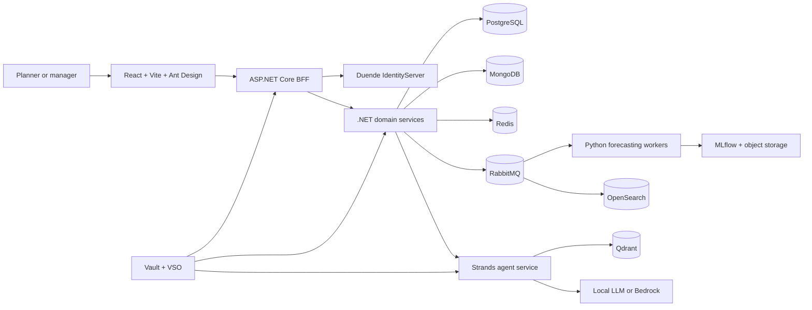

# StockSense

StockSense is a cloud-native inventory planning and purchasing platform for
non-perishable specialty retailers. It combines demand forecasting, supplier
constraints, governed purchasing workflows, retrieval-augmented generation,
and an AI planning assistant to help a retailer decide what to reorder, when,
and why.

This is a **portfolio project**. It is designed to demonstrate how I take a
realistic multi-tenant product from business intent through requirements,
architecture, implementation, verification, deployment, and operations using
an AI-Driven Development Life Cycle (AI-DLC). The repository is intended to keep
the design decisions, traceability, review evidence, infrastructure, and
application code together so reviewers can assess both the result and the
engineering process.

## Project status

StockSense has completed and approved Inception. Construction is the active
lifecycle phase, but no Construction artifact or application implementation has
started, so the application and local platform described below are an approved
target rather than a runnable implementation. The skills table explicitly
describes planned evidence; each claim will become demonstrated only when linked
implementation and validation evidence is committed. The engine-owned
[lifecycle state](aidlc/spaces/default/intents/260908-stock-sense-design/aidlc-state.md)
is the source of truth for current progress.

## Business problem

Small specialty retailers often plan replenishment with incomplete sales data,
changing supplier terms, and limited analytical capacity. StockSense turns
reproducible sales, inventory, and supplier inputs into forecasts and shortage
signals, lets planners compare replenishment scenarios, and keeps purchasing
decisions under explicit human control.

The core journey is:

1. Import sales and inventory data.
2. Ingest supplier offers and catalog terms.
3. Train or select a demand model and produce a 28-day forecast.
4. Identify likely shortages and compare replenishment scenarios.
5. Draft a purchase proposal.
6. Let a manager approve, reject, or cancel it under defined rules.
7. Simulate partial or complete receipt and update inventory.
8. Evaluate forecasting, inventory, agent, and operational outcomes.

The initial demonstrator models three isolated retailers with one store and 100
products each, using 18 months of deterministic synthetic history. It does not
send real purchase orders or require real retailer data.

## What this project demonstrates

| Skill area | Evidence planned in StockSense |
| --- | --- |
| AI-DLC | Versioned requirements, stories, acceptance criteria, domain design, ADRs, contracts, delivery Bolts, approval gates, independent reviews, and linked validation evidence |
| React engineering | React and TypeScript application built with Vite and Ant Design; accessible planner and manager workflows; generated BFF clients and browser verification |
| .NET engineering | ASP.NET Core services and BFF, domain-oriented modules, Dapper/Npgsql persistence, transactional outbox/inbox, authorization, idempotency, and concurrency control |
| Relational databases | PostgreSQL tenant isolation, row-level security, stored procedures/functions, transaction design, audit records, and Flyway migrations; application code cannot query tables directly |
| NoSQL and specialized data stores | MongoDB for heterogeneous supplier documents, Redis for caching, Qdrant for vector retrieval, and OpenSearch for operational log and audit investigation |
| ML and MLOps | Leakage-safe time-series backtests, baseline comparison, model evaluation and promotion, MLflow lineage, versioned artifacts, drift/quality evidence, and model rollback |
| Agentic applications and RAG | Python Strands agents, local Qwen-family inference, multilingual embedding evaluation with EmbeddingGemma and Qwen, tenant-isolated retrieval, cited answers, typed tools, and deterministic backend authorization of side effects |
| DevOps | GitHub Actions, contract and supply-chain checks, self-hosted deployment automation, Helm packaging, Terraform/Terragrunt infrastructure as code, and reproducible clean-room setup |
| Cloud-native architecture | Kubernetes workloads, declarative configuration, health and readiness probes, OpenTelemetry, secrets supplied by Vault and Vault Secrets Operator, recovery exercises, and provider seams for later cloud deployment |
| Security and identity | Duende IdentityServer, OAuth 2.0/OIDC, Google federation, local demo identities, BFF security, tenant authorization, secret rotation, and negative security tests |
| Engineering quality | OpenAPI and AsyncAPI contract validation, focused unit/integration/browser tests, resilience and replay checks, resource measurement, backup/restore, rollback, and revision-bound portfolio evidence |

## Target architecture



All REST boundaries will be described with OpenAPI and all asynchronous
boundaries with AsyncAPI. RabbitMQ consumers will use bounded retries,
dead-letter handling, and idempotency. PostgreSQL will be the transactional
system of record; .NET code will use Dapper/Npgsql only to invoke Flyway-managed
routines. Transactional audit events will flow through the outbox to OpenSearch
for investigation without turning the search index into the source of truth.

Retailer data will begin in shared services with strict tenant boundaries and a
designed path to separate databases per tenant. Qdrant collections will be
isolated by retailer and embedding model version. The backend will remain the
authority for tenant routing, calculations, approvals, and side effects; the
assistant may explain and propose actions but may not approve purchasing
decisions.

## Local-first and cloud-ready delivery

The target review path will run on Docker Desktop Kubernetes within a planning
budget of 16 GB RAM and up to three CPU units. Terraform/Terragrunt will compose
the environment, Helm will package workloads, and Vault will run inside
Kubernetes. The completed clean-checkout path must work without owner
credentials, paid APIs, or a particular GPU. Real CPU inference is a required
acceptance target; acceleration on the available AMD Radeon RX 6700 XT is
optional.

Local model and embedding choices are evaluated rather than assumed. Provider
interfaces leave an explicit opt-in path to external inference such as Amazon
Bedrock, while local execution remains the default. The same infrastructure
boundaries are intended to support a later managed-cloud deployment without
making cloud accounts a prerequisite for portfolio review.

## AI-DLC and development model

The project uses **AWS Labs AI-DLC Workflows 2.8.0** with the Codex integration,
classic lifecycle scope, standard design depth, and standard test strategy. The
active [lifecycle state](aidlc/spaces/default/intents/260908-stock-sense-design/aidlc-state.md)
is the source of truth for current progress.

Construction is organized into runnable Bolts, from a retail walking skeleton
through tenant hardening, supplier knowledge, forecasting, governed purchasing,
agentic assistance, and clean-room release evidence. Each Bolt has an integration
branch. Every user story is implemented on its own short-lived child branch and
reviewed through its own pull request into that Bolt branch. After the assembled
Bolt passes its reviews, the owner-approved Bolt is squash-merged to `main`.

A coordinating Codex session works with ten project-local specialists covering
technical leadership, frontend, .NET, persistence, ML/MLOps, agentic RAG,
Terraform/Terragrunt and DevOps, security/identity, quality/reliability, and
AI-DLC process integrity. See the [development agent team](docs/development-agent-team.md)
and the tracked definitions under [`.codex/agents`](.codex/agents/).

## Repository guide

- [Product brief](docs/product-brief.md) — business intent, scope, selected stack, and evaluation posture.
- [System design](docs/design.md) — detailed application and platform design.
- [Execution plan](docs/execution-plan.md) — delivery roadmap and portfolio outcomes.
- [Architecture decisions](docs/decisions/) — selected technologies and their consequences.
- [AI-DLC lifecycle record](aidlc/spaces/default/intents/260908-stock-sense-design/) — requirements, stories, domain model, contracts, delivery plan, reviews, and audit trail.
- [Git contribution rules](CONTRIBUTING.md) — branch, pull-request, validation, and merge policy.
- [AI-DLC setup](docs/ai-dlc-setup.md) — pinned runtime installation and diagnostics.

## AI-DLC setup

On Windows, install the pinned per-user runtime and start Codex with project hook
access:

```powershell
./scripts/Install-AiDlc.ps1
./scripts/Start-Codex.ps1
```

Run local diagnostics without starting a model session:

```powershell
./scripts/aidlc.ps1 doctor --json
```

The runtime is already installed on the setup machine. A fresh Codex session
can inspect current progress with `$aidlc --status` and resume the existing
StockSense intent with `$aidlc --resume`.

## License

StockSense is MIT licensed. The vendored AI-DLC framework is MIT-0 licensed;
see the [upstream license](docs/AI-DLC-LICENSE.txt).
