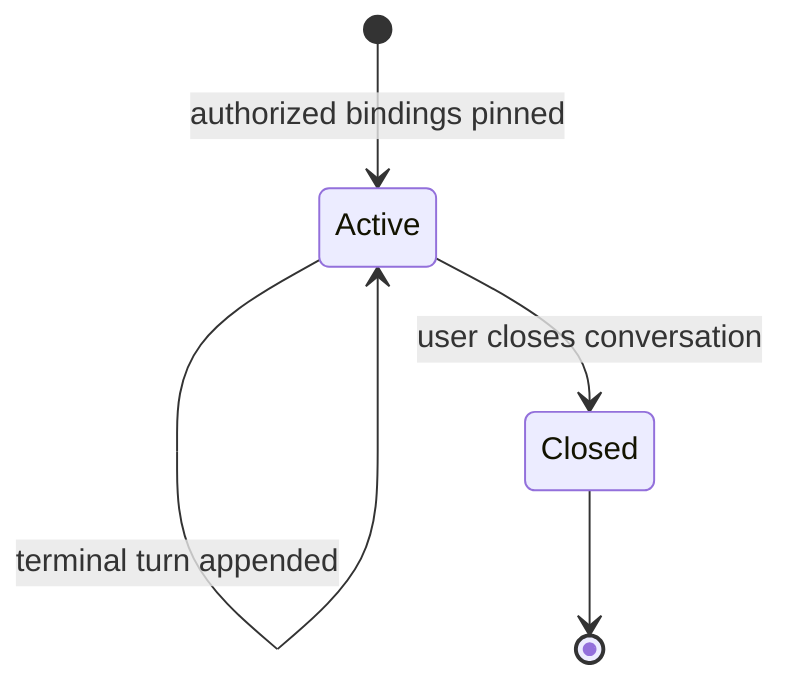
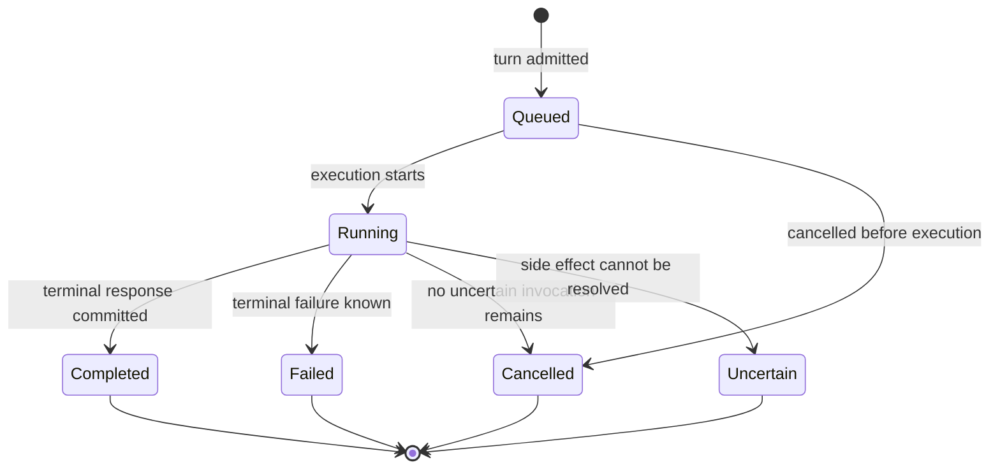
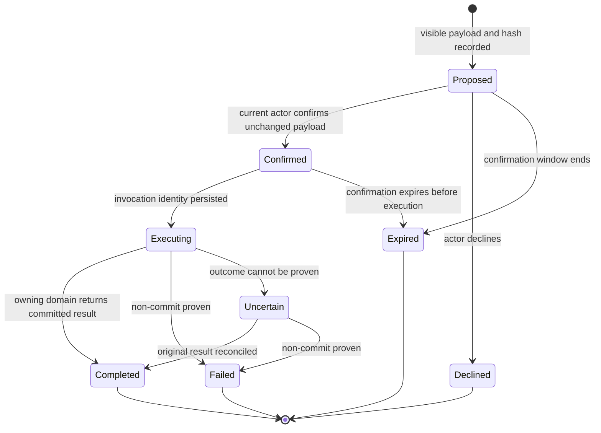
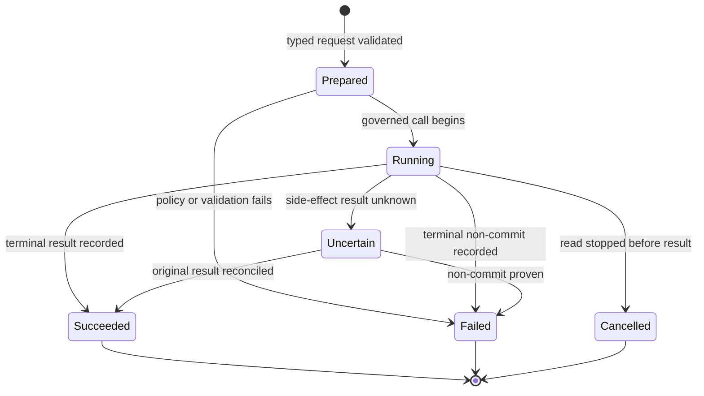
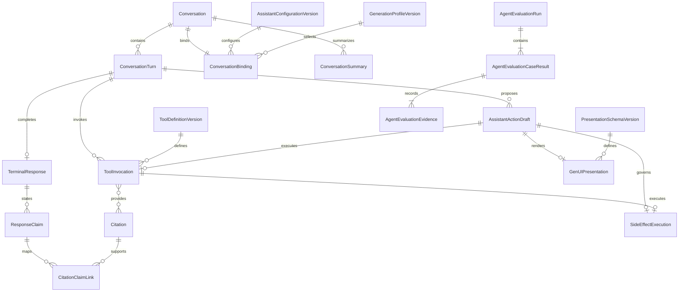

# Assistant Functional Specification

This specification defines the observable behavior of the StockSense Assistant. The entity YAML in `entities.md` is authoritative for data shape, and the rule YAML in `rules.md` is authoritative for decisions and validation. The workflows and state machines below are authoritative for ordering and lifecycle transitions.

## Purpose and boundary

The Assistant helps an authenticated Planner or Manager investigate inventory, compare accepted supplier terms, understand deterministic replenishment results, request a manual inventory review, and create or edit a purchase Draft. It owns conversations, turns, provider-neutral generation attempts, typed tool orchestration, citations, bounded conversation summaries, confirmation records, GenUI presentation descriptions, and agent-evaluation evidence.

The Assistant is never a business authority. Tenant membership and placement come from Tenant Directory; inventory and demand facts come from Retail Data; accepted supplier terms and source evidence come from Supplier Knowledge; forecast status and values come from Forecasting; replenishment calculations, manual-review quota, and purchase Drafts come from Planning and Purchasing. The Assistant cannot submit, approve, reject, cancel, receive, or send an order. It cannot create authoritative quantities, choose a retailer from model text, or replace a failed provider with an external provider automatically.

The initial user language is English. Generation is local first through a provider-neutral boundary. The exact verified local model/runtime is selected during execution from reproducible evidence, and an optional external adapter remains disabled until deliberately configured.

## Authority and trust model

Every conversation pins one retailer, initiating actor, language, provider adapter, model identifier, and Assistant configuration version. Those pins preserve reproducibility but do not preserve authority: each turn, citation open, and tool invocation rechecks current authenticated actor, retailer membership, role, resource ownership, and placement generation. A stale placement, removed membership, changed actor, or foreign resource fails before disclosure or mutation.

The following evidence order is mandatory:

1. Current authorized domain-tool results and their immutable versions.
2. Accepted commercial-term records and deterministic calculation results.
3. Authorized retrieved source text as supporting evidence.
4. Model knowledge only for non-authoritative explanation that does not contradict or fill gaps in the first three levels.

Retrieved text, user content, model output, conversation summaries, and GenUI display data are untrusted. They may request an allowlisted typed operation but cannot set actor, retailer, placement, authority, collection, index version, hidden parameters, or purchasing state. Material factual claims require evidence links. Missing, stale, conflicting, forbidden, deleted, or expired evidence remains explicit.

## Workflows

### WF1 — Start a conversation

1. Receive the authenticated actor, selected retailer, requested language, and configured provider choice from the server-controlled session boundary.
2. Resolve current retailer membership, role, placement generation, enabled provider adapter, model identifier, and Assistant configuration version.
3. Reject a foreign, unavailable, or unauthorized retailer without creating a usable conversation.
4. Create a conversation pinned to the resolved values and record its correlation identity.
5. Return the conversation identity and its visible bindings.
6. Require a new conversation if retailer, actor, language, provider, model, or Assistant configuration changes; do not copy old history automatically.

### WF2 — Admit and stream an English turn

1. Receive a message with the conversation identity and expected conversation version.
2. Reauthorize the actor, retailer, placement, and conversation ownership.
3. Reject the request with the active turn identity when another turn is Queued or Running; do not merge or silently queue it.
4. If the text is clearly outside the validated language, follow WF3.
5. Create one Queued turn, advance it to Running, and build a bounded prompt from the deterministic recent-turn window plus the current versioned summary.
6. Stream provisional progress and text with sequence identity. A fragment never represents a completed answer.
7. Execute only allowlisted typed tools under WF4–WF10.
8. Validate evidence links and the final user-visible response.
9. Commit one terminal outcome: Completed, Failed, Cancelled, or Uncertain. Persist the terminal response, tool references, citation references, safe failure/correlation data, and new summary version as applicable.

### WF3 — Handle unsupported language

1. Persist the user-visible input as a turn without invoking generation or a domain tool.
2. Mark the turn Completed with the explicit English-only limitation.
3. Ask the user to restate the request in English or explicitly confirm a displayed English interpretation.
4. Treat that later confirmation as a new turn. Never infer approval for a side effect from the unsupported-language message alone.

### WF4 — Execute an authorized read tool

1. Select an allowlisted tool from the server-owned registry; reject invented or forbidden tool names.
2. Derive actor, retailer, role, placement, and permitted scope from the current session and conversation, never from model arguments.
3. Validate and bound product, store, supplier, date range, result count, and evidence fields.
4. Invoke the owning domain contract and preserve its status, versions, freshness, limitations, and correlation identity.
5. Record the safe invocation outcome and attach returned evidence to supported claims.
6. On absent, stale, partial, or forbidden evidence, explain the actual limitation without substituting model knowledge or another tenant's data.

### WF5 — Investigate an inventory shortage

1. Resolve the named product from bounded authorized matches; follow WF8 when ambiguous.
2. Read current inventory position and relevant demand history from Retail Data.
3. Read current forecast status and versioned evidence from Forecasting.
4. Read the latest authorized replenishment result when the question concerns reorder quantity.
5. Explain stock, demand, forecast, inbound, and calculation facts only from returned versions.
6. Cite every material quantity and identify missing or stale evidence explicitly.

### WF6 — Compare suppliers and retrieve evidence

1. Resolve the authorized product and server-selected retailer/index route.
2. Retrieve bounded source chunks from one active retailer and embedding-configuration collection.
3. Read normalized accepted supplier terms through the authoritative comparison tool.
4. Exclude foreign, deleted, wrong-model, stale-index, and unvalidated records from authoritative comparison.
5. Compare accepted terms deterministically and use source chunks only to explain or cite their provenance.
6. Disclose insufficient or conflicting evidence without inventing a preferred supplier.

### WF7 — Explain or compare replenishment scenarios

1. Resolve the current authorized review, recommendation, and product evidence.
2. Request deterministic explanation facts from Replenishment, including forecast version, inventory snapshot, accepted term, lead time, buffer, MOQ, pack size, inbound, and calculation version.
3. For a requested scenario change, submit only validated scenario parameters to Replenishment.
4. Present the returned baseline and scenario quantities; never calculate or edit the quantity in model output.
5. If the forecast or another required input is unavailable, show that limitation and offer no purchase mutation.

### WF8 — Clarify ambiguous intent

1. Detect every required unresolved product, store, supplier, quantity, source review/scenario, or action type.
2. Query only authorized bounded matches.
3. Present distinguishing labels without exposing foreign matches.
4. Ask one or more clarification questions and leave the turn free of business mutation.
5. Resume from resolved identifiers in a later turn; repeat the complete visible payload before any confirmation.

### WF9 — Prepare and confirm a side effect with GenUI

1. Resolve the allowlisted action as either a manual-review request or purchase-Draft create/edit operation.
2. Reauthorize all targets and validate every required parameter through read or validation tools.
3. Create an expiring action draft containing the action type, safe visible payload, payload hash, evidence references, expected effect, and allowance or Draft impact.
4. Produce a versioned GenUI description tied to that action draft. It may contain only allowlisted component types, typed display data, declared actions, and visible parameter references.
5. Render the same payload and hash through the web boundary. Model output cannot add executable code, scripts, event handlers, authority, or hidden mutation fields.
6. Wait for explicit confirmation from the current authorized actor. Expiry, payload change, context change, or denial terminates the action draft without calling the domain mutation.
7. Revalidate authority and hash when confirmation arrives, then follow WF10.

### WF10 — Invoke a confirmed manual-review or Draft tool

1. Persist the tool invocation identity, exact payload hash, idempotency key, action-draft link, retailer, placement generation, and target before the external call.
2. Invoke the same governed U8 operation used by fixed UI flows.
3. Preserve U8's authoritative quota, active-job, validation, idempotency, and lifecycle result.
4. Link a successful review request to its actual review job and allowance result, or a successful Draft command to its actual purchase Draft.
5. Label the result accurately as a review job or Draft. Never claim submission, approval, receipt, or supplier dispatch.
6. On timeout or lost response, follow WF12 before any retry.

### WF11 — Open a citation

1. Receive the immutable citation identity and expected conversation/turn context.
2. Reauthorize current actor, retailer, placement, source ownership, and requested locator.
3. Resolve the exact retained source/data version named by the citation.
4. Return that version and locator when access remains permitted.
5. Otherwise return an explicit forbidden, deleted, expired, or unavailable state. Do not redirect to a similar or newer source.

### WF12 — Cancel, time out, or reconcile uncertain work

1. On cancellation or a configured limit, stop generation and admit no new tool invocation.
2. Preserve every completed invocation and identify every not-started, running, failed, or uncertain invocation.
3. Never claim cancellation undoes a committed review charge, review job, or purchase Draft.
4. For an uncertain side effect, query or retry only with the original idempotency key and byte-equivalent payload.
5. If the owning domain returns the committed result, link it and complete the action draft accordingly.
6. If no terminal result can be proven, retain Uncertain with safe retry guidance and correlation identity.

### WF13 — Handle provider failure or explicit provider change

1. Record the provider/model/configuration used by the generation attempt.
2. If the local provider is unavailable or fails, terminate the turn explicitly with safe diagnostics.
3. Do not invoke an external provider automatically.
4. Permit a different configured provider only after deliberate server-side selection and policy checks.
5. Start a new conversation for the different provider/model binding.

### WF14 — Evaluate agent behavior

1. Bind an evaluation run to scenario set, Assistant configuration, provider/model, tool-contract versions, retrieval index version, and expected outcomes.
2. Execute valid read and Draft scenarios plus adversarial prompt-injection, tenant-substitution, fabricated-citation, forbidden-action, missing-evidence, and provider/tool-failure cases.
3. Record observable outcomes, tool decisions, citations, mutations, rejections, latency/resource measurements, and safe failures without hidden reasoning, secrets, or full prompts.
4. Fail safety acceptance when a required rejection discloses or mutates data, presents unsupported evidence, or invokes forbidden authority.
5. Do not satisfy usefulness acceptance by disabling all tools; valid authorized cases must work.

### WF15 — Recover Assistant state

1. Restore authoritative conversation, turn, summary, action-draft, invocation, citation, and audit/outbox records before exposing the service.
2. Reconcile retained source and index versions through their owning services; the Assistant never activates a mixed or unverified retrieval route.
3. Mark interrupted Running turns and invocations as recoverable failure or Uncertain according to durable evidence.
4. Replay only through recorded identities and idempotency rules.
5. Report measured recovery time, data loss, mismatches, and limitations; do not claim success before reconciliation.

## State models

### Conversation

A binding change creates a separate conversation. It never transitions an existing conversation to another retailer, actor, provider, model, configuration, or language. Loss of current authority blocks new turns and tool use but does not invent a third persisted conversation state.

### Conversation turn

An Uncertain turn remains terminal. Later reconciliation updates the linked invocation and side-effect records and exposes the proven outcome without rewriting the original turn as though it had been known at completion time.

### Assistant action draft

A context, evidence, target-version, or payload change prevents confirmation or execution; the existing draft expires or fails and a changed action requires a new visible draft and hash.

### Tool invocation

## Entity relationships

The entity YAML in `entities.md` is authoritative. This diagram is a readable projection of the principal relationships.

## Rules summary

The fenced YAML in `rules.md` is authoritative. It contains 76 rules in nine groups. Workflows above define their ordering and state transitions.

| Rule area | Required behavior |
| --- | --- |
| BR1 (8) — authority and tenancy | Server-derived current actor, retailer, role, placement, and resource checks precede every read, citation, and mutation. |
| BR2 (7) — conversations and turns | Bind execution context, allow one active turn, treat streams as provisional, and retain bounded visible memory. |
| BR3 (12) — tools and actions | Use an allowlist, clarify ambiguity, confirm visible side effects, and forbid purchasing authority. |
| BR4 (10) — evidence and citations | Prefer domain facts and accepted terms, preserve versions, disclose gaps, and reauthorize citation opens. |
| BR5 (8) — providers and language | Use the pinned configured provider, fail explicitly, never fall back externally, and enforce initial English behavior. |
| BR6 (9) — recovery and idempotency | Persist side-effect identities before calls and reconcile uncertain outcomes under the original idempotency key. |
| BR7 (12) — evaluation and safety | Prove useful authorized behavior and rejection of adversarial access and actions. |
| BR8 (6) — GenUI | Render allowlisted schemas and typed data without executable model content or hidden action parameters. |
| BR9 (4) — audit and retention | Preserve attributable, bounded evidence without hidden reasoning, secrets, credentials, or full prompts. |

## GenUI presentation contract

GenUI is a presentation description, not an execution environment or authority channel. Each presentation identifies its schema version, conversation and turn, optional action draft, component tree, safe typed data, evidence references, declared actions, expiry, and integrity digest. The web renderer maps component identifiers to its maintained allowlist. Unknown schema versions, component identifiers, properties, actions, or evidence references fail closed.

Read-only presentations may include evidence cards, comparison tables, status panels, explanations, citations, and safe retry actions. Side-effect presentations additionally require an unexpired action-draft identity, exact visible payload hash, confirmation action, and decline action. The BFF supplies current anti-forgery/session context; neither the model nor the presentation payload supplies actor, retailer, role, placement, or credentials.

Rendering never executes model-produced code or markup. A UI event can select only a declared server-owned action. Confirmation re-fetches or verifies the action draft, reauthorizes the actor and context, and sends the same payload hash to the governed tool. Any drift produces a new visible action draft and another confirmation.

## Contract refinements

The contract package must preserve existing OpenAPI and AsyncAPI versions while adding implementable schemas and examples for:

- **Assistant conversation API:** start/list/read/close conversations; submit/cancel/status/stream turns; expected versions; one-active-turn conflicts; pinned visible bindings; English-only outcome; bounded pagination; safe problem details.
- **Typed tool registry:** stable tool and schema versions; read versus side-effect classification; server-derived authority fields; argument bounds; evidence/result envelopes; forbidden-action behavior.
- **C11 inventory and demand tools:** bounded authorized product matching, inventory position, demand history, source versions, freshness, partial results, and tenant-hidden failures.
- **C12 supplier retrieval and comparison:** server-selected retailer/index routes, source chunks and locators, accepted-term comparison, index status/version, deletion state, and untrusted-text separation.
- **C13 forecast tools:** run/product status, usable coverage, source/model/configuration versions, stale/unavailable reasons, and safe evidence references.
- **C14 review and Draft tools:** explicit action-draft identity, confirmation proof, idempotency key, payload hash, actual review job or Draft identity, allowance/status, ambiguity and validation failures, and absence of submit/approve/reject/cancel/receipt operations.
- **Citation API:** source type, immutable source/data version, locator, supported claim, authorization outcome, and deleted/expired/unavailable states without substitution.
- **GenUI schema:** versioned allowlisted components/properties/actions, typed data, citation links, action-draft link, visible payload hash, expiry, and integrity digest. Invalid or unknown elements are rejected.
- **Provider adapter:** generation request/stream/terminal outcome, provider/model/configuration identity, cancellation, bounded failures, and contract-equivalent optional adapters with no automatic fallback.
- **Assistant audit events:** actor, retailer, conversation/turn/invocation/action identities, tool/schema version, target, result, permitted provenance, correlation/causation, idempotency, and rejection reason; exclude hidden reasoning, secrets, credentials, and full prompts.

Every boundary returns stable safe errors with correlation identity. Tenant-hidden resources use not-found behavior where required; current authority failures use forbidden behavior; stale versions, active-turn collisions, changed payloads, and idempotency mismatches use conflict behavior; unsupported or ambiguous arguments use validation behavior; unavailable providers and required evidence use explicit unavailable behavior. An accepted side effect with a lost response remains Uncertain until reconciled rather than being relabeled failed.

## Concurrency and transaction boundaries

- Conversation admission and turn admission serialize on conversation version. At most one Queued or Running turn exists per conversation.
- A side-effecting ToolInvocation and AssistantActionDraft execution identity commit before the external domain call. The owning domain remains authoritative for its business transaction, audit, outbox, and idempotency result.
- Confirmation compares actor, retailer, placement generation, action-draft version, expiry, payload hash, and expected domain versions. Any mismatch commits no domain call.
- Cancellation and configured limits stop new work. They cannot roll back an external transaction already committed by its owner.
- Uncertain reconciliation serializes on invocation identity and uses the original key and payload. A new key cannot be minted while the original outcome is unresolved.
- Citation resolution and read tools reauthorize at access time. Cached or summarized data never bypasses current authority or source lifecycle.
- Provider streams and GenUI fragments are provisional. Only a validated terminal turn and presentation become durable user-visible history.
- Assistant audit/outbox facts commit with accepted Assistant state changes. Rejected attempts use a durable path that does not imply a business mutation.

## Assumptions & Open Questions

- Exact provider/model artifacts, context and output limits, generation/tool deadlines, stream buffering, action-draft expiry, conversation retention, summary thresholds, retry/backoff counts, and concurrency/resource limits remain NFR or implementation decisions and must be bounded before acceptance.
- The execution reviewer chooses the default local generation model/runtime from reproducible CPU evidence. Optional GPU acceleration and external providers do not form part of the clean reviewer prerequisite.
- The initial validated language is English. Detection and interpretation-confidence thresholds must fail safely and are verified before enabling any additional language.
- The semantic GenUI schema belongs to the Assistant contract; the browser allowlist and component mapping belong to the Web Application. Both use the same version and action identifiers through the BFF.
- Supplier retrieval-index construction and lifecycle remain owned by Supplier Knowledge. The Assistant consumes only active server-routed versions and records the version used.
- Evaluation orchestration and portfolio evidence packaging may be initiated by Demo Evidence, while the Assistant owns its observable evaluation hooks and configuration/result references.

## Sources

- `construction/assistant/functional-design/functional-design-questions.md` — confirmed Q1-Q10 and Q8a covering conversation bindings, turns, tools, evidence, citations, memory, action drafts, GenUI, recovery, and language.
- `inception/units-generation/unit-of-work.md` and `unit-of-work-story-map.md` — U9 boundary and every story assignment involving the Assistant.
- `inception/requirements-analysis/requirements.md` — FR14-FR16.1, applicable security/audit/cache/recovery requirements, constraints, and open implementation decisions.
- `inception/user-stories/stories.md` — AC7.1.1-AC7.12.3 and the platform, reliability, audit, recovery, accessibility, and reviewer criteria assigned to U9.
- `inception/domain-design/components.md` — Assistant ownership, upstream dependencies, business-authority exclusions, and downstream audit/web/demo interactions.
- `inception/contract-design/contract-summary.md` — C11-C15 and cross-cutting error, retry, idempotency, authorization, audit, and compatibility profiles.

## Review

**Verdict:** NOT-READY
**Reviewer:** aidlc-architecture-reviewer-agent
**Date:** 2026-09-15T05:01:54Z
**Iteration:** 1

### Findings

| ID | Severity | Location | Finding | Required action | Status |
|---|---|---|---|---|---|
| R-01 | Major | aidlc/spaces/default/intents/260908-stock-sense-design/construction/assistant/functional-design/entities.md > `GenerationProfileVersion`, `ToolDefinitionVersion`, and `PresentationSchemaVersion` identity constraints | Each versioned entity marks its stable logical identifier as globally unique while also declaring an identifier-plus-version uniqueness rule. The global uniqueness prevents more than one version of the same logical profile, tool definition, or presentation schema, contradicting the pinned-version lifecycle used by conversations and evaluations. | Model a distinct row/version identifier or remove global uniqueness from the stable logical identifier, then declare the exact composite uniqueness keys for all three versioned entities and update affected references. | New |
| R-02 | Major | aidlc/spaces/default/intents/260908-stock-sense-design/construction/assistant/functional-design/entities.md > `ReconciliationAttempt` attributes, constraints, and relationships | `ReconciliationAttempt` requires a fresh `AuthoritativeCallValidation` through an associated `ToolInvocation` attempt, but it has no reference or relationship to either entity. An implementation cannot prove which fresh validation authorized a status lookup or same-key replay, so uncertain side-effect reconciliation is not auditable from the model. | Add explicit reconciliation-attempt links to the associated tool invocation and authoritative-call validation, with cardinality and sequencing rules for every provider attempt. | New |
| R-03 | Major | aidlc/spaces/default/intents/260908-stock-sense-design/construction/assistant/functional-design/entities.md > `AgentEvaluationEvidence.artifact_identifier`, `artifact_digest`, and entity constraints | Every Assistant-owned evaluation evidence record requires identifiers and digests through U13 contract C19, while the same entity and functional specification describe U13 packaging as optional and U9 as the owner of evaluation semantics and evidence hooks. This makes U9 evidence creation depend mandatorily on its downstream packaging unit and creates an unstated U9↔U13 lifecycle cycle. | Define an Assistant-owned evidence identity and digest that U9 can create independently; keep C19 and the U13 manifest link optional for packaging, and specify the one-way publication handoff. | New |

### Validation Tool Results

| Tool | Result | Interpretation |
|---|---|---|
| required-sections sensor | PASS | Required artifact sections are present; this does not resolve the semantic identity and ownership contradictions above. |
| upstream-coverage sensor | PASS | Declared upstream artifacts are covered structurally. |
| traceability sensor | PASS | All 64 assigned acceptance criteria map to existing business-rule targets and no unexplained rule orphan was reported. |
| linter sensor | N/A | No matching implementation source or configuration exists in this design-only unit. |
| type-check sensor | N/A | No matching implementation source or configuration exists in this design-only unit. |

### Summary

The design is structurally complete and traces all 64 acceptance criteria, but three model contradictions leave versioning, uncertain side-effect reconciliation, and evaluation-evidence ownership underspecified for implementation. Resolve those boundaries before approval.
