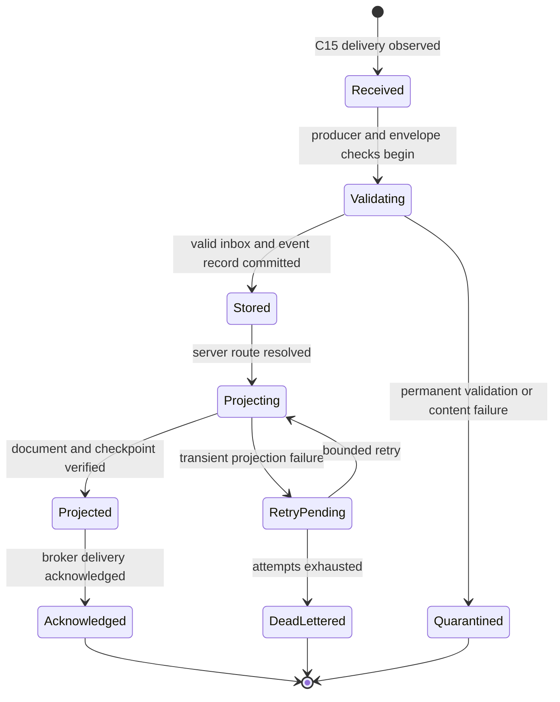
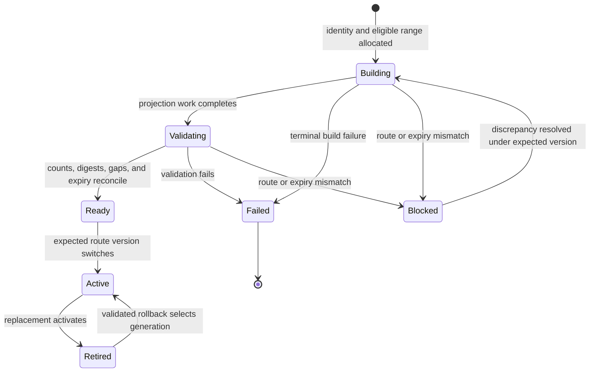
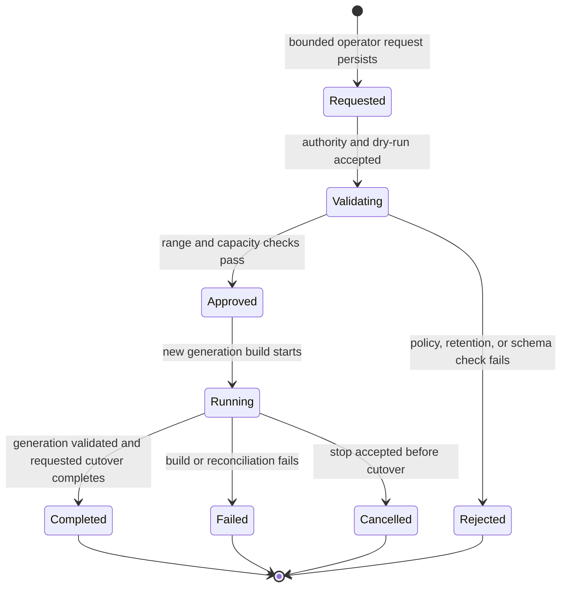
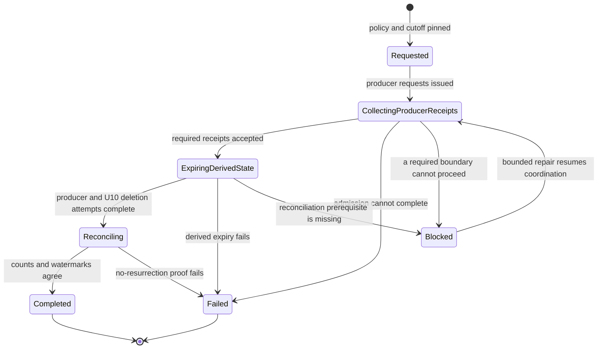
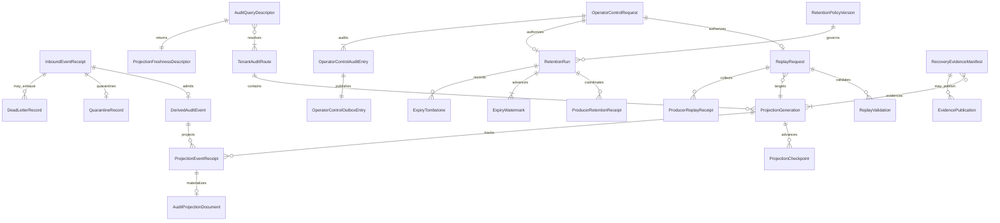

# Audit Evidence Functional Specification

Unit: U10 Audit Evidence (`audit-evidence`)

Confirmation basis: the Audit Evidence consolidated summary was confirmed as `Looks correct` on 2026-09-15.

## Purpose and boundary

Audit Evidence turns immutable C15 audit events into searchable, tenant-authorized evidence. It owns event-consumption receipts, a retained derived event ledger, projection generations and checkpoints, replay and retention coordination, operator control records, query freshness, and recovery evidence. It does not own the business meaning or validity of an audited action. The producing service remains authoritative for its audit row, outbox entry, aggregate state, actor decision, and rejection record.

OpenSearch is a rebuildable query projection. U10's PostgreSQL event copy is also derived and cannot authorize, repair, reverse, or make valid a producer mutation. U10 never reads or writes another unit's database, index, cache, document store, or artifact storage. Cross-unit reads, republishing, retention coordination, and evidence publication use versioned contracts.

## Authority and trust model

- A C15 event is accepted only from an authenticated producer workload with the expected issuer, audience, scope, message type, schema version, and placement generation.
- Retailer identifiers, index names, event payloads, correlation identifiers, and operator request parameters are context rather than authority.
- Planner and Manager queries revalidate the current user, retailer membership, permitted role, requested resource scope, and placement generation. Tenant-hidden resources return no cross-retailer evidence.
- Replay, retention, quarantine repair, generation activation, and cross-retailer investigation require current Platform Operator authority with narrow scopes and expected request/policy versions.
- Producer events are untrusted at the U10 boundary until envelope, schema, field allowlist, size, redaction, and semantic invariants pass.
- Credentials, tokens, raw supplier documents, full prompts, hidden reasoning, and unrestricted exception payloads are prohibited in the event ledger, projection, telemetry, quarantine diagnostics, and portfolio evidence.
- U10 records its accepted, denied, failed, cancelled, and completed privileged-control attempts through an append-only self-audit/outbox path. That record proves the control attempt and never changes producer truth.

## Workflows

### WF1 — Admit and project a valid C15 audit event

1. Receive an at-least-once C15 delivery and authenticate the producer workload and declared contract version.
2. Validate message identity, producer/message type, retailer and placement context, actor descriptor, occurred time, correlation, causation, idempotency identity, action, target, outcome, and before/after versions.
3. Apply the event-type field allowlist, bounded-size rules, and prohibited-content checks before retaining payload fields.
4. Look up the immutable event ID. If a matching receipt and payload digest already exist, return the recorded processing state. If the same ID carries different immutable content, quarantine the mismatch and do not project it.
5. Commit the unique inbox receipt and immutable derived event record before attempting projection.
6. Resolve the server-owned retailer projection route and current placement generation. A client or event cannot select an arbitrary index.
7. Create the projection document idempotently under the event ID in the target projection generation.
8. Commit the projection attempt result and checkpoint after the projected document is verified.
9. Acknowledge RabbitMQ only after the required inbox and projection-checkpoint state is durable. A crash before acknowledgement safely repeats from step 4.

### WF2 — Handle an invalid, unsafe, or incompatible event

1. Classify the failure as authentication, unsupported message/schema, malformed envelope, invalid context, replay mismatch, prohibited content, excessive size, or incompatible semantics.
2. Retain only safe identifiers, schema metadata, payload digest when safe to compute, validation codes, correlation identity, timestamps, and retry eligibility.
3. Do not store or index prohibited fields or the unsafe raw payload.
4. Reject immediately when retry cannot change the result. Use bounded retry only for a declared transient dependency failure.
5. After the configured attempt limit, route the original delivery through the C15 dead-letter policy and expose lag, reason code, and operator guidance.
6. Record the outcome without acknowledging that the producer action was valid or invalid beyond the producer-supplied authoritative outcome.

### WF3 — Recover from OpenSearch failure

1. Preserve the committed inbox/event record and mark projection pending or failed with a bounded next-attempt policy.
2. Retry the same event ID and byte-equivalent projection representation; never create a second logical projection event.
3. If a prior attempt indexed the document but failed before checkpoint commit, verify the matching document digest and commit the checkpoint.
4. If retries are exhausted, dead-letter the delivery with visible lag and safe diagnostics.
5. Keep producer business transactions and required producer audit/outbox writes independent of U10 and OpenSearch availability.
6. Resume through the original event identity. A new event ID cannot hide an unresolved projection failure.

### WF4 — Query retailer business-audit history

1. Authenticate the current session or machine caller and revalidate retailer membership, role, route placement, and requested resource scope.
2. Resolve the active per-retailer projection generation on the server. Ignore any client-supplied index or placement authority.
3. Validate a bounded date range, stable page cursor, page size, and optional actor, action, target type/ID, outcome, producer service, and correlation filters.
4. Query only the resolved retailer projection and return immutable event descriptors ordered by occurred time and event ID.
5. Return the projection generation, checkpoint, observed lag, freshness classification, query time, and bounded result count with the page.
6. When lag exceeds the declared threshold or projection state is unavailable, return explicit stale/partial/unavailable semantics according to the versioned query contract. Never present silently incomplete history as current.
7. Record permitted query audit metadata without copying unrestricted result payloads into logs.

### WF5 — Run an operator correlation investigation

1. Require distinct current Platform Operator authority and a bounded investigation purpose, scope, and time range.
2. Query business-audit projections and separate operational telemetry streams through server-owned routes.
3. Correlate only through bounded identifiers such as correlation, causation, event, service, job, request, and trace identifiers.
4. Preserve each source's retention, authorization, and availability status. Missing operational telemetry does not invalidate retained business audit.
5. Return redacted links and summaries rather than credentials, tokens, raw supplier material, full prompts, hidden reasoning, or unrestricted exceptions.
6. Audit the investigation request, filters, actor, outcome, and accessed retailer set through U10's self-audit path.

### WF6 — Create and validate a replay request

1. Require Platform Operator authority, expected request version, reason, bounded source range, retailer scope, target projection generation, and idempotency key.
2. Resolve the retained U10 event-ledger range and applicable expiry watermarks. Identify gaps, incompatible schemas, quarantined records, and missing producer sequences.
3. When a retained range is proven missing or corrupt, request republishing through the versioned producer-owned replay boundary; never read producer storage directly.
4. Validate producer identities, placement generations, supported schemas, event counts, digests, retention eligibility, queue/backlog capacity, and target-generation isolation.
5. Produce a dry-run result with eligible, expired, missing, incompatible, and blocked counts. No active route changes during validation.
6. Admit execution only when every blocking discrepancy is resolved or represented by an explicit approved partial-recovery policy defined before implementation.

### WF7 — Build and activate a replay generation

1. Create a new non-active projection generation for the authorized retailer or bounded operator scope.
2. Process eligible retained and producer-republished events by original event ID, preserving original business identity and chronology.
3. Deduplicate deliveries and detect per-producer/resource sequence gaps without inventing a global ordering.
4. Apply current no-resurrection watermarks and deletion/tombstone state before and during projection.
5. Reconcile event counts, target counts, digests, source ranges, schema versions, quarantines, expiry exclusions, and checkpoint coverage.
6. Mark the generation ready only when validation passes. A failed or incomplete build remains inactive and queryable only through bounded operator diagnostics.
7. Atomically switch the server-owned route to the ready generation with an expected route and placement version.
8. Retire the previous generation according to a bounded rollback window. Rollback selects a previously validated compatible generation and still applies current expiry watermarks.

### WF8 — Coordinate a retention run

1. Require Platform Operator authority and select one immutable retention-policy version and cutoff for business audit and operational telemetry classes.
2. Build a retention plan listing producer-owned authoritative audit ranges, U10 derived ranges, retailer projection generations, telemetry streams, backups subject to the documented policy, and expected counts.
3. Send versioned retention commands or requests to each producer boundary; every producer evaluates and deletes only its own eligible authoritative records under controlled privileges.
4. Record each producer's accepted, completed, failed, and reconciled receipt with policy, cutoff, counts, digest, and correlation identity.
5. Apply the same cutoff to U10's derived event ledger and per-retailer projections within the configured expiry-lag allowance.
6. Persist cutoff watermarks or tombstones sufficient to prevent replay, rollback, restore, or delayed delivery from reintroducing expired records.
7. Reconcile producer receipts, U10 counts, projection counts, quarantine/DLQ eligibility, and backups before declaring the run complete.
8. Report partial or failed retention explicitly. Never advance a watermark past unverified deletion in a way that hides retained authoritative records.

### WF9 — Repair a quarantined or dead-lettered event

1. Require Platform Operator authority and open only safe failure metadata for the original event/delivery identity.
2. Determine whether the producer must issue a corrected new event, republish the exact original event, or retire an unsupported event under an approved compatibility/retention rule.
3. Never edit immutable producer content or U10's retained event representation in place.
4. Reprocess an exact replay under the original event ID; a corrected business fact uses a new producer-owned event linked by causation.
5. Preserve every repair attempt, decision, and terminal result in U10's self-audit and replay evidence.

### WF10 — Ingest and retain operational telemetry

1. Receive logs, metrics, and traces through the configured telemetry boundary independently of C15 business-audit delivery.
2. Enforce field allowlists, redaction, cardinality bounds, size limits, and the operator-only telemetry route.
3. Correlate using bounded identifiers without copying business payloads or prohibited content.
4. Apply bounded buffering and backpressure. When data is dropped, expose counts, time range, source, and reason without blocking business work.
5. Apply the versioned operational-log retention class, whose initial configurable default is seven days.
6. Never infer a required business-audit event solely from log text or treat telemetry delivery as proof that producer audit committed.

### WF11 — Restore U10 into a clean environment

1. Restore U10's protected PostgreSQL data and configuration under the declared recovery policy; verify schema and migration compatibility before service.
2. Reconcile inbox/event counts, immutable digests, projection generations, checkpoints, replay and retention records, expiry watermarks, and self-audit state.
3. Rebuild OpenSearch into new inactive generations from retained eligible event records.
4. Reapply current retention watermarks before indexing restored or replayed records.
5. Validate per-retailer counts, ranges, digests, route and placement generations, cross-retailer isolation, lag, and known limitations.
6. Activate each retailer route only after its validation passes. Keep failed or mismatched routes unavailable rather than serving mixed or stale evidence.
7. Record measured recovery time, data loss, expired exclusions, failures, and limitations without claiming unmeasured success.

### WF12 — Move one retailer's audit projection

1. Consume the authoritative tenant-placement transition and require the expected old and new placement generations.
2. Pause or drain that retailer's U10 projection and replay work without blocking unrelated retailers.
3. Build the target retailer projection route from eligible retained events and current expiry watermarks.
4. Reconcile counts, digests, checkpoints, event gaps, and isolation at the new placement.
5. Atomically switch the server-owned retailer route to the new generation and reject stale placement work.
6. Resume tenant work and verify that unrelated retailers retain their intended routes.
7. Retain a revision-bound migration evidence record; later cleanup follows the validated rollback and retention policy.

### WF13 — Publish portfolio and recovery evidence

1. Bind evidence to source revision, scenario, environment identity, retention/replay policy versions, retailer/placement scope, and U10 configuration.
2. Record inbox and projection counts, eligible/expired ranges, checkpoints, index generation, lag, checksums, failures, measured resource/recovery values, and redacted query samples.
3. Distinguish passed, failed, limited, not-run, and unavailable outcomes. Never infer a passing result from artifact presence.
4. Publish bounded immutable evidence descriptors through C19 to U13. U10 retains audit/replay semantics; U13 owns portfolio packaging and manifest composition.
5. Exclude prohibited content and reauthorize any live evidence query independently of a published descriptor.

### WF14 — Audit a privileged U10 control

1. Persist control identity, actor/workload, operator authority context, requested scope, expected versions, idempotency key, reason, and correlation before effect.
2. Record denied or malformed attempts through a durable rejection path that performs no control effect.
3. For an accepted control, commit the control state and self-audit/outbox record atomically before asynchronous execution.
4. Update observable progress through append-only attempts and terminal state; never rewrite the original request or prior outcome.
5. A repeated matching idempotency key returns the original control identity/result; changed content with the same key fails.

## State models

### Event processing

### Projection generation

### Replay request

### Retention run

## Entity relationships

The entity YAML in `entities.md` is authoritative. The diagram uses the same entity names and shows the relationships most relevant to the workflows.

## Rules summary

The fenced YAML in `rules.md` is authoritative. It contains 84 rules in seven groups: BR1 (17), BR2 (10), BR3 (12), BR4 (10), BR5 (12), BR6 (11), and BR7 (12). The workflows above define ordering and state transitions, while the rules define invariant behavior and violation handling.

| Rule group | Count | Required behavior |
| --- | ---: | --- |
| BR1 — authority and producer evidence | 17 | Producers own business truth; U10 preserves bounded evidence for each producer workflow without taking authority. |
| BR2 — admission and projection | 10 | Authenticate producers, validate C15, deduplicate immutable event IDs, project idempotently, checkpoint, then acknowledge. |
| BR3 — replay and routing | 12 | Validate replay ranges, build inactive generations, reconcile gaps and expiry, and switch server-owned routes by expected version. |
| BR4 — authorized query | 10 | Reauthorize each tenant or operator query, bound filters and pages, enforce isolation, and expose freshness and lag. |
| BR5 — retention and recovery | 12 | Coordinate one versioned cutoff, collect producer receipts, preserve no-resurrection evidence, and validate recovery before service. |
| BR6 — telemetry and privileged controls | 11 | Keep telemetry separate and bounded; authorize, version, audit, and safely retry privileged controls. |
| BR7 — evidence publication | 12 | Publish measured, revision-bound, redacted U10 evidence through C19 while retaining U10 ownership and explicit limitations. |

## Contract refinements

The contract package must preserve existing versions while adding implementable schemas and examples for:

- **C15 event envelope:** immutable event identity and digest, producer/message/schema identity, retailer and placement generation, actor type/subject, resource and aggregate version/sequence, occurred time, correlation/causation, idempotency, outcome, allowlisted provenance, and compatible extension rules.
- **C15 delivery behavior:** at-least-once delivery, publisher confirms, inbox deduplication, projection checkpoint before acknowledgement, bounded retry, dead-letter identity, observable lag, and byte-equivalent replay under the original event ID.
- **Producer replay control:** bounded operator-authorized range request and producer-owned republishing response/event. It exposes no producer storage and preserves original event identities, timestamps, versions, and expiry eligibility.
- **Retention coordination:** immutable policy/cutoff request, expected policy version, per-producer acceptance/progress/completion receipt, counts/digests, partial failure, and no-resurrection reconciliation.
- **U10 business-audit API:** retailer route, bounded filters/pagination, current membership/role checks, event descriptors, projection generation/checkpoint, freshness/lag, safe unavailable states, and tenant-hidden failures.
- **U10 operator-control API:** replay, generation validation/activation/rollback, retention, quarantine repair, cross-retailer correlation, request versions, idempotency, progress, cancellation boundary, and safe diagnostics.
- **Operational correlation API:** operator-only bounded query over separately retained logs/traces and audit descriptors, with source availability and redaction state.
- **C19 evidence publication:** immutable evidence identity/digest, source revision, scenario/environment, measured/result status, ranges/counts/checkpoints/generations/lag, redacted samples, and limitations without transferring ownership.

Every synchronous boundary returns versioned safe problem details with correlation identity. Missing or invalid authentication is unauthorized; insufficient current authority is forbidden; tenant-hidden resources are not found; stale request/policy/placement/route versions and idempotency mismatches are conflicts; malformed or policy-invalid ranges are validation errors; quota/backlog saturation is explicit; unavailable projections, producers, or telemetry return unavailable or partial status without fabricated completeness.

## Concurrency and transaction boundaries

- Producer business state, authoritative audit, and producer outbox commit in the producer transaction. U10 and OpenSearch never participate in that transaction.
- U10 event ID and payload digest are immutable. Matching duplicate deliveries reuse prior state; mismatched content under the same ID is quarantined.
- Inbox/event-record commit precedes OpenSearch. Projection uses the event ID as stable identity. Checkpoint commit follows verified projection; broker acknowledgement follows both durable states.
- A crash after indexing but before checkpoint or acknowledgement repeats safely and verifies the same document digest.
- Per-producer/resource sequence gaps are observable and block completeness claims for the affected range. They do not create a fictitious total order across unrelated streams.
- Projection generation content is immutable after validation. Activation serializes on expected retailer route and placement generation. Other retailer routes remain independent.
- Replay and retention serialize where their ranges overlap. A replay always applies current expiry watermarks, including when the source event or backup predates the latest retention run.
- Producer retention executes only in the owning service. U10's coordinator records receipts and applies the same policy to its derived state; it never deletes foreign storage.
- Privileged U10 control admission and self-audit/outbox commit atomically. Later attempts and outcomes append; they do not rewrite original intent.
- Operational telemetry buffering is bounded and independent of required audit processing. Telemetry loss cannot roll back or suppress producer/U10 audit records.

## Assumptions & Open Questions

- Exact retry counts, backoff, processing deadlines, queue/backlog limits, DLQ retention, replay batch size, and lag/freshness thresholds remain bounded OQ6 parameters.
- Exact recovery time/data-loss objectives, backup schedule/expiry, persistent-disk limits, projection rollback window, and restore activation criteria remain OQ5 prerequisites.
- The 90-day business-audit and seven-day operational-log defaults are configurable. OQ10 must set maintenance schedule and tolerated expiry lag before retention acceptance.
- Index/data-stream rollover, shards, replicas, refresh cadence, and local storage limits must fit the measured 16 GB RAM / 3 CPU envelope; no silent resource increase is permitted.
- The exact Platform Operator identity, scopes, replay/retention contract transport, and expected-version representation remain contract details. They cannot grant tenant roles privileged or cross-retailer control.
- Backup expiry and producer replay availability may be shorter than an operator-requested range; the dry run must expose the gap and cannot claim recovery.

## Sources

- `construction/audit-evidence/functional-design/functional-design-questions.md` — confirmed Q1-Q11 and consolidated summary.
- `inception/units-generation/unit-of-work.md` and `unit-of-work-story-map.md` — U10 boundary and 33 assigned stories.
- `inception/requirements-analysis/requirements.md` — FR17, FR17.1, FR18, FR20, NFR3, NFR4, NFR7-NFR11, NFR15, OQ5, OQ6, and OQ10.
- `inception/user-stories/stories.md` — 114 acceptance criteria assigned to U10 across business, agent, platform, audit, recovery, and reviewer stories.
- `inception/domain-design/components.md` — AuditEvidence dependencies, ownership, entity seeds, and storage boundaries.
- `inception/contract-design/contract-summary.md` — C15 event delivery, C17/C18 query composition, C19 evidence publication, authority invariants, and retry profiles.

## Review

**Verdict:** NOT-READY
**Reviewer:** aidlc-architecture-reviewer-agent
**Date:** 2026-09-15T10:35:29Z
**Iteration:** 1

### Findings

| ID | Severity | Evidence | Finding | Consequence | Required action | Status |
|---|---|---|---|---|---|---|
| R-01 | Critical | `functional-spec.md` > WF6 steps 3-4, WF8 steps 2-4, and Contract refinements; `contract-summary.md` > integration table and C15/C19 | The design depends on producer-owned replay requests/responses and coordinated retention commands/receipts across U3-U9, but the shared contract catalogue defines no such boundaries. C15 carries producer-to-U10 audit events and an operator DLQ replay authority; C19 is the U13-owned demo evidence manifest. Neither defines U10-to-producer replay or retention operations. | Core missing-range recovery and authoritative audit retention cannot be implemented without inventing cross-unit APIs, ownership, authentication, retry, and compatibility behavior across every producer. | Add explicit provider-owned replay and retention contracts to the shared contract catalogue, including request/receipt schemas, authority, idempotency, versioning, partial failure, and retry semantics; then bind WF6/WF8 and the affected entities/rules to those contract IDs. | New |
| R-02 | Critical | `functional-spec.md` > WF1 steps 4-8 and WF8 step 6; `rules.md` > BR5.5-BR5.6 | WF8 promises that delayed delivery cannot reintroduce expired records, but the authoritative admission workflow checks only the live receipt/event identity before inserting. BR5.6 applies expiry state to rebuild, replay, and rollback, not to ordinary delayed C15 admission. After retention removes the receipt and derived event, a late delivery can therefore pass WF1 and be projected again. | The stated 90-day retention and no-resurrection guarantee can fail in normal at-least-once delivery, exposing expired audit data after deletion. | Require WF1 admission to check the applicable monotonic expiry watermark and event tombstone before creating an inbox/event row; define the durable terminal disposition, broker acknowledgement/dead-letter behavior, and race serialization with a concurrent retention run. | New |
| R-03 | Major | `contract-summary.md` > C15 payload schema; `entities.md` > AE02 `DerivedAuditEvent`; `rules.md` > BR1.2, BR1.4-BR1.12, BR2.2 and BR2.5 | C15 v1 lacks the producer identity, producer audit/outbox reference, stream identity/order, and event-specific evidence fields that AE02 and the rules require. The design acknowledges that C15 must be refined, but no compatible concrete event schemas or trusted producer-binding mechanism exist in the consumed contract. | U10 cannot validate provenance, detect declared stream gaps, or materialize much of the evidence mapped to the 114 acceptance criteria from the current wire contract. Implementers would have to guess fields and trust boundaries. | Define additive event-type schemas and a trusted producer identity binding for C15, including stream order and producer audit/outbox provenance, and state how existing v1 messages are accepted or rejected during overlap. | New |
| R-04 | Major | `functional-spec.md` > Event processing state model, WF2 steps 4-5; `rules.md` > BR3.7 | The authoritative event-processing state machine ends `Quarantined` immediately and provides no transition that settles the RabbitMQ delivery. WF2 and BR3.7 separately require permanent invalid deliveries and exhausted retries to reach dead-letter handling. | An implementation following the state model can leave poison deliveries unacknowledged for repeated redelivery, or acknowledge them without the required dead-letter evidence. | Extend the state model with explicit permanent-rejection and exhausted-retry transitions through durable quarantine/dead-letter state to the final broker disposition, including idempotent recovery after a crash between persistence and reject/ack. | New |
| R-05 | Major | `functional-spec.md` > WF5 steps 1 and 6 and WF14 step 1; `entities.md` > AE18 `OperatorControlRequest`, AE19 `OperatorControlAuditEntry`, and AE21 `AuditQueryDescriptor` | Cross-retailer investigations must retain purpose, filters, and the accessed retailer set, yet AE18/AE19 contain only a nullable single retailer plus a request hash/outcome, and AE21 has no reference to the authorizing control request. The model cannot durably connect the executed query scope to the privileged authorization record. | U10 cannot prove which retailers and filters a Platform Operator actually accessed, weakening the audit boundary for the service's highest-impact read operation. | Add a bounded purpose and canonical query-scope representation, persist the authorized/accessed retailer set or a verifiable manifest, and link each operator investigation descriptor and audit entry to the accepted control request/version. | New |

### Validation Tool Results

| Tool | Result | Interpretation |
|---|---|---|
| Bounded traceability validator | PASS: 114 unique upstream IDs, 114 unique `OK` mappings, all targets resolve to 84 unique rules, every mapped AC appears in at least one target rule source, and the 33 AC story prefixes exactly match the 33 U10 story assignments | Structural AC coverage is complete; the findings concern whether the mapped behavior can be implemented safely. |
| Bounded entity/rule reference validator | PASS: 26 unique entities, 31 relationships with valid endpoints, 84 rules with all required fields/categories, and all `applies_to` targets resolved | No duplicate IDs, missing rule fields, or unresolved internal relationship endpoints were found. |
| Shared-contract cross-check | FAIL: required replay/retention boundaries are absent, and C15 lacks required provenance/order/evidence fields | Confirms R-01 and R-03. |
| Workflow/state consistency check | FAIL: delayed live admission does not apply expiry state, and quarantine has no terminal broker path | Confirms R-02 and R-04. |

### Summary

The artifacts have complete mechanical traceability, coherent tenant routing, and strong producer-authority boundaries. Approval should weigh that against two runtime-critical gaps: the producer replay/retention integrations do not exist in the shared contracts, and the normal admission path can resurrect expired events; the remaining state and privileged-investigation gaps also require implementation-shaping decisions.
