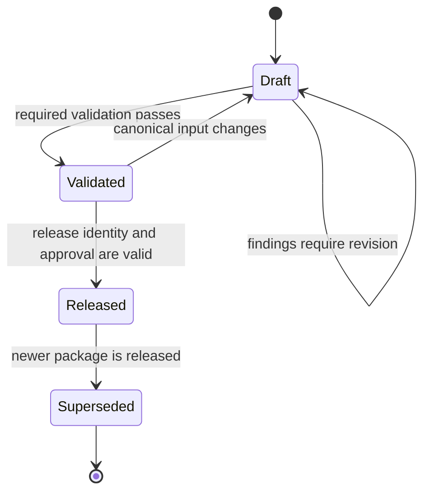
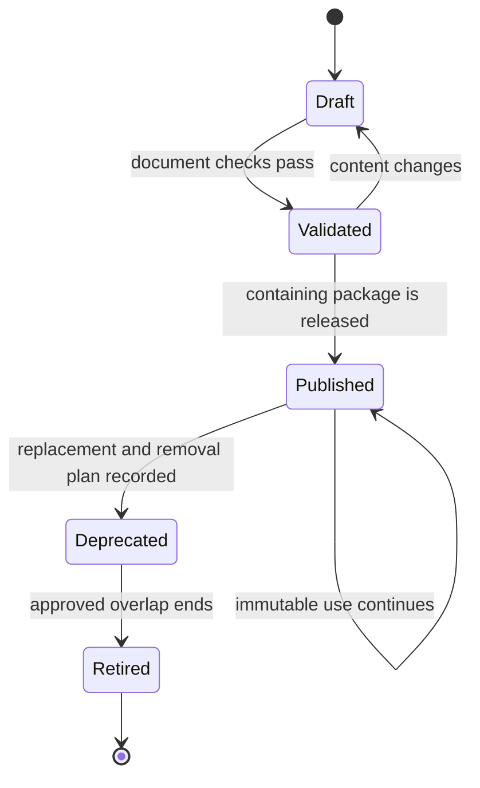
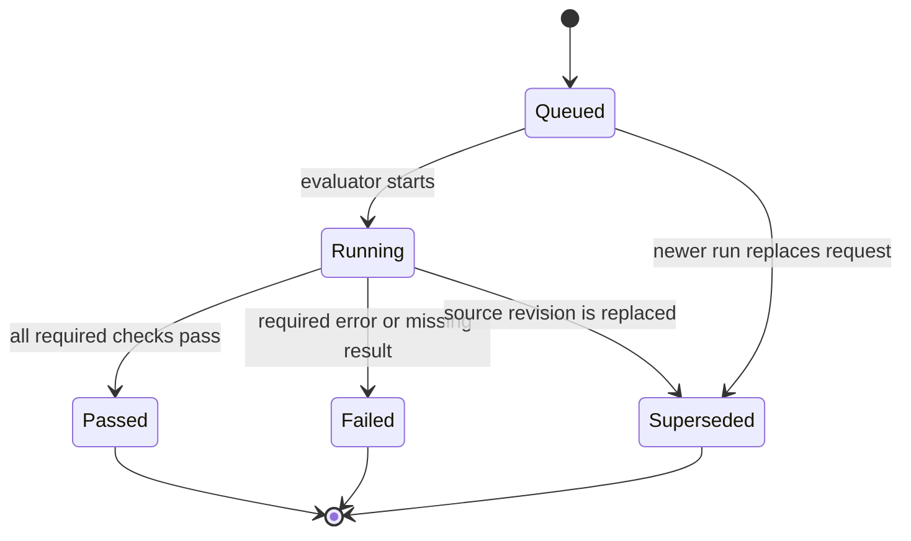
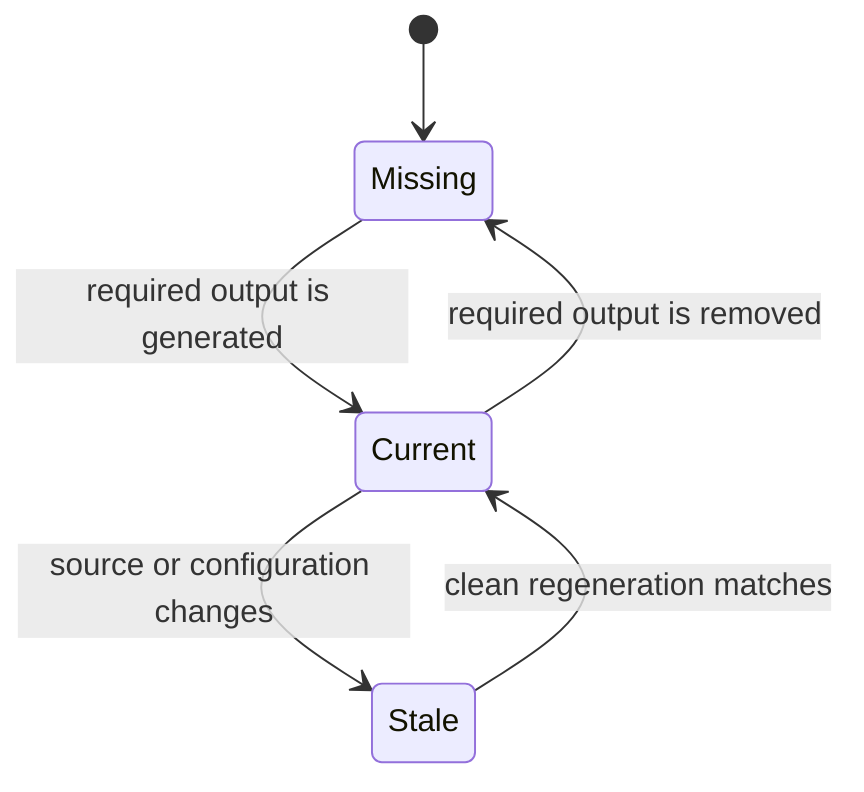
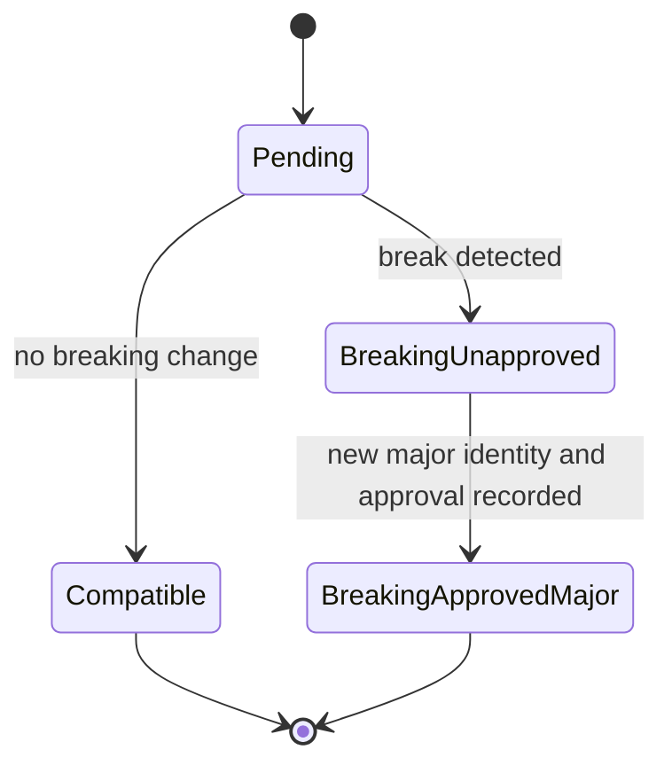
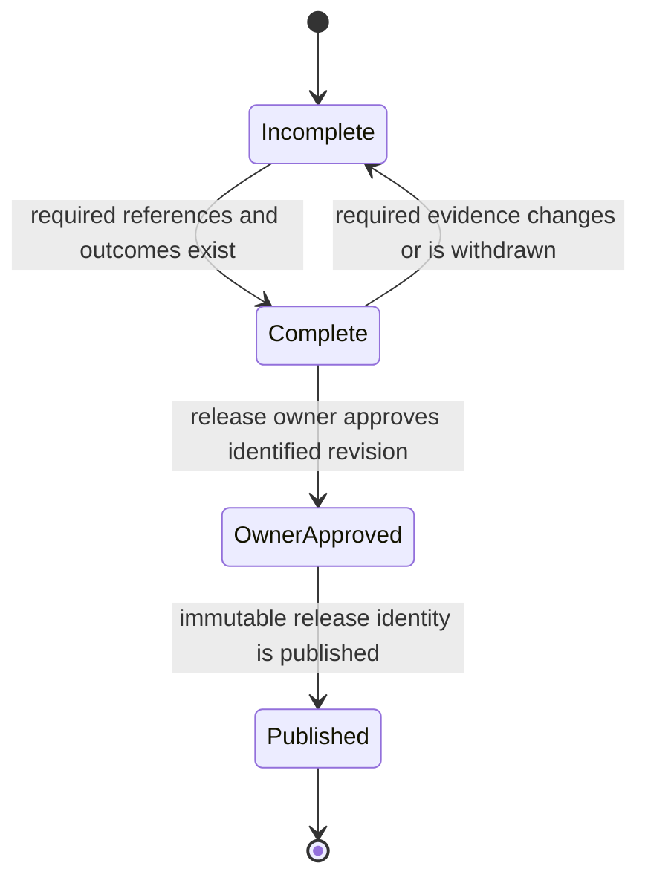
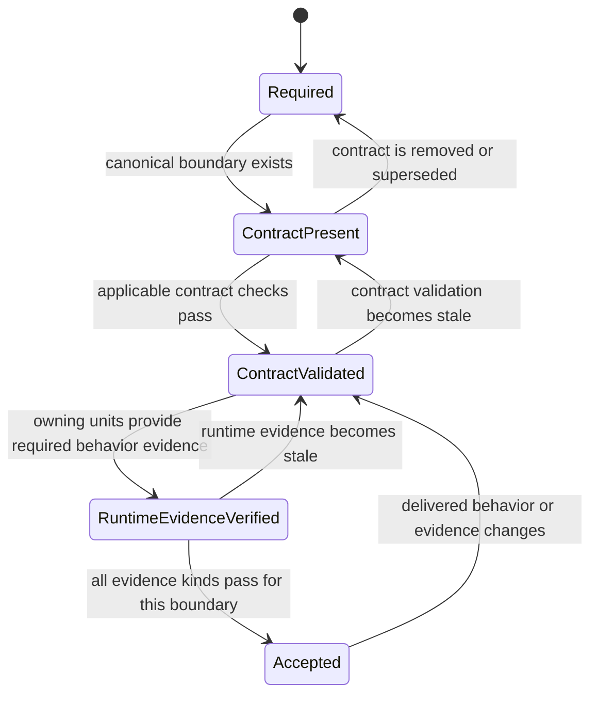
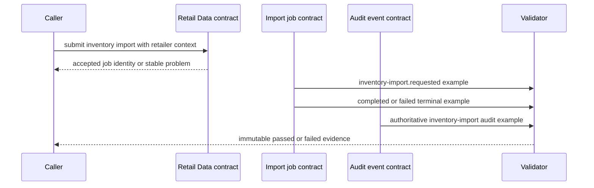
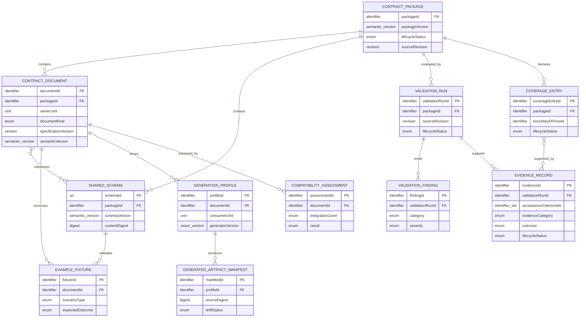

# Contracts Functional Specification

Unit: U1 Contracts (`contracts`)

Sources: `unit-of-work.md`, `unit-of-work-story-map.md`, `requirements.md`, `components.md`, `contract-summary.md`, and the confirmed Contracts Functional Design questionnaire.

## Purpose and boundaries

U1 provides the canonical, versioned agreement between StockSense units. It governs contract packaging, validation, compatibility assessment, examples, generated-client inputs, and traceable evidence. Provider services own REST semantics; message producers own job and event semantics; consumers own their generated runtime code.

U1 contains no business behavior, runtime authorization, message broker, deployment authority, shared persistence model, or direct access to another unit's storage. A passing schema proves agreement shape. It does not prove that a runtime unit enforces authorization, commits atomically, publishes reliably, or processes a message idempotently; those outcomes require the owning unit's evidence.

## Participants

| Participant | Responsibility |
| --- | --- |
| Provider or producer owner | Defines and approves the semantics of its OpenAPI or AsyncAPI document |
| Contracts maintainer | Packages canonical inputs, applies governance rules, and publishes validated versions |
| Consumer owner | Defines a consumer-local generation profile and compiles the derived output |
| Validation evaluator | Executes required checks and records immutable findings and outcomes |
| Integration evaluator | Selects the correct Git baseline and blocks unapproved incompatibility |
| Release owner | Explicitly approves a major-version break or versioned release claim |
| Reviewer | Traverses stable evidence from acceptance criteria to actual outcomes |

## Canonical package contents

A complete package manifest identifies:

1. One OpenAPI document for each included provider service.
2. One AsyncAPI document for each included message producer.
3. Every shared JSON Schema referenced by those documents.
4. Valid and deliberately invalid examples with expected outcomes.
5. Consumer-local generation profiles and expected generated-output manifests.
6. Compatibility assessments against the required integration baseline.
7. A validation run and evidence records bound to the evaluated source revision.

The initial walking-skeleton package contains only the boundaries needed by Bolt 1. Later consumer stories extend the package before their own acceptance. U1 final acceptance occurs only when every approved boundary has canonical inputs and passing evidence.

## Workflows

### FD1. Register or change a provider contract

1. The provider or producer owner selects an existing document or creates a new draft under a stable document identity.
2. The owner declares the owning unit, document kind, approved specification version, semantic version, canonical path, and digest.
3. The maintainer resolves every referenced shared schema and fixture inside the package boundary.
4. The maintainer checks that ownership remains with the provider or producer and that U1 is recorded only as governance owner.
5. The candidate enters document validation.
6. A failed candidate returns to `draft` with findings; a successful candidate becomes `validated`.
7. Publication occurs only as part of a validated package release. Published content is immutable.

### FD2. Validate a candidate package

1. Create a `ValidationRun` in `queued` state for an immutable source revision and trigger context.
2. Resolve the package manifest and mark the run `running`.
3. Check package completeness, canonical paths, unique identities, exact standard versions, semantic versions, and ownership metadata.
4. Validate OpenAPI and AsyncAPI syntax and all referenced JSON Schemas.
5. Validate every valid example and verify that each deliberately invalid example fails for its declared reason.
6. Apply common policies for tenant context, actor, placement generation, correlation, causation, idempotency, error envelopes, and message categories.
7. Regenerate every required consumer-local output from pinned inputs and compare normalized outputs with their manifests.
8. Execute the compatibility workflow for each changed document.
9. Evaluate required boundary and acceptance-criterion coverage for the trigger context.
10. Record each finding with category, severity, artifact, location, and rule ID.
11. Mark the run `failed` when any required error finding, missing check, stale output, or unapproved break exists; otherwise mark it `passed`.
12. Preserve the immutable result and expose actionable findings to the caller.

### FD3. Assess compatibility

1. Determine the integration level from the intended target: story, Bolt, or release.
2. Select the baseline: the story's Bolt branch, `main` for a Bolt pull request, or the latest release tag for a release.
3. Verify that both baseline and candidate resolve to immutable revisions.
4. Compare every changed document and referenced schema under the approved compatibility policy.
5. Classify additive optional changes as compatible when consumer tolerance rules permit them.
6. Classify removed elements, narrowed accepted inputs, newly required inputs, incompatible output changes, or replaced event meaning as breaking.
7. For a breaking change, require a new major identity and explicit owner approval.
8. Record `compatible`, `breaking-unapproved`, or `breaking-approved-major` with all findings and approval evidence.
9. Return the assessment to the validation run. `breaking-unapproved` is always a required error.

### FD4. Generate and verify consumer-local outputs

1. Resolve the canonical source document, exact generator version, configuration, target language, consumer unit, and consumer-local output path.
2. Verify that the output path is contained by the consumer and does not create a shared runtime package.
3. Generate into a clean temporary location.
4. Normalize only declared nondeterministic metadata; source meaning and executable output are never normalized away.
5. Compute source, configuration, and output digests.
6. Compare the result with the consumer's tracked generated output where tracking is required.
7. Mark the manifest `current` when outputs match, `stale` when they differ, or `missing` when required output is absent.
8. Fail the applicable validation run for `stale` or `missing` and prohibit manual edits as a repair.
9. The consumer accepts regenerated output only together with the canonical contract change that caused it.

### FD5. Validate the initial inventory-import fixture

1. Validate the inventory-import REST boundary for request payload, authentication expectations, retailer context, accepted job response, job query, and stable errors.
2. Validate the `inventory-import.requested` message against its operation, payload, and common envelope.
3. Validate `inventory-import.completed` and `inventory-import.failed` as mutually exclusive terminal outcomes correlated to the request.
4. Validate one immutable authoritative inventory-import audit event with actor, retailer, target, outcome, provenance, correlation, causation, idempotency, and placement metadata.
5. Verify positive examples for each message and negative examples for missing authority context, malformed envelope data, and incompatible schema changes.
6. Record this as the initial reusable fixture only. Do not mark later boundaries or runtime reliability behavior complete.

### FD6. Evaluate CI and portfolio evidence

1. Determine the checks applicable to the changed package elements and trigger context.
2. Run untrusted pull-request checks in the hosted, unprivileged validation path without deployment credentials or access to isolated deployment execution.
3. Combine syntax, examples, policy, generation drift, compatibility, and coverage outcomes into one immutable validation result.
4. Block integration when any required result failed, is missing, or did not run.
5. Create evidence records linking acceptance criteria, boundary IDs, rule IDs, source revision, package version, and validation run.
6. Preserve model and data cards, rejected candidates, resource and recovery findings, synthetic limitations, and all failed, limited, rejected, and not-run outcomes.
7. Label evidence as released only when an explicit owner approval reference, immutable revision, tag, and package version are present.
8. For final coverage, enumerate every delivered REST boundary, async boundary, and sensitive business flow. Require its own passing contract and owning-unit behavior evidence.
9. Reject a complete-coverage claim when only the foundation fixture has passed.

## State machines

### Contract package lifecycle

Text fallback: a package starts as Draft, becomes Validated after all required checks pass, becomes Released only with valid release identity and approval, and becomes Superseded when a newer package is released. Any pre-release content change returns it to Draft.

### Contract document lifecycle

Text fallback: documents move from Draft to Validated and are Published only through a released package. Published revisions remain immutable; they may be Deprecated with a replacement plan and later Retired after the approved overlap.

### Validation run lifecycle

Text fallback: a run is Queued, then Running, and finishes as Passed or Failed. It may become Superseded when a newer immutable source revision replaces it; no terminal result is rewritten.

### Generated artifact drift lifecycle

Text fallback: required generated output is Missing until generated, Current while its source/configuration/output digests match, and Stale after a relevant input change. Only clean regeneration returns it to Current.

### Compatibility result lifecycle

Text fallback: an assessment begins Pending and becomes Compatible or Breaking Unapproved. A breaking result becomes Breaking Approved Major only after both a new major identity and explicit approval exist.

### Evidence publication lifecycle

Text fallback: evidence is Incomplete until all required references and actual outcomes exist, becomes Complete after validation, becomes Owner Approved only through explicit authority, and becomes Published only with immutable release identity.

### Boundary coverage lifecycle

Text fallback: every delivered boundary or sensitive flow begins Required, then gains a canonical contract, passing contract checks, and owning-unit runtime evidence before becoming Accepted. Stale or changed inputs move it back to the earliest valid state.

## Initial fixture sequence

Text fallback: the REST contract accepts or rejects an inventory import, the job contract represents requested and one terminal outcome, the audit contract represents the authoritative event, and validation returns immutable evidence. This diagram describes contract validation, not runtime delivery proof.

## Derived entity-relationship view

The YAML in `entities.md` is authoritative; this diagram is a readable derivative.

Text fallback: a package contains documents, schemas, and per-boundary coverage entries; documents reference schemas and own fixtures, generation profiles, and compatibility assessments; profiles produce generated-output manifests; package validation runs emit findings and support evidence records; evidence records satisfy specific coverage entries.

## Derived rules summary

The YAML in `rules.md` is authoritative; this table is a readable derivative.

| Rules | Behavioural effect |
| --- | --- |
| BR1.1-BR1.4 | Enforce complete, versioned, immutable packages while preserving provider semantic ownership |
| BR2.1-BR2.4 | Validate initial REST/async examples and common authority, correlation, idempotency, and error metadata |
| BR3.1-BR3.3 | Keep generated output consumer-local, reproducible, provenance-rich, and free of manual drift |
| BR4.1-BR4.4 | Compare against the true integration baseline and block unapproved breaking changes |
| BR5.1-BR5.4 | Specify distinct jobs/events and bounded at-least-once reliability semantics without claiming runtime proof |
| BR6.1-BR6.7 | Block failed integration and publish truthful, stable, boundary-specific evidence |

## Errors and edge cases

| Condition | Required outcome |
| --- | --- |
| Manifest references a missing or external path | Package validation fails with the exact declaration and path |
| Duplicate document, schema, fixture, or package identity | Validation fails; identifiers are not silently reassigned |
| Unsupported specification or floating tool/generator version | Validation fails before generation or compatibility judgment |
| Reference cycle or unresolved schema | The affected document and examples fail with the reference chain |
| Valid fixture fails | Run fails and retains the observed schema/policy finding |
| Invalid fixture unexpectedly passes | Run fails because the negative oracle was not enforced |
| Generator output differs only because undeclared metadata varies | Run fails until normalization is explicitly governed; arbitrary diff suppression is prohibited |
| Consumer output was manually edited | Regeneration exposes drift and the applicable check fails |
| Story has no resolvable Bolt baseline | Compatibility assessment fails without falling back silently to `main` |
| No release tag exists | Release comparison remains unresolved until an explicit initial-release baseline is declared and approved |
| Breaking event is edited in place | Compatibility fails; a new type or major identity is required |
| Major version is present without approval | Result remains `breaking-unapproved` and blocks integration |
| Approval exists without immutable revision/package identity | Release evidence remains invalid |
| Duplicate async delivery example | Contract requires deduplication semantics; owning runtime must separately prove one effect |
| Runtime reliability evidence is absent | Schema may pass, but delivery/atomicity acceptance remains incomplete |
| Required check did not run | Validation result is failed or not-run, never passed |
| Foundation fixture passes while later boundaries lack evidence | Final coverage fails and names each uncovered boundary or flow |
| Untrusted validation requests privileged runner or secrets | Privileged execution is denied and CI configuration is failed |

## Acceptance coverage summary

| Story | U1 contribution |
| --- | --- |
| US8.2 | Canonical initial REST/async documents, fixtures, validation, generation inputs, and compatibility failures |
| US8.5 | Contracted message categories, envelope, outbox/inbox, acknowledgement, deduplication, authority, retry, DLQ, and replay semantics; runtime units prove behavior |
| US8.7 | Applicable hosted contract checks, required-check blocking, and an unprivileged public-PR validation path |
| US10.2 | Stable, truthful, revision-bound contract evidence and a final per-boundary coverage matrix |
