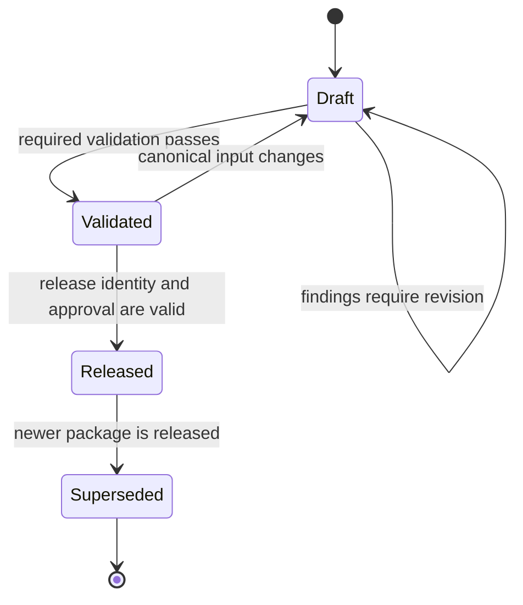
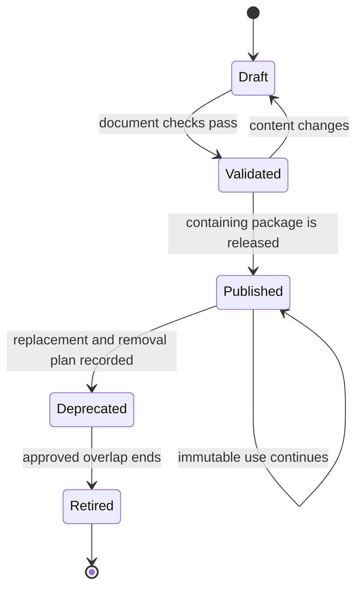
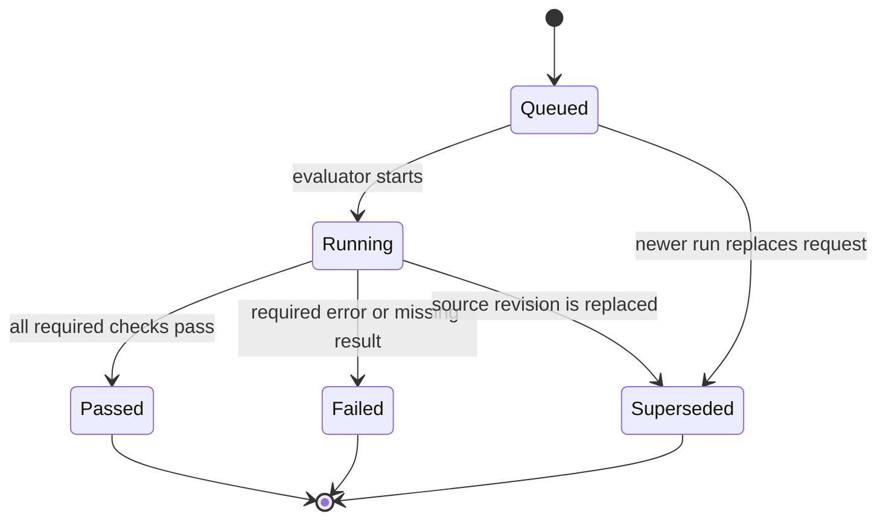
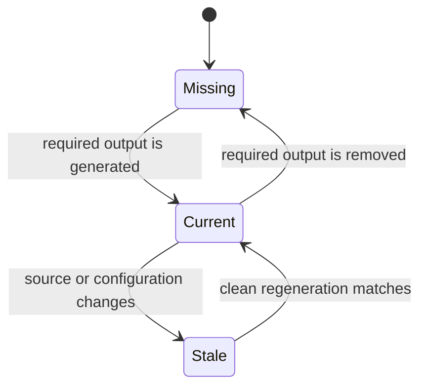
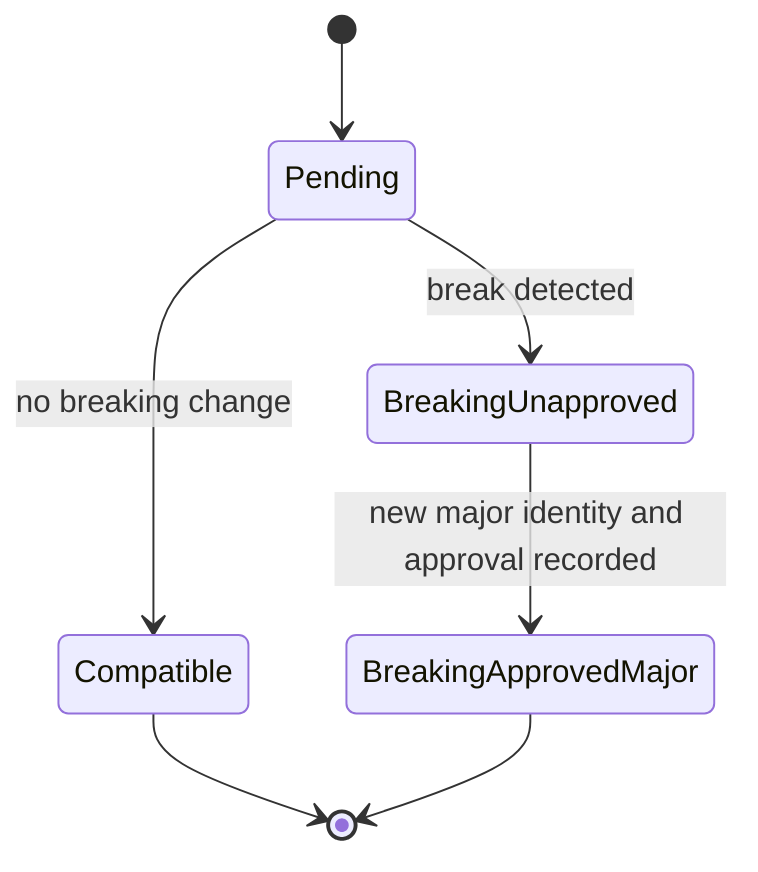
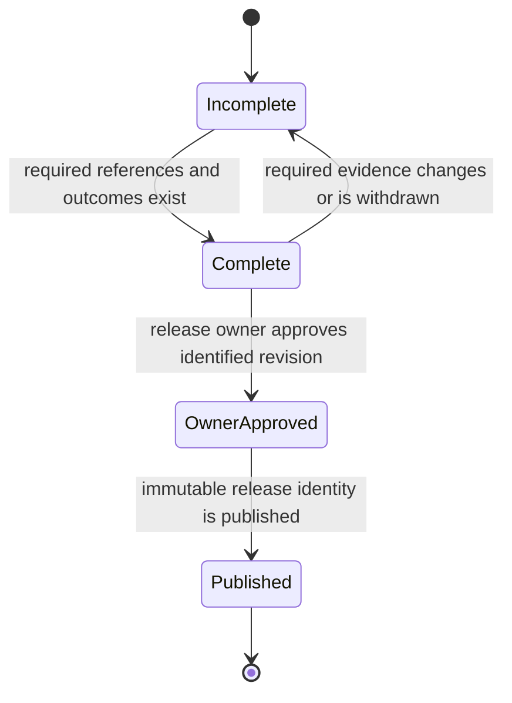
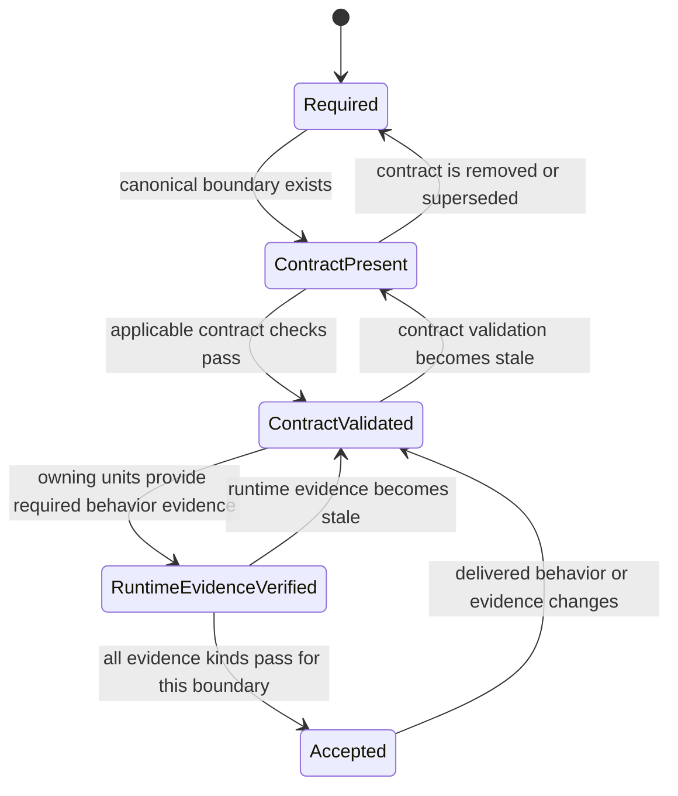
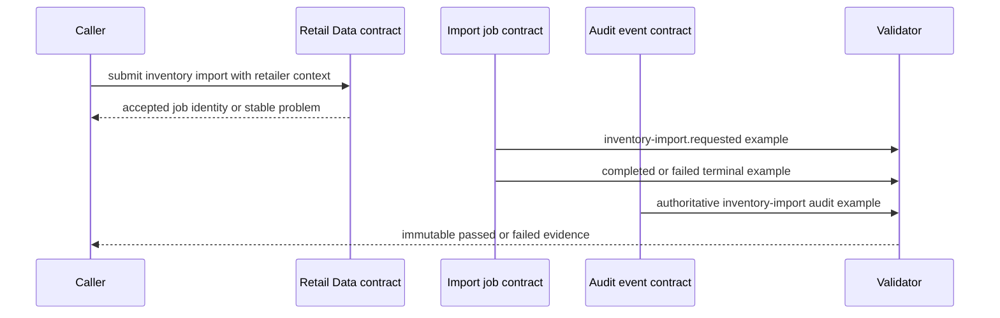
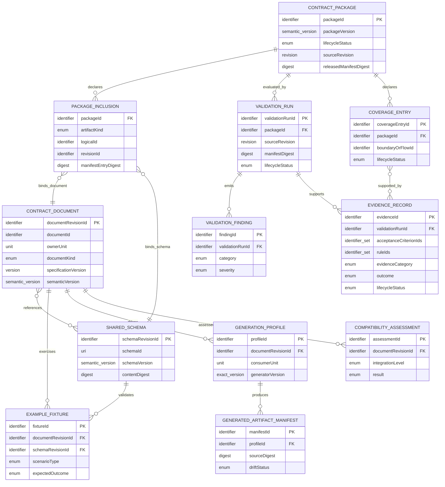

# Contracts Functional Specification

Unit: U1 Contracts (`contracts`)

Sources: `unit-of-work.md`, `unit-of-work-story-map.md`, `requirements.md`, `components.md`, `contract-summary.md`, and the confirmed Contracts Functional Design questionnaire.

## Purpose and boundaries

U1 provides the canonical, versioned agreement between StockSense units. It governs contract packaging, validation, compatibility assessment, examples, generated-client inputs, and traceable evidence. Provider services own REST semantics; message producers own job and event semantics; consumers own their generated runtime code.

U1 contains no business behavior, runtime authorization, message broker, deployment authority, shared persistence model, or direct access to another unit's storage. A passing schema proves agreement shape. It does not prove that a runtime unit enforces authorization, commits atomically, publishes reliably, or processes a message idempotently; those outcomes require the owning unit's evidence.

## Participants

| Participant | Responsibility |
| --- | --- |
| Provider or producer owner | Defines and approves the semantics of its OpenAPI or AsyncAPI document |
| Contracts maintainer | Packages canonical inputs, applies governance rules, and publishes validated versions |
| Consumer owner | Defines a consumer-local generation profile and compiles the derived output |
| Validation evaluator | Executes required checks and records immutable findings and outcomes |
| Integration evaluator | Selects the correct Git baseline and blocks unapproved incompatibility |
| Release owner | Explicitly approves a major-version break or versioned release claim |
| Reviewer | Traverses stable evidence from acceptance criteria to actual outcomes |

## Canonical package contents

A complete versioned C01 package manifest identifies canonical documents and package-local governed sidecars with owner, path, semantic version, SHA-256 digest, immutable source revision, and C01-C27 boundary coverage. The release validator compares its per-boundary inventory with the fixed C01 required-kind matrix and rejects missing or duplicate boundaries, missing applicable sidecars, and digest mismatches. A sidecar for a generated-output manifest points to consumer-local code without moving that code into U1. The manifest identifies:

1. One OpenAPI document for each included provider service.
2. One AsyncAPI document for each included message producer.
3. Every shared JSON Schema and every typed-port signature referenced by those documents.
4. Valid and deliberately invalid examples with expected outcomes.
5. Consumer-local generation profiles and expected generated-output manifests.
6. Compatibility assessments against the required integration baseline.
7. A validation run and evidence records bound to the evaluated source revision.

The initial walking-skeleton candidate package contains only the boundaries needed by Bolt 1. Later consumer stories extend the package before their own acceptance. A release package requires all C01-C27 boundaries, their canonical inputs, and passing evidence. The approved inventory includes C22-C23 Messaging Platform and C24-C27 Recovery Coordination; U1 governs their wire contracts while U14 and U15 retain their runtime responsibilities. The C01/C15 inventory also distinguishes the closed tenant audit envelope from the retailerless global identity-audit envelope; U1 validates both without giving itself runtime audit or access authority.

Each document and shared schema has a stable logical ID plus a distinct immutable revision ID. U1 derives these IDs at package load from the approved C01 manifest fields: `logicalId = SHA-256("logical\0" || kind || "\0" || owner || "\0" || normalizedPath)` and `revisionId = SHA-256("revision\0" || logicalId || "\0" || semanticVersion || "\0" || contentDigest)`, over UTF-8 bytes with lowercase canonical kind, exact registered owner, slash-normalized case-sensitive safe path and lowercase `sha256:` hex. `ContractDocument.documentId` equals the derived logical ID; `SharedSchema.schemaId` equals `urn:stocksense:schema:<logicalId>`. U1 validates any JSON Schema `$id` as a reference URI without rewriting it. U1 also hashes each RFC 8785 canonical manifest entry into `PackageInclusion.manifestEntryDigest` without adding derived fields to C01. A changed path creates a new logical identity. A package-local inclusion binds one manifest entry and boundary set to exactly one revision; another package version may reuse that immutable revision. Package load recomputes and checks every binding before fixture or generator resolution. Fixtures, generation profiles and compatibility assessments reference revision IDs. Published predecessors remain addressable while a replacement is validated. A finalized manifest's exact SHA-256 digest is bound to a detached validation receipt, avoiding a manifest that hashes a sidecar containing its own digest.

## Workflows

### FD1. Register or change a provider contract

1. The provider or producer owner selects an existing logical document identity or creates a new one; every changed document or shared schema receives a new immutable revision ID while published predecessors remain addressable.
2. The owner declares the owning unit, document kind, approved specification version, semantic version, canonical path, content digest, and exact document/schema revision IDs.
3. The maintainer resolves every referenced shared schema and fixture inside the package boundary.
4. The maintainer checks that ownership remains with the provider or producer and that U1 is recorded only as governance owner.
5. The candidate enters document validation.
6. A failed candidate returns to `draft` with findings; a successful candidate becomes `validated`.
7. Publication occurs only as part of a validated package release. Published revision IDs and content are immutable; a replacement keeps the logical ID and obtains a new revision ID.

### FD2. Validate a candidate package

1. Run the prerequisite checks that produce governed result sidecars, freeze the resulting exact candidate manifest bytes, compute their SHA-256 digest, then create the final `ValidationRun` in `queued` state for that manifest digest, immutable source revision, and trigger context. Keep this digest-bound final receipt detached from the manifest to avoid self-reference.
2. Resolve the package manifest and mark the run `running`.
3. Check package completeness, canonical paths, unique identities, exact standard versions, semantic versions, ownership metadata, C01's fixed required-kind/sidecar matrix, and exactly one coverage row for each C01-C27 boundary in a release. Recompute every manifest-entry logical/revision ID and bind it through one package-local inclusion; reject ambiguous bindings before resolving fixtures or generated outputs.
4. Validate OpenAPI and AsyncAPI syntax, all referenced JSON Schemas, and every typed-port signature with the port validator.
5. Recompute every listed canonical and sidecar `sha256:` digest from exact bytes, reconstruct canonical inputs from the immutable `sourceRevision`, and reject unlisted, duplicated, symlinked, traversal, or source-mismatched files. Validate every valid example and verify that each deliberately invalid example fails for its declared reason.
6. Apply common policies for tenant context, actor, placement generation, correlation, causation, idempotency, error envelopes, and message categories.
7. Regenerate every required consumer-local output from pinned inputs and compare normalized outputs with their manifests.
8. Execute the compatibility workflow for each changed document.
9. Evaluate required boundary and acceptance-criterion coverage for the trigger context.
10. Record each finding with category, severity, artifact, location, and rule ID.
11. Mark the run `failed` when any required error finding, missing check, stale output, or unapproved break exists; otherwise mark it `passed`.
12. Preserve the immutable detached result with the exact manifest digest, source revision, sidecar digests, and findings. Publication recomputes and compares the manifest digest and source revision against this passing receipt; any byte change requires a new run.

### FD3. Assess compatibility

1. Determine the integration level from the intended target: story, Bolt, or release.
2. Select the baseline: the story's Bolt branch, `main` for a Bolt pull request, or the latest release tag for a release.
3. Verify that both baseline and candidate resolve to immutable revisions.
4. Compare every changed document and referenced schema under the approved compatibility policy.
5. Classify additive optional changes as compatible when consumer tolerance rules permit them.
6. Classify removed elements, narrowed accepted inputs, newly required inputs, incompatible output changes, or replaced event meaning as breaking.
7. For a breaking change, require a new major identity and explicit owner approval.
8. Record `compatible`, `breaking-unapproved`, or `breaking-approved-major` with all findings and approval evidence.
9. Return the assessment to the validation run. `breaking-unapproved` is always a required error.

### FD4. Generate and verify consumer-local outputs

1. Resolve the exact canonical document revision ID and content digest, exact generator version, configuration, target language, consumer unit, and consumer-local output path.
2. Verify that the output path is contained by the consumer and does not create a shared runtime package.
3. Generate into a clean temporary location.
4. Normalize only declared nondeterministic metadata; source meaning and executable output are never normalized away.
5. Compute source, configuration, and output digests.
6. Compare the result with the consumer's tracked generated output where tracking is required.
7. Mark the manifest `current` when outputs match, `stale` when they differ, or `missing` when required output is absent.
8. Fail the applicable validation run for `stale` or `missing` and prohibit manual edits as a repair.
9. The consumer accepts regenerated output only together with the canonical contract change that caused it.

### FD4a. Validate messaging and recovery protocol packages

1. Validate C22's protocol compatibility manifest against both closed C01 envelope profiles and U14's .NET/Python package declarations. Require the same protocol and conformance-fixture versions for U14 and the service-owned U3/U4 bootstrap publisher adapters; preserve separate U13 evidence for each. A package declaration or schema pass cannot stand in for runtime conformance.
2. Validate C23's wire constraints: authenticated producer binding, RFC 8785 payload digest, 65,536-byte envelope limit, five total deliveries, bounded retry and seven-day DLQ retention, authorized replay of at most 100 messages, and no global ordering or exactly-once claim. Validate U3/U4 as bootstrap publishers without adding a U14 package dependency.
3. Validate separate C15 tenant and retailerless global identity-audit AsyncAPI routes and examples. Global events use the closed global C01 envelope, include redacted pre-login denials, and have no invented retailer or placement fields; tenant events require a real retailer and placement generation. Reject cross-route or cross-envelope examples.
4. Validate C02's revocable human platform-Operator grant/current-check contract, U10's distinct C17 delegated-human global query, and U11's separate C18 no-store platform route. Negative examples reject retailer-only Operators, machine callers, revoked grants, wrong audience/client/scope, unavailable U3 checks, and tenant-route leakage. U1 validates shapes and fixtures; U3/U10/U11/U12 own runtime enforcement.
5. Validate C24 bootstrap REST with required `X-Correlation-ID` and `Idempotency-Key` headers, its typed durable `200` result, and RFC 9457 `401`/`403`/`409`/`422`/`503` problems including `RECOVERY_PERSISTENCE_UNAVAILABLE`. Run the approved concrete fixtures for exact durable replay, changed-payload `409`, invalid token `401`, wrong scope `403`, unsupported policy `422`, persistence failure `503` without a fabricated durable result, closed checkpoint/digest matching, and abort-before-late-prepare suppression. A participant `200` never represents coordinator-wide success. Validate C25 recovery commands and acknowledgements, C26 Operator recovery REST, and C27 immutable recovery events as separate provider/producer-owned documents. Every C25/C27 payload composes the C01 message envelope, and examples distinguish class A bootstrap from class B/C asynchronous participants.
6. Require recovery fixtures for roster registration and compatibility, durable prepare dispatch before send, abort to every potentially delivered participant, an abort-before-late-prepare terminal guard, stale-generation fencing, manifest and checkpoint digests, and a failed or unresolved terminal outcome that cannot be reported as success.
7. Require C26 examples for current Operator authorization, same-subject and same-client preview/start binding, single-use confirmation, read-only status inspection, and failure on stale placement, changed manifest, or missing participant. Contract validation cannot substitute for U15's coordinator and participant runtime proof.

### FD4b. Validate C07/C10/C13 model and forecast contract packages

1. Require C07's canonical, versioned `model_lifecycle.finalize_heavy_work_v1` shared-transaction signature, named U5/U7 `EXECUTE` caller roles, positive/negative fixtures and immutable C01 package inclusion. U1 validates the signature and examples; U6 owns its function, lease, fence, pin and drain state, and U5/U7 own their publication transactions.
2. Validate that a batch forecast run, admitted route pin, request, queued first attempt and first lease share the immutable IDs in C07; a later attempt has a new ID only after the prior lease is authoritatively terminal or fenced. Reject mismatched run/pin/attempt claims, an attempt-2 first lease and nonbatch leases carrying batch-only IDs.
3. Require paired fixtures for U5/U7 same-transaction publication, audit/outbox, U6 lease finalization and U6-owned pin closure, exact replay versus changed-digest conflict, and before/after-commit crashes. A schema pass establishes the expected outcome shape; only owning runtime integration tests prove the atomic effect.
4. Require fixtures for pin admission racing route drain, verified pin closure before promotion/rollback, evaluation-lease completion in the same transaction as route change, and central-slot reuse only after retailer-local terminal proof. Timeout alone never clears a pin or slot; U6/U7/U15 own live fencing and recovery proof.
5. Validate C10's typed `ForecastRunHistoryResponse` and C10/C13 requests with 1–100 distinct products. The response's covered and unavailable sets partition the requested products exactly; every unavailable product has a reason, only covered products have 28 dated values, and stale/unpublished/failed runs retain explicit statuses. Positive and deliberately invalid examples verify each bound and branch.
6. Include the typed sidecar, schemas and validation outcomes in the Bolt 2 C01 release. U6/U7 producer-consumer tests close in Bolt 4; U8/U11/U12 consumers and U13 clean-room evidence verify their respective paths later. No U1 contract check is counted as runtime publication or authorization evidence.

### FD5. Validate the initial inventory-import fixture

1. Validate the inventory-import REST boundary for request payload, authentication expectations, retailer context, accepted job response, job query, and stable errors.
2. Validate the `inventory-import.requested` message against its operation, payload, and common envelope.
3. Validate `inventory-import.completed` and `inventory-import.failed` as mutually exclusive terminal outcomes correlated to the request.
4. Validate one immutable authoritative inventory-import audit event with actor, retailer, target, outcome, provenance, correlation, causation, idempotency, and placement metadata.
5. Verify positive examples for each message and negative examples for missing authority context, malformed envelope data, and incompatible schema changes.
6. Record this as the initial reusable fixture only. Do not mark later boundaries or runtime reliability behavior complete.

### FD6. Evaluate CI and portfolio evidence

1. Determine the checks applicable to the changed package elements and trigger context.
2. Run untrusted pull-request checks in the hosted, unprivileged validation path without deployment credentials or access to isolated deployment execution.
3. Combine syntax, examples, policy, generation drift, compatibility, and coverage outcomes into one immutable detached validation result bound to the exact finalized manifest digest and source revision.
4. Block integration when any required result failed, is missing, or did not run.
5. Create evidence records linking acceptance criteria, boundary IDs, nonempty versioned rule IDs, source revision, package version, and validation run. Resolve each rule ID against the rules catalogue at that source revision and verify the linked acceptance criterion, boundary, revision and run belong to the same validated package.
6. Preserve model and data cards, rejected candidates, resource and recovery findings, synthetic limitations, and all six evidence outcomes: passed, failed, limited, rejected, unavailable, and not-run. Every outcome retains reason, expected and actual result, trace, environment, timing, command profile, artifact digests, and limitations.
7. Before publication, recompute the final manifest digest and source revision and require exact agreement with a passing validation receipt; a changed manifest or sidecar returns to validation. Label evidence as released only when that receipt, explicit owner approval reference, immutable revision, tag, and package version are present.
8. For final coverage, enumerate every delivered REST boundary, async boundary, and sensitive business flow. Require its own passing contract and owning-unit behavior evidence.
9. Reject a complete-coverage claim when only the foundation fixture has passed.

## State machines

### Contract package lifecycle

```mermaid
stateDiagram-v2
    [*] --> Draft
    Draft --> Validated: required validation passes
    Draft --> Draft: findings require revision
    Validated --> Released: release identity and approval are valid
    Validated --> Draft: canonical input changes
    Released --> Superseded: newer package is released
    Superseded --> [*]
```

Text fallback: a package starts as Draft, becomes Validated after all required checks pass, becomes Released only with valid release identity and approval, and becomes Superseded when a newer package is released. Any pre-release content change returns it to Draft.

### Contract document lifecycle

```mermaid
stateDiagram-v2
    [*] --> Draft
    Draft --> Validated: document checks pass
    Validated --> Draft: content changes
    Validated --> Published: containing package is released
    Published --> Deprecated: replacement and removal plan recorded
    Deprecated --> Retired: approved overlap ends
    Published --> Published: immutable use continues
    Retired --> [*]
```

Text fallback: documents move from Draft to Validated and are Published only through a released package. Published revisions remain immutable; they may be Deprecated with a replacement plan and later Retired after the approved overlap.

### Validation run lifecycle

```mermaid
stateDiagram-v2
    [*] --> Queued
    Queued --> Running: evaluator starts
    Running --> Passed: all required checks pass
    Running --> Failed: required error or missing result
    Queued --> Superseded: newer run replaces request
    Running --> Superseded: source revision is replaced
    Passed --> [*]
    Failed --> [*]
    Superseded --> [*]
```

Text fallback: a run is Queued, then Running, and finishes as Passed or Failed. It may become Superseded when a newer immutable source revision replaces it; no terminal result is rewritten.

### Generated artifact drift lifecycle

```mermaid
stateDiagram-v2
    [*] --> Missing
    Missing --> Current: required output is generated
    Current --> Stale: source or configuration changes
    Stale --> Current: clean regeneration matches
    Current --> Missing: required output is removed
```

Text fallback: required generated output is Missing until generated, Current while its source/configuration/output digests match, and Stale after a relevant input change. Only clean regeneration returns it to Current.

### Compatibility result lifecycle

```mermaid
stateDiagram-v2
    [*] --> Pending
    Pending --> Compatible: no breaking change
    Pending --> BreakingUnapproved: break detected
    BreakingUnapproved --> BreakingApprovedMajor: new major identity and approval recorded
    Compatible --> [*]
    BreakingApprovedMajor --> [*]
```

Text fallback: an assessment begins Pending and becomes Compatible or Breaking Unapproved. A breaking result becomes Breaking Approved Major only after both a new major identity and explicit approval exist.

### Evidence publication lifecycle

```mermaid
stateDiagram-v2
    [*] --> Incomplete
    Incomplete --> Complete: required references and outcomes exist
    Complete --> OwnerApproved: release owner approves identified revision
    OwnerApproved --> Published: immutable release identity is published
    Complete --> Incomplete: required evidence changes or is withdrawn
    Published --> [*]
```

Text fallback: evidence is Incomplete until all required references and actual outcomes exist, becomes Complete after validation, becomes Owner Approved only through explicit authority, and becomes Published only with immutable release identity.

### Boundary coverage lifecycle

```mermaid
stateDiagram-v2
    [*] --> Required
    Required --> ContractPresent: canonical boundary exists
    ContractPresent --> ContractValidated: applicable contract checks pass
    ContractValidated --> RuntimeEvidenceVerified: owning units provide required behavior evidence
    RuntimeEvidenceVerified --> Accepted: all evidence kinds pass for this boundary
    ContractPresent --> Required: contract is removed or superseded
    ContractValidated --> ContractPresent: contract validation becomes stale
    RuntimeEvidenceVerified --> ContractValidated: runtime evidence becomes stale
    Accepted --> ContractValidated: delivered behavior or evidence changes
```

Text fallback: every delivered boundary or sensitive flow begins Required, then gains a canonical contract, passing contract checks, and owning-unit runtime evidence before becoming Accepted. Stale or changed inputs move it back to the earliest valid state.

## Initial fixture sequence

```mermaid
sequenceDiagram
    participant Caller
    participant RetailContract as Retail Data contract
    participant JobContract as Import job contract
    participant AuditContract as Audit event contract
    participant Validator

    Caller->>RetailContract: submit inventory import with retailer context
    RetailContract-->>Caller: accepted job identity or stable problem
    JobContract->>Validator: inventory-import.requested example
    JobContract->>Validator: completed or failed terminal example
    AuditContract->>Validator: authoritative inventory-import audit example
    Validator-->>Caller: immutable passed or failed evidence
```

Text fallback: the REST contract accepts or rejects an inventory import, the job contract represents requested and one terminal outcome, the audit contract represents the authoritative event, and validation returns immutable evidence. This diagram describes contract validation, not runtime delivery proof.

## Derived entity-relationship view

The YAML in `entities.md` is authoritative; this diagram is a readable derivative.

```mermaid
erDiagram
    CONTRACT_PACKAGE ||--o{ PACKAGE_INCLUSION : declares
    PACKAGE_INCLUSION }o--|| CONTRACT_DOCUMENT : binds_document
    PACKAGE_INCLUSION }o--|| SHARED_SCHEMA : binds_schema
    CONTRACT_DOCUMENT }o--o{ SHARED_SCHEMA : references
    CONTRACT_DOCUMENT ||--o{ EXAMPLE_FIXTURE : exercises
    SHARED_SCHEMA ||--o{ EXAMPLE_FIXTURE : validates
    CONTRACT_DOCUMENT ||--o{ GENERATION_PROFILE : drives
    GENERATION_PROFILE ||--o{ GENERATED_ARTIFACT_MANIFEST : produces
    CONTRACT_DOCUMENT ||--o{ COMPATIBILITY_ASSESSMENT : assessed_by
    CONTRACT_PACKAGE ||--o{ VALIDATION_RUN : evaluated_by
    VALIDATION_RUN ||--o{ VALIDATION_FINDING : emits
    VALIDATION_RUN ||--o{ EVIDENCE_RECORD : supports
    CONTRACT_PACKAGE ||--o{ COVERAGE_ENTRY : declares
    COVERAGE_ENTRY }o--o{ EVIDENCE_RECORD : supported_by

    CONTRACT_PACKAGE {
        identifier packageId PK
        semantic_version packageVersion
        enum lifecycleStatus
        revision sourceRevision
        digest releasedManifestDigest
    }
    PACKAGE_INCLUSION {
        identifier packageId FK
        enum artifactKind
        identifier logicalId
        identifier revisionId
        digest manifestEntryDigest
    }
    CONTRACT_DOCUMENT {
        identifier documentRevisionId PK
        identifier documentId
        unit ownerUnit
        enum documentKind
        version specificationVersion
        semantic_version semanticVersion
    }
    SHARED_SCHEMA {
        identifier schemaRevisionId PK
        uri schemaId
        semantic_version schemaVersion
        digest contentDigest
    }
    EXAMPLE_FIXTURE {
        identifier fixtureId PK
        identifier documentRevisionId FK
        identifier schemaRevisionId FK
        enum scenarioType
        enum expectedOutcome
    }
    GENERATION_PROFILE {
        identifier profileId PK
        identifier documentRevisionId FK
        unit consumerUnit
        exact_version generatorVersion
    }
    GENERATED_ARTIFACT_MANIFEST {
        identifier manifestId PK
        identifier profileId FK
        digest sourceDigest
        enum driftStatus
    }
    COMPATIBILITY_ASSESSMENT {
        identifier assessmentId PK
        identifier documentRevisionId FK
        enum integrationLevel
        enum result
    }
    VALIDATION_RUN {
        identifier validationRunId PK
        identifier packageId FK
        revision sourceRevision
        digest manifestDigest
        enum lifecycleStatus
    }
    VALIDATION_FINDING {
        identifier findingId PK
        identifier validationRunId FK
        enum category
        enum severity
    }
    EVIDENCE_RECORD {
        identifier evidenceId PK
        identifier validationRunId FK
        identifier_set acceptanceCriterionIds
        identifier_set ruleIds
        enum evidenceCategory
        enum outcome
        enum lifecycleStatus
    }
    COVERAGE_ENTRY {
        identifier coverageEntryId PK
        identifier packageId FK
        identifier boundaryOrFlowId
        enum lifecycleStatus
    }
```

Text fallback: a package has package-local inclusions that derive and bind one immutable revision per logical document/schema, allowing that revision to be reused by later packages, and contains per-boundary coverage entries. Fixtures, generation profiles and compatibility assessments reference those exact revisions. Profiles produce generated-output manifests; detached package validation receipts bind the exact manifest digest, emit findings, and support evidence records whose rule IDs resolve against the same source revision; evidence records satisfy specific coverage entries.

## Derived rules summary

The YAML in `rules.md` is authoritative; this table is a readable derivative.

| Rules | Behavioural effect |
| --- | --- |
| BR1.1-BR1.6 | Enforce complete, exact-manifest-bound, revision-addressable immutable packages while preserving provider semantic ownership |
| BR2.1-BR2.7 | Validate initial REST/async examples, the C07 finalizer/pin/drain fixtures, C10/C13 typed history and bounded product-set coverage, complete versioned catalogue, and common authority, correlation, idempotency, and error metadata |
| BR3.1-BR3.3 | Keep generated output consumer-local, reproducible, provenance-rich, and free of manual drift |
| BR4.1-BR4.4 | Compare against the true integration baseline and block unapproved breaking changes |
| BR5.1-BR5.4 | Specify distinct jobs/events and bounded at-least-once reliability semantics without claiming runtime proof |
| BR5.5-BR5.10 | Preserve C01/C15/C17/C18/C22-C27 messaging, global audit, and recovery compatibility, fencing, partial-failure, and Operator confirmation semantics |
| BR6.1-BR6.7 | Block failed integration and publish truthful, stable, boundary-specific evidence |

## Errors and edge cases

| Condition | Required outcome |
| --- | --- |
| Manifest references a missing or external path | Package validation fails with the exact declaration and path |
| Duplicate document, schema, fixture, or package identity | Validation fails; identifiers are not silently reassigned |
| Unsupported specification or floating tool/generator version | Validation fails before generation or compatibility judgment |
| Reference cycle or unresolved schema | The affected document and examples fail with the reference chain |
| Valid fixture fails | Run fails and retains the observed schema/policy finding |
| Invalid fixture unexpectedly passes | Run fails because the negative oracle was not enforced |
| Generator output differs only because undeclared metadata varies | Run fails until normalization is explicitly governed; arbitrary diff suppression is prohibited |
| Consumer output was manually edited | Regeneration exposes drift and the applicable check fails |
| Story has no resolvable Bolt baseline | Compatibility assessment fails without falling back silently to `main` |
| No release tag exists | Release comparison remains unresolved until an explicit initial-release baseline is declared and approved |
| Breaking event is edited in place | Compatibility fails; a new type or major identity is required |
| Major version is present without approval | Result remains `breaking-unapproved` and blocks integration |
| Approval exists without immutable revision/package identity | Release evidence remains invalid |
| Manifest bytes or a governed sidecar changes after the passing run | Published digest no longer matches the detached receipt; require a fresh final validation run |
| Fixture or generated output refers only to a mutable logical document/schema ID | Reject the unresolved reference and bind it to an immutable revision ID |
| Manifest entry does not deterministically resolve to one immutable revision | Reject package load before fixture, generation or publication; preserve the prior revision |
| Same immutable revision appears in a later package version | Reuse it through a new package-local inclusion without mutating the revision |
| Evidence names an unknown or cross-revision rule ID | Reject the evidence link and the complete-coverage claim |
| C07 batch lease lacks matching run/pin/attempt IDs, or a pin/drain fixture permits stale authority | Fail the named negative fixture; U6/U7 must separately prove live row-lock and transaction behavior |
| C10/C13 product coverage omits a requested product or fabricates an unavailable series | Fail the typed schema/example fixture and identify the product and branch |
| Global identity audit is routed through a tenant envelope or retailer route | Fail C01/C15 validation and retain the negative fixture; never fabricate retailer or placement context |
| Retailer-only or machine caller passes a global identity-audit example | Fail C02/C17/C18 validation; runtime units must also prove the denial |
| Duplicate async delivery example | Contract requires deduplication semantics; owning runtime must separately prove one effect |
| Runtime reliability evidence is absent | Schema may pass, but delivery/atomicity acceptance remains incomplete |
| Required check did not run | Validation result is failed or not-run, never passed |
| Foundation fixture passes while later boundaries lack evidence | Final coverage fails and names each uncovered boundary or flow |
| Untrusted validation requests privileged runner or secrets | Privileged execution is denied and CI configuration is failed |

## Acceptance coverage summary

| Story | U1 contribution |
| --- | --- |
| US8.2 | Canonical initial REST/async documents, fixtures, validation, generation inputs, compatibility failures, and complete versioned catalogues for the browser/BFF, messaging, evidence, heavy-lease, signed-model, forecast-history/product-set and recovery boundaries (AC8.2.4); C07/C10/C13 conformance is documented separately from runtime proof |
| US8.5 | Contracted message categories, envelope, outbox/inbox, acknowledgement, deduplication, authority, retry, DLQ, and replay semantics; U1 supplies the parameterized consumer fixture for AC8.5.4 while each runtime domain consumer proves its own atomic effect |
| US8.7 | Applicable hosted contract checks, required-check blocking, and an unprivileged public-PR validation path |
| US9.11 | C24-C27 recovery bootstrap, command/acknowledgement, Operator, and event contracts with negative fencing and partial-failure fixtures; U15/U14 and participants prove runtime behavior |
| US10.2 | Stable, truthful, revision-bound contract evidence, the exact six-outcome evidence manifest fields in AC10.2.5, and a final per-boundary coverage matrix |

## Review

**Verdict:** NOT-READY
**Reviewer:** aidlc-architecture-reviewer-agent
**Date:** 2026-09-26T14:10:44Z
**Iteration:** 1
**Request Challenge:** review:c48d7d670f00369220c04b181e18c9bd

### Findings

| ID | Severity | Location | Finding | Required action | Status |
|---|---|---|---|---|---|
| R-01 | Critical | aidlc/spaces/default/intents/260908-stock-sense-design/construction/contracts/functional-design/entities.md > SharedSchema.dialect and ExampleFixture.documentRevisionId; aidlc/spaces/default/intents/260908-stock-sense-design/construction/contracts/functional-design/functional-spec.md > FD4b step 1 | C01 requires C07's `model-lifecycle/v1/finalize-heavy-work.shared-schema.yaml` as a canonical schema (contract-summary.md, C01 policy lines 157-163), but C07 defines it as a typed PostgreSQL port with `port`, arguments, result, conflicts and locking (lines 1054-1087), not a JSON Schema. U1's only SharedSchema entity requires the JSON Schema 2020-12 dialect, FD2 validates shared schemas as JSON Schema, and every fixture must reference an OpenAPI/AsyncAPI ContractDocument revision. The required finalizer signature and its fixtures therefore have no valid package or fixture binding in this model. | Model the C07 typed port as a distinct canonical schema kind or define a valid representation and validator for it; bind its positive/negative fixtures to that exact immutable port revision and make the C01 required-kind policy agree. | Unresolved |
| R-02 | Major | aidlc/spaces/default/intents/260908-stock-sense-design/construction/contracts/functional-design/rules.md > BR2.7; aidlc/spaces/default/intents/260908-stock-sense-design/construction/contracts/functional-design/functional-spec.md > FD4b step 5 | BR2.7 fails a covered C10 or C13 product lacking 28 dated values, but C13's `forecast-status` response deliberately omits series for every product (contract-summary.md, C13 lines 1501-1509 and 1540); only `forecast-evidence` carries 28 values. Applying this rule as written rejects a valid status response. | Split validation by response type: require 28 dated values for covered C10 latest/history and C13 evidence responses, and forbid series in C13 status responses. Add positive and negative fixtures for both C13 operations. | Unresolved |
| R-03 | Major | aidlc/spaces/default/intents/260908-stock-sense-design/construction/contracts/functional-design/entities.md > ContractPackage.governedArtifacts, ContractPackage.boundaryCoverage and PackageInclusion.artifactKind; aidlc/spaces/default/intents/260908-stock-sense-design/construction/contracts/functional-design/functional-spec.md > FD2 step 3 | The C01 governed-sidecar layer is not modelled. `PackageInclusion.artifactKind` admits only `openapi`, `asyncapi` and `json-schema`, and none of the ten sidecar kinds the C01 policy names (`example-fixture`, `compatibility-assessment`, `validation-run`, `evidence-record`, `generation-profile`, `generated-output-manifest`, `contract-package-policy`, `protocol-compatibility-manifest`, `messaging-conformance-profile`, `recovery-policy` in contract-summary.md `requiredSidecarKinds`) occurs anywhere in entities.md, rules.md or functional-spec.md. `governedArtifacts` and `boundaryCoverage` use the logical types `Set<GovernedArtifactReference>` and `BoundaryInventory`, neither of which is defined in this unit. FD2 step 3 and BR1.1 nevertheless require validating each sidecar's kind, path, digest, owner and per-boundary coverage against that fixed matrix. | Define the governed-sidecar reference and boundary-inventory types as first-class entities, or extend PackageInclusion, carrying the sidecar kind enum, owner, boundary IDs, path, digest and source revision, so FD2 step 3 has a model to validate against. | New |
| R-04 | Major | aidlc/spaces/default/intents/260908-stock-sense-design/construction/contracts/functional-design/entities.md > ContractPackage.releasedManifestDigest and ValidationRun.manifestDigest; aidlc/spaces/default/intents/260908-stock-sense-design/construction/contracts/functional-design/functional-spec.md > FD2 steps 1 and 12 and FD6 step 7 | The design resolves the manifest self-reference by keeping the final validation receipt detached and by making `releasedManifestDigest` a detached publication-registry field, but neither the receipt's storage location nor the publication registry is modelled: ValidationRun has no path or registry attribute and no entity represents the registry. The C01 release policy rejects any unlisted applicable file beneath the package root (contract-summary.md, release-policy paragraph following the policy YAML), so an unlisted in-package receipt would fail its own validator, and FD6 step 7 cannot say how publication locates the passing receipt it must recompute against. | State where the detached receipt and publication registry live relative to the package root, model their identity and lookup, and reconcile that placement with the C01 unlisted-file rejection rule. | New |
| R-05 | Major | aidlc/spaces/default/intents/260908-stock-sense-design/construction/contracts/functional-design/entities.md > ExampleFixture.documentRevisionId | The C01 policy requires an `example-fixture` sidecar for every declared boundary in a candidate and for all of C01-C27 in a release, but eight boundaries have only a `schema` canonical kind and no OpenAPI or AsyncAPI document: C01, C02, C08, C16, C19, C20, C21 and C22, derived from `requiredCanonicalKinds` at contract-summary.md lines 157-159. ExampleFixture makes `documentRevisionId` required and references ContractDocument, whose `documentKind` allows only `openapi` and `asyncapi`, so those eight mandatory fixtures have no valid binding. C08 is additionally an in-process typed port and shared transaction schema, so it also fails the SharedSchema 2020-12 dialect constraint that R-01 raises for C07. | Allow a fixture to bind to a schema or typed-port revision alone, give ExampleFixture its own boundary IDs, and confirm the binding for each schema-only boundary rather than only for document-backed ones. | New |
| R-06 | Minor | aidlc/spaces/default/intents/260908-stock-sense-design/construction/contracts/functional-design/rules.md > Rules summary table | The human-readable summary the stage requires after the YAML block lists the second group as BR2.1-BR2.5 and omits BR2.6 and BR2.7 entirely, although both rules exist in the authoritative block and both are traceability targets for AC8.2.4. The derived summary in functional-spec.md correctly reads BR2.1-BR2.7, so the two views disagree. | Update the rules.md summary row to BR2.1-BR2.7 and describe the C07 and C10/C13 rules it currently omits. | New |
| R-07 | Minor | aidlc/spaces/default/intents/260908-stock-sense-design/construction/contracts/functional-design/entities.md > SharedSchema.lifecycleStatus; aidlc/spaces/default/intents/260908-stock-sense-design/construction/contracts/functional-design/functional-spec.md > State machines | SharedSchema carries a four-value lifecycle (`draft`, `validated`, `published`, `superseded`) but is the only lifecycle-bearing entity with no state machine in functional-spec.md, which holds seven diagrams covering package, document, validation run, generated-artifact drift, compatibility, evidence and coverage. No rule or diagram says what moves a published schema revision to `superseded`, so that state is unreachable as specified. | Add a SharedSchema lifecycle state machine, or drop `superseded` and state that a schema revision is superseded only by the package inclusion that replaces it. | New |

### Validation Tool Results

| Tool | Result | Interpretation |
|---|---|---|
| traceability, read-only shell equivalent | PASS: 20 upstream IDs and 20 coverage rows, all `OK`, no `GAP` or `ORPHAN`; 37 distinct BR targets all resolve to the 37 rule IDs in rules.md; zero derived orphan rules against the empty `reverse` array | Element-level coverage is sound. The sensor's acceptance-criterion resolution step could not be reproduced: the passed upstream artifacts contain no AC or US identifiers at all (requirements.md yields zero matches), so the AC set itself was not independently confirmed here. |
| required-sections, upstream-coverage, linter, type-check, traceability engine sensors | NOT RUN | The dispatch prohibits `aidlc` engine commands and the sensor dispatcher writes audit and sensor detail files, so no sensor pass is claimed for this stage. |
| Node or Bun based checks | NOT RUN | Neither `node` nor `bun` resolves on this host despite the dispatch note, so every mechanical check above was performed with shell text tooling instead. |
| Sidecar-kind and undefined-type scan, shell | FAIL: zero occurrences of any of the ten C01 sidecar kind tokens across entities.md, rules.md and functional-spec.md; `GovernedArtifactReference` and `BoundaryInventory` are used as logical types and defined nowhere | Confirms finding R-03. |
| Prior-state byte comparison, git | The three other artifacts are unmodified since the reviewed revision and functional-spec.md differs only by the removed prior review appendix | R-01 and R-02 were re-checked against current bytes and neither cited location has changed. |

### Summary

Both prior findings carry forward unchanged: the artifacts are byte-identical to the previously reviewed state apart from the removed review appendix, so R-01 and R-02 remain open exactly as written. Three further Major gaps in the package model surfaced on this pass, covering the C01 governed-sidecar layer, the detached validation receipt and publication registry, and fixture binding for the eight schema-only boundaries; together they leave U1's release protocol without the structure a developer would need to implement it without asking the architect.
