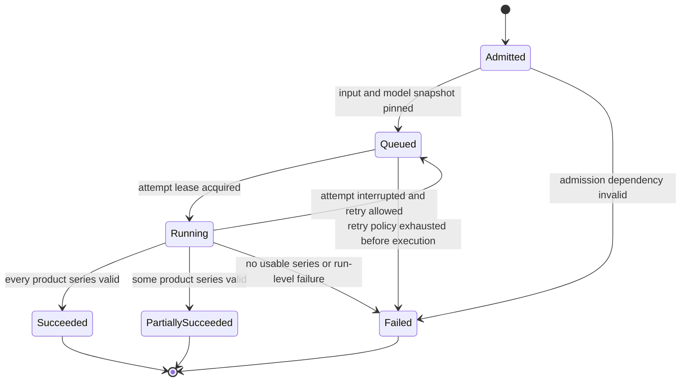
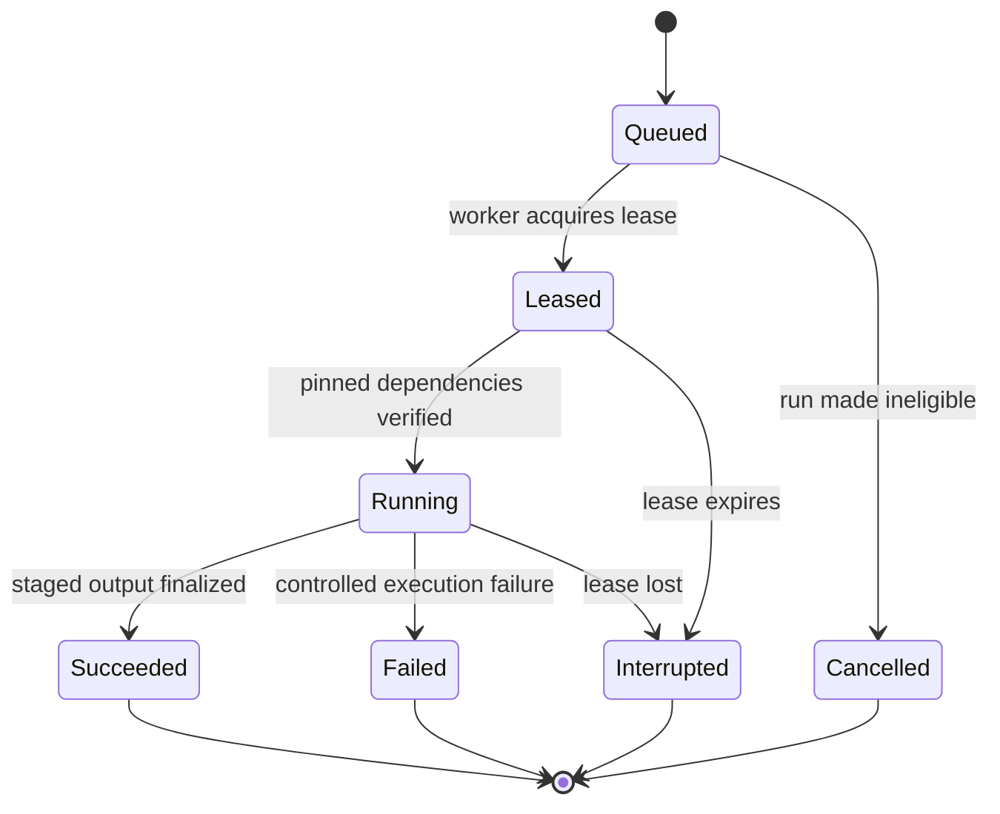
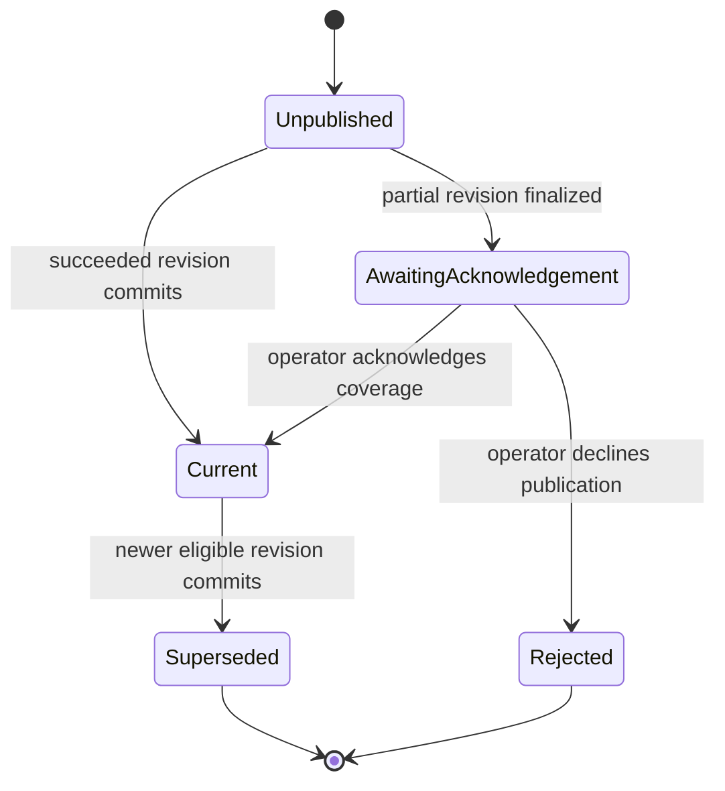
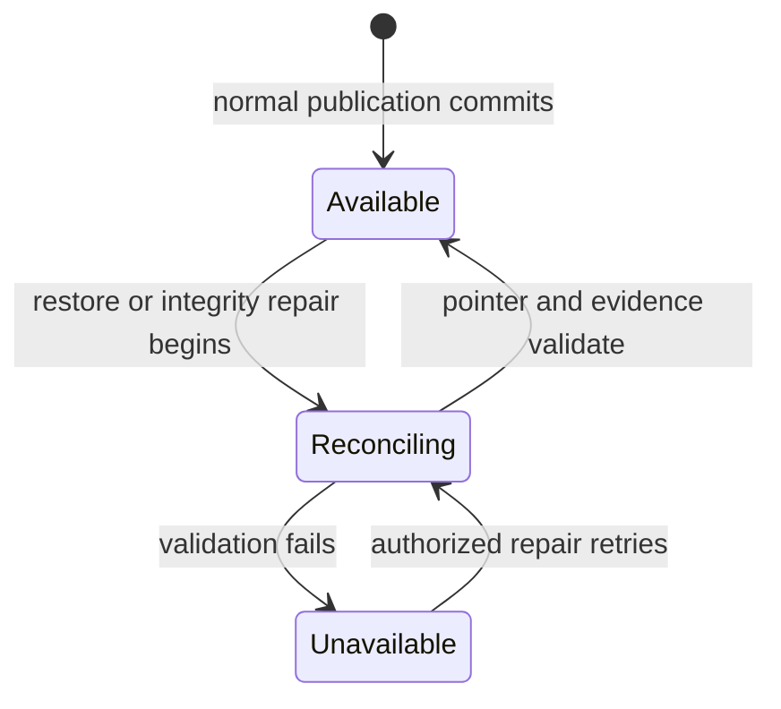
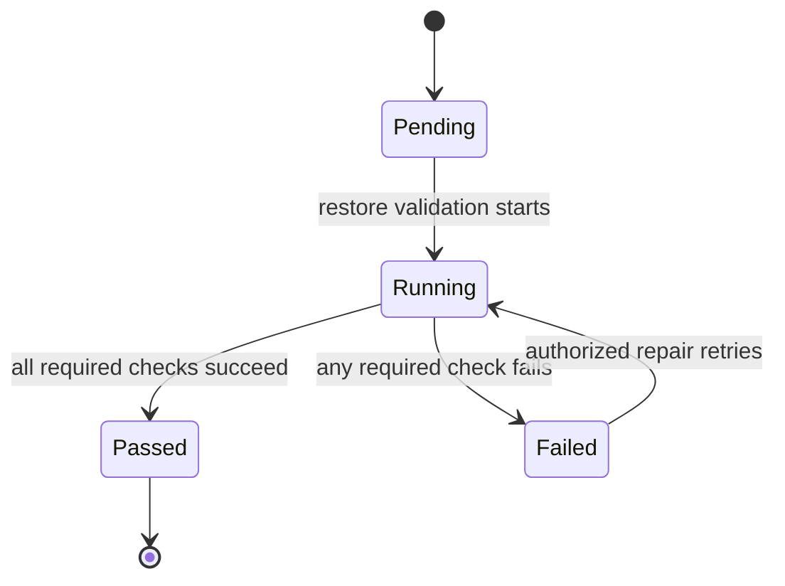
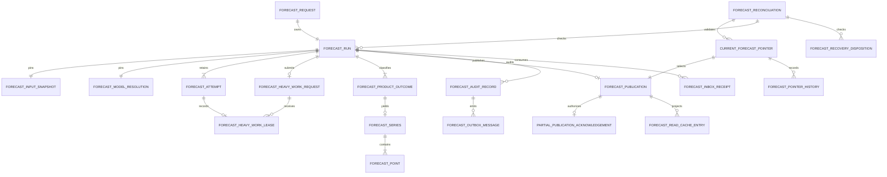

# Forecasting Functional Specification

Unit: U7 Forecasting (forecasting)

Status: Draft for independent review

Decision basis: Forecasting Functional Design answers and C07/C23/C25 reconciliation reconfirmed as `Looks correct` on 2026-09-25; the owner then directed correction of the four Forecasting review findings. The C07, C10 and C13 amendments remain subject to review and conformance evidence.

This specification is the source of truth for ordered workflows and lifecycle transitions. The entity diagram and rule summary are derived views of `entities.md` and `rules.md`.

## Purpose and boundaries

Forecasting admits one deterministic daily request per retailer-local date, resolves immutable demand and model inputs, executes retailer-scoped inference, preserves every run revision and attempt, publishes valid 28-day product series, classifies freshness, and exposes bounded evidence to Planning, Purchasing, the assistant, and reviewer workflows.

Forecasting does not own Retail Data observations or calendars, Model Lifecycle training or release promotion, replenishment calculations, purchasing decisions, identity, cluster provisioning, or the searchable audit projection. It consumes only authorized contracts and never reads another unit's storage directly. It serves a promoted compatible seasonal-naive, moving-average, or trained release and never selects an unapproved fallback.

## Actors and authority

| Actor | Permitted behavior |
| --- | --- |
| Planner | Read forecast status, current usable series, freshness, product coverage, and bounded provenance for an authorized retailer. |
| Manager | Read the same authorized forecast evidence used to review replenishment and purchasing decisions. |
| Operator | Inspect all authorized run revisions and failures, request a rerun, acknowledge a partial revision for publication, repair failed work, and reconcile restored state. |
| Scheduler | Submit the stable daily request for one retailer and local date under narrow machine authority. |
| Forecast worker | Execute one leased attempt using only the run's pinned inputs and model resolution; it cannot choose a model route or publish a partial run without acknowledgement. |
| Planning and Purchasing | Request a current usable forecast for an explicit set of products and validate returned coverage and versions before calculation or approval. |
| Assistant | Request bounded status or evidence for explicit products under the current user's retailer authority; it cannot infer or expand authority. |
| Retail Data | Supply authorized versioned observations, promotions, product scope, calendar, and placement context through C06. |
| Model Lifecycle | Resolve the server-owned active compatible signed Model Release and arbitrate batch-forecast work through C07. |
| Messaging Platform | Supply C23 Python RabbitMQ mechanics and conformance fixtures; U7 owns forecast domain effects. |
| Recovery Coordination | Send C25 Class C commands and validate U7's durable checkpoint and reconciliation evidence. |

Every protected operation revalidates retailer identity, current human role or machine scope, placement generation, resource ownership, and applicable contract version. A caller-supplied retailer, product, run, or artifact identifier never establishes authority.

## Workflow specifications

### WF1. Determine and submit the daily schedule

1. The scheduler reads the retailer's versioned time-zone and calendar settings under retailer-scoped machine authority.
2. It identifies one logical due time at 02:00 for each retailer-local date.
3. If 02:00 is invalid because the clock advances, it uses the first valid instant after 02:00. If 02:00 is ambiguous because the clock repeats, it uses the earlier occurrence.
4. The stable business key is retailer plus local forecast date; delivery time, scheduler instance, and retry count do not alter that key.
5. The scheduler submits the request with its resolved UTC instant, local date, calendar version, and deterministic request identity.
6. Restart, redelivery, or a second scheduler instance returns the existing logical request for the same business key and creates no duplicate forecast effect.
7. This schedule is independent of the Planning unit's daily inventory-review schedule and never consumes or changes manual-review allowance.

### WF2. Admit a scheduled request or Operator rerun

1. Forecasting validates retailer authority, placement generation, local date, calendar version, request kind, and operation identity before creating work.
2. The first valid scheduled request for a retailer and local date receives revision one. Exact replay returns that request and its current run state.
3. A changed payload under the same operation identity conflicts and creates no work.
4. An authorized Operator may request a new revision for the same retailer and local date after selecting a reason and current dependency versions. The service assigns the next immutable revision; callers cannot choose it.
5. Admission creates the request, logical run, immutable business audit, and outbox entry as one authoritative effect. It does **not** create a ForecastAttempt before WF3 has pinned the input and model digests.
6. A failure before authoritative admission creates no run and no downstream effect. A rejected attempt is recorded separately with safe details.

### WF3. Resolve and pin all run inputs

1. Forecasting requests C06 data for the retailer using the admitted availability cutoff and required source version.
2. It verifies retailer, stores, active product scope, observation and promotion versions, time-zone/calendar version, source checksum, and placement generation.
3. Forecasting preallocates immutable run and first-attempt UUIDs, then calls C07 `pins:admit` with both IDs, expected promotion generation, runtime compatibility, placement/recovery generation and idempotency key. U6 atomically admits a durable route pin bound to both IDs and returns the server-owned signed package or rejects a draining/stale route. The read-only resolver never authorizes a run.
4. The returned Model Release must be validated, active, available, retailer-scoped, signed, checksum-verifiable, and compatible with the declared input/output schemas and runtime profile. Before deserialization, U7 verifies the C07 `skops.io` manifest and artifact digests, Ed25519 signature, current authoritative signer status, trust-policy version/digest, feature/runtime schemas, release state and validity window.
5. Forecasting pins the Retail Data source, cutoff, calendar, active-product scope, C07 route pin ID, model release, artifact checksum, route version, schemas, runtime profile, forecasting configuration, and placement generation before execution. In that same U7 pinning transaction it creates exactly one queued first ForecastAttempt with the preallocated first-attempt ID, now-known inputSnapshotDigest and modelResolutionDigest, execution-environment reference, and attemptNumber 1.
6. Missing or incompatible data or model resolution makes the run explicitly unavailable or failed. Forecasting does not choose a baseline, previous model, different artifact, or mutable latest source.
7. Every later attempt for the run reuses exactly this snapshot. Corrections, promotions, and rollbacks affect only a later daily request or an explicit new rerun revision.
8. If U7 cannot commit the pinned snapshot after C07 has admitted a route pin, it records/reconciles a terminal nonpublication disposition and calls the idempotent C07 pin-release command. An uncertain pin remains outstanding and blocks promotion; no timer silently clears it.

### WF4. Execute and retain a run attempt

1. A worker validates the C01/C23 message envelope, tenant/job authority, run version, placement and recovery generation, then commits an inbox record before accepting execution authority.
2. U7 submits an idempotent durable `batch-forecast` HeavyWorkRequest to the shared C07 arbiter with immutable run, pin and initial-attempt IDs. A queued request stays visible; only the current global-queue winner obtains a renewable C07 lease. First acquisition names the same three IDs and updates the existing queued attempt 1 with request ID, lease ID and monotonic fencing token, changing the logical run from Queued to Running. It never appends attempt 2 for the first execution; only a retry after attempt 1 and its lease are authoritatively terminal/fenced appends attempt 2 with a new ID and the same pinned digests before reacquisition.
3. The worker verifies pinned object checksums, schemas, runtime compatibility, and product scope before inference.
4. It generates one expected-demand series for every active retailer/store/product combination in the pinned scope using the single pinned Model Release.
5. It renews through C07 while working. Every renew, release, completion and finalizer carries current lease ID and monotonic token and validates active status, expiry, placement and recovery generation.
6. A worker that loses, cancels or expires its C07 lease records an Interrupted or Failed attempt and cannot publish. A retry appends a new attempt to the same run and pinned snapshot within C07's bounded request deadline and attempt budget.
7. Attempt output stays staged until product validation and run aggregation finish; staged output is never current or consumer-visible.

### WF5. Validate product series and determine the run outcome

1. Each product series must contain exactly one value for every horizon day 1 through 28 relative to the retailer-local forecast date.
2. Every expected-demand value must be a deterministic finite nonnegative decimal represented at the declared precision.
3. A negative, not-a-number, infinite, missing, duplicate, unordered, or extra horizon value fails only that product when the rest of the run remains structurally valid.
4. Forecasting never clips a negative value, fills a missing value, truncates an extra value, converts invalid output to zero, or silently substitutes another model.
5. A run is Succeeded only when every product in the pinned active scope has one complete valid series.
6. A run is PartiallySucceeded when at least one product has a complete valid series and at least one product fails with a safe reason.
7. A run is Failed when no product has a usable series or a run-level dependency, schema, tenant, placement, checksum, or runtime check fails.
8. U7's owner-controlled PostgreSQL finalization routine invokes the U6-owned C07 `finalize_heavy_work_v1` port inside the **same retailer-local transaction** that commits the final attempt outcome, product outcomes, valid series, failures, provenance, business audit and outbox. The U6 port verifies the durable request/lease/pin/run/attempt binding, locks and validates current lease ID, worker, monotonic token, expiry, placement/recovery generations, result digest and idempotency identity, then closes its own verified pin in that caller transaction. U7 has EXECUTE only and does not update U6 route tables. Any conflict rolls the whole transaction back and keeps staged output invisible. An identical post-commit replay returns the original result and already-closed pin only after U7 verifies its own committed publication identity, attempt ID and digest; no REST check can substitute for this atomic effect.

### WF6. Publish a complete or partial revision

1. A Succeeded revision is eligible to advance the current pointer automatically after its finalization transaction commits.
2. Pointer advancement verifies the retailer/local-date key, run revision, product-scope digest, compatibility, and expected current-pointer version.
3. The pointer, publication record, audit, and outbox effect advance together. A race or expected-version mismatch leaves the prior pointer unchanged.
4. A PartiallySucceeded revision remains immutable and inspectable but is AwaitingAcknowledgement. It cannot become current automatically.
5. An authorized Operator inspects product coverage, safe failure reasons, pinned versions, and impact; an explicit acknowledgement records rationale and the acknowledged coverage digest.
6. If the run and coverage are still eligible, acknowledgement advances the current pointer atomically. It never edits series or turns a failed product into a success.
7. Failed, unavailable, unreconciled, corrupt, or incompatible revisions never become current. A failed rerun leaves the prior current pointer and its original freshness facts intact.
8. Superseded current revisions remain retained and queryable with pointer history and reasons.

### WF7. Resolve current usability and freshness

1. A read first revalidates current retailer authority and requested product ownership.
2. Forecasting resolves the server-owned current pointer for the requested retailer and local date; the caller cannot nominate an arbitrary run as current.
3. It distinguishes the latest request/run outcome from the last published current revision.
4. A current revision is Fresh until the next retailer-local 02:00 due time plus six hours, using the same deterministic invalid/ambiguous-time rules as scheduling.
5. It is Stale after that instant or earlier when the pinned source, model, calendar, configuration, placement, or schemas are known to be incompatible.
6. A newer failed or partial-unacknowledged revision never extends the prior revision's freshness window or relabels it fresh.
7. A response states run identity and revision, latest outcome, current publication status, generated time, age, freshness boundary and reason, product coverage, model/data/configuration versions, and safe limitations.
8. No eligible current pointer yields explicit Unavailable; no silent fallback or invented demand is returned.

### WF8. Serve Planning and Purchasing through C10

1. An authorized status or history read may request a specified run revision and receives its immutable outcome, evidence, freshness classification, publication state, and safe limitations even when that revision is stale, failed, partial, or non-current.
2. An authorized Planning use request asks for the latest usable current publication and names the required product set. It cannot nominate an arbitrary run revision as calculation authority.
3. Forecasting returns only products owned by that retailer and reports complete, partial, failed, stale, unpublished, or unavailable coverage explicitly.
4. The response supplies exactly 28 values per covered product and pins forecast, source, calendar, model, configuration, schema, and placement versions.
5. A stale, incompatible, unreconciled, unpublished, or uncovered required product prevents a complete-usable result. An unacknowledged partial run remains inspectable by ID but is never usable through the current-publication path.
6. Planning must reject or explicitly degrade according to its own rules; it cannot treat missing demand as zero. Forecasting does not calculate replenishment, supplier constraints, inventory positions, MOQ, packs, buffers, or purchase approval.
7. A later inventory, supplier-term, or forecast version cannot retroactively change this response's immutable run evidence; downstream approval revalidates its own complete input snapshot.

### WF9. Serve assistant status and evidence through C13

1. The assistant submits an explicit bounded product set under the current user's delegated retailer context.
2. Forecasting revalidates user authority, retailer, products, run ownership, and response bounds without trusting model-generated identifiers.
3. Status returns the latest outcome, current publication, freshness, product coverage, and safe limitations.
4. Evidence returns bounded 28-day series plus model, data, configuration, calendar, and run citations suitable for an explanation.
5. Missing, stale, partial, or unavailable evidence remains explicit. The assistant cannot invent demand, omit a limitation, or expand to a foreign product.
6. Tool calls and denied attempts carry correlation and audit evidence while foreign resources remain undisclosed.

### WF10. Retry, rerun, dead-letter, and repair work

1. A transient execution failure records the failed or interrupted attempt and keeps the logical run's pinned snapshot unchanged.
2. Bounded automatic retry appends the next attempt under the same run; it never creates another business revision or schedule effect.
3. Exhausting C07's job budget finalizes the logical run as Failed. Separately, exhaustion of C23's five broker delivery attempts moves the message to observable dead-letter handling; broker deliveries never count as new C07 attempts.
4. Authorized dead-letter replay revalidates tenant/job authority and event identity, then either returns the recorded effect or appends an eligible retry attempt.
5. An Operator repair may resume the same immutable run only when its pinned inputs remain available and valid. Changed dependencies require a new rerun revision through WF2.
6. No retry, replay, or repair can overwrite a prior attempt, series, publication, audit record, or current pointer.

### WF11. Commit audit, events, and disposable cache behavior

1. Request admission, run finalization, publication, partial acknowledgement, pointer change, rerun, repair, and recovery decisions append immutable business audit and outbox records in the same authoritative transaction as their business effect.
2. A required audit or outbox failure rolls back the business mutation. A rejected authorization, validation, or concurrency attempt uses a separate durable record that survives business rollback.
3. U7 uses U14's C23 Python package for C01/C22 envelope validation, durable relay, confirms and bounded retries. U7 owns the domain schema and committed forecast state, business audit and outbox. An unpublished outbox record remains eligible for retry.
4. Consumers validate contract identity, event identity, tenant, aggregate version, correlation, placement and recovery generation, and commit their U7 inbox plus local effect before acknowledging.
5. Redelivery returns the recorded effect; bounded exhausted delivery enters an observable dead-letter path and makes no exactly-once transport claim.
6. Read caches are disposable and scoped by retailer, resource, version, product coverage, and authorization-relevant context. They never own permission, current selection, freshness, or series authority.
7. An authoritative commit invalidates affected cached reads. A cold or unavailable cache falls back to an authorized authoritative read without weakening tenant or version checks.

### WF12. Keep daily inventory review independent

1. Forecasting publishes lifecycle and current-pointer events after authoritative commit; it does not directly start or own a replenishment review.
2. Planning may consume those events or its own schedule to request forecast evidence, but its one-active-review and manual allowance rules remain separate.
3. Forecast scheduler restart, duplicate delivery, or DST handling affects only the one daily forecast request for that retailer/local date.
4. Planning scheduler restart, retained due work, or manual-review contention affects only Planning jobs and cannot create a duplicate Forecast Run or consume forecast execution identity.
5. Both flows preserve their own intended local date, trigger, input versions, and outcomes for audit and recovery.

### WF13. Restore and reconcile Forecasting

1. As a C25 Class C participant, U7 durably records each prepare/close/abort/resume command and disposition before acknowledgement. Prepare and close fence worker finalizers, inbox/outbox paths and current-publication exposure; abort before a delayed prepare creates a terminal guard. Class C command deadlines are 120/180/60/180 seconds respectively.
2. Recovery restores authoritative Forecasting requests, runs, C07 request/lease evidence, attempts, product outcomes, series, publications, current pointers, partial acknowledgements, audit, inbox and outbox history before any current forecast is exposed. Recovery-policy-v1 requires a 24-hour RPO, two-hour RTO and 30-day backup retention.
3. Restored current pointers enter Reconciling and are unavailable to consumers during validation.
4. Per retailer, U15-directed reconciliation verifies tenant ownership, placement/recovery generations, local dates and schedule identities, source snapshots, signed model packages and current trust metadata, C07 lease fences, exactly 28 finite nonnegative values, product coverage, run/pointer transitions, acknowledgements, retention and message replay position.
5. A run captured as Running becomes Interrupted and is failed or made retryable under the normal C07 attempt rules; it is never assumed complete.
6. A pointer becomes Reconciled only when its complete history and selected revision validate. Missing, corrupt, expired, foreign, incompatible or incomplete evidence keeps it unavailable. Resume does not clear a fence on command receipt alone.
7. Restore never recomputes, edits or substitutes a forecast silently. A new result requires a normal scheduled request or an authorized Operator rerun.
8. Reconciliation records counts, mismatches, elapsed recovery time, observed data loss and limitations against the fixed recovery-policy-v1 objectives.

### WF14. Validate contracts and reviewer portability

1. Every Forecasting REST operation is defined through OpenAPI and every job or event flow through AsyncAPI, including authentication, tenant context, errors, idempotency, versioning, examples, and compatibility metadata.
2. Contract validation rejects invalid examples and incompatible schema changes before integration; each Forecasting producer and consumer proves its own contract behavior.
3. Local readiness checks expose dependency, schema, storage, queue, worker, schedule, and model-availability state. Missing credentials, disk, runtime, model artifact, or resource headroom fails explicitly.
4. The reviewer journey uses pinned and verifiable prerequisites, local authentication, seeded tenant data, and a real CPU-compatible promoted model without owner secrets, cached artifacts, cloud access, or a GPU requirement.
5. Evidence links import versions, forecast request/run/attempt, product coverage, model release, current pointer, freshness, downstream shortage use, audit events, recovery checks, and declared limitations.
6. A failed setup or unavailable dependency yields actionable diagnostics and never produces a false successful-forecast claim.
7. Three clean reference-host runs retain actual setup and inference phase timings; each must satisfy the 90-minute total and 45-minute post-download limits. Forecasting reports its measured contribution and never substitutes an interpolated p95 for three observed runs.

## State machines

### Forecast Run lifecycle

Text fallback: an admitted run pins its dependencies and queues. Attempts may return interrupted work to the queue. Final aggregation ends the immutable logical run as Succeeded, PartiallySucceeded, or Failed; later changed-input work is a new run revision.

### Forecast Attempt lifecycle

Text fallback: each attempt is appended to a logical run. Only a leased worker may execute and finalize it. Success, failure, interruption, and cancellation remain retained; retry appends another attempt rather than reopening the old one.

### Forecast Publication lifecycle

Text fallback: a fully successful revision can become current automatically. A partial revision waits for an Operator's coverage acknowledgement and can be published or rejected. A newer eligible publication supersedes the current pointer without deleting history.

### Current pointer recovery lifecycle

Text fallback: loading restored records does not expose forecasts. Current pointers stay Reconciling until their history, tenant, inputs, series, and message state validate. A failure keeps them Unavailable until an authorized repair and successful reconciliation.

### Forecast Reconciliation lifecycle

Text fallback: a reconciliation begins Pending, runs the complete restored-state validation, and ends Passed or Failed. A failed reconciliation may run again after an authorized repair; only a Passed result permits the corresponding current pointers to become Available.

## Derived entity relationship view

Text fallback: each immutable request revision owns one logical run; each run pins one input snapshot and signed model resolution and may submit one C07 batch-work request with fenced leases across attempts. Each run retains attempts and product outcomes, with valid series of exactly 28 points. Eligible runs produce publications; partial publications may carry an Operator acknowledgement. One server-owned pointer selects the current publication and retains pointer history. Runs append audit/outbox evidence and inbox receipts; C25 durable dispositions and reconciliation guard restored exposure.

## Derived rules summary

| Rule group | Behavioral effect |
| --- | --- |
| BR1 | Current retailer, role or machine authority, placement, and resource ownership guard every operation. |
| BR2 | Retailer-local 02:00 scheduling and stable business identities prevent duplicate daily effects, including DST cases. |
| BR3 | Immutable source, calendar, configuration, placement and signed promoted-model snapshots make every run reproducible; route pinning awaits an atomic drain barrier. |
| BR4 | C07 queued and fenced attempts, strict 28-point validation, explicit product outcomes and an atomic cross-unit finalizer govern execution. |
| BR5 | Atomic publication, Operator acknowledgement of partial coverage, and retained pointer history govern current selection. |
| BR6 | The next 02:00 plus six-hour boundary and compatibility checks govern Fresh, Stale, and Unavailable responses. |
| BR7 | Contracted reads, U14's C23 Python broker mechanics, U7-owned atomic audit/outbox and inbox effects, and disposable caches preserve integration behavior. |
| BR8 | C25 Class C fencing and durable dispositions, restore-first reconciliation, fixed recovery objectives, retention and integrity checks prevent invalid forecast exposure. |
| BR9 | Independent review scheduling, validated contracts, readiness diagnostics, and CPU-portable evidence support downstream and reviewer use. |

## Contract refinements

| Contract | Required refinement |
| --- | --- |
| C06 demand and calendar data | Return retailer/store/product scope, source revision and checksum, availability cutoff, demand and promotion versions, time-zone/calendar version, placement generation, and explicit unavailable or stale reasons. |
| C07 promoted model and heavy work | Return a signed skops.io package with authoritative signer/trust metadata; admit batch-forecast requests into the global queue and supply current lease/fence evidence. Use `pins:admit`/`drains:start` under one route lock and U6's EXECUTE-only `finalize_heavy_work_v1` port inside U7's publication transaction; require their race fixtures before accepting publication or switching. |
| C23 reusable messaging | U14 supplies Python RabbitMQ package and conformance fixtures; U7 owns forecast domain schemas and state/audit/outbox/inbox effects. Broker retries and C07 execution attempts are distinct. |
| C25 recovery participant | U7 durably handles Class C prepare/close/abort/resume, checkpoint and monotonic guards with 120/180/60/180-second deadlines and exposes current forecasts only after U15-directed reconciliation. |
| C10 planning and purchasing evidence | Keep run-status/history GET inspectable; use `POST /forecasts:latest` with 1–100 distinct product IDs. Return exact requested/covered/unavailable sets, one per-product coverage reason, 28 dated values only for covered products, current publication/run identity, freshness and pinned provenance. |
| C13 assistant status and evidence | Both status and evidence POSTs require the same bounded product-set body and exact coverage partition. Status omits series; evidence returns 28 values only for covered products, with safe freshness, limitations and stable provenance citations. |
| C15 authoritative events | Add request-admitted, run-started/completed/failed, partial-awaiting-acknowledgement, partial-acknowledged/rejected, current-pointer-changed, forecast-invalidated, and reconciliation events under the common tenant/correlation envelope. |
| Forecasting command and status API | Add Operator-only rerun, partial acknowledgement/rejection, repair, and reconciliation operations plus authorized request/run/attempt/product/publication status resources with operation keys and expected versions. |

## Error and boundary behavior

| Condition | Required outcome |
| --- | --- |
| Missing, revoked, foreign, or stale authority | Deny without disclosing target existence; retain safe rejected-attempt audit. |
| Duplicate schedule delivery | Return the original request/run under current authority; create no duplicate effect. |
| Changed payload under an operation identity | Conflict; preserve the original request and outcome. |
| No promoted compatible release | Explicit Unavailable; never choose an arbitrary baseline or prior model. |
| Route pin/drain or cross-unit finalizer cannot prove its C07 preconditions | Block old-route admission, switching or publication as applicable; never infer safety from a previous REST lease check. |
| Expired, cancelled, superseded or recovery-fenced C07 lease | Reject attempt finalization and publication under the stale token; retain staged output as invisible evidence only. |
| Revoked signer or invalid signed package | Fail before deserialization with explicit model-unavailable; never substitute another package. |
| Source, checksum, schema, runtime, calendar, or placement mismatch | Fail admission or the affected run explicitly; do not substitute mutable current data. |
| Invalid product output | Fail that product; retain valid products only when the run is structurally safe and classify the run Partial. |
| Partial run without Operator acknowledgement | Keep it non-current and expose coverage/failures for review. |
| Current pointer race | Conflict and preserve the prior pointer with no partial publication. |
| Latest run failed while an older publication exists | Show both facts; preserve the older result's original freshness boundary. |
| Missing required product or stale forecast | Return incomplete, stale, or unavailable evidence; never return zero as invented demand. |
| Worker or broker interruption | Retain the attempt and deduplicate effects; retry within bounds or enter observable dead-letter handling. |
| Audit or outbox write fails | Roll back the authoritative mutation. |
| Cache cold, stale, or unavailable | Read the authoritative source under full authorization and version checks. |
| Restore mismatch or incomplete backup | Keep the current pointer unavailable until reconciliation succeeds. |
| Missing local prerequisite or CPU-compatible model | Fail readiness with actionable diagnostics and no claimed successful forecast. |

## Sources

- inception/units-generation/unit-of-work.md
- inception/units-generation/unit-of-work-story-map.md
- inception/requirements-analysis/requirements.md
- inception/user-stories/stories.md
- inception/domain-design/components.md
- inception/contract-design/contract-summary.md
- construction/forecasting/functional-design/functional-design-questions.md
- construction/forecasting/functional-design/entities.md
- construction/forecasting/functional-design/rules.md

## Assumptions & Open Questions

- C07 governs heavy-work lease/deadline/attempt budgets; C23 governs separate broker retry and DLQ bounds. Response bounds and decimal precision remain implementation parameters subject to approved contracts.
- Recovery-policy-v1 fixes a 24-hour RPO, two-hour RTO, 30-day backup retention and Class C prepare/close/abort/resume deadlines of 120/180/60/180 seconds.
- C07 now specifies the same-transaction finalizer and route admission/drain barrier. Their review and race-conformance evidence remain prerequisites before claiming a deployable publication or route-switch path.
- The six-hour freshness grace period and deterministic 02:00 DST behavior are confirmed functional decisions; performance and alerting thresholds remain later NFR values.
- Planning owns replenishment arithmetic, supplier-term use, review quota, and purchase revalidation. Forecasting guarantees the versioned coverage and explicit unusable states those rules consume.
- Local CPU inference is the portable acceptance path. Optional GPU acceleration and external model-provider integration do not change the Forecasting domain contracts or authority model.

## Review

**Verdict:** NOT-READY
**Reviewer:** aidlc-architecture-reviewer-agent
**Date:** 2026-09-25T14:24:47Z
**Iteration:** 1

### Findings

| ID | Severity | Location | Finding | Required action | Status |
|---|---|---|---|---|---|
| R-01 | Critical | aidlc/spaces/default/intents/260908-stock-sense-design/construction/forecasting/functional-design/functional-spec.md > WF5 step 8 and Contract refinements > C07 | WF5 requires one atomic effect that validates U6's current lease and fence while committing U7 outcomes, series, audit and outbox. The accepted contract-summary.md C07 exposes a separate completeHeavyWorkLease call and says finalizers compare the fence atomically, but defines no cross-unit transaction or protocol that binds that comparison to U7's commit. A lease can expire or be superseded between a REST check and U7 publication. The specification itself keeps staged output invisible pending this contract. | Approve a C07/U7 finalization contract that names the transaction authority, ordering, idempotent recovery and fence comparison committed with U7 results; prove expiry, supersession and recovery-fence races cannot publish stale output. | New |
| R-02 | Critical | aidlc/spaces/default/intents/260908-stock-sense-design/construction/forecasting/functional-design/functional-spec.md > WF3 step 3 and Contract refinements > C07 | U7 requires an atomic route admission/drain barrier for a no-overlap promotion, but the accepted contract-summary.md C07 defines only an active/overlap resolver and promotion operation. It has no route-pin admission token or drain operation. An old-route resolution can race promotion and become a newly admitted run after the old release ceases to accept new work. | Define and approve the C07 route-pin admission and promotion drain protocol, including its atomic boundary, outstanding-pin completion rule and restart behavior; test a pin racing promotion and reject any old-route admission after drain begins. | New |
| R-03 | Major | aidlc/spaces/default/intents/260908-stock-sense-design/construction/forecasting/functional-design/functional-spec.md > WF2 step 5 and WF4 step 2 | WF2 creates an initial ForecastAttempt during admission, before WF3 pins inputs and model. entities.md > ForecastAttempt requires inputSnapshotDigest and modelResolutionDigest at creation. WF4 then says lease acquisition appends an attempt, which would create a second attempt for the first execution. The attempt identity and required fields cannot be implemented consistently as written. | Put snapshot pinning before attempt creation or specify a valid pending shape, and state whether lease acquisition updates the queued initial attempt or creates a new attempt only after a prior attempt terminates. | New |
| R-04 | Major | aidlc/spaces/default/intents/260908-stock-sense-design/construction/forecasting/functional-design/functional-spec.md > WF8 step 2, WF9 step 1 and Contract refinements > C10/C13 | WF8 and WF9 require consumers to name an explicit product set and receive coverage-specific status. The accepted contract-summary.md C10 latest GET defines no product-set parameter or response schema, and C13 status/evidence POSTs define no request body. U8 and U9 cannot implement the required calls or validate partial coverage from the approved wire contracts. | Revise C10 and C13 OpenAPI request and response schemas to carry a bounded product set, explicit per-product coverage and usable/stale/unavailable outcomes, then align U7 consumer examples and contract tests. | New |

### Validation Tool Results

| Tool | Result | Interpretation |
|---|---|---|
| required-sections | PASS on entities.md, rules.md and functional-spec.md | Required Markdown structure is present. |
| upstream-coverage | PASS with reason "no upstream" and no scanned files | Invocation did not verify the declared upstream artifacts; cross-contract findings above were checked directly. |
| linter | eslint-unavailable when invoked on functional-spec.md | No TypeScript or JavaScript output is in this pass, so the linter binding is inapplicable. |
| type-check | no-tsconfig-found when invoked on functional-spec.md | No TypeScript output is in this pass, so the type-check binding is inapplicable. |
| traceability | PASS with no gaps, orphans, missing rows or invalid targets | Assigned AC-to-BR references are structurally valid; this does not resolve the behavioral and contract gaps above. |

### Summary

The C07 finalizer and route-change paths cannot meet their stated safety rules with the accepted contract, so operational forecast publication remains blocked. Attempt creation and consumer API shapes also need alignment before developers can implement the documented workflows.
