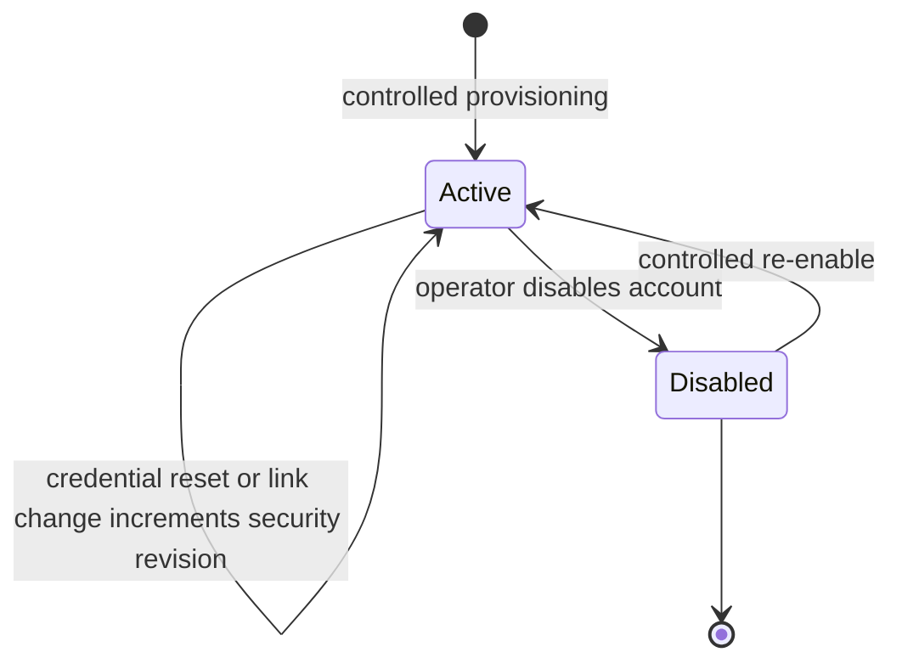
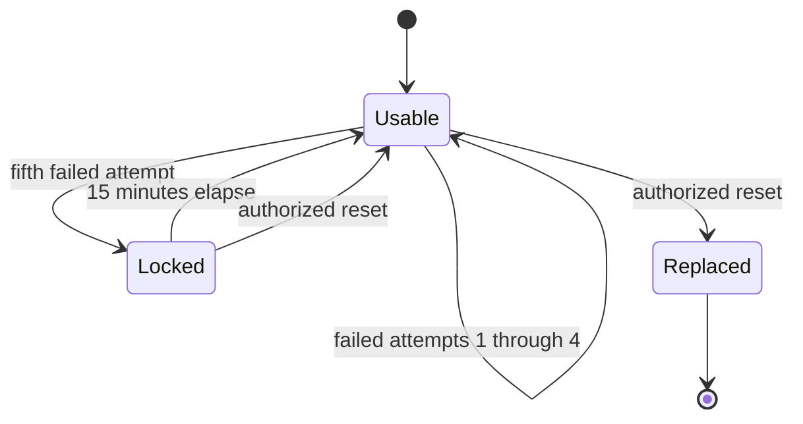
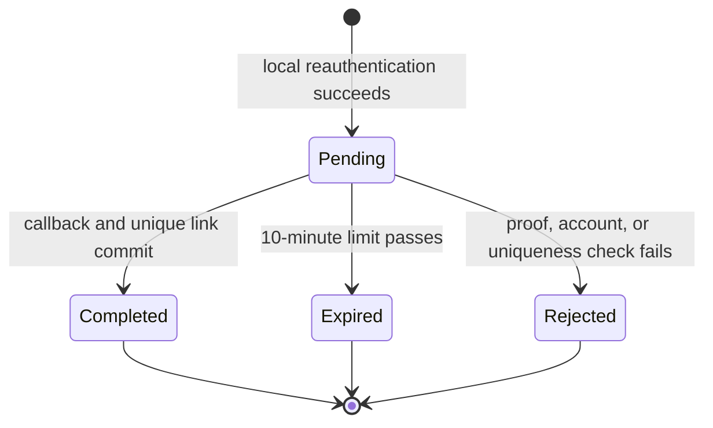
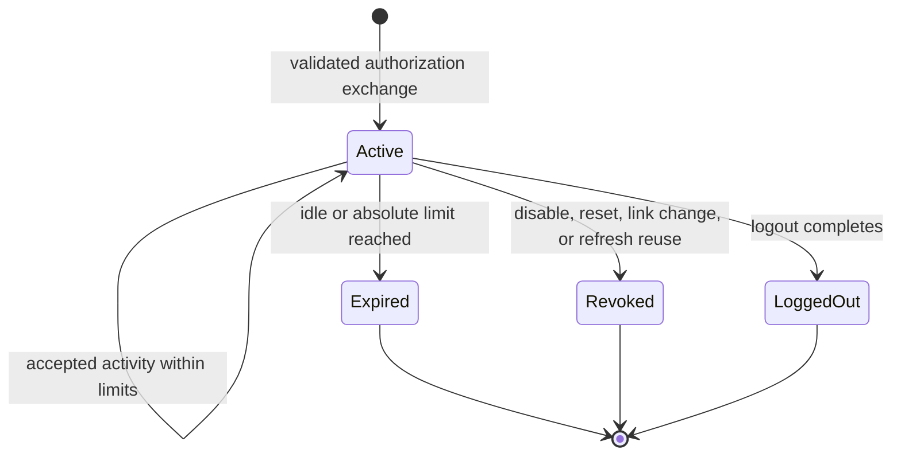
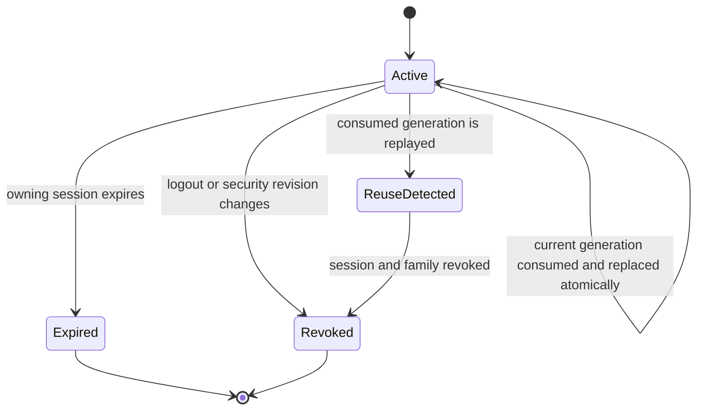
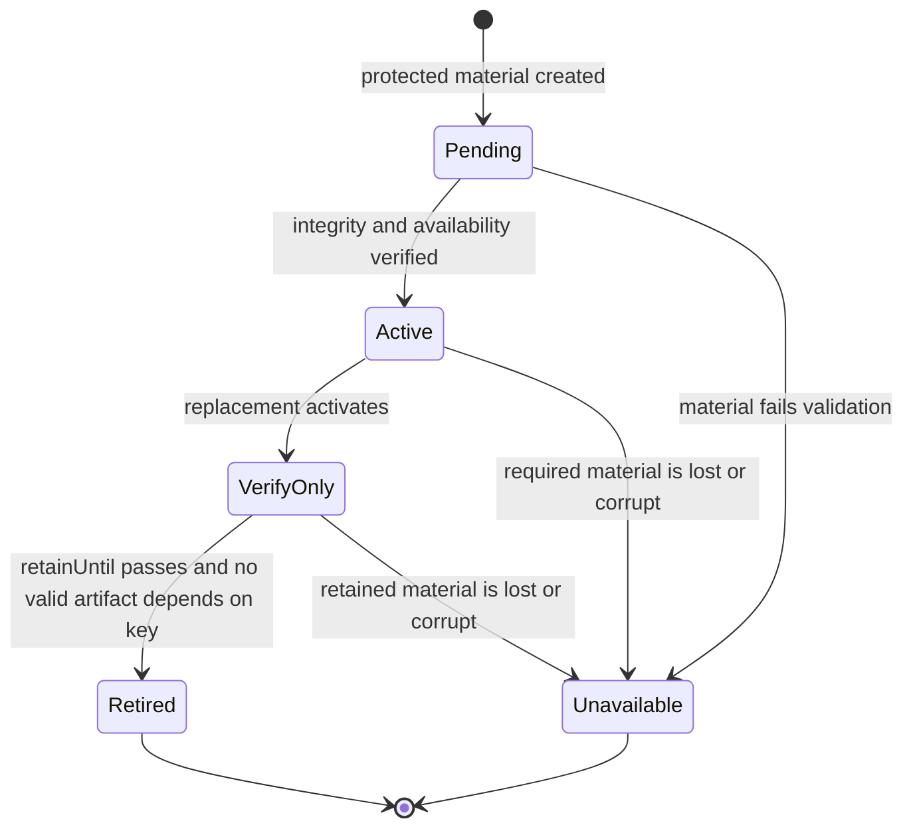
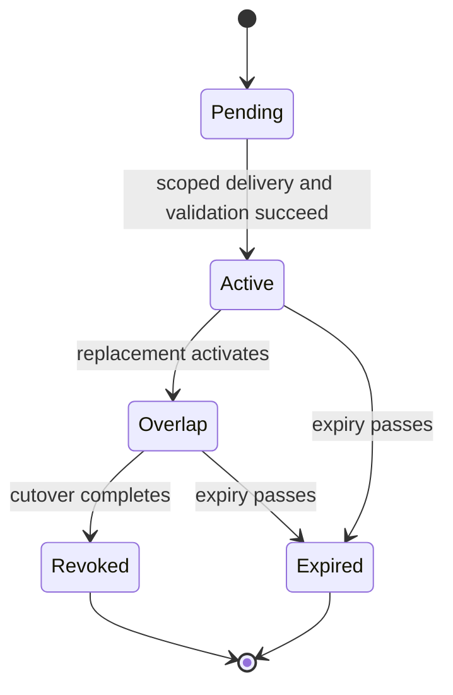
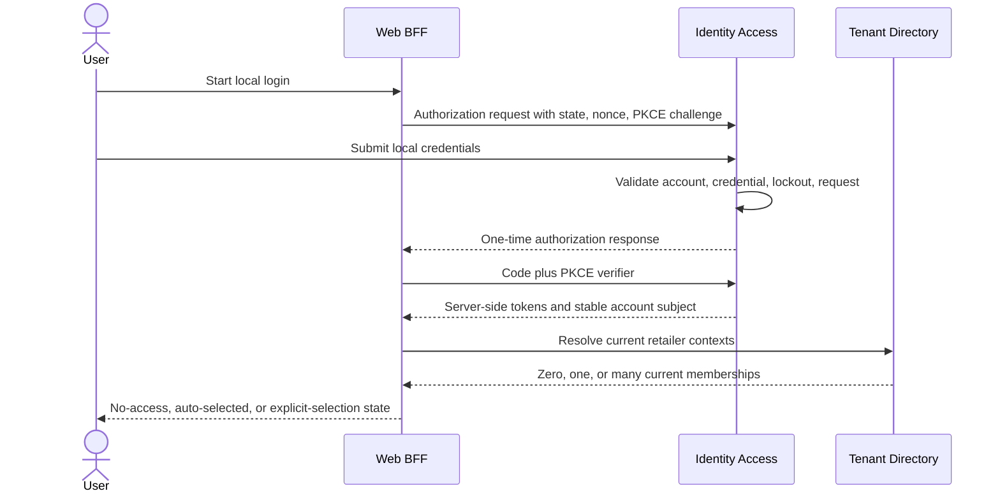
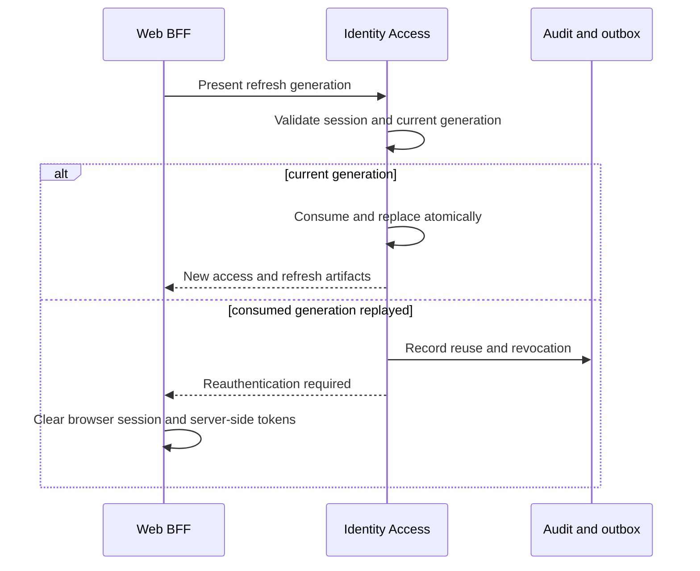
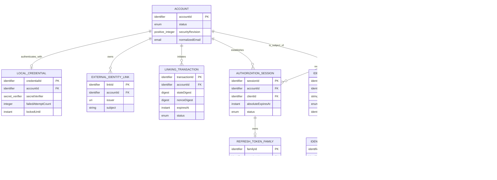

# Identity Access Functional Specification

Unit: U3 Identity Access (`identity-access`)

Sources: `unit-of-work.md`, `unit-of-work-story-map.md`, `requirements.md`, `components.md`, `contract-summary.md`, and the confirmed Identity Access Functional Design questionnaire.

## Purpose and boundaries

Identity Access proves who a human or workload is, issues and revokes bounded authorization artifacts, manages explicit external-identity links, protects authentication credentials and keys, and records authoritative identity changes. It supports a secret-free local reviewer path and optional Google federation.

Identity Access does not own retailer memberships, roles, placement generation, or business authorization. U4 Tenant Directory makes those current decisions. U11 owns the browser-facing session cookie, CSRF enforcement, server-side token storage, and retailer-context orchestration. U12 owns presentation state. A U3 token supplies authenticated identity and narrow protocol claims; it never turns a route identifier, cached role, or external email into retailer authority.

The fixed local identities are:

- Issuer: `https://identity.stocksense.localhost`
- Application and BFF origin: `https://app.stocksense.localhost`
- Google callback: `https://identity.stocksense.localhost/signin-google`
- BFF sign-in callback: `https://app.stocksense.localhost/signin-oidc`
- BFF sign-out callback: `https://app.stocksense.localhost/signout-callback-oidc`

Google is optional. When its client configuration is absent, the Google option is unavailable and local authentication remains complete. A real Google smoke run is owner-operated evidence because reviewers receive no owner credentials.

## Participants

| Participant | Responsibility |
| --- | --- |
| Human user | Authenticates locally or through a previously linked Google identity and initiates explicit linking |
| Platform operator | Controls demo identity initialization, credential reset, client registration, key recovery, and protected bootstrap |
| Identity Access | Validates identity proof, owns links/grants/keys, issues tokens, revokes authorization state, and records audit/outbox data |
| Web BFF | Acts as the only browser OIDC client, stores tokens server-side, owns the secure browser cookie, and enforces CSRF |
| Google | Optional external identity proof source; supplies verified issuer-subject identity but no StockSense authority |
| Tenant Directory | Resolves current retailer memberships, roles, and placement generation from the authenticated account reference |
| Workload client | Authenticates under a narrow registered audience and scope without human roles |
| Secret-protection boundary | Protects key and credential references and makes them available only to authorized workloads |
| Audit consumer | Receives versioned, redeliverable identity events and builds a disposable search projection |
| Portfolio reviewer | Uses generated local credentials and the local path without Google secrets or owner-specific state |

## Owned logical operations

| Operation | Inputs | Successful result | Required failures |
| --- | --- | --- | --- |
| Authenticate locally | Local identifier, submitted secret, client request context | Verified account subject eligible for authorization flow | Generic invalid credential, locked account, disabled account, unavailable protection material |
| Resolve external identity | Verified issuer, subject, external callback proof | Existing linked account subject | Unknown link, invalid callback, unavailable provider |
| Start external link | Active local account, recent local reauthentication, provider | Ten-minute pending linking transaction | Missing reauthentication, disabled account, provider unavailable |
| Complete external link | Transaction, verified issuer-subject, state, nonce | Unique link and revoked prior sessions | Expired/consumed transaction, state/nonce failure, conflicting account link |
| Establish authorization session | Account subject, validated client, redirect, code-flow proof | Active U3 session plus bounded token family | Invalid client/redirect/state/nonce/code/PKCE, inactive account |
| Refresh authorization | Current one-time refresh token and active session | Consumed generation plus one replacement generation and access token | Expired/revoked session, old generation, reuse detection |
| End authorization session | Active or already ended session | Logged-out/revoked U3 state | Unknown session returns no authority |
| Register/rotate workload credential | Authorized operator, client allowance, protected credential reference | Active bounded credential version | Unauthorized operator, broad scope, missing secret protection |
| Publish discovery and keys | Active issuer configuration, lifecycle-valid public verification keys | C02 metadata and active/verify-only public keys | Inconsistent issuer/endpoints, missing required active key |
| Reset local credential | Authorized operator, target account, protected generated credential | New credential/security revision and all-session revocation | Unauthorized reset, failed protection, unknown account |
| Rotate/recover keys | Authorized operation, protected material, integrity evidence | One active key per purpose and retained prior versions | Missing/corrupt/sealed material, premature retirement, failed integrity check |

Every persistent operation resolves through U3-owned parameterized data operations under its runtime identity. Direct table access, arbitrary query execution, and cross-unit storage access are prohibited. Schema evolution runs under separate migration authority and must finish before the changed service becomes ready.

## Workflows

### FD1. Local sign-in through the BFF

1. U11 creates a one-time authorization request for its registered client, exact callback, state, nonce, and PKCE challenge.
2. Identity Access validates the client and exact local callback before presenting configured authentication methods.
3. The user submits local credentials over the identity origin.
4. Identity Access finds the local credential without revealing whether the account exists.
5. It rejects a disabled account, active lockout, or invalid secret, updates failure/lockout state where applicable, and creates a denied audit outcome without a session.
6. For a valid active credential, it clears the current failure count and authenticates the account subject.
7. Identity Access validates the still-pending authorization request and issues a one-time authorization response. It does not include retailer membership or role authority.
8. U11 sends the authorization response and PKCE verifier to the token boundary.
9. Identity Access validates client, redirect, state, nonce, code, and verifier; failure consumes or invalidates the request and issues nothing.
10. On success, Identity Access creates an authorization session with a 30-minute idle and 8-hour absolute limit, then issues a 10-minute access token and one-time refresh family.
11. U11 stores tokens server-side, rotates its secure HttpOnly cookie, and asks U4 for current retailer contexts using the stable account reference.
12. U11 returns the zero-, one-, or many-membership landing behavior defined in FD6.

### FD2. Sign in through a linked Google identity

1. Identity Access offers Google only when the configured provider and exact `/signin-google` callback are valid.
2. The user chooses Google and is redirected with a one-time state, nonce, and PKCE-bound request.
3. Google returns to the exact callback.
4. Identity Access validates provider issuer, audience, signature, lifetime, state, nonce, code, and PKCE proof.
5. It looks up only the verified `(issuer, subject)` pair in `ExternalIdentityLink`.
6. When a link exists for an active account, authorization continues at FD1 step 7.
7. When no link exists, Identity Access creates no account, session, role, or membership. Matching email and `email_verified` do not change this outcome.
8. The user receives safe guidance to sign in locally and explicitly link Google.
9. Provider unavailability or callback failure is audited and denied while the independent local path remains available.

### FD3. Link Google to an existing account

1. A locally authenticated user selects Link Google.
2. Identity Access requires a fresh local credential verification for the same active account.
3. It creates a pending linking transaction bound to that account, Google, state, nonce, and a ten-minute expiry.
4. The user completes Google authentication at the exact callback.
5. Identity Access validates external proof and confirms the linking transaction is pending, unexpired, unconsumed, and belongs to the current local account.
6. It checks the verified issuer-subject pair under a uniqueness boundary.
7. If the pair belongs to another account, it rejects the attempt without identifying that account.
8. If the pair already belongs to this account, it returns the existing idempotent result and consumes the transaction.
9. Otherwise it atomically creates the link, completes the transaction, increments the account security revision, revokes every prior session/refresh family, and commits an audit/outbox event.
10. The user must sign in again. No self-service unlink operation is exposed in v1.

### FD4. Refresh an active human authorization session

1. U11 presents the current refresh credential from server-side storage.
2. Identity Access locates its family and validates the client, active account, account security revision, 30-minute idle limit, 8-hour absolute limit, and current refresh generation.
3. If the generation is current, Identity Access atomically consumes it, creates one replacement generation bounded by the same absolute session expiry, updates accepted activity, and issues a 10-minute access token.
4. If the generation was previously consumed, Identity Access marks reuse detected, revokes the family and session, records the security event, and issues nothing.
5. Expired, revoked, mismatched, unknown, or disabled-account state returns a stable reauthentication outcome.
6. U11 clears its cookie/token state on terminal refresh failure.

### FD5. Logout and security revocation

1. U11 validates its browser mutation and CSRF protection before requesting logout.
2. Identity Access marks an active authorization session `logged-out` and revokes its refresh family. Repeated logout is safe and grants no authority.
3. U11 removes its server-side tokens and invalidates the current browser cookie.
4. Replay of either old U3 authorization state or the old browser cookie cannot authorize a protected request.
5. The signed-out state is displayed. The upstream Google session is left unchanged.
6. Account disablement, local credential reset, or identity-link change increments `securityRevision` and revokes all account sessions by the same terminal path.

### FD6. Resolve retailer context after authentication

1. U3 returns a stable authenticated account reference without retailer roles or memberships.
2. U11 requests current contexts from U4 Tenant Directory.
3. With zero memberships, U11 exposes no-access/provisioning guidance and offers no signup or self-assignment.
4. With one membership, U11 may select it automatically and records a local selection generation.
5. With multiple memberships, the user explicitly selects one and U11 advances the selection generation.
6. Before every business request, the authoritative provider revalidates current membership, role, and placement generation with U4-owned information.
7. Revocation, missing context, foreign identifiers, or stale placement fail even when U3 identity remains valid.
8. Late responses from a prior selection generation are discarded and cannot appear under or supply mutation context for the new retailer.
9. If authorization changes during a mutation and its result is uncertain, U11 reconciles status or asks the user; it never automatically resubmits the mutation.

### FD7. Issue and validate machine authorization

1. An operator registers a workload client with explicit token type, allowed audiences, and allowed scopes.
2. A protected credential version is delivered only to the authorized workload identity.
3. The workload requests only a subset of its registered audiences and scopes.
4. Identity Access validates active client and credential lifecycle, then issues a short-lived machine token under the active signing key.
5. A receiving service validates issuer, audience, signature, lifetime, token type, scope, and workload/job authority locally from C02 metadata and keys.
6. Invalid scope, audience, token type, client, credential, signature, or lifetime is denied without business effect.
7. Machine authorization cannot satisfy human membership, manager authority, purchase approval, rejection, cancellation, or receipt permissions.

### FD8. Rotate a machine credential

1. The operator creates a new protected credential version under the same bounded client registration.
2. The secret-protection boundary exposes it only to the authorized workload.
3. The workload reloads or rolls out and demonstrates authentication with the new version.
4. The prior version may remain in bounded overlap only for the declared transition window.
5. After successful cutover, the old version is revoked and removed from workload delivery.
6. Sealed protection storage, absent material, failed reload, or expired credentials produces explicit denial without broader fallback permission.

### FD9. Rotate signing and session-protection keys

1. Rotation starts on the 90-day schedule or through a controlled emergency action.
2. New versioned material is generated and protected before activation.
3. Identity Access verifies the new material is readable and suitable for its purpose.
4. One new version per purpose becomes active; prior material stops new issuance and becomes verify-only.
5. Token-signing material remains available for at least 15 minutes after its last issuance.
6. Session-data-protection material remains available for at least 8 hours and 5 minutes after its last issuance.
7. Retirement is allowed only after `retainUntil` and verification that no valid artifact depends on that version.
8. Missing or corrupt required material fails closed. Controlled replacement requires user reauthentication rather than silently accepting incompatible state.

### FD10. Initialize and reset demo identities

1. Initialization checks whether the environment already has an identity baseline; it never overwrites an existing baseline by reseeding.
2. On an empty environment it creates the planner, manager-planner, multi-retailer planner, and operator account profiles.
3. It generates a different local password for each account and environment, stores only its protected verifier, and reveals the plaintext once through protected setup output.
4. U4 independently provisions the declared demo memberships; U3 stores no membership copy as authority.
5. The smoke flow validates local login for representative identities and confirms the operator has no retailer authority.
6. An authorized reset generates and protects a replacement, increments account/credential revisions, revokes sessions, and returns one-time protected disclosure.
7. Failed initialization or reset reports an actionable outcome and never falls back to a checked-in default.

### FD11. Back up and restore Identity Access

1. A consistent backup captures U3-owned relational records while external key, credential, and unseal/recovery material is protected outside the cluster.
2. Restore occurs into an isolated clean identity boundary before exposure.
3. Migration history, record counts, referential integrity, account security revisions, active/retained key versions, and protected references are reconciled.
4. Retention reconciliation removes expired audit records and prevents their outbox events from reappearing through replay.
5. Representative local login, token validation, revocation, and retained-key verification checks run against the restored state.
6. Only a complete, consistent result becomes ready. Corrupt, incomplete, sealed, or mismatched input remains unavailable with explicit diagnostics.
7. Integrated recovery evidence records elapsed time, observed data loss, limitations, source revision, and checksums without claiming an unmeasured objective.

### FD12. Commit and publish an identity security event

1. A security-relevant authentication denial or authoritative identity change creates a redacted `IdentityAuditRecord` with stable type, outcome, reason, actor, target, correlation, and time.
2. For an authoritative change, Identity Access creates an `IdentityOutboxMessage` with the same correlation and a versioned event type in the same transaction.
3. If the audit or outbox record cannot commit, the authoritative change rolls back.
4. A publisher sends pending messages and waits for durable publication confirmation.
5. On confirmation it marks the outbox record published; on transient failure it retries within the bounded policy.
6. Exhausted delivery becomes visible failed/dead-letter state with the same immutable message identity.
7. Replay republishes the same event identity and never repeats the identity change. Consumers deduplicate independently.

## State machines

### Account lifecycle



Text fallback: controlled provisioning creates an Active account. Reset and link changes keep it Active but advance its security revision and revoke prior sessions. Disablement blocks authentication; controlled re-enable does not restore old sessions.

### Local credential lockout lifecycle



Text fallback: a local credential remains Usable through four failures, becomes Locked on the fifth for 15 minutes, and returns to Usable after expiry or reset. Reset replaces the prior credential and revokes account sessions.

### Linking transaction lifecycle



Text fallback: reauthentication creates a Pending transaction. It reaches Completed once, or terminal Expired/Rejected state. Terminal transactions cannot be replayed.

### Authorization session lifecycle



Text fallback: a validated exchange creates Active authorization state. It remains active only within the 30-minute idle and 8-hour absolute limits, and ends permanently as Expired, Revoked, or Logged Out.

### Refresh-token family lifecycle



Text fallback: one Active refresh generation rotates atomically. Session expiry or security action ends the family. Replaying a consumed generation enters Reuse Detected and revokes the entire family and session.

### Cryptographic key lifecycle



Text fallback: protected material starts Pending, becomes Active after validation, then Verify Only after replacement. It retires only after its concrete retention boundary. Missing or corrupt material becomes Unavailable and causes fail-closed recovery.

### Machine credential lifecycle



Text fallback: a machine credential is Pending until scoped delivery succeeds, Active during normal use, and may enter bounded Overlap when its replacement activates. It then becomes Revoked or Expired and cannot authenticate.

## Interaction sequences

### Local sign-in and retailer-context handoff



Text fallback: the BFF begins a protected authorization flow, Identity Access verifies local proof and issues bounded tokens, and only then does the BFF ask Tenant Directory for current retailer contexts.

### Explicit Google linking

```mermaid
sequenceDiagram
    actor User
    participant Identity as Identity Access
    participant Google
    participant Audit as Audit and outbox

    User->>Identity: Reauthenticate locally and choose Link Google
    Identity->>Identity: Create 10-minute transaction with state and nonce
    Identity->>Google: Authorization request
    Google-->>Identity: Exact callback with external proof
    Identity->>Identity: Validate proof, transaction, issuer-subject uniqueness
    alt valid and unlinked
        Identity->>Audit: Commit link, security revision, revocation, event
        Identity-->>User: Link complete; sign in again
    else invalid, expired, or linked elsewhere
        Identity->>Audit: Record denied outcome
        Identity-->>User: Safe failure; no link or access
    end
```

Text fallback: a locally reauthenticated account creates a ten-minute transaction, Google returns verified proof, and Identity Access either commits one unique link with session revocation or records a safe denial without creating access.

### Refresh reuse response



Text fallback: a current refresh generation rotates once. Replay of a consumed generation revokes the U3 session and tells the BFF to clear its own session state.

## Derived entity-relationship view

The YAML in `entities.md` is authoritative; this diagram is a readable derivative.



`CryptographicKeyVersion` is independent protected lifecycle material used by sessions and token issuance; it has no foreign-key ownership by an account or client.

## Derived rules summary

The YAML in `rules.md` is authoritative; this table groups the rules by implementation concern.

| Concern | Rules | Required behavior |
| --- | --- | --- |
| Local authentication | BR1.1-BR1.5 | Generic denial, lockout, generated demo credentials, controlled reset, and all-session revocation |
| Google federation | BR2.1-BR2.6 | Optional exact configuration, no email linking, explicit ten-minute proof, unique issuer-subject link, no self-unlink |
| Human authorization | BR3.1-BR3.7 | Valid code/PKCE proof, bounded session/token lifetime, one-time refresh, logout, CSRF boundary, no automatic mutation retry |
| Key protection | BR4.1-BR4.4 | 90-day rotation, concrete overlap, protected persistence, and fail-closed recovery |
| Workload identity | BR5.1-BR5.3 | Narrow issuer/audience/scope and credential lifecycle without human authority |
| Retailer boundary | BR6.1-BR6.3 | Tenant Directory authority and safe zero/one/many context handling |
| Persistence/recovery | BR7.1-BR7.5 | Owned parameterized operations, ordered migration, restart/restore integrity, and retention reconciliation |
| Reviewer path | BR8.1-BR8.4 | Stable local HTTPS, explicit prerequisites, local login without Google, and accessible safe outcomes |
| Contracts/events | BR9.1-BR9.3 | Versioned APIs, atomic audit/outbox, and bounded at-least-once publication |

## Boundary contracts and failure semantics

| Boundary | Owner | Identity Access obligation |
| --- | --- | --- |
| C02 Identity metadata and keys | U3 | Publish exact issuer/endpoints and active plus lifecycle-valid verify-only public signing keys |
| C16 Browser login through BFF | U11 with U3 protocol provider | Accept only registered BFF client, exact callbacks, authorization code with PKCE, server-side token use, logout, and session validation |
| C20 Google federation adapter | U3 | Validate external proof and link only by explicit audited issuer-subject binding |
| Tenant membership query | U4 | Provide stable account reference only; never claim current retailer authority |
| Identity audit event | U3 producer, U10 consumer | Commit immutable redacted event through outbox under versioned AsyncAPI semantics |
| Secret/key delivery | U2 platform boundary, U3 consumer | Resolve only workload-scoped protected references and fail closed when unavailable |
| Demo/recovery evidence | U13 | Expose supported health, local authentication, rotation, and restore checks without direct storage mutation |

Identity endpoints and protocol responses use their standard authorization semantics. StockSense-specific service errors use stable browser-safe codes and a correlation identifier. The minimum behavior set is:

| Condition | External result |
| --- | --- |
| Unknown user, wrong password, disabled account | `authentication_failed`; no account enumeration |
| Locked local credential | `authentication_temporarily_locked`; no session |
| Invalid redirect, state, nonce, code, callback, or PKCE | `invalid_authorization_response`; no token or session |
| Unknown Google issuer-subject link | `external_identity_not_linked`; no account creation |
| Expired or mismatched linking transaction | `linking_transaction_invalid`; no link |
| External identity belongs to another account | `external_identity_link_conflict`; no account disclosure |
| Expired/revoked session or refresh reuse | `reauthentication_required`; no renewal |
| Missing required CSRF at U11 | `csrf_validation_failed`; no mutation |
| Invalid machine audience/scope/job authority | `machine_authority_denied`; no business effect |
| Sealed or missing protected material | `identity_dependency_unavailable`; service not ready for affected capability |
| Failed migration or corrupt restore | `identity_recovery_invalid`; service not declared recovered |

Credentials, tokens, authorization codes, raw external claims, key material, and secret references are excluded from error detail, logs, and event payloads. Correlation uses bounded identifiers rather than sensitive values.

## Acceptance scenarios

The following scenarios must remain independently executable and evidence-bound:

1. Valid seeded local credentials complete the BFF flow; invalid credentials, invalid state/nonce/callback/PKCE, and locked accounts create no session.
2. A Google identity with the same email as a local account remains unlinked and unauthorized until the local account reauthenticates and completes the explicit ten-minute flow.
3. Wrong-account, expired, replayed, and issuer-subject-conflict linking attempts fail without changing links or sessions.
4. Session idle/absolute expiry, account disablement, reset, link change, logout, and refresh reuse each prevent further authorization.
5. A logged-out cookie and revoked U3 grant both fail; StockSense does not claim to log out Google.
6. Zero, one, and multiple memberships produce no-access, automatic selection, and explicit-selection behavior respectively; revoked, substituted, and late-context cases fail.
7. Workload tokens with wrong issuer, audience, scope, type, lifetime, or job authority fail and cannot exercise human purchasing permissions.
8. Restart preserves identities and valid keys; rotation uses new active material while prior artifacts validate only through their explicit retention boundary.
9. Sealed/missing protection material, failed credential reload, corrupt backup, incomplete restore, and failed migration keep the service unready with actionable diagnostics.
10. A clean reviewer environment without Google secrets or owner state starts the identity boundary, obtains generated demo credentials through protected setup output, and completes local login.
11. Identity state changes atomically create redacted audit/outbox records; publication retry/replay preserves one authoritative effect and immutable message identity.
12. Restore reconciles identity counts, relationships, keys, representative authentication, and retention so expired audit data cannot reappear.

These scenarios prove U3's contribution only. UI accessibility, Kubernetes provisioning, secret-store operation, Tenant Directory enforcement, and integrated recovery require their owning units' evidence as well.

## Review

**Verdict:** NOT-READY
**Reviewer:** aidlc-architecture-reviewer-agent
**Date:** 2026-09-11T19:58:59Z
**Iteration:** 1

### Findings

| ID | Severity | Location | Finding | Required action | Status |
|---|---|---|---|---|---|
| R-01 | Major | aidlc/spaces/default/intents/260908-stock-sense-design/construction/identity-access/functional-design/entities.md > RefreshTokenFamily; functional-spec.md > FD4. Refresh an active human authorization session | `RefreshTokenFamily` retains only `currentTokenDigest` and `currentGeneration`, but BR3.4 and FD4 require U3 to recognize a replay of a previously consumed generation and revoke the family and session. Replacing the sole digest removes the evidence needed to distinguish consumed-token reuse from an unknown invalid token, so the required security behavior is not implementable from the model. | Add an owned per-generation token record or another explicit retained-digest mechanism, with atomic consume/replace semantics, reuse-detection lookup, expiry/retention rules, and its relationship to the family and session. | New |
| R-02 | Major | aidlc/spaces/default/intents/260908-stock-sense-design/construction/identity-access/functional-design/entities.md > IdentityAuditRecord and IdentityOutboxMessage; aidlc/spaces/default/intents/260908-stock-sense-design/inception/contract-design/contract-summary.md > C15 — Authoritative audit events to Audit Evidence | U3's outbox model cannot produce the mandatory C15 envelope as specified: it has no `retailerId`, `placementGeneration`, `idempotencyKey`, `actor`, or event `data`, while C15 requires all of them. Identity Access must also record pre-authentication denials and operator actions that may have no retailer or placement, so no valid value is defined for two mandatory fields. The one-to-one audit/outbox relationship also conflicts with FD12, which creates an outbox only for authoritative changes while recording authentication denials as audit records. | Define a C15-compatible identity-event profile and entity mapping, including explicit semantics for retailerless identity events, actor-type mapping, idempotency, payload data, and whether denied audit records are published; then align the audit-to-outbox cardinality with FD12. | New |
| R-03 | Major | aidlc/spaces/default/intents/260908-stock-sense-design/construction/identity-access/functional-design/functional-spec.md > fixed local identities and FD1; aidlc/spaces/default/intents/260908-stock-sense-design/inception/contract-design/contract-summary.md > C16 — Browser login through the BFF | The confirmed design registers `https://app.stocksense.localhost/signin-oidc` as the BFF OIDC callback, while C16 names `/auth/callback` as `completeLogin`. The documents do not distinguish an internal middleware callback from a browser-facing continuation route, and FD1 says U3 validates the exact callback. U3 and U11 therefore cannot implement or test the same redirect contract without choosing which path is authoritative. | Reconcile C16 with the confirmed callback: identify the registered OIDC redirect URI and any separate browser continuation endpoint, assign each endpoint to U3 or U11, and use those same paths in the contract, workflow, and negative callback tests. | New |
| R-04 | Minor | aidlc/spaces/default/intents/260908-stock-sense-design/construction/identity-access/functional-design/entities.md > LocalCredential; functional-spec.md > Local credential lockout lifecycle; rules.md > BR1.3 | `failedAttemptCount` has a maximum of five and the state machine returns Locked to Usable when 15 minutes elapse, but no rule resets or rolls the counter when the lock expires. BR1.3 refers to the fifth failure in the current unlocked sequence, leaving the next failed attempt after expiry undefined and potentially impossible to persist within the declared maximum. | Specify the atomic counter transition when lockout expires or a new unlocked sequence begins, including the outcome of the first failed attempt after expiry and concurrent attempts at the boundary. | New |

### Validation Tool Results

| Tool | Result | Interpretation |
|---|---|---|
| required-sections | NOT RUN: the explicit-path sensor invocation was interrupted before completion | Manual inspection confirmed the four required artifacts and the functional-spec workflow/state-machine sections, but no deterministic sensor verdict was produced. |
| upstream-coverage | NOT RUN: stopped at owner instruction before invocation | The artifacts cite all five supplied upstream contract artifacts; deterministic coverage was not independently produced. |
| linter | N/A: no TypeScript or JavaScript artifact or snippet is present | The stage binding does not apply to these Markdown/YAML/Mermaid/JSON artifacts. |
| type-check | N/A: no TypeScript or TSX artifact or snippet is present | The stage binding does not apply to these artifacts. |
| traceability | NOT RUN: stopped at owner instruction before invocation | Manual inspection found 43 unique upstream IDs, 43 coverage rows targeting declared BR IDs, and one explained reverse entry for BR1.5; no deterministic sensor verdict was produced. |

### Summary

The design has three implementation-significant boundary/model gaps: refresh-token reuse cannot be detected from the entity model, U3 identity events cannot satisfy C15 for retailerless activity, and the registered BFF callback conflicts with C16. The owner should request changes or explicitly accept these risks before implementation.
