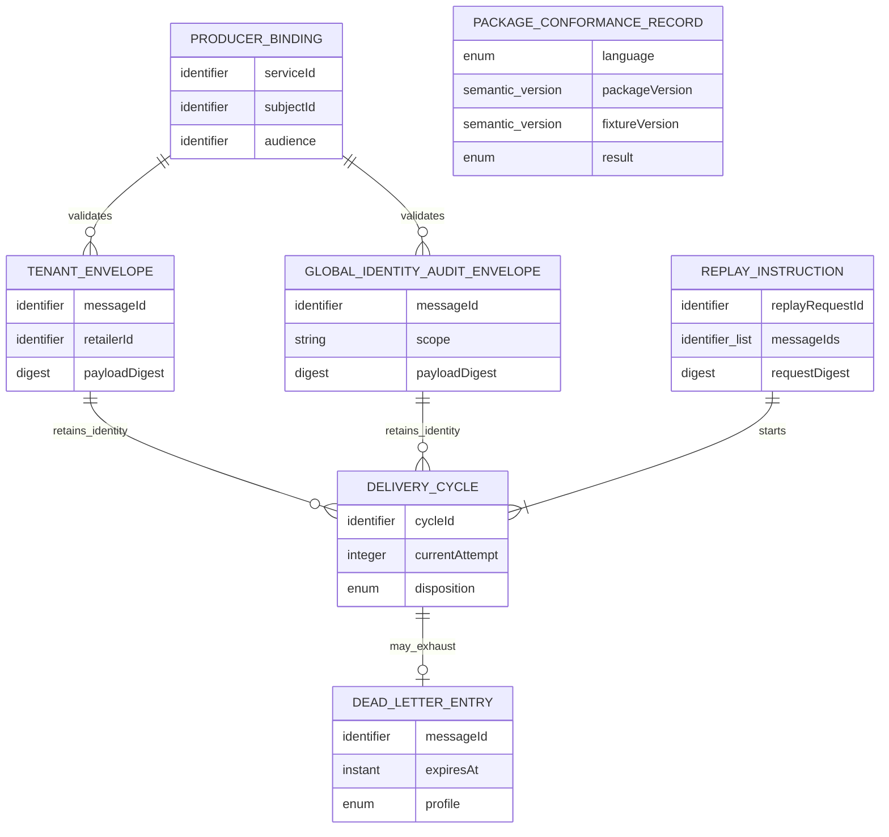

# Messaging Platform Functional Specification

Unit: U14 Messaging Platform (`messaging-platform`)

Sources: `unit-of-work.md`, `unit-of-work-story-map.md`, `requirements.md`, `components.md`, `contract-summary.md`, and the confirmed `functional-design-questions.md`.

## Purpose and ownership

U14 supplies reusable C01/C23 protocol validation and RabbitMQ delivery mechanics in independently versioned .NET and Python packages. U1 owns schemas, AsyncAPI and fixture governance. U2 owns broker topology and deployment. U5-U10 and U15 own their event meaning, transactional outbox/inbox, current authority, generation fences and atomic business effects. U3 and U4 are bootstrap publishers with their own C23-conformant adapters and separate U13 evidence; they do not depend on U14. U14 owns no domain database, retailer grant, or business-result transition.

## Participants

| Participant | Responsibility |
| --- | --- |
| Domain producer | Creates a valid domain event and commits its own outbox with the authoritative mutation. |
| U14 publishing adapter | Binds workload identity, validates envelope/digest/size, publishes and waits for durable broker confirm. |
| RabbitMQ and U2 platform | Routes tenant and global profiles, retains bounded dead letters and supplies broker-side recovery evidence. |
| U14 consumer adapter | Validates delivered envelope and identity before invoking the owning handler; acknowledges only on committed result. |
| Domain consumer | Validates current authority and fence, commits inbox and one effect/outbox result, or rejects. |
| U10 or owning Operator control | Authenticates and audits tenant or global replay permission before issuing a bounded replay instruction. |
| U1 Contracts | Versions C01/C22/C23, fixtures and compatibility policy. |
| U13 Demo Evidence | Collects separate U14 package and U3/U4 bootstrap-publisher results. |

## Owned logical operations

| Operation | Input | Success | Failure |
| --- | --- | --- | --- |
| Validate envelope | Versioned tenant or global wire envelope, registered workload binding, out-of-band route | Exact closed C01 schema, canonical digest and route accepted | Profile mismatch, absent tenant context, invented global tenant context, extra wire field, digest/size/producer conflict |
| Publish owner outbox message | Immutable envelope, authenticated producer, owner-held pending row | Durable broker confirm returned to owner | No confirm leaves owner row pending; no claim of publication |
| Consume delivery | Authenticated broker delivery, owner handler | Ack only after owner commit | Redelivery or quarantine; no transport claim of business effect |
| Schedule retry or dead letter | Failed delivery, current attempt | Deterministic next attempt or profile-specific DLQ | Attempt six refused; unresolved state remains visible |
| Execute authorized replay | Owner-issued audited authority and durable request/result reference, one to 100 immutable messages | One deterministic bounded cycle per message with original envelope/messageId; exact retry returns prior owner result | Wrong authority/scope, 101 messages, changed request under one ID, failed reconciliation |
| Declare package conformance | U1 protocol and fixture revision, .NET/Python package versions | Each package passes applicable same-version suites | Missing, invalid or incompatible suite blocks corresponding release claim |

## Workflows

### FD1. Validate and publish an immutable message

1. The domain owner commits its business change and outbox row atomically, then gives U14 an immutable message and its registered workload identity. U14 cannot edit the domain row or make the business decision.
2. U14 selects exactly one closed C01 wire schema from the envelope shape and authenticated route. Tenant messages carry all thirteen required tenant fields, including real retailer ID, placement generation, non-null UUID `causationId`, `schemaVersion`, `occurredAt`, `actor`, and `producer`. Retailerless identity-security audit carries all twelve required global fields, including `scope: global`, the `identity.global.audit.recorded` type and a required `causationId` that is null only for a root decision; it carries no retailer or placement fields. Both allow only optional `traceparent` beyond their required fields. Adapter `profile`, route, and byte count remain outside the wire envelope.
3. The adapter derives producer service, subject and audience from the authenticated registered workload. It checks allowed type, route and protocol range before broker publish; caller-supplied producer fields cannot override this binding.
4. It validates the selected U1-owned JSON Schema, computes SHA-256 over RFC 8785-canonicalized `data`, serializes only the complete C01 wire envelope as UTF-8, and rejects an envelope over 65,536 bytes. Broker headers and adapter metadata are excluded from those bytes. It verifies immutable message/idempotency identity and returns the durable prior result for an exact replay; changed content is quarantined.
5. It publishes using the original `messageId` and waits for a durable RabbitMQ confirm. Only that confirm lets the owner mark its outbox published. A lost confirm leaves the owner row pending for same-identity retry; delivery remains at least once.

### FD2. Deliver to an owner-controlled consumer

1. U14 receives the broker delivery and rechecks profile, route, authenticated producer, canonical digest, size, supported protocol version and immutable identity before invoking the handler.
2. The owner checks current tenant/job or global authority, placement and recovery generation, and the relevant domain fence. U14 cannot replace this check.
3. The owner atomically records inbox uniqueness and its business effect/outbox result. An exact duplicate returns the prior durable result; a changed payload with the same identity is quarantined. Crash before commit leaves no acknowledged effect; crash after commit but before ack is a duplicate on redelivery.
4. U14 acknowledges only after the owner reports durable commit or duplicate resolution. Failure before that point leaves delivery eligible for the bounded retry path. An acknowledgment never means a global exactly-once transport guarantee.

### FD3. Retry, dead-letter and reconcile

1. Initial delivery is attempt one. Transient failures schedule attempts two, three, four and five at 1, 2, 4 and 8 seconds, with no jitter and unchanged canonical envelope, `messageId` and payload digest.
2. Failed attempt five goes to the matching tenant or global identity-audit dead-letter route. Attempt six is forbidden. The dead letter retains safe failure evidence for seven days (604,800 seconds).
3. At expiry, the responsible owner receives an unresolved-expiry signal and reconciles authoritative state. U14 does not infer a successful business effect or repair it from broker absence.
4. Correlation, causation, attempt, retry delay and safe disposition are observable within the versioned telemetry budget. A diagnostic telemetry outage cannot roll back a committed business operation; loss evidence records it.

### FD4. Replay a bounded dead-letter batch

1. U10 or the owning domain verifies and audits current Operator authority: platform grant for global identity audit, or current retailer Operator membership for tenant messages. U14 accepts only a valid owner-issued replay authorization, never a raw browser role claim.
2. Before dispatch, U10 or the owning domain durably records the audited replay request under `replayRequestId`, its canonical request digest (authorized scope and ordered message IDs/envelope digests), deterministic cycle IDs derived from that request ID and each message ID, and a pending state. It stores the exact final or partial result when known and owns the request/result ledger; U14 holds no durable replay ledger. An exact completed retry returns that prior result without invoking U14. A changed batch or scope under the same request ID conflicts.
3. For a new or in-progress request, U14 validates one to 100 distinct message IDs atomically for authorized profile, immutable identity, canonical digest and payload. A batch of 101, duplicate IDs, or mixed unauthorized scopes is rejected as a whole. If a response or broker confirm is lost, the owner reuses its durable per-message dispatch state and the same cycle IDs, then resumes only unfinished work. At-least-once physical redelivery may occur, but neither it nor U14 allocates a second logical cycle for the same request/message pair; the owning consumer inbox prevents a duplicate business effect.
4. Each accepted message keeps the original canonical envelope and `messageId`; broker metadata carries replay-request identity and its deterministic cycle ID, beginning at attempt one and bounded to five deliveries. The owner durably records the exact completion or partial-failure result against its existing request ID.
5. The owner reconciles replay and authoritative state before closing the audited replay request. A duplicate effect, changed payload or unresolved expiry remains visible and cannot be represented as repaired by transport alone.

### FD5. Prove package and consumer conformance

1. U1 publishes a versioned C22 protocol range and fixtures for tenant/global envelopes, cross-profile rejection, producer binding, digest/size, confirms, exact replay, changed-payload conflict, poison/DLQ, expiry, authorized replay, reconciliation, ordering and telemetry.
2. U14 declares independent semantic versions for its .NET and Python packages; each states the U1 protocol range it supports and runs the same applicable fixture version. Missing, incompatible or failed evidence blocks its release.
3. U3 and U4 run applicable fixtures against their own service-local publishers; U13 records those separately from the U14 language-package results. Neither bootstrap publisher acquires an U14 dependency.
4. Each domain consumer repeats parameterized duplicate, stale-authority, crash-before-commit and crash-after-commit schedules against its own inbox and effect. A passing representative U14 fixture does not accept the import, receipt or other domain consumer on its behalf.
5. CI and portfolio evidence bind every result to the package revision, protocol/fixture versions, environment, actual outcome and digest; missing prerequisites are `not-run` or limited, never an invented pass.

### FD6. Participate in a coordinated recovery cut

1. U15 coordinates the registered participant roster and durable dispatch inventory. Domain participants fence their own relays/consumers/acknowledgments; U2 fences RabbitMQ topology and captures broker-supported per-queue identities/digests. U14's adapter respects supplied current fence generations and cannot reopen traffic under a stale one.
2. Drain/checkpoint and broker evidence contribute to the U15 manifest together with each participant's PostgreSQL LSN/transaction evidence. U14 telemetry alone cannot certify a consistent cut.
3. Abort, delayed prepare, restart and resume retain owner/coordinator terminal guards. U14 refuses delivery work while a relevant fence is unresolved; only the owning participant and U15 reconcile and release it.

## State machines

```mermaid
stateDiagram-v2
    [*] --> Pending: owner commits outbox
    Pending --> Confirmed: broker confirms same messageId
    Pending --> Pending: no confirm; retry same identity
    Confirmed --> Delivered: owner commits then ack
    Confirmed --> RetryScheduled: failed delivery
    RetryScheduled --> Confirmed: next attempt 2 to 5
    RetryScheduled --> DeadLettered: attempt 5 fails
    DeadLettered --> ReplayCycle: audited authorized replay
    ReplayCycle --> Confirmed: original envelope, new attempt 1
    DeadLettered --> Expired: seven-day retention ends
```

Text fallback: the producer's pending outbox becomes broker-confirmed only after a durable confirm. Owner commit precedes ack. Delivery failure makes at most five attempts before a dead letter. Authorized replay starts another bounded cycle with the same immutable message; expiry requires owner reconciliation.

## Derived entity-relationship view

The YAML in `entities.md` is authoritative. This is a view of protocol relationships, not tables owned by U14.

Text fallback: one workload binding validates tenant and global identity-audit envelopes against separate closed wire schemas. Either envelope may have multiple bounded cycles across distinct authorized replay requests. A failed cycle can yield one dead-letter entry; one owner-ledger-backed replay instruction starts one to 100 deterministic cycles only once per request/message pair. Package evidence has no business-state relationship.

## Derived rules summary

The YAML in `rules.md` is authoritative.

| Concern | Rules | Effect |
| --- | --- | --- |
| Envelope and producer | BR1.1-BR1.5 | Two closed profiles, authenticated binding, canonical digest, size and immutable identity. |
| Delivery and replay | BR2.1-BR2.6 | Confirm-before-outbox advancement, owner-commit-before-ack, bounded retries/DLQ and owner-ledger-backed idempotent replay. |
| Packages and ownership | BR3.1-BR3.4 | Independent language packages pass U1 fixtures without taking domain state or bootstrap-publisher ownership. |
| Recovery | BR4.1-BR4.2 | Honor current fences and contribute broker evidence to U15's cut. |
| Reviewer evidence | BR5.1-BR5.4 | Reproducible scoped validation, safe telemetry and measured inputs for U13. |

## Boundary contracts and failure semantics

| Boundary | Owner | U14 obligation |
| --- | --- | --- |
| C01/C15 envelopes and audit routes | U1 schemas, domain event producers | Validate the exact, distinct closed tenant/global wire shapes against U1 schemas; keep profile, route and measured byte count outside the envelope; never invent retailer context. |
| C22 compatibility and fixtures | U1 | Declare .NET/Python versions and supported protocol range; run same applicable fixture revision. |
| C23 broker mechanics and replay | U14 adapter, with U10/domain owner request ledger | Authenticate producer, confirm, deliver/ack after owner commit, bound retry/DLQ/replay, enforce size and emit safe telemetry; use owner-supplied prior request result and deterministic cycle IDs. |
| C24-C27 recovery | U15 coordinator, U2 broker, domain participants | Honor supplied fences and broker cut evidence; do not claim global recovery from package telemetry. |
| U3/U4 bootstrap publishers | U3/U4 | Share conformance rules but no runtime U14 package dependency; U13 records their results separately. |

| Condition | External result and effect |
| --- | --- |
| Missing/wrong producer binding, route, audience or protocol | `MESSAGE_PRODUCER_UNAUTHENTICATED` or `MESSAGE_PRODUCER_MISMATCH`; no publish/effect. |
| Invalid profile or fabricated tenant metadata | Contract validation failure; no cross-profile substitution. |
| Serialized envelope exceeds 65,536 bytes | `MESSAGE_ENVELOPE_TOO_LARGE` before publish. |
| Digest mismatch or changed content under message/idempotency identity | `MESSAGE_PAYLOAD_CONFLICT`; quarantine, no business effect. |
| Lost broker confirmation | Owner outbox stays pending; retry same immutable identity. |
| Owner commit uncertain or crash before ack | Redelivery; owner inbox resolves duplicate, U14 makes no exactly-once claim. |
| Fifth failed attempt | Profile-specific DLQ; no sixth delivery. |
| Unauthorized, duplicate-ID, mixed-scope or 101-item replay | Entire request denied without starting a cycle. |
| Exact completed replay-request retry | Return the owner's durable prior result without dispatch or a new delivery cycle. |
| Same replayRequestId with changed batch/scope | Conflict against the owner request digest; no new cycle. |
| In-progress replay retry after uncertain broker confirmation | Reconcile the owner ledger and broker under the same deterministic cycle IDs; resume only unfinished work. |
| Missing current recovery fence or stale generation | No delivery/topology mutation; owning participant must reconcile. |

## Acceptance scenarios

1. Tenant and global identity-audit envelopes validate only against their own schemas and routes, including a separate global dead-letter path and explicit cross-profile rejection.
2. Payloads at 65,535 and 65,536 serialized bytes pass; 65,537 fails before publication. A changed digest or producer binding fails at publish and receive.
3. A committed representative owner outbox advances only after broker confirm. A consumer ack occurs only after its inbox and effect commit; crash-before/after schedules lead to one owner effect under redelivery.
4. Attempts one through five use 1/2/4/8-second waits for attempts two through five and preserve immutable identity. Failed attempt five dead-letters; attempt six is impossible; seven-day expiry produces reconciliation evidence.
5. An audited authorized batch of 100 starts one deterministic bounded cycle per original envelope. Exact replay-request retry after a lost response returns the owner-held prior result without another cycle; an in-progress retry resumes only existing cycle IDs. A changed batch under the same request ID, batch of 101, retailer-only authority for global messages, or changed payload is rejected atomically.
6. The .NET and Python packages pass the same versioned C22 fixtures. U3/U4 bootstrap-publisher results and each domain consumer's inbox/authority/effect tests remain independently required.
7. A recovery fence blocks relevant messaging activity and stale generations; U2's per-queue evidence joins U15's participant checkpoints without U14 claiming a complete snapshot.
8. Correlated telemetry omits secrets and reports bounded loss under outage. U13 records measured U14 contributions but decides whole-stack latency, capacity, reviewer timing and release coverage from all owning units.

## Review

**Verdict:** NOT-READY
**Reviewer:** aidlc-architecture-reviewer-agent
**Date:** 2026-09-26T14:32:31Z
**Iteration:** 1
**Request Challenge:** review:ffb5b1f0b106ec6058d0dd61a5b72ecf

Review class: advisory. This is a single decision-support pass for the human approval gate; there is no fix-and-re-review loop behind it. The verdict informs the gate, it does not block it.

### Findings

| ID | Severity | Location | Finding | Required action | Status |
|---|---|---|---|---|---|
| R-01 | Major | aidlc/spaces/default/intents/260908-stock-sense-design/construction/messaging-platform/functional-design/functional-spec.md > Purpose and ownership, and entities.md > EnvelopeTransportMetadata.route | U14 is the declared owner of RabbitMQ "topology conventions" (unit-of-work.md, U14 Owns and delivers; components.md, MessagingPlatform responsibilities), but the design assigns all topology to U2 and never defines the route/exchange/queue/DLX naming convention. `EnvelopeTransportMetadata.route` is required, and BR1.1 ("authenticated tenant route"), BR1.2 ("dedicated route") and BR2.4 ("tenant or separate global route") all depend on route identity. A search of contract-summary.md for exchange, routing key or topology convention returns no match, so the convention is defined in no passed contract either. A developer cannot implement profile-to-route selection or DLQ routing from this design. | State U14's topology conventions in this design: the route/exchange naming rule, how the tenant and global identity-audit routes are distinguished, and how each maps to its dead-letter path. Alternatively record explicitly that the convention moved to U2 or U1 and name the owning artifact. | Unresolved |
| R-02 | Major | .../messaging-platform/functional-design/functional-spec.md > Workflows > FD3 step 3, and rules.md > BR2.4 | Dead-letter expiry detection has no named owner. BR2.4 requires that on expiry the system "retain safe expiry evidence and request authoritative-state reconciliation" and forbids silently discarding uncertainty; FD3.3 says "the responsible owner receives an unresolved-expiry signal". No participant in the Participants table is assigned detection of the 604,800-second expiry or emission of that signal. BR3.3 makes U14 stateless, U2 owns topology only, and a broker TTL expiry is by default silent. As written the 7-day retention can lapse with no evidence and no reconciliation request, which is the exact outcome BR2.4 prohibits. | Name the component that detects dead-letter expiry and emits the unresolved-expiry signal, and state where the expiry evidence is durably held (owner ledger, U2 broker-side expiry DLX, or U10). | Unresolved |
| R-03 | Major | .../messaging-platform/functional-design/entities.md > DeliveryCycle, and functional-spec.md > Workflows > FD1 and FD3 | `DeliveryCycle.cycleId` and `currentAttempt` (min 1, max 5) are required attributes, but the design defines their custody only on the replay path. FD4 step 2 has the owner derive deterministic cycle IDs and FD4 step 4 puts them in broker metadata; FD1 and FD3 never say who allocates `cycleId` for an ordinary publish, nor where `currentAttempt` is carried between attempts. BR3.3 forbids U14 from holding state, so neither value can live in the adapter. C23 mentions broker headers carrying the current attempt only for replay. | State, for the non-replay path, who allocates `cycleId` and where `currentAttempt` is carried across the five attempts (broker header, x-death, or owner-supplied), so the attempt bound is enforceable by a stateless adapter. | Unresolved |
| R-04 | Major | .../messaging-platform/functional-design/traceability.json (stage sensor `traceability`) | The stage's `traceability` sensor cannot pass for this Unit. The packaged sensors are Bun/TypeScript and could not be executed in this dispatch, so the logic of `.codex/tools/aidlc-sensor-traceability.ts` was reproduced with Node 24 against the same inputs. `resolveBoltDag` prefers `runtime-graph.json`, whose `bolt_dag.batches` lists only 13 units and omits `messaging-platform` and `recovery-coordination`, although `inception/units-generation/unit-of-work-dependency.md` declares all 15. `resolveUnitContext` therefore returns the reason `unit "messaging-platform" is not declared in unit-of-work-dependency.md`, the resolved upstream AC set is empty, `findings_count` is 1 and `pass` is false. The artifact content itself is clean: 42 declared `upstream_ids` exactly match the 42 AC IDs of the 11 stories the story map assigns to U14, 42 coverage rows, no duplicates, no GAP, no invalid status, no invalid target, and no derived orphan among the 21 BR IDs in rules.md. | Regenerate or repair `runtime-graph.json` so its `bolt_dag` carries all 15 declared units before this Unit's traceability evidence is relied on at the gate. No change to this Unit's artifacts is required. | Unresolved |
| R-05 | Minor | .../messaging-platform/functional-design/rules.md > BR2.5 source list, and traceability.json > AC9.11.4 | BR2.5 declares `source: [C23, AC8.5.3, AC9.11.4]`, but traceability.json records AC9.11.4 as `N/A` with the justification that U15 owns destructive Operator confirmation and U14 owns no recovery UI or command. AC9.11.4 in stories.md is about destructive snapshot/recovery confirmation, so the `N/A` is correct and the BR2.5 citation is the error. The two source-of-truth artifacts of this Unit contradict each other on the same ID. | Remove AC9.11.4 from BR2.5's source list, or change the traceability status if U14 really does carry part of that criterion. | Unresolved |
| R-06 | Minor | .../messaging-platform/functional-design/entities.md > DeliveryCycle.disposition, and functional-spec.md > State machines | The state machine (source of truth for transitions) has seven states: Pending, Confirmed, Delivered, RetryScheduled, DeadLettered, ReplayCycle, Expired. `DeliveryCycle.disposition` allows only four values: pending, confirmed, delivered, dead-lettered. RetryScheduled, ReplayCycle and Expired are reachable states with no representable disposition value. | Extend the `disposition` enum to cover every reachable state, or state in functional-spec.md which diagram states are not disposition values and what represents them instead. | Unresolved |
| R-07 | Minor | .../messaging-platform/functional-design/rules.md > BR3.2, and functional-spec.md > Workflows > FD5 step 1 | `ordering` is one of the 15 required C22 conformance suites and is listed as a fixture in BR3.2 and FD5.1, but no rule, workflow or entity states what ordering guarantee is being proven. C23's messaging-platform profile settles it with `ordering: no-global-order-claim`, so the contract resolves the question, but the behavioural source of truth for this Unit does not restate it and the fixture has no design anchor. | Restate the C23 `no-global-order-claim` invariant as a rule or workflow statement so the ordering fixture has a testable expectation in this design. | Unresolved |
| R-08 | Minor | .../messaging-platform/functional-design/rules.md > BR2.3, and functional-spec.md > Workflows > FD3 step 1 | The design fixes the backoff as the literal sequence 1, 2, 4, 8 seconds and drops C22/C23's `backoffFormula: min-2-power-attempt-minus-2-and-30-seconds-no-jitter` and its 30-second ceiling. AC8.5.3 asks for "backoff endpoints of one and 30 seconds" to be evaluated and for contract-defined backoff to stay within those inclusive bounds; traceability.json maps AC8.5.3 to BR2.3 among others. With only five attempts the 30-second endpoint is unreachable, so the upper-bound part of the criterion has no design basis. | Record the C22/C23 formula and the 30-second ceiling alongside the 1/2/4/8 sequence, and state explicitly that the ceiling is not reached within five attempts, so the AC8.5.3 fixture has a defined expectation. | Unresolved |
| R-09 | Minor | .codex/aidlc-common/stages/construction/functional-design.md > `consumes` frontmatter, as it affects .../messaging-platform/functional-design/traceability.json | The stage declares `upstream_ids` as acceptance criteria, but `stories.md` (where every AC ID is defined) is not in the stage `consumes` list, so it is not passed to the reviewer and is not an `upstream-coverage` target. The AC IDs in this Unit's traceability.json cannot be verified against any declared upstream document; they had to be resolved by reading `inception/user-stories/stories.md` outside the passed set. This is a stage-definition gap, not an artifact defect, and it recurs on every Unit. | Add `user-stories`/`stories` to the stage's `consumes` (or to the reviewer pass-list) so acceptance-criterion IDs are verifiable from the declared upstream set. | Unresolved |
| R-10 | Minor | .../messaging-platform/functional-design/functional-spec.md > Derived entity-relationship view | The derived ER view omits `EnvelopeTransportMetadata`, which is one of the seven entities in entities.md and carries the required `route` and `serializedBytes` attributes, and it omits any edge from `DeadLetterEntry` to `ReplayInstruction` even though FD4 replays dead letters. The view is explicitly derived from entities.md, so the omission makes the readable view diverge from the source of truth. | Add `EnvelopeTransportMetadata` to the ER view and either add the dead-letter-to-replay edge or note in entities.md why that relationship is not modelled. | Unresolved |

### Validation Tool Results

The packaged sensors under `.codex/tools/` are Bun/TypeScript modules and no `bun` runtime is available on this host, so they could not be executed from this dispatch. Each sensor's logic was reproduced with Node 24 against the same inputs; the rows below are reproductions, not tool runs.

| Tool | Result | Interpretation |
|---|---|---|
| traceability (reproduced) | FAIL, findings_count 1, reason `unit "messaging-platform" is not declared in unit-of-work-dependency.md` | Confirms R-04. Caused by a stale `runtime-graph.json` bolt_dag (13 of 15 units), not by traceability.json. The artifact's own content checks are all clean: 42 upstream_ids, 42 coverage rows, 0 duplicates, 0 GAP, 0 invalid entries, 0 invalid targets, 0 derived orphans against the 21 BR IDs in rules.md. |
| required-sections (reproduced) | PASS | No template resolves in either templates directory, so the generic two-H2 floor applies. entities.md 2, rules.md 2, functional-spec.md 9. traceability.json is non-Markdown and quiet-passes. Confirms the prior R-03 heading fix held. |
| upstream-coverage (reproduced) | PASS | All five declared consumes slugs (unit-of-work, unit-of-work-story-map, requirements, components, contract-summary) are referenced in the deliverable union. |
| linter (reproduced) | PASS, vacuous | The three Markdown deliverables contain only yaml, mermaid and untagged fences; no TypeScript or JavaScript snippet exists to inspect. |
| type-check (reproduced) | PASS, vacuous | Same as above. |

Contract cross-checks performed by hand, all resolving: the 13 required C01 tenant fields and 12 required global identity-audit fields in entities.md match contract-summary.md exactly, including the closed `actor`/`producer` shapes, the nullable global `causationId`, and the forbidden fields on each profile; the 65,536-byte ceiling, five-attempt bound, 7-day retention and 1-to-100 replay batch match C22/C23; every referenced contract ID (C01, C15, C22, C23, C24, C25, C26, C27) and every referenced NFR ID (NFR3, NFR5, NFR7, NFR7.1, NFR9) resolves in its owning inception artifact; the U3/U4 bootstrap-publisher carve-out matches C23 and the components.md dependents list.

### Summary

The two envelope profiles, the digest and size rules, the confirm-then-ack ordering, and the owner-ledger-backed replay idempotency are precise and match the passed contracts; the three prior findings are all closed. What is still missing is the transport plumbing around them: U14's declared topology conventions are defined nowhere (R-01), nobody is assigned to notice a dead letter expiring (R-02), and the delivery-cycle identity and attempt counter have no custodian on the ordinary publish path (R-03) even though the adapter is required to be stateless. Separately, the stage's traceability sensor cannot pass for this Unit until the stale runtime graph is regenerated (R-04).
