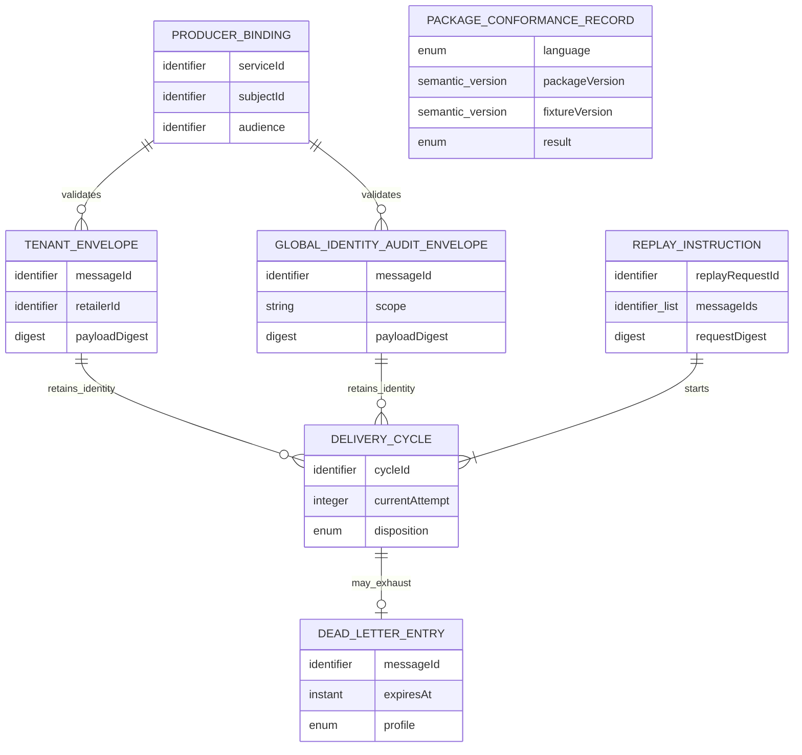

# Messaging Platform Functional Specification

Unit: U14 Messaging Platform (`messaging-platform`)

Sources: `unit-of-work.md`, `unit-of-work-story-map.md`, `requirements.md`, `components.md`, `contract-summary.md`, and the confirmed `functional-design-questions.md`.

## Purpose and ownership

U14 supplies reusable C01/C23 protocol validation and RabbitMQ delivery mechanics in independently versioned .NET and Python packages. U1 owns schemas, AsyncAPI and fixture governance. U2 owns broker topology and deployment. U5-U10 and U15 own their event meaning, transactional outbox/inbox, current authority, generation fences and atomic business effects. U3 and U4 are bootstrap publishers with their own C23-conformant adapters and separate U13 evidence; they do not depend on U14. U14 owns no domain database, retailer grant, or business-result transition.

## Participants

| Participant | Responsibility |
| --- | --- |
| Domain producer | Creates a valid domain event and commits its own outbox with the authoritative mutation. |
| U14 publishing adapter | Binds workload identity, validates envelope/digest/size, publishes and waits for durable broker confirm. |
| RabbitMQ and U2 platform | Routes tenant and global profiles, retains bounded dead letters and supplies broker-side recovery evidence. |
| U14 consumer adapter | Validates delivered envelope and identity before invoking the owning handler; acknowledges only on committed result. |
| Domain consumer | Validates current authority and fence, commits inbox and one effect/outbox result, or rejects. |
| U10 or owning Operator control | Authenticates and audits tenant or global replay permission before issuing a bounded replay instruction. |
| U1 Contracts | Versions C01/C22/C23, fixtures and compatibility policy. |
| U13 Demo Evidence | Collects separate U14 package and U3/U4 bootstrap-publisher results. |

## Owned logical operations

| Operation | Input | Success | Failure |
| --- | --- | --- | --- |
| Validate envelope | Versioned tenant or global wire envelope, registered workload binding, out-of-band route | Exact closed C01 schema, canonical digest and route accepted | Profile mismatch, absent tenant context, invented global tenant context, extra wire field, digest/size/producer conflict |
| Publish owner outbox message | Immutable envelope, authenticated producer, owner-held pending row | Durable broker confirm returned to owner | No confirm leaves owner row pending; no claim of publication |
| Consume delivery | Authenticated broker delivery, owner handler | Ack only after owner commit | Redelivery or quarantine; no transport claim of business effect |
| Schedule retry or dead letter | Failed delivery, current attempt | Deterministic next attempt or profile-specific DLQ | Attempt six refused; unresolved state remains visible |
| Execute authorized replay | Owner-issued audited authority and durable request/result reference, one to 100 immutable messages | One deterministic bounded cycle per message with original envelope/messageId; exact retry returns prior owner result | Wrong authority/scope, 101 messages, changed request under one ID, failed reconciliation |
| Declare package conformance | U1 protocol and fixture revision, .NET/Python package versions | Each package passes applicable same-version suites | Missing, invalid or incompatible suite blocks corresponding release claim |

## Workflows

### FD1. Validate and publish an immutable message

1. The domain owner commits its business change and outbox row atomically, then gives U14 an immutable message and its registered workload identity. U14 cannot edit the domain row or make the business decision.
2. U14 selects exactly one closed C01 wire schema from the envelope shape and authenticated route. Tenant messages carry all thirteen required tenant fields, including real retailer ID, placement generation, non-null UUID `causationId`, `schemaVersion`, `occurredAt`, `actor`, and `producer`. Retailerless identity-security audit carries all twelve required global fields, including `scope: global`, the `identity.global.audit.recorded` type and a required `causationId` that is null only for a root decision; it carries no retailer or placement fields. Both allow only optional `traceparent` beyond their required fields. Adapter `profile`, route, and byte count remain outside the wire envelope.
3. The adapter derives producer service, subject and audience from the authenticated registered workload. It checks allowed type, route and protocol range before broker publish; caller-supplied producer fields cannot override this binding.
4. It validates the selected U1-owned JSON Schema, computes SHA-256 over RFC 8785-canonicalized `data`, serializes only the complete C01 wire envelope as UTF-8, and rejects an envelope over 65,536 bytes. Broker headers and adapter metadata are excluded from those bytes. It verifies immutable message/idempotency identity and returns the durable prior result for an exact replay; changed content is quarantined.
5. It publishes using the original `messageId` and waits for a durable RabbitMQ confirm. Only that confirm lets the owner mark its outbox published. A lost confirm leaves the owner row pending for same-identity retry; delivery remains at least once.

### FD2. Deliver to an owner-controlled consumer

1. U14 receives the broker delivery and rechecks profile, route, authenticated producer, canonical digest, size, supported protocol version and immutable identity before invoking the handler.
2. The owner checks current tenant/job or global authority, placement and recovery generation, and the relevant domain fence. U14 cannot replace this check.
3. The owner atomically records inbox uniqueness and its business effect/outbox result. An exact duplicate returns the prior durable result; a changed payload with the same identity is quarantined. Crash before commit leaves no acknowledged effect; crash after commit but before ack is a duplicate on redelivery.
4. U14 acknowledges only after the owner reports durable commit or duplicate resolution. Failure before that point leaves delivery eligible for the bounded retry path. An acknowledgment never means a global exactly-once transport guarantee.

### FD3. Retry, dead-letter and reconcile

1. Initial delivery is attempt one. Transient failures schedule attempts two, three, four and five at 1, 2, 4 and 8 seconds, with no jitter and unchanged canonical envelope, `messageId` and payload digest.
2. Failed attempt five goes to the matching tenant or global identity-audit dead-letter route. Attempt six is forbidden. The dead letter retains safe failure evidence for seven days (604,800 seconds).
3. At expiry, the responsible owner receives an unresolved-expiry signal and reconciles authoritative state. U14 does not infer a successful business effect or repair it from broker absence.
4. Correlation, causation, attempt, retry delay and safe disposition are observable within the versioned telemetry budget. A diagnostic telemetry outage cannot roll back a committed business operation; loss evidence records it.

### FD4. Replay a bounded dead-letter batch

1. U10 or the owning domain verifies and audits current Operator authority: platform grant for global identity audit, or current retailer Operator membership for tenant messages. U14 accepts only a valid owner-issued replay authorization, never a raw browser role claim.
2. Before dispatch, U10 or the owning domain durably records the audited replay request under `replayRequestId`, its canonical request digest (authorized scope and ordered message IDs/envelope digests), deterministic cycle IDs derived from that request ID and each message ID, and a pending state. It stores the exact final or partial result when known and owns the request/result ledger; U14 holds no durable replay ledger. An exact completed retry returns that prior result without invoking U14. A changed batch or scope under the same request ID conflicts.
3. For a new or in-progress request, U14 validates one to 100 distinct message IDs atomically for authorized profile, immutable identity, canonical digest and payload. A batch of 101, duplicate IDs, or mixed unauthorized scopes is rejected as a whole. If a response or broker confirm is lost, the owner reuses its durable per-message dispatch state and the same cycle IDs, then resumes only unfinished work. At-least-once physical redelivery may occur, but neither it nor U14 allocates a second logical cycle for the same request/message pair; the owning consumer inbox prevents a duplicate business effect.
4. Each accepted message keeps the original canonical envelope and `messageId`; broker metadata carries replay-request identity and its deterministic cycle ID, beginning at attempt one and bounded to five deliveries. The owner durably records the exact completion or partial-failure result against its existing request ID.
5. The owner reconciles replay and authoritative state before closing the audited replay request. A duplicate effect, changed payload or unresolved expiry remains visible and cannot be represented as repaired by transport alone.

### FD5. Prove package and consumer conformance

1. U1 publishes a versioned C22 protocol range and fixtures for tenant/global envelopes, cross-profile rejection, producer binding, digest/size, confirms, exact replay, changed-payload conflict, poison/DLQ, expiry, authorized replay, reconciliation, ordering and telemetry.
2. U14 declares independent semantic versions for its .NET and Python packages; each states the U1 protocol range it supports and runs the same applicable fixture version. Missing, incompatible or failed evidence blocks its release.
3. U3 and U4 run applicable fixtures against their own service-local publishers; U13 records those separately from the U14 language-package results. Neither bootstrap publisher acquires an U14 dependency.
4. Each domain consumer repeats parameterized duplicate, stale-authority, crash-before-commit and crash-after-commit schedules against its own inbox and effect. A passing representative U14 fixture does not accept the import, receipt or other domain consumer on its behalf.
5. CI and portfolio evidence bind every result to the package revision, protocol/fixture versions, environment, actual outcome and digest; missing prerequisites are `not-run` or limited, never an invented pass.

### FD6. Participate in a coordinated recovery cut

1. U15 coordinates the registered participant roster and durable dispatch inventory. Domain participants fence their own relays/consumers/acknowledgments; U2 fences RabbitMQ topology and captures broker-supported per-queue identities/digests. U14's adapter respects supplied current fence generations and cannot reopen traffic under a stale one.
2. Drain/checkpoint and broker evidence contribute to the U15 manifest together with each participant's PostgreSQL LSN/transaction evidence. U14 telemetry alone cannot certify a consistent cut.
3. Abort, delayed prepare, restart and resume retain owner/coordinator terminal guards. U14 refuses delivery work while a relevant fence is unresolved; only the owning participant and U15 reconcile and release it.

## State machines

```mermaid
stateDiagram-v2
    [*] --> Pending: owner commits outbox
    Pending --> Confirmed: broker confirms same messageId
    Pending --> Pending: no confirm; retry same identity
    Confirmed --> Delivered: owner commits then ack
    Confirmed --> RetryScheduled: failed delivery
    RetryScheduled --> Confirmed: next attempt 2 to 5
    RetryScheduled --> DeadLettered: attempt 5 fails
    DeadLettered --> ReplayCycle: audited authorized replay
    ReplayCycle --> Confirmed: original envelope, new attempt 1
    DeadLettered --> Expired: seven-day retention ends
```

Text fallback: the producer's pending outbox becomes broker-confirmed only after a durable confirm. Owner commit precedes ack. Delivery failure makes at most five attempts before a dead letter. Authorized replay starts another bounded cycle with the same immutable message; expiry requires owner reconciliation.

## Derived entity-relationship view

The YAML in `entities.md` is authoritative. This is a view of protocol relationships, not tables owned by U14.

Text fallback: one workload binding validates tenant and global identity-audit envelopes against separate closed wire schemas. Either envelope may have multiple bounded cycles across distinct authorized replay requests. A failed cycle can yield one dead-letter entry; one owner-ledger-backed replay instruction starts one to 100 deterministic cycles only once per request/message pair. Package evidence has no business-state relationship.

## Derived rules summary

The YAML in `rules.md` is authoritative.

| Concern | Rules | Effect |
| --- | --- | --- |
| Envelope and producer | BR1.1-BR1.5 | Two closed profiles, authenticated binding, canonical digest, size and immutable identity. |
| Delivery and replay | BR2.1-BR2.6 | Confirm-before-outbox advancement, owner-commit-before-ack, bounded retries/DLQ and owner-ledger-backed idempotent replay. |
| Packages and ownership | BR3.1-BR3.4 | Independent language packages pass U1 fixtures without taking domain state or bootstrap-publisher ownership. |
| Recovery | BR4.1-BR4.2 | Honor current fences and contribute broker evidence to U15's cut. |
| Reviewer evidence | BR5.1-BR5.4 | Reproducible scoped validation, safe telemetry and measured inputs for U13. |

## Boundary contracts and failure semantics

| Boundary | Owner | U14 obligation |
| --- | --- | --- |
| C01/C15 envelopes and audit routes | U1 schemas, domain event producers | Validate the exact, distinct closed tenant/global wire shapes against U1 schemas; keep profile, route and measured byte count outside the envelope; never invent retailer context. |
| C22 compatibility and fixtures | U1 | Declare .NET/Python versions and supported protocol range; run same applicable fixture revision. |
| C23 broker mechanics and replay | U14 adapter, with U10/domain owner request ledger | Authenticate producer, confirm, deliver/ack after owner commit, bound retry/DLQ/replay, enforce size and emit safe telemetry; use owner-supplied prior request result and deterministic cycle IDs. |
| C24-C27 recovery | U15 coordinator, U2 broker, domain participants | Honor supplied fences and broker cut evidence; do not claim global recovery from package telemetry. |
| U3/U4 bootstrap publishers | U3/U4 | Share conformance rules but no runtime U14 package dependency; U13 records their results separately. |

| Condition | External result and effect |
| --- | --- |
| Missing/wrong producer binding, route, audience or protocol | `MESSAGE_PRODUCER_UNAUTHENTICATED` or `MESSAGE_PRODUCER_MISMATCH`; no publish/effect. |
| Invalid profile or fabricated tenant metadata | Contract validation failure; no cross-profile substitution. |
| Serialized envelope exceeds 65,536 bytes | `MESSAGE_ENVELOPE_TOO_LARGE` before publish. |
| Digest mismatch or changed content under message/idempotency identity | `MESSAGE_PAYLOAD_CONFLICT`; quarantine, no business effect. |
| Lost broker confirmation | Owner outbox stays pending; retry same immutable identity. |
| Owner commit uncertain or crash before ack | Redelivery; owner inbox resolves duplicate, U14 makes no exactly-once claim. |
| Fifth failed attempt | Profile-specific DLQ; no sixth delivery. |
| Unauthorized, duplicate-ID, mixed-scope or 101-item replay | Entire request denied without starting a cycle. |
| Exact completed replay-request retry | Return the owner's durable prior result without dispatch or a new delivery cycle. |
| Same replayRequestId with changed batch/scope | Conflict against the owner request digest; no new cycle. |
| In-progress replay retry after uncertain broker confirmation | Reconcile the owner ledger and broker under the same deterministic cycle IDs; resume only unfinished work. |
| Missing current recovery fence or stale generation | No delivery/topology mutation; owning participant must reconcile. |

## Acceptance scenarios

1. Tenant and global identity-audit envelopes validate only against their own schemas and routes, including a separate global dead-letter path and explicit cross-profile rejection.
2. Payloads at 65,535 and 65,536 serialized bytes pass; 65,537 fails before publication. A changed digest or producer binding fails at publish and receive.
3. A committed representative owner outbox advances only after broker confirm. A consumer ack occurs only after its inbox and effect commit; crash-before/after schedules lead to one owner effect under redelivery.
4. Attempts one through five use 1/2/4/8-second waits for attempts two through five and preserve immutable identity. Failed attempt five dead-letters; attempt six is impossible; seven-day expiry produces reconciliation evidence.
5. An audited authorized batch of 100 starts one deterministic bounded cycle per original envelope. Exact replay-request retry after a lost response returns the owner-held prior result without another cycle; an in-progress retry resumes only existing cycle IDs. A changed batch under the same request ID, batch of 101, retailer-only authority for global messages, or changed payload is rejected atomically.
6. The .NET and Python packages pass the same versioned C22 fixtures. U3/U4 bootstrap-publisher results and each domain consumer's inbox/authority/effect tests remain independently required.
7. A recovery fence blocks relevant messaging activity and stale generations; U2's per-queue evidence joins U15's participant checkpoints without U14 claiming a complete snapshot.
8. Correlated telemetry omits secrets and reports bounded loss under outage. U13 records measured U14 contributions but decides whole-stack latency, capacity, reviewer timing and release coverage from all owning units.

## Review

**Verdict:** READY
**Reviewer:** aidlc-architecture-reviewer-agent
**Date:** 2026-09-25T20:08:21Z
**Iteration:** 1

### Findings

| ID | Severity | Location | Finding | Required action | Status |
|---|---|---|---|---|---|

No actionable findings.

### Validation Tool Results

| Tool | Result | Interpretation |
|---|---|---|
| Bounded structural checks | PASS: required headings, 21 unique BR IDs, 41 traceability rows with valid OK targets | Required artifact structure and rule references resolve. |
| C01/C23 contract comparison | PASS: distinct closed tenant/global fields; owner-held replay request/result ledger and deterministic cycle IDs | The prior envelope and replay concerns are addressed without claiming U14 persistence. |

### Summary

The U14 design is ready for implementation: C01 profiles, C23 delivery and replay ownership, and the required traceability are internally consistent with the passed contracts. Domain owners retain authority and atomic effects.