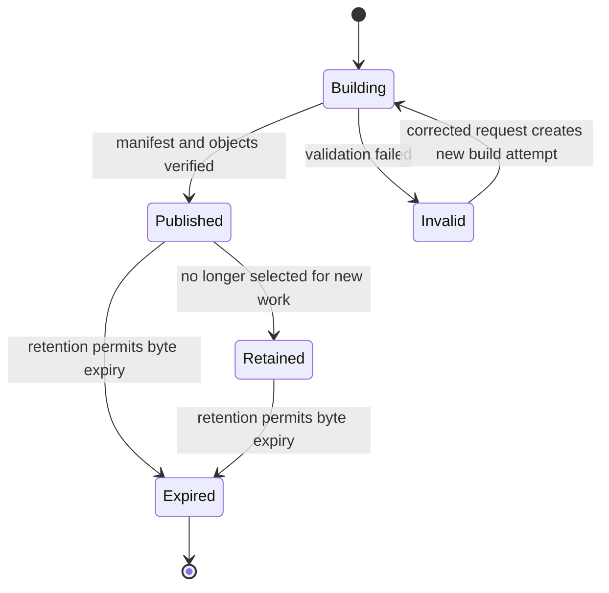
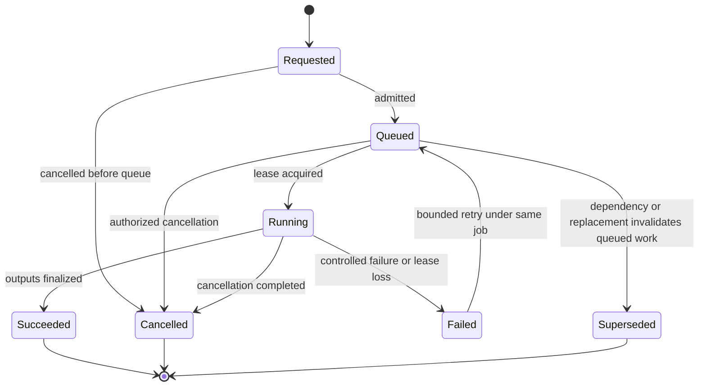
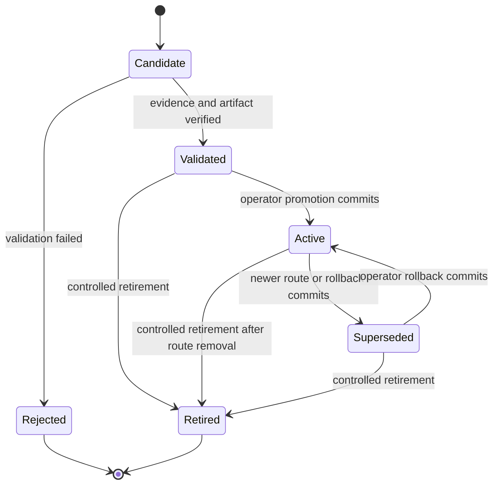
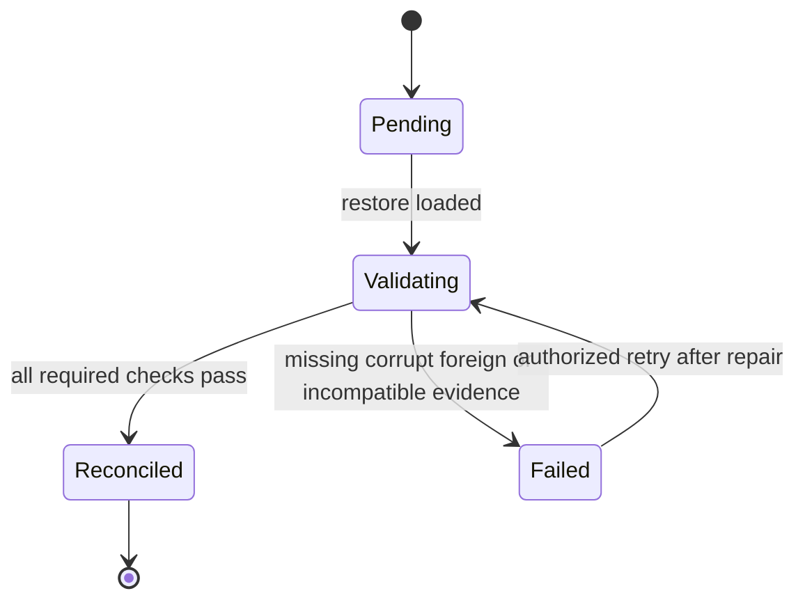
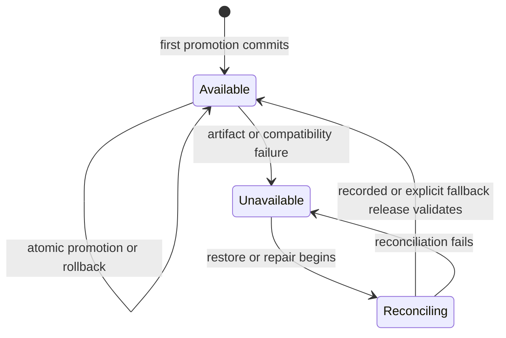
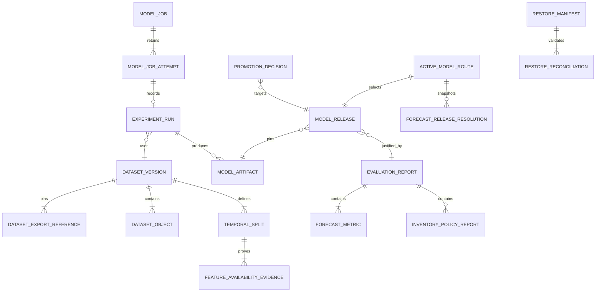

# Model Lifecycle Functional Specification

Unit: U6 Model Lifecycle (model-lifecycle)

Status: Draft for independent review

Decision basis: confirmed Model Lifecycle Functional Design answers dated 2026-09-13.

This specification is the source of truth for ordered workflows and lifecycle transitions. The entity diagram and rule summary are derived views of `entities.md` and `rules.md`.

## Purpose and boundaries

Model Lifecycle creates reproducible retailer-scoped datasets, runs resource-bounded training and evaluation work, records experiment evidence, validates immutable model releases, and controls the single active model route that Forecasting resolves. It does not own Retail Data or Supplier Knowledge source records, forecast production or freshness, replenishment policy, identity, searchable audit projection, cluster provisioning, or human purchasing authority.

## Actors and authority

| Actor | Permitted behavior |
| --- | --- |
| Operator | Publish governed datasets, submit/cancel/retry ML jobs, inspect MLflow evidence, validate releases, promote, roll back, restore, reconcile, and execute controlled retention within current authority. |
| Reviewer | Inspect published evaluation and portfolio evidence exposed through authorized read contracts; cannot mutate releases or routes. |
| Model Lifecycle service/worker | Execute only under validated tenant and job authority; cannot promote or choose a production route. |
| Forecasting service | Resolve and pin the server-owned active release for a retailer; cannot submit arbitrary artifact locations. |
| Retail Data / Supplier Knowledge | Produce authorized immutable exports; they do not control model state. |

Every protected action revalidates retailer context, current role or machine scope, and placement generation. Operator-wide infrastructure access does not permit cross-retailer data mixing.

## Workflow specifications

### WF1. Publish an immutable Dataset Version

1. An authorized Operator submits a dataset-publication command with retailer, temporal configuration, feature-schema version, source-selection parameters, and a tenant-scoped operation key.
2. Model Lifecycle validates current Operator authority and retailer placement, records the request hash, and returns the original result for an exact replay or a conflict for changed payload under the same key.
3. It requests an immutable Retail Data export through C04 and, when inventory-policy evaluation is included, an accepted-term export through C05. Provider job IDs, source revisions, checksums, availability times, and opaque object references are pinned.
4. The worker verifies tenant identity, placement generation, export checksums, and the availability cutoff. It never reads provider tables or caller-selected host paths.
5. It materializes physically or logically separate objects for training features/labels and evaluation-only latent demand truth. Latent true demand and synthetic lost demand never enter model inputs.
6. It creates expanding-window Temporal Splits and origin-time feature availability evidence. Every training window ends before its origin.
7. It writes objects to staging, verifies checksums and counts, writes the canonical manifest, and computes one aggregate manifest checksum.
8. One authoritative transaction changes the Dataset Version to Published and appends business audit and outbox records. A failed required write leaves the version Building or Invalid.
9. Changed exports, cutoff, feature schema, split configuration, origins, or bytes always create a new version.

### WF2. Admit and schedule a resource-intensive ML job

1. An authorized Operator submits a train, forecast-evaluation, policy-evaluation, or restore-reconciliation command with immutable dependency IDs and an operation key.
2. The service validates tenant, role, placement, dependency status, request hash, and contract version before accepting the job.
3. An exact replay returns the existing logical job. Changed payload under the same key conflicts.
4. The accepted job moves Requested to Queued. The global queue orders accepted heavy jobs by durable admission sequence.
5. A dispatcher grants the cluster-wide execution lease only when no other heavy job holds a valid lease. Waiting jobs remain visible in FIFO order.
6. Cancellation may remove a Queued job or signal a Running attempt; cancellation never promotes or deletes verified evidence.

### WF3. Execute, heartbeat, and recover a Model Job

1. The worker appends a Model Job Attempt, acquires the job and cluster leases, and pins immutable input and runtime digests.
2. The attempt moves Leased to Running and emits bounded heartbeats. Commit authority is valid only while the worker owns an unexpired lease.
3. Verified intermediate outputs may be stored with checkpoint digests. A checkpoint never represents job success or promotion.
4. Success finalizes outputs, completes experiment evidence, changes the attempt and logical job to Succeeded, and releases the lease.
5. A controlled failure records a safe code and provenance and changes both attempt and job to Failed. A cancellation records Cancelled.
6. Lease expiry marks the attempt Interrupted and the job Failed or retryable. A later retry appends an attempt under the same logical job and reuses only immutable inputs or a verified checkpoint.
7. A stale or foreign worker cannot commit after losing its lease. Repeated messages are deduplicated by inbox records.
8. Exhausted retry policy moves the work to observable dead-letter handling; controlled replay retains the original job and tenant authority.

### WF4. Train the first retailer-scoped candidate

1. A training job pins one Published Dataset Version, Feature Specification, model definition, code revision, container/runtime digest, dependency lock, deterministic seed, and configuration digest.
2. Admission rejects foreign, invalid, corrupt, expired, or leakage-failed inputs.
3. The worker fits one retailer-scoped multi-product HistGradientBoostingRegressor with Poisson loss. It uses declared lagged observed-sales, shifted rolling, calendar, known-promotion, product-identity, and horizon-day features.
4. Every transformation is fitted inside its temporal fold or final training window. Evaluation-only truth remains inaccessible to the fitting path.
5. The worker records the run in operator-only experiment metadata, including job attempt, inputs, configuration, runtime, timings, status, and safe failure details.
6. Successful serialized bytes are written to staging, checked against the declared format and input/output schemas, hashed, and finalized at an immutable object reference.
7. The completed job may create a Candidate release. It never changes an Active Model Route.
8. Failed or cancelled runs remain inspectable and cannot create a validated release.

### WF5. Evaluate forecasts with common rolling origins

1. An evaluation job pins one Dataset Version, at least three complete 28-day Temporal Splits, the seasonal-naive and moving-average definitions, and any trained candidate definitions.
2. Feature-availability validation must pass for every scored split. Incomplete horizons are excluded with dates, counts, and reasons.
3. Each model produces forecasts for identical retailer products and origins. A mismatch makes the report Incomplete.
4. For each model, MAE equals total absolute error divided by observation count; zero-demand observations remain included.
5. WAPE equals one hundred times total absolute error divided by total generated true demand. A zero denominator yields WAPE N/A, a zero-demand flag, and retained MAE.
6. The report records dates, sample counts, products, origins, exclusions, versions, unsuccessful candidates, and synthetic-data limitations.
7. The hand-check fixtures must reproduce demand 10 versus forecast 8 as MAE 2 and WAPE 20%, and demand 0 versus forecast 2 as MAE 2 with WAPE N/A. Across the two observations [10,0] and [8,2], MAE is 2 and WAPE is 40%.
8. A report becomes Complete only after every required candidate, baseline, disclosure, checksum, and arithmetic validation succeeds.

### WF6. Evaluate chronological inventory-policy outcomes

1. A policy-evaluation job pins the Dataset Version, accepted-term export, true demand, initial stock, supplier constraints, lead times, ordering policy, and fixed versioned acquisition costs.
2. For each forecast candidate, it runs one chronological simulation per scenario. It never sums separate simulations for overlapping forecast origins.
3. Only the forecast input varies. Realized order and inventory trajectories may differ as consequences of that forecast.
4. Lost-demand rate is one hundred times lost units divided by true demand. Zero demand yields N/A while lost units remain visible.
5. Mean closing inventory value includes every evaluated day, including zero-stock days, and excludes inbound stock and sales revenue.
6. Monetary outcomes remain in the retailer currency and are never aggregated across currencies.
7. The hand-check fixtures produce lost units 4 and rate 40% for demand 10 with stock 6, and mean value 20/3 for daily closing values 12, 8, and 0.
8. The report is linked to the common forecast evaluation so a Reviewer can compare forecast quality and policy outcomes without an opaque composite score.

### WF7. Validate and register a Model Release

1. An authorized Operator requests validation of a Candidate release using its operation key.
2. Model Lifecycle validates current authority, tenant identity, successful run, complete comparable report against both baselines, complete lineage, feature-availability evidence, no leakage failure, artifact checksum, format, dependency/runtime profile, and input/output schemas.
3. A trained or baseline release that passes becomes Validated but remains inactive. Validation does not modify the retailer route.
4. A release that fails validation remains Candidate or becomes Rejected with durable reasons. It cannot be activated.
5. Release identity, artifact reference, evaluation link, and model definition are immutable; lifecycle changes are recorded as transitions.

### WF8. Promote a validated release

1. An authorized Operator chooses a Validated release and submits the target, expected route version, evidence reference, and explicit rationale.
2. The service revalidates role, retailer, placement, release status, artifact checksum and availability, runtime/schema compatibility, evaluation completeness, and idempotency.
3. No universal improvement threshold is inferred. The rationale explains the evidence and tradeoff; a validated baseline may remain or become active.
4. Under one authoritative transaction, the current Active release becomes Superseded when present, the target becomes Active, a Promotion Decision is appended, the Active Model Route advances one version, and business audit and outbox records are appended.
5. Any expected-version, audit, outbox, or eligibility failure rolls back every route-change effect.
6. Forecast Runs admitted after commit resolve the new route; existing runs remain pinned to their prior release.

### WF9. Roll back to a retained release

1. An authorized Operator selects a retained compatible Validated or Superseded release and supplies current expected route version and rollback reason.
2. The service repeats artifact, tenant, runtime, schema, evaluation, retention, and availability checks. Rejected, retired, expired, corrupt, missing, or foreign releases are ineligible.
3. The same transaction used for promotion appends a rollback Promotion Decision, changes route and release states, audit, and outbox.
4. The prior active release becomes Superseded. The rollback target becomes Active again without changing its immutable artifact or earlier evidence.
5. Historical Forecast Runs and prior promotions remain unchanged.

### WF10. Resolve and pin a release for Forecasting

1. Forecasting calls C07 under a validated machine identity and retailer job authority when admitting a Forecast Run.
2. Model Lifecycle resolves the server-owned Active Model Route. Caller-provided artifact locations or arbitrary production release overrides are rejected.
3. The service verifies route and release availability and returns retailer, route version, promotion decision, release version, artifact reference/checksum, runtime profile, input/output schema digests, evaluation summary, activation time, and provenance links.
4. Forecasting persists the resolution against the Forecast Run before execution and verifies the artifact checksum and compatibility before inference.
5. Retries for that Forecast Run reuse the same resolution even if a later promotion or rollback occurs.
6. Missing, corrupt, incompatible, expired, or unreconciled releases return an explicit unavailable result with no substitution.
7. Forecasting separately records current run status, last successful run, result age, and freshness; Model Lifecycle does not relabel an older forecast as fresh.

### WF11. Process messages and publish lifecycle events

1. Authoritative Model Lifecycle mutations append required outbox records in their local transaction.
2. The relay publishes with durable delivery and confirms, retaining unpublished entries for retry.
3. Consumers validate schema, tenant, job authority, event identity, aggregate version, and placement generation.
4. A consumer commits its local effect and inbox record before acknowledgement. Redelivery returns the recorded result without duplication.
5. Bounded failure enters an observable dead-letter path. An authorized replay preserves event identity and never claims exactly-once transport.

### WF12. Restore and reconcile Model Lifecycle

1. The Operator selects a checksummed Restore Manifest linking control-store, experiment-metadata, and object-store snapshots under one retention-policy version.
2. Restore loads all authorities into the clean environment without declaring routes usable. Restored routes become Reconciling or Unavailable.
3. Per retailer, the reconciliation job verifies ownership, placement, dataset manifests, experiment references, artifact bytes/checksums, runtime and schemas, evaluation evidence, release transitions, route history, tombstones, and retention state.
4. Jobs captured as Running become explicitly Interrupted and Failed or retryable; no partial output becomes promoted.
5. If the recorded active release validates, the Operator completes reconciliation and restores route availability with audit evidence.
6. If it does not validate, the route remains Unavailable. An authorized Operator may select a compatible retained Validated release as an explicit fallback through the normal route-change controls.
7. Missing, corrupt, expired, or foreign bytes are never substituted. Counts, failures, elapsed recovery time, data loss, and limitations are reported against the later approved objectives.

### WF13. Apply retention and expire bytes safely

1. Controlled retention identifies an eligible dataset object or model artifact under a versioned policy.
2. The service checks active routes, retained Forecast Runs, evaluation reports, promotions, rollbacks, restore manifests, and required audit evidence.
3. Any retained dependency blocks ordinary deletion and returns safe dependency counts.
4. When policy and dependencies permit expiry, bytes are removed and an immutable tombstone preserves retailer, target identity, checksum, policy, dependency digest, and expiry time.
5. Dependent records show evidence unavailable; they never point to substitute bytes. Expired data cannot reappear through restore or rebuild.

### WF14. Record accepted and rejected business audit evidence

1. Dataset publication, release registration, promotion, rollback, restore selection, and retention mutations commit their business entry and outbox atomically.
2. Required audit failure rolls back the mutation.
3. Rejected authorization, tenant, validation, or concurrency attempts use a separate durable path that survives the rejected transaction without disclosing secrets or foreign existence.
4. Runtime roles append and read only as authorized; they cannot update or delete audit history. Controlled retention uses separate privilege.

### WF15. Validate contracts and local runtime readiness

1. Every REST boundary is described in OpenAPI and every asynchronous job/event boundary in AsyncAPI, including auth, tenant, errors, idempotency, examples, and compatibility metadata.
2. CI validates schemas, examples, generated-client inputs, and supported compatibility. Invalid or incompatible changes block integration.
3. Local deployment exposes health, readiness, dependency, queue, and active-job state. Missing runtime, disk, object store, MLflow, credentials, or resource headroom fails explicitly before unsupported work starts.
4. The reviewer path uses pinned, checksummed prerequisites and a real CPU-compatible model. Optional AMD GPU results remain separate evidence.
5. Published portfolio evidence links requirements, datasets, runs, reports, releases, tests, rejected candidates, recovery limits, and measured capacity without claiming unmeasured improvement.

## State machines

### Dataset Version lifecycle

Text fallback: a dataset is built and becomes Published only after complete manifest and object verification. Invalid builds may be retried as build attempts. Published versions may be retained and later expired; expiry preserves tombstones and never mutates the old manifest.

### Model Job lifecycle

Text fallback: accepted jobs queue and one heavy job runs at a time. Failure or interruption may append a new attempt and requeue the same logical job. Success, cancellation, and supersession are explicit terminal outcomes; none promotes a model.

### Model Release lifecycle

Text fallback: validation and activation are distinct. Candidate releases become Validated or Rejected. An Operator may activate a Validated release; replacing it makes it Superseded. Rollback reactivates a retained compatible Superseded release through a new audited decision.

### Restore reconciliation lifecycle

Text fallback: loading snapshots does not restore service authority. Each retailer stays unavailable until reconciliation passes. A failed reconciliation may retry after explicit repair; no newest-file fallback occurs.

### Active Model Route availability

Text fallback: route-version changes are atomic while available. Artifact or restore failures make the route explicitly unavailable. Repair or restore enters Reconciling and returns to Available only after a specific release validates.

## Derived entity relationship view

Text fallback: immutable upstream exports and objects form Dataset Versions and Temporal Splits. Job Attempts create Experiment Runs and artifacts. Evaluation Reports justify Model Releases. Promotion Decisions change one Active Model Route, which Forecast Runs snapshot. Restore Manifests reconcile these authorities per retailer.

## Derived rules summary

| Rule group | Behavioral effect |
| --- | --- |
| BR1 | Server-resolved tenant and Operator authority govern every read, job, artifact, and route. |
| BR2 | Immutable manifests and origin-time feature evidence define reproducibility and leakage boundaries. |
| BR3 | Common rolling origins and exogenous scenarios make forecast and inventory comparisons honest. |
| BR4 | Training, run metadata, and artifact finalization preserve complete immutable provenance. |
| BR5 | Durable jobs, leases, attempts, operation keys, inboxes, and DLQ handling make retries deterministic. |
| BR6 | Validated-but-inactive releases, human decisions, and atomic route transactions govern promotion and rollback. |
| BR7 | Forecasting pins one verified release and owns execution and freshness without silent fallback. |
| BR8 | Restore, reconciliation, dependencies, and tombstones preserve usable and unavailable evidence correctly. |
| BR9 | OpenAPI, AsyncAPI, atomic audit, readiness, resource checks, and evidence rules support local delivery. |

## Contract refinements

| Contract | Required refinement |
| --- | --- |
| C04 Retail dataset exports | Return immutable job status plus retailer, placement generation, source revisions, availability cutoff, object references, row counts, and checksums. |
| C05 Accepted-term exports | Return immutable term/provenance snapshot, retailer currency, effective-time basis, object reference, and checksum for policy evaluation. |
| C07 promoted-model metadata | Return route and promotion versions, release identity, artifact reference/checksum, runtime profile, schema digests, evaluation summary, activation time, and provenance links; expose explicit unavailable reasons. |
| C15 authoritative events | Add dataset-published, job-status, release-validated/rejected, model-promoted/rolled-back, route-unavailable/reconciled, and artifact-expired events under the common tenant/correlation envelope. |
| Model Lifecycle command API | Add tenant-authorized asynchronous publication/training/evaluation job resources and Operator-only validation, promotion, rollback, restore, and retention commands with operation keys and expected versions. |

## Error and boundary behavior

| Condition | Required outcome |
| --- | --- |
| Missing, foreign, or revoked authority | Deny without disclosing target existence; preserve safe rejected-attempt audit. |
| Stale placement or route version | Conflict with no partial effect; caller re-resolves trusted context. |
| Changed payload under an operation key | Conflict; retain original result. |
| Corrupt source, dataset, or model object | Mark unavailable/corrupt; fail dependent work without substitution. |
| Leakage or incomparable cohorts | Incomplete/failed evaluation; release cannot validate or activate. |
| Second heavy ML job | Keep Queued in visible FIFO order. |
| Worker or broker interruption | Retain attempts and retry safely from immutable input or verified checkpoint. |
| Missing audit or outbox write | Roll back the authoritative mutation. |
| Unavailable active release | Explicit unavailable model response; Forecasting does not invent or silently reuse another release. |
| Restore mismatch | Keep the retailer route unavailable until reconciliation or explicit validated fallback succeeds. |

## Sources

- inception/units-generation/unit-of-work.md
- inception/units-generation/unit-of-work-story-map.md
- inception/requirements-analysis/requirements.md
- inception/domain-design/components.md
- inception/contract-design/contract-summary.md
- construction/model-lifecycle/functional-design/functional-design-questions.md
- construction/model-lifecycle/functional-design/entities.md
- construction/model-lifecycle/functional-design/rules.md

## Assumptions & Open Questions

- Exact seasonal-naive period, moving-average window, rolling-origin cadence beyond three complete horizons, job deadlines/retry budgets, resource requests, retention durations, and recovery objectives are deferred to NFR and implementation stages.
- Forecast freshness threshold and stale-result planning behavior remain owned by Forecasting and Planning and are not selected here.
- Synthetic evaluation demonstrates the workflow and does not establish real-world commercial improvement.

## Review

**Reviewer:** aidlc-architecture-reviewer-agent
**Iteration:** 1
**Verdict:** NOT-READY
**Date:** 2026-09-13T08:23:55Z

### Findings

| ID | Severity | Location | Finding | Required action | Status |
|---|---|---|---|---|---|
| R-01 | Major | aidlc/spaces/default/intents/260908-stock-sense-design/construction/model-lifecycle/functional-design/functional-spec.md > Assumptions & Open Questions | Baseline periods, moving-average windows, and rolling-origin cadence are deferred to implementation, so candidate-versus-baseline comparisons are not reproducible from this design. | Specify the deterministic evaluation configuration, versioning rules, and equality constraints applied to baseline and candidate runs. | New |
| R-02 | Major | aidlc/spaces/default/intents/260908-stock-sense-design/construction/model-lifecycle/functional-design/functional-spec.md > Assumptions & Open Questions | Job deadlines and retry budgets are deferred, leaving lease expiry, renewal, retry exhaustion, and duplicate-worker behavior underspecified for implementation. | Define lease duration and renewal semantics, attempt limits, retryable outcomes, terminal failure handling, and idempotency behavior. | New |
| R-03 | Major | aidlc/spaces/default/intents/260908-stock-sense-design/construction/model-lifecycle/functional-design/functional-spec.md > Assumptions & Open Questions | Retention durations and recovery objectives are deferred, so the required relationship among MLflow metadata, object artifacts, and the lifecycle ledger during restore or rollback is not implementable without architectural guidance. | Define retention and restore invariants, the authority of each store, recovery ordering, and behavior when metadata, objects, and ledger state disagree. | New |

### Validation Tool Results

| Tool | Result | Interpretation |
|---|---|---|
| Stage-declared validation tools | Not run because the bounded review was ordered to conclude immediately after interruption | No structural validation evidence is available for this advisory verdict. |

### Summary

The design leaves three behavior-defining areas to later stages or implementation: reproducible model comparison, lease/retry semantics, and multi-store recovery. Those gaps require architectural decisions before a developer can implement the lifecycle safely.
