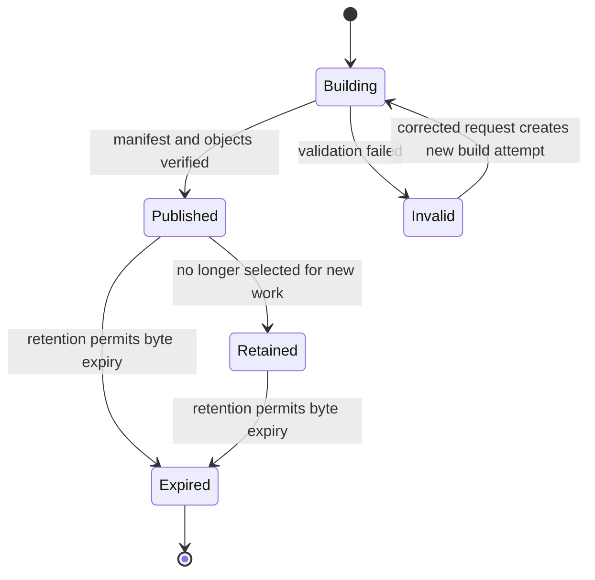
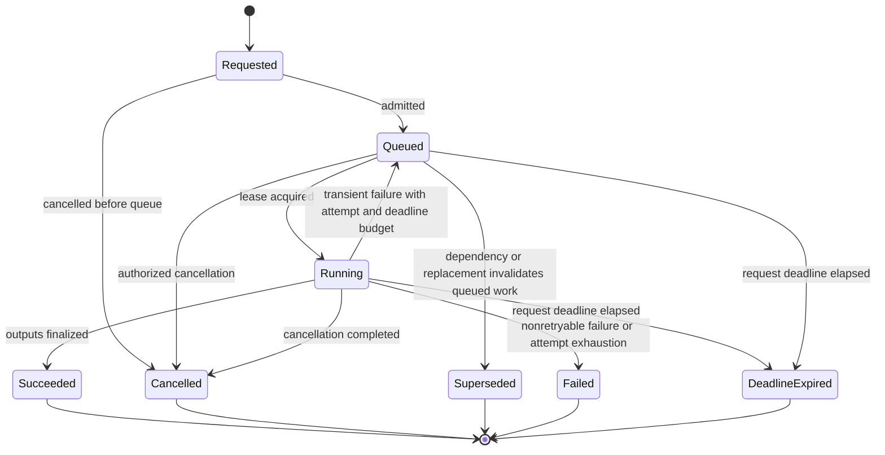
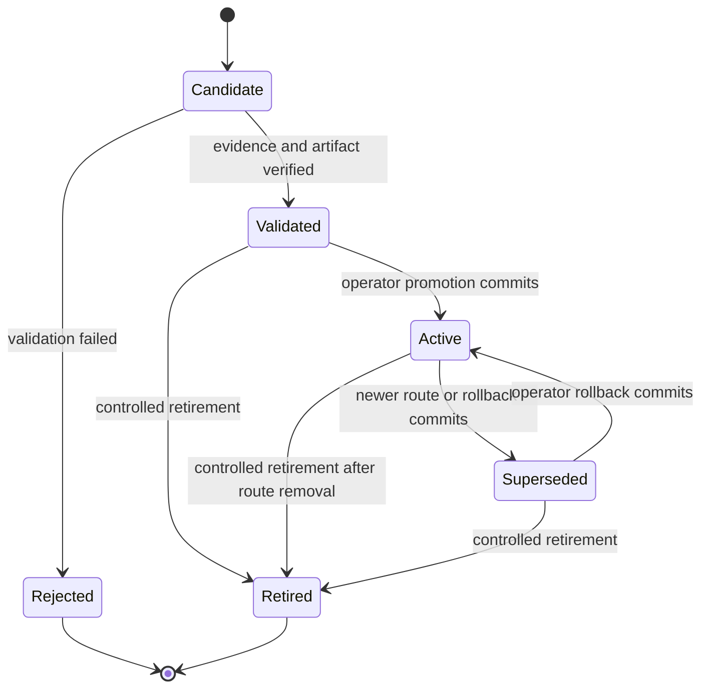
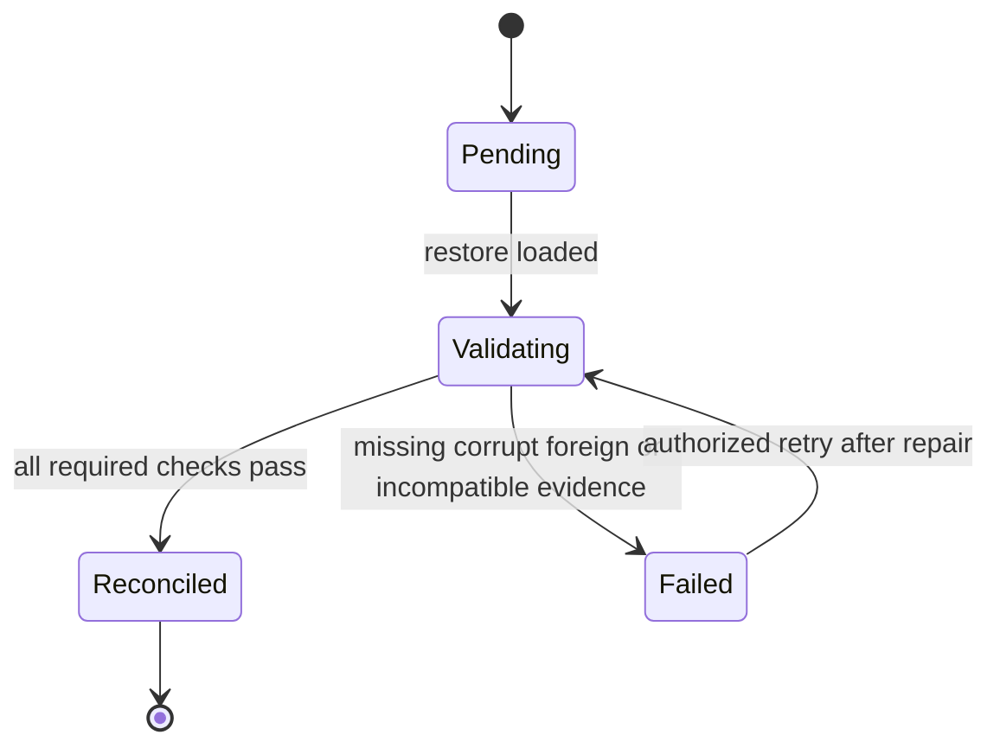
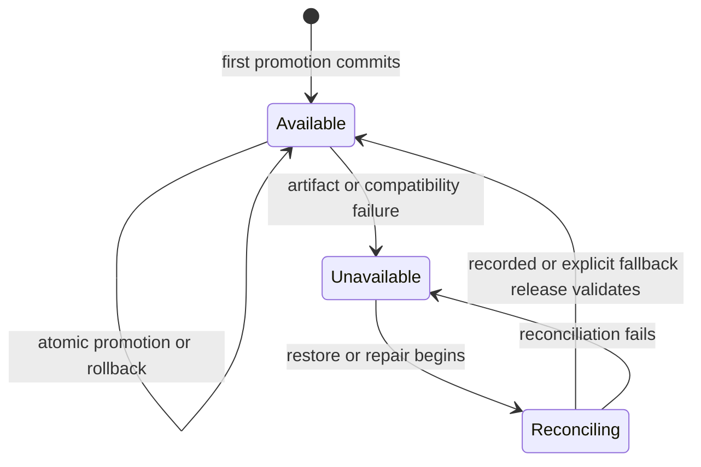
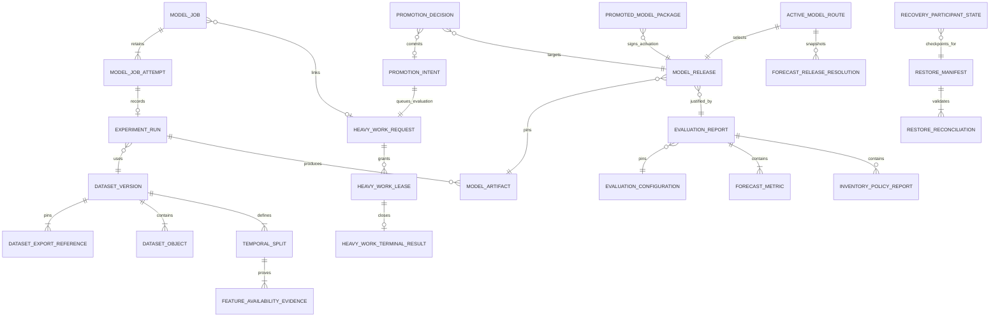

# Model Lifecycle Functional Specification

Unit: U6 Model Lifecycle (model-lifecycle)

Status: Draft for independent review

Decision basis: confirmed Model Lifecycle Functional Design answers dated 2026-09-13 and reconciliation confirmed 2026-09-25, followed by owner-directed C07 safety corrections pending review.

This specification is the source of truth for ordered workflows and lifecycle transitions. The entity diagram and rule summary are derived views of `entities.md` and `rules.md`.

## Purpose and boundaries

Model Lifecycle creates reproducible retailer-scoped datasets, runs resource-bounded training and evaluation work, records experiment evidence, validates immutable model releases, and controls the single active model route that Forecasting resolves. It does not own Retail Data or Supplier Knowledge source records, forecast production or freshness, replenishment policy, identity, searchable audit projection, cluster provisioning, or human purchasing authority.

## Actors and authority

| Actor | Permitted behavior |
| --- | --- |
| Operator | Publish governed datasets, submit/cancel/retry ML jobs, inspect MLflow evidence, validate releases, promote, roll back, restore, reconcile, and execute controlled retention within current authority. |
| Reviewer | Inspect published evaluation and portfolio evidence exposed through authorized read contracts; cannot mutate releases or routes. |
| Model Lifecycle service/worker | Execute only under validated tenant and job authority; cannot promote or choose a production route. |
| Forecasting service | Resolve and pin the server-owned active release for a retailer; cannot submit arbitrary artifact locations. |
| Retail Data / Supplier Knowledge | Produce authorized immutable exports; they do not control model state. |

Every protected action revalidates retailer context, current role or machine scope, and placement generation. Operator-wide infrastructure access does not permit cross-retailer data mixing.

## Workflow specifications

### WF1. Publish an immutable Dataset Version

1. An authorized Operator submits a dataset-publication command with retailer, temporal configuration, feature-schema version, source-selection parameters, and a tenant-scoped operation key.
2. Model Lifecycle validates current Operator authority and retailer placement, records the request hash, and returns the original result for an exact replay or a conflict for changed payload under the same key.
3. It requests an immutable Retail Data export through C04 and, when inventory-policy evaluation is included, an accepted-term export through C05. Provider job IDs, source revisions, checksums, availability times, and opaque object references are pinned.
4. The worker verifies tenant identity, placement generation, export checksums, and the availability cutoff. It never reads provider tables or caller-selected host paths.
5. It materializes physically or logically separate objects for training features/labels and evaluation-only latent demand truth. Latent true demand and synthetic lost demand never enter model inputs.
6. It creates expanding-window Temporal Splits and origin-time feature availability evidence. Every training window ends before its origin.
7. It writes objects to staging, verifies checksums and counts, writes the canonical manifest, and computes one aggregate manifest checksum.
8. One authoritative transaction changes the Dataset Version to Published and appends business audit and outbox records. A failed required write leaves the version Building or Invalid.
9. Changed exports, cutoff, feature schema, split configuration, origins, or bytes always create a new version.

### WF2. Admit and schedule a resource-intensive ML job

1. An authorized Operator submits a train, forecast-evaluation, policy-evaluation, or restore-reconciliation command with immutable dependency IDs and an operation key. Training and evaluation link a U6 Model Job to a C07 HeavyWork Request; restore reconciliation is a C25-directed internal job and is not represented as an unsupported C07 work type.
2. The service validates tenant, role, placement, dependency status, request hash, and contract version before accepting the job.
3. An exact replay returns the existing logical job. Changed payload under the same key conflicts.
4. The accepted job moves Requested to Queued. U6's separate C07 HeavyWork Request queue accepts training, evaluation, and Forecasting batch-forecast work under authenticated owner-service and retailer/job authority. External owner work remains in its own domain ledger and never becomes a U6 Model Job.
5. The global queue orders all four work types by durable admission sequence; the C07 priority field is stored but does not reorder version 1 FIFO. A dispatcher grants the one cluster-wide execution slot only when no other work type holds a valid lease. Each new acquisition receives a globally higher fencing token.
6. Cancellation may remove a Queued job or signal a Running attempt; cancellation never promotes or deletes verified evidence.
7. C07 admission fixes a 60-minute deadline and at most three lease acquisitions for all four supported work types under execution-policy-v1. The deadline is never extended by waiting, retry, or broker redelivery; the owner service retains its own domain job identity and result.

### WF3. Execute, heartbeat, and recover a Model Job

1. A U6 worker appends a Model Job Attempt; U6 and external workers acquire and renew their own C07 HeavyWork Lease against the shared request/queue ledger and pin immutable input and runtime digests in the owner service.
2. PostgreSQL grants a unique lease ID and a fencing token strictly greater than any prior token for that request. The five-minute lease is renewed at most every minute with lease ID, token, retailer, and placement/recovery generation checks. Commit authority is valid only while that exact lease remains active and unexpired.
3. Verified intermediate outputs may be stored with checkpoint digests. A checkpoint never represents job success or promotion.
4. Success finalizes owner-service outputs and evidence with the C07 lease. For U7, the owner PostgreSQL routine invokes U6's EXECUTE-only `finalize_heavy_work_v1` in the same retailer-local transaction as owner state, audit and outbox. The U6 port first checks for an immutable terminal result under the retailer, caller-service, operation ID, idempotency key and lease identity, even if the lease is now completed. Exact canonical argument and result-digest replay returns that result's ID and digest with `idempotent-replay` and `already-closed` for its pin; changed payload, a pin closed by a different result, or mismatched owner identity conflicts. For a new finalization it locks the local request, lease/fence, route pin and guard where applicable; checks request/lease/forecast-run/attempt/pin binding, worker, global token, work type, active status, database-clock expiry, retailer, placement/recovery generation, result digest, idempotency identity and expected owner version; and writes one immutable `HeavyWorkTerminalResult`, its ID on the completed fence, and the same result ID on the closed U6-owned pin. It returns `terminalResultId`, `resultDigest`, `closedPinId` and pin-closure disposition. U7 cannot update U6 route tables. Before its owner routine returns success on replay, U7 reads its already committed publication pointer and verifies the same terminal result ID/digest, attempt ID where applicable and expected owner version; it does not republish owner rows, audit or outbox. A crash before commit leaves lease and pin active; after commit the owner and U6 result are read back together. The C07 REST `:complete` endpoint is reserved for U6-owned work and never stands in for an external owner's publication transaction. U6 holds the central slot until the local terminal/fenced result is durably reconciled; an inaccessible tenant database fails acquisitions closed.
5. A controlled failure records a safe code and provenance and changes both attempt and job to Failed. A cancellation records Cancelled.
6. Lease expiry marks the owner attempt Interrupted and invalidates its token forever. Only transient dependency failure or lease interruption retries after one and then two minutes, within the original deadline and three-acquisition budget. Retry appends an owner attempt under the same owner job and C07 request, reusing only immutable inputs or a verified checkpoint. Invalid inputs, authorization, compatibility, corruption, cancellation, or signature failure are terminal.
7. A stale or foreign worker cannot commit after losing its lease. Repeated messages are deduplicated by inbox records.
8. Attempt exhaustion yields terminal Failed; elapsed deadline yields C07 DeadlineExpired. Both retain safe failure evidence and an observable operator action. A new run requires a new authorized operation key; broker dead-letter replay retains event identity and cannot reopen a terminal C07 request.

### WF4. Train the first retailer-scoped candidate

1. A training job pins one Published Dataset Version, Feature Specification, model definition, code revision, container/runtime digest, dependency lock, deterministic seed, and configuration digest.
2. Admission rejects foreign, invalid, corrupt, expired, or leakage-failed inputs.
3. The worker fits one retailer-scoped multi-product HistGradientBoostingRegressor with Poisson loss. It uses declared lagged observed-sales, shifted rolling, calendar, known-promotion, product-identity, and horizon-day features.
4. Every transformation is fitted inside its temporal fold or final training window. Evaluation-only truth remains inaccessible to the fitting path.
5. The worker records the run in operator-only experiment metadata, including job attempt, inputs, configuration, runtime, timings, status, and safe failure details.
6. Successful serialized skops.io bytes are written to staging, checked against declared runtime and input/output schemas, hashed, and finalized at an immutable object reference. Training records byte and provenance evidence only. Promotion generation, active status, validity window, full C07 package manifest and signature are created only after an explicit route decision.
7. The completed job may create a Candidate release. It never changes an Active Model Route.
8. Failed or cancelled runs remain inspectable and cannot create a validated release.

### WF5. Evaluate forecasts with common rolling origins

1. An evaluation job pins one Dataset Version and evaluation-configuration-v1: seven observed days for a seasonal-naive weekly pattern, the preceding 28 observed days for a moving average, 28-day nonoverlapping rolling-origin stride and 28-day held-out horizon, with at least three complete origins. For product and origin date O, seasonal-naive horizon day h (1..28) repeats the observation at O-7+((h-1) mod 7); moving-average horizon day h is the same arithmetic mean of observations O-28 through O-1. O is the first forecast date. Missing any required observed history excludes that product-origin for every model.
2. Feature-availability validation must pass for every scored split. Incomplete horizons are excluded with dates, counts, and reasons. Leakage fixtures specifically verify seasonal-naive days 8 and 28 and moving-average day 28 against origin-only data while held-out truth is inaccessible.
3. Each model produces forecasts for identical retailer, dataset, product-origin pairs, horizon, evaluation truth, and availability cutoff under one immutable configuration digest. A mismatch makes the report Incomplete. Changed periods, stride, or exclusion policy create a new configuration version and a separately comparable report.
4. For each model, MAE equals total absolute error divided by observation count; zero-demand observations remain included.
5. WAPE equals one hundred times total absolute error divided by total generated true demand. A zero denominator yields WAPE N/A, a zero-demand flag, and retained MAE.
6. The report records dates, sample counts, products, origins, exclusions, versions, unsuccessful candidates, and synthetic-data limitations.
7. The hand-check fixtures must reproduce demand 10 versus forecast 8 as MAE 2 and WAPE 20%, and demand 0 versus forecast 2 as MAE 2 with WAPE N/A. Across the two observations [10,0] and [8,2], MAE is 2 and WAPE is 40%.
8. A report becomes Complete only after every required candidate, baseline, disclosure, checksum, and arithmetic validation succeeds.

### WF6. Evaluate chronological inventory-policy outcomes

1. A policy-evaluation job pins the Dataset Version, accepted-term export, true demand, initial stock, supplier constraints, lead times, ordering policy, and fixed versioned acquisition costs.
2. For each forecast candidate, it runs one chronological simulation per scenario. It never sums separate simulations for overlapping forecast origins.
3. Only the forecast input varies. Realized order and inventory trajectories may differ as consequences of that forecast.
4. Lost-demand rate is one hundred times lost units divided by true demand. Zero demand yields N/A while lost units remain visible.
5. Mean closing inventory value includes every evaluated day, including zero-stock days, and excludes inbound stock and sales revenue.
6. Monetary outcomes remain in the retailer currency and are never aggregated across currencies.
7. The hand-check fixtures produce lost units 4 and rate 40% for demand 10 with stock 6, and mean value 20/3 for daily closing values 12, 8, and 0.
8. The report is linked to the common forecast evaluation so a Reviewer can compare forecast quality and policy outcomes without an opaque composite score.

### WF7. Validate and register a Model Release

1. An authorized Operator requests validation of a Candidate release using its operation key.
2. Model Lifecycle validates current authority, tenant identity, successful run, complete comparable report against both baselines, complete lineage, feature-availability evidence, no leakage failure, artifact checksum, skops.io format, dependency/runtime profile, and input/output schemas. Release validation does not require a promotion-specific signed package that does not yet exist.
3. A trained or baseline release that passes becomes Validated but remains inactive. Validation does not modify the retailer route.
4. A release that fails validation remains Candidate or becomes Rejected with durable reasons. It cannot be activated.
5. Release identity, artifact reference, evaluation link, and model definition are immutable; lifecycle changes are recorded as transitions.

### WF8. Promote a validated release

1. An authorized Operator chooses a Validated release and submits the target, expected promotion generation, evidence reference, and explicit rationale. For first activation the expected generation is zero and the route row is absent; for later changes it equals the current positive version. This is a durable promotion intent, not an automatic model choice.
2. U6 first calls C07 `drains:start` under the durable retailer-local route-control guard for the expected generation (zero for first activation) and records its drain ID and 60-minute attempt deadline. New old-route `pins:admit` calls then fail. It waits for every previously admitted pin to be committed terminal or safely fenced and reconciled; an uncertain pin remains outstanding. Only after the drain reports zero pins does U6 create and acquire a fresh C07 evaluation request in the global queue, durably associating the request and granted lease with the drain. The evaluation request's deadline cannot extend the earlier drain deadline. The worker then rechecks current Operator grant, retailer/placement/recovery authority, release status, artifact bytes/checksum, runtime/schema/trust compatibility, evaluation completeness, idempotency and expected route generation. It does not wait for old runs or a human while holding the evaluation lease.
3. No universal improvement threshold is inferred. The rationale explains the evidence and tradeoff; a validated baseline may remain or become active.
4. Version 1 permits no prior-release overlap. Promotion waits for every old pin's proven terminal disposition; the run's deadline alone does not clear a pin. The worker constructs the full C07 active package for generation expected+1, including release status, validFrom, null overlapUntil, artifact/runtime/feature/trust fields and current signer. It canonicalizes the immutable manifest under RFC8785 excluding manifestDigest, signature and live verification, hashes and Ed25519-signs those same bytes.
5. It calls C07 promote with drain ID, live X-Lease-Id and X-Fencing-Token, signed package, evidence digest, expected promotion generation and placement/recovery generations. In one retailer-local authoritative transaction, U6 locks the route-control guard and lease/fence rows; rechecks the drain ID, zero outstanding pins, current evaluation lease and deadline, signer/package, generations and route CAS; and writes one `HeavyWorkTerminalResult` with `workType=evaluation`, `status=completed`, result ID/digest, drain/intent/decision IDs and route generation. The completed lease/fence and promotion decision reference that same result. The signed package, route, release transitions, the drain marked `committed`, audit and outbox commit with it or all roll back. The inactive generation-zero guard transitions to active generation one on first activation. Exact C07 replay reads and returns the same decision and terminal result from the durable binding, even when the lease is already completed; changed payload conflicts and the separate `:complete` command is not called first. U6 reopens the central slot only after reading this committed local terminal result.
6. Any current-authority, lease, signer, expected-version, audit, outbox, in-flight-run, or eligibility failure rolls back the route change and leaves the promotion intent failed with a safe reason.
7. Forecast Runs admitted after commit pin only the new route; earlier old-route pins have proven terminal before the switch. On failed evaluation, abort after lease acquisition, expiry or recovery, U6 first records a local terminal/fenced evaluation-lease outcome under the fence lock; central-slot reconciliation waits for that proof. On drain expiry, U6 aborts and reopens only a still-valid old route, otherwise leaves it unavailable for recovery; restart distinguishes precommit active lease/drain from postcommit route/terminal result and never assumes a timed-out pin is closed.

### WF9. Roll back to a retained release

1. An authorized Operator selects a retained compatible Validated or Superseded release and supplies current expected route version and rollback reason.
2. The service repeats artifact, tenant, runtime, schema, signer/trust, evaluation, retention, and availability checks. Rejected, retired, expired, corrupt, missing, foreign, or signer-revoked releases are ineligible.
3. The Operator-authorized rollback starts the same C07 drain, waits for zero proven outstanding pins **before** requesting an evaluation lease, verifies the retained release under that live lease, constructs and signs a new complete active package for the next generation, and calls C07 rollback with drain ID, X-Lease-Id, X-Fencing-Token, evidence digest and expected generations. One transaction rechecks the guard, zero pins, fence, package and CAS and writes the same typed completed evaluation `HeavyWorkTerminalResult`, linking its result ID/digest to the completed lease/fence and rollback decision; package, route/release transitions, the drain marked `committed`, audit and outbox commit with that result. Exact replay returns that same decision and terminal result even after lease completion; failure, abort and restart use the same local terminal/fence proof before central-slot release as promotion. An expired drain or lease leaves the old route unchanged or unavailable for recovery; no timer silently clears a pin.
4. The prior active release becomes Superseded. The rollback target becomes Active again without changing its immutable artifact or earlier evidence.
5. Historical Forecast Runs and prior promotions remain unchanged.

### WF10. Resolve and pin a release for Forecasting

1. Forecasting preallocates immutable Forecast Run and first-attempt IDs, then calls C07 `pins:admit` under a validated machine identity and retailer job authority; a read-only resolver response cannot authorize work. Exact admission replay returns the existing pin and never creates a second run.
2. Model Lifecycle resolves the server-owned Active Model Route. Caller-provided artifact locations or arbitrary production release overrides are rejected.
3. Under the route-control row lock, U6 checks open state, generations, release and signed package validity; inserts one durable pin for `(retailerId, forecastRunId, initialForecastAttemptId)` and returns those identities with the pin ID plus retailer, route/promotion generation, promotion decision, release version, artifact reference/checksum, immutable signed package manifest and trust-policy identity, runtime profile, input/output schema digests, evaluation summary, activation time, and provenance links. Current authoritative signer status is checked: active signs and verifies; verify-only-overlap applies only to a declared retained overlap (none in version 1); revoked immediately makes affected packages unavailable. A competing drain wins the same row lock and rejects new old-route pins.
4. Forecasting persists the pin and immutable model/input digests against the Forecast Run, creates queued attempt 1 with the preallocated ID, and only then submits the batch-forecast request carrying all three IDs. The first lease reuses attempt 1; only an authoritative terminal/fenced earlier lease permits a distinct attempt 2 before reacquisition. Request and acquisition replay never create another attempt. Before deserialization Forecasting verifies manifest and artifact digests, signature, current signer status, trusted skops.io type, policy/version, schemas, runtime, release state, and validity window. The default resolver returns only the active release; version 1 has no previous-release overlap.
5. Retries for that Forecast Run reuse the same resolution and durable pin; U6's finalizer closes the verified pin inside U7's owner transaction, or an authorized nonpublication release closes it after proof. An uncertain pin blocks promotion even if the Forecast Run deadline has passed.
6. Missing, corrupt, incompatible, expired, or unreconciled releases return an explicit unavailable result with no substitution.
7. Forecasting separately records current run status, last successful run, result age, and freshness; Model Lifecycle does not relabel an older forecast as fresh.

### WF11. Process messages and publish lifecycle events

1. Authoritative Model Lifecycle mutations append required outbox records in their local transaction.
2. U14's C23 package supplies the C01/C22 tenant envelope, schema validation, durable RabbitMQ delivery and publisher confirms. U6 owns the domain outbox and relay adapter, retaining unpublished entries for retry.
3. Consumers validate schema, tenant, job authority, event identity, aggregate version, and placement generation.
4. A consumer commits its local effect and inbox record before acknowledgement. Redelivery returns the recorded result without duplication.
5. Five broker delivery attempts are distinct from C07 execution attempts. Exhaustion enters an observable dead-letter path; an authorized replay preserves event identity and never claims exactly-once transport.

### WF12. Restore and reconcile Model Lifecycle

1. The Operator selects a checksummed Restore Manifest linking a checkpoint-aligned PostgreSQL lifecycle snapshot, MLflow metadata snapshot, and immutable object inventory/snapshot under recovery-policy-v1. Complete sets are retained 30 days; target RPO is 24 hours and target RTO is two hours.
2. Restore loads the complete cut into an isolated environment, verifies each snapshot digest and cut marker, and then opens the lifecycle ledger in maintenance mode. PostgreSQL alone is authoritative for release state and route; MLflow is experiment evidence; object storage is byte authority. Restored routes remain Reconciling or Unavailable.
3. Per retailer, reconciliation compares the three inventories and verifies ownership, placement, dataset manifests, MLflow experiment references, object bytes/checksums, signed packages, runtime and schemas, evaluation evidence, release transitions, route history, tombstones, and retention state. Disagreement cannot be repaired by inferring missing metadata or bytes from another store.
4. Jobs captured as Running become explicitly Interrupted and Failed or retryable; no partial output becomes promoted.
5. If the recorded active release validates, the Operator completes reconciliation and restores route availability with audit evidence.
6. If it does not validate, the route remains Unavailable. An authorized Operator may select a compatible retained Validated release as an explicit fallback through the normal route-change controls.
7. Missing, corrupt, expired, or foreign bytes are never substituted. Counts, failures, elapsed recovery time and data loss are reported against the fixed 24-hour RPO and two-hour RTO. Breach is explicit even when reconciliation eventually succeeds.
8. Rollback uses the same three-authority checks at decision time; a valid ledger route with missing MLflow evidence or bytes remains unavailable.

### WF13. Apply retention and expire bytes safely

1. Controlled retention identifies an eligible dataset object or model artifact under a versioned policy.
2. The service checks active routes, retained Forecast Runs, evaluation reports, promotions, rollbacks, restore manifests, and required audit evidence.
3. Any retained dependency blocks ordinary deletion and returns safe dependency counts.
4. When policy and dependencies permit expiry, bytes are removed and an immutable tombstone preserves retailer, target identity, checksum, policy, dependency digest, and expiry time.
5. Dependent records show evidence unavailable; they never point to substitute bytes. Expired data cannot reappear through restore or rebuild.

### WF14. Record accepted and rejected business audit evidence

1. Dataset publication, release registration, promotion, rollback, restore selection, and retention mutations commit their business entry and outbox atomically.
2. Required audit failure rolls back the mutation.
3. Rejected authorization, tenant, validation, or concurrency attempts use a separate durable path that survives the rejected transaction without disclosing secrets or foreign existence.
4. Runtime roles append and read only as authorized; they cannot update or delete audit history. Controlled retention uses separate privilege.

### WF15. Validate contracts and local runtime readiness

1. Every REST boundary is described in OpenAPI and every asynchronous job/event boundary in AsyncAPI, including auth, tenant, errors, idempotency, examples, and compatibility metadata.
2. CI validates schemas, examples, generated-client inputs, and supported compatibility. Invalid or incompatible changes block integration.
3. Local deployment exposes health, readiness, dependency, queue, and active-job state. Missing runtime, disk, object store, MLflow, credentials, or resource headroom fails explicitly before unsupported work starts.
4. The reviewer path uses pinned, checksummed prerequisites and a real CPU-compatible model. Optional AMD GPU results remain separate evidence.
5. Published portfolio evidence links requirements, datasets, runs, reports, releases, tests, rejected candidates, recovery limits, and measured capacity without claiming unmeasured improvement.

### WF16. Participate in C25 Class C recovery

1. U6 persists each U15 command identity and recovery generation before returning a disposition. Repeated commands return the original disposition; a changed payload under the same identity conflicts.
2. Prepare has the C25 Class C 120-second deadline. It atomically advances the recovery fence, invalidates prior job lease tokens and placement generations, stops new admission, and fences workers, finalizers, message relays and consumers. In-flight effects either finish under the old valid fence before prepare commits or are rejected and retried under a new generation.
3. U6 drains or quarantines unsettled effects within the 180-second Class C close deadline, records job and outbox/inbox positions plus a checkpoint digest, then acknowledges close. No route or model publication is made available by the checkpoint itself.
4. Abort has the 60-second Class C deadline and durably closes that command generation; delayed prepare or close for it is rejected, never reopened. Resume has the 180-second Class C deadline and requires U15's authorized command after checkpoint-aligned restoration and the WF12 reconciliation, with a fresh placement/recovery generation.
5. The recovery protocol preserves tenant audit and outbox effects already committed, never synthesizes success for interrupted jobs, and returns an explicit unsafe disposition when the checkpoint or reconciliation is incomplete.

## State machines

### Dataset Version lifecycle

Text fallback: a dataset is built and becomes Published only after complete manifest and object verification. Invalid builds may be retried as build attempts. Published versions may be retained and later expired; expiry preserves tombstones and never mutates the old manifest.

### Model Job lifecycle

Text fallback: accepted jobs queue and one heavy job runs at a time. A retryable interrupted attempt may append a new attempt and requeue the same logical job while its deadline and budget remain. Failed, DeadlineExpired, Success, Cancellation, and Supersession are terminal for the C07 request; none promotes a model.

### Model Release lifecycle

Text fallback: validation and activation are distinct. Candidate releases become Validated or Rejected. An Operator may activate a Validated release; replacing it makes it Superseded. Rollback reactivates a retained compatible Superseded release through a new audited decision.

### Restore reconciliation lifecycle

Text fallback: loading snapshots does not restore service authority. Each retailer stays unavailable until reconciliation passes. A failed reconciliation may retry after explicit repair; no newest-file fallback occurs.

### Active Model Route availability

Text fallback: route-version changes are atomic while available. Artifact or restore failures make the route explicitly unavailable. Repair or restore enters Reconciling and returns to Available only after a specific release validates.

## Derived entity relationship view

Text fallback: immutable upstream exports and objects form Dataset Versions and Temporal Splits. One Heavy Work Request arbiter grants globally fenced leases for all four C07 work types; U6 Model Jobs retain their own attempts and experiment evidence. Evaluation Reports pin one versioned comparison configuration and justify Model Releases. An Operator Promotion Intent queues a fresh evaluation lease, then a signed activation package and Promotion Decision change one Active Model Route. Forecast Runs snapshot that package. Recovery participant state fences work before a Restore Manifest reconciles the three authorities per retailer.

## Derived rules summary

| Rule group | Behavioral effect |
| --- | --- |
| BR1 | Server-resolved tenant and Operator authority govern every read, job, artifact, and route. |
| BR2 | Immutable manifests and origin-time feature evidence define reproducibility and leakage boundaries. |
| BR3 | A versioned seven-day/28-day baseline profile, common 28-day origins, and exogenous scenarios make comparisons reproducible. |
| BR4 | Training, run metadata, and artifact finalization preserve complete immutable provenance. |
| BR5 | One C07 arbiter serves four work types with five-minute fenced leases, fixed deadlines/attempts, transactional finalizers, and deterministic replay. |
| BR6 | Validated inactive releases, human promotion intent, newly signed packages, first-route zero-version CAS, and atomic route transactions govern activation. |
| BR7 | Forecasting pins one verified release and owns execution and freshness without silent fallback. |
| BR8 | Thirty-day aligned recovery sets, 24-hour RPO, two-hour RTO, Class C fencing, reconciliation, and tombstones preserve evidence correctly. |
| BR9 | OpenAPI, AsyncAPI, atomic audit, readiness, resource checks, and evidence rules support local delivery. |

## Contract refinements

| Contract | Required refinement |
| --- | --- |
| C04 Retail dataset exports | Return immutable job status plus retailer, placement generation, source revisions, availability cutoff, object references, row counts, and checksums. |
| C05 Accepted-term exports | Return immutable term/provenance snapshot, retailer currency, effective-time basis, object reference, and checksum for policy evaluation. |
| C07 request, lease, route pin/drain and promoted-model package | U6 persists the shared request/deadline for training, evaluation and batch-forecast; the central single slot cannot be reused without retailer-local terminal/fence proof. Named U7 database service roles invoke U6's versioned EXECUTE-only finalizer in their owner publication transaction on the same retailer-local database, without direct U6 table access; tenant split moves fence, route and owner rows together. The finalizer returns a durable terminal result ID/digest and pin disposition; exact replay verifies the committed owner pointer before success. Forecasting preallocates run/attempt IDs, admits the pin and stores queued attempt 1 before batch submission. Promotion and rollback drain old pins before obtaining evaluation work and atomically write a completed evaluation terminal result, lease/fence disposition and route decision; exact replay reads that same binding. The complete route-specific skops.io package is signed at activation. Return route generation, release identity, signed manifest, artifact checksum, trust-policy/signer identity, runtime/schema digests and provenance; expose explicit unavailable reasons. |
| C23 reusable messaging | U14 supplies C01/C22 RabbitMQ package and conformance; U6 supplies domain adapters and atomic inbox/outbox effects with current tenant/recovery fences. |
| C25 Class C recovery | U6 durably records prepare/abort/resume dispositions, fences worker and messaging paths, acknowledges a checkpoint, and resumes only after U15-directed reconciliation. |
| C15 authoritative events | Add dataset-published, job-status, release-validated/rejected, model-promoted/rolled-back, route-unavailable/reconciled, and artifact-expired events under the common tenant/correlation envelope. |
| Model Lifecycle command API | Add tenant-authorized asynchronous publication/training/evaluation job resources and Operator-only validation, promotion, rollback, restore, and retention commands with operation keys and expected versions. |

## Error and boundary behavior

| Condition | Required outcome |
| --- | --- |
| Missing, foreign, or revoked authority | Deny without disclosing target existence; preserve safe rejected-attempt audit. |
| Stale placement or route version | Conflict with no partial effect; caller re-resolves trusted context. |
| Changed payload under an operation key | Conflict; retain original result. |
| Corrupt source, dataset, or model object | Mark unavailable/corrupt; fail dependent work without substitution. |
| Leakage or incomparable cohorts | Incomplete/failed evaluation; release cannot validate or activate. |
| Second heavy ML job | Keep Queued in visible FIFO order. |
| Worker or broker interruption | Retain attempts and retry safely from immutable input or verified checkpoint under current fence; broker delivery and C07 execution have separate budgets. |
| Expired deadline or exhausted attempts | Close the C07 request as deadline-expired or failed; never reopen it through replay. |
| Stale lease token or recovery generation | Reject finalization, audit, outbox and publication effects atomically; preserve existing evidence. |
| Lost finalizer response or changed replay | Look up the immutable terminal result before active-lease rejection. Exact replay returns its original identity, digest and pin disposition only after the owner pointer matches; a changed digest, owner version or different pin-closing result conflicts without new effects. |
| Pin races drain or remains uncertain | Reject post-drain old-route admission; keep the uncertain pin outstanding and refuse promotion/rollback until terminal proof. |
| First activation | Expected promotion generation zero compare-and-creates the route at generation one; any competing initializer receives a conflict. |
| Missing baseline history or horizon leakage | Exclude that product-origin across all models; weekly pattern and 28-day mean read only observations before the origin for all 28 forecast days. |
| Missing audit or outbox write | Roll back the authoritative mutation. |
| Unavailable active release | Explicit unavailable model response; Forecasting does not invent or silently reuse another release. |
| Restore mismatch | Keep the retailer route unavailable until reconciliation or explicit validated fallback succeeds. |

## Sources

- inception/units-generation/unit-of-work.md
- inception/units-generation/unit-of-work-story-map.md
- inception/requirements-analysis/requirements.md
- inception/domain-design/components.md
- inception/contract-design/contract-summary.md
- construction/model-lifecycle/functional-design/functional-design-questions.md
- construction/model-lifecycle/functional-design/entities.md
- construction/model-lifecycle/functional-design/rules.md

## Assumptions & Open Questions

- Queue capacity and measured resource requests remain NFR and implementation values. Evaluation periods, job deadlines and retry budgets, retention duration, and recovery objectives are fixed in the versioned profiles above.
- Forecast freshness threshold and stale-result planning behavior remain owned by Forecasting and Planning and are not selected here.
- Synthetic evaluation demonstrates the workflow and does not establish real-world commercial improvement.

## Review

**Verdict:** READY
**Reviewer:** aidlc-architecture-reviewer-agent
**Date:** 2026-09-26T16:14:43Z
**Iteration:** 1

### Findings

| ID | Severity | Location | Finding | Required action | Status |
|---|---|---|---|---|---|
| R-01 | Major | aidlc/spaces/default/intents/260908-stock-sense-design/construction/model-lifecycle/functional-design/functional-spec.md > WF9 step 1 and entities.md > PromotionIntent | Promotion persists a durable pre-commit PromotionIntent (target, rationale, evidence digest, expected generation, operationKey, requestHash, drainId, c07RequestId) before `drains:start`, but rollback creates no equivalent record. WF9 never creates a PromotionIntent, `PromotionDecision.promotionIntentId` is optional, PromotionIntent carries no promote/rollback discriminator, and ForecastRouteDrain stores no target release. BR6.10 nevertheless requires "Persist the target, rationale, evidence digest and expected generation" for both directions, and the HeavyWorkTerminalResult constraint says a completed evaluation result "binds promotion intent, drain, decision", which is unsatisfiable on the rollback path. BR5.6 and IdempotencyRecord list `rollback` as a keyed operation, yet nothing durable holds a rollback operation key before the decision commits. | Either extend PromotionIntent to cover rollback (add a promote/rollback purpose, make `PromotionDecision.promotionIntentId` required, and have WF9 step 1 create it before the drain) or declare the equivalent durable rollback intent record, so a crash between `drains:start` and the route-switch commit is recoverable and rollback replay has a durable key. | Unresolved |
| R-02 | Major | aidlc/spaces/default/intents/260908-stock-sense-design/construction/model-lifecycle/functional-design/entities.md > ForecastRouteControl.promotionGeneration and ActiveModelRoute.routeVersion | C07 treats the route generation as one counter that `pins:admit` stamps and the promotion CAS compares. The entity model splits it across two durable rows (`ForecastRouteControl.promotionGeneration`, min 0, and `ActiveModelRoute.routeVersion`, min 1) plus seven derived fields (`ForecastRoutePin.promotionGeneration`, `PromotedModelPackage.promotionGeneration`, `PromotionIntent.expectedPromotionGeneration`, `ForecastRouteDrain.expectedPromotionGeneration`, `PromotionDecision.expectedRouteVersion`, `HeavyWorkTerminalResult.routeGeneration`, `ForecastReleaseResolution.routeVersion`), with no stated invariant that the two authoritative rows are equal and no statement of which one the CAS and pin stamping read. Only the first-activation case (guard zero to route version one) is pinned down. | Name one authoritative route-generation counter, state the invariant that the other field mirrors it, and say explicitly which row `pins:admit` stamps from and which row the promotion and rollback compare-and-swap tests. | Unresolved |
| R-03 | Minor | aidlc/spaces/default/intents/260908-stock-sense-design/construction/model-lifecycle/functional-design/functional-spec.md > WF8 step 5 and rules.md > BR6.6 | C07 requires the final route transaction to recheck "drain ID and unexpired deadline". WF8 step 5 rechecks "the drain ID, zero outstanding pins, current evaluation lease and deadline" and BR6.6 rechecks "matching drain ID and zero outstanding pins"; neither states that the drain's own `deadlineAt` must still be unexpired or that its status must still be `draining`. The zero-pins recheck under the guard lock currently carries that safety alone. | Add the drain's unexpired `deadlineAt` and `draining` status to the commit-time recheck list in WF8 step 5, WF9 step 3, and BR6.6. | Unresolved |
| R-04 | Minor | aidlc/spaces/default/intents/260908-stock-sense-design/construction/model-lifecycle/functional-design/entities.md > HeavyWorkTerminalResult entityConstraints | `HeavyWorkTerminalResult.status` allows `superseded`, but the constraint enumerating non-committed evaluation dispositions names only "Failed, expired, cancelled or recovery-fenced". C07 states that supersession is recorded as `expired` or `recovery-fenced`. It is therefore undefined whether an evaluation lease lost to supersession writes `superseded` or one of the two C07 dispositions, and whether that result binds the drain. | Either drop `superseded` from the terminal-result status enum for the evaluation work type, or add it to the non-committed disposition constraint and say how it maps to C07's `expired` and `recovery-fenced` wording. | Unresolved |
| R-05 | Minor | aidlc/spaces/default/intents/260908-stock-sense-design/construction/model-lifecycle/functional-design/entities.md > IdempotencyRecord | `operationType` includes `finalizeHeavyWork`, but the uniqueness tuple is retailerId, operationType and operationKey with no caller-service component, while WF3 step 4 and BR5.12 key finalizer replay on retailer, caller service, operation ID and idempotency key. Separately, `resultReference` is required, so the record cannot be written when an asynchronous operation is accepted and its result does not yet exist. | Add the caller service to the uniqueness tuple, or drop `finalizeHeavyWork` and state that HeavyWorkTerminalResult alone carries finalizer idempotency; and make `resultReference` optional until the durable result exists. | Unresolved |
| R-06 | Minor | aidlc/spaces/default/intents/260908-stock-sense-design/construction/model-lifecycle/functional-design/functional-spec.md > Derived entity relationship view and entities.md > Entity summary | The derived ER diagram omits 12 of the 37 declared entities, and the Entity summary table omits exactly the five entities that implement the C07 correction under review: GlobalHeavyWorkSlot, RetailerLeaseFence, ForecastRouteControl, ForecastRoutePin and ForecastRouteDrain. A reader working from the derived views cannot see the drain, pin or fence mechanism at all. | Regenerate both derived views from the entities.md source of truth so at least the route-control, pin, drain, fence and global-slot entities and their relationships appear. | Unresolved |
| R-07 | Minor | aidlc/spaces/default/intents/260908-stock-sense-design/construction/model-lifecycle/functional-design/rules.md > BR5.1 and functional-spec.md > WF1 | BR5.1 scopes the single cluster-wide execution slot to C07 work types only, and the ModelJob constraint explicitly excludes `publishDataset`, `registerRelease` and `restoreReconcile` from C07. No rule then bounds concurrency for those job types, although they share the fixed 16 GiB and three-CPU local budget and dataset publication materializes and checksums the full feature, label and truth object set. WF1 declares no admission or queue semantics; only BR9.7's resource-envelope precheck limits oversubscription. | State the admission rule for non-C07 Model Jobs: either a declared concurrency limit per job type, or an explicit statement that BR9.7's resource-envelope check is the only gate and why that is sufficient under the planning budget. | Unresolved |

### Validation Tool Results

The packaged sensors in `.codex/tools/` are Bun and TypeScript and no Bun runtime exists in this session, so the checks below are Node 24 reproductions of the sensors' logic, not tool passes.

| Tool | Result | Interpretation |
|---|---|---|
| traceability (reproduction) | PASS: 55 acceptance criteria declared, 55 resolved from the 16 U6 stories in the story map, 0 missing, 0 extra, 0 duplicates, all `OK` with targets, 86 rules parsed with no duplicate IDs, every `BRx.y` target resolves in rules.md, 0 derived rule orphans | Per-unit coverage is complete and no rule is unexplained; the empty `reverse` array is correct because no rule lacks an acceptance criterion. |
| upstream-coverage (reproduction) | PASS: all five consumed slugs (`unit-of-work`, `unit-of-work-story-map`, `requirements`, `components`, `contract-summary`) are referenced in each of entities.md, rules.md and functional-spec.md | No consumed upstream artifact is unreferenced. |
| required-sections (reproduction) | PASS: entities.md 4 H2 sections, rules.md 4, functional-spec.md 10, all above the generic two-H2 floor; no stage template resolves for this artifact set | Structural section requirements are met. |
| linter and type-check | NOT APPLICABLE: no TypeScript or JavaScript snippets appear in any of the three markdown artifacts | Nothing for the code-shape sensors to inspect. |
| Reference resolution (manual reproduction) | PASS: 37 entities; every `references:` target resolves to a declared entity and attribute except `Retailer.retailerId`, which resolves upstream to the TenantDirectory-owned Retailer in `inception/domain-design/components.md`; all relationship endpoints are declared entities; both YAML source-of-truth blocks are structurally well formed | No broken intra-unit cross-references. |
| Rule source resolution (manual reproduction) | PASS: every `source:` value on all 86 rules cites at least one FR or NFR that exists in requirements.md; the only other tokens are the valid contract IDs C07, C23 and C25 | Rule provenance resolves. |
| Evaluation arithmetic (manual recomputation) | PASS: WF5 step 7 (MAE 2 and WAPE 20%, MAE 2 and WAPE N/A, combined MAE 2 and WAPE 40%) and WF6 step 7 (lost units 4, rate 40%, mean closing value 20/3) all recompute correctly; the seasonal-naive index O-7+((h-1) mod 7) reads only observations in the closed range O-7 to O-1 for every h in 1 to 28, and the 28-day mean reads only O-28 to O-1, so neither baseline touches held-out truth | The fixed baseline profile is leakage-free and the disclosed hand-check fixtures are arithmetically correct. |

### Summary

The atomic binding of the evaluation terminal result to promotion and rollback is satisfied on the current bytes, in both directions. HeavyWorkTerminalResult now carries `workType: evaluation` with a full disposition enum, a unique `leaseId`, and optional `promotionIntentId`, `promotionDecisionId`, `drainId` and `routeGeneration`; its constraints require a completed evaluation result to be written with the fence transition, signed package, route switch, drain commitment, decision, audit and outbox in one retailer-local transaction, and require failed, expired, cancelled or recovery-fenced evaluation results to exist as local proof before the central slot is reconciled. `PromotionDecision.evaluationTerminalResultId` is required and unique, so no route decision, promote or rollback, can commit without exactly one bound terminal result. WF8 step 5 and WF9 step 3 state the same single transaction, the same exact-replay read of the committed binding, the same precommit versus postcommit crash distinction, and the rule that U6 reopens the central slot only after reading the committed retailer-local terminal result. Item by item this matches the C07 shared-transaction finalization port and the C07 route admission and no-overlap promotion sections, including drain-before-lease ordering, zero proven old pins, the generation-zero first-activation guard, and the prohibition on clearing a pin by elapsed time. The residual concerns are the two Major gaps above: the rollback direction has no durable pre-commit intent record to match promotion's, and the route generation is duplicated across two authoritative rows without a stated invariant. Neither breaks the atomicity property; both are underspecifications a developer would otherwise resolve by guessing, and they are what the human should weigh at the gate.
