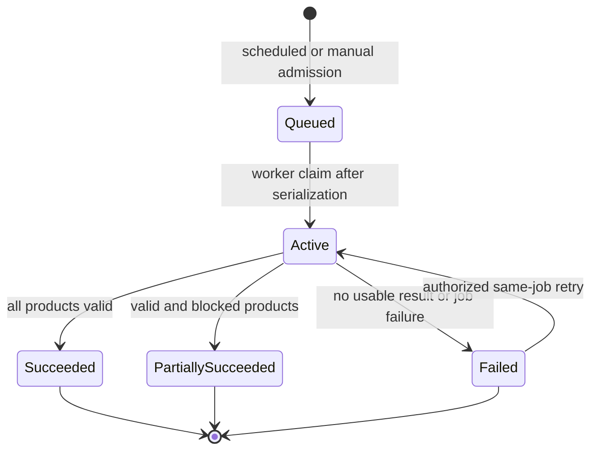
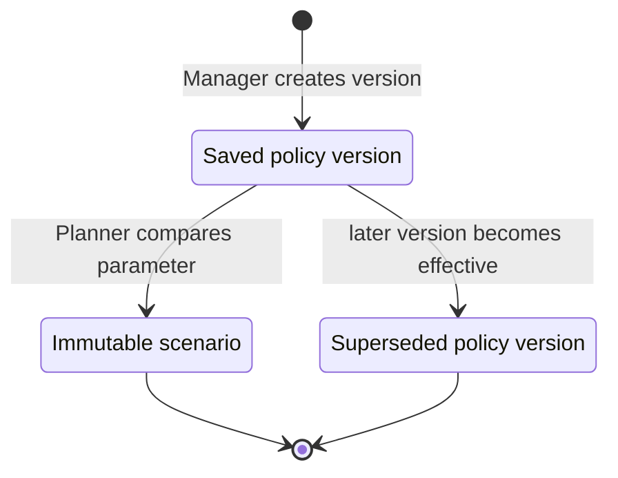
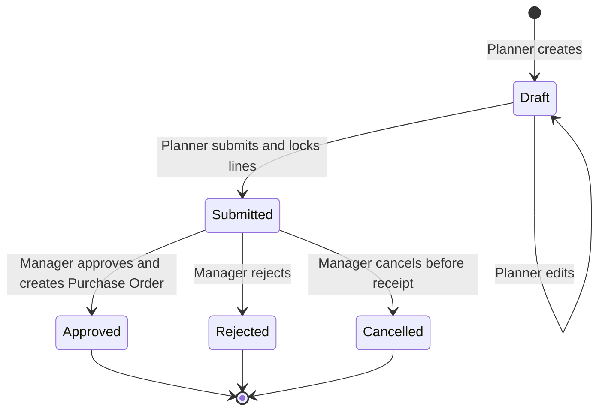
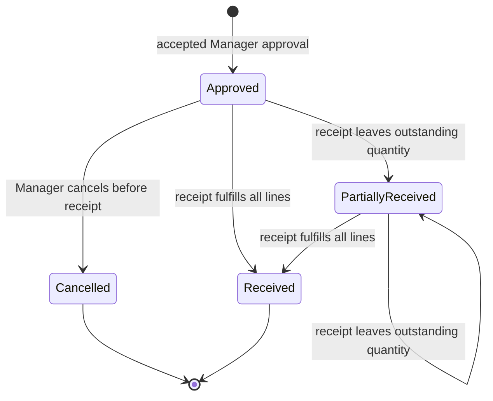
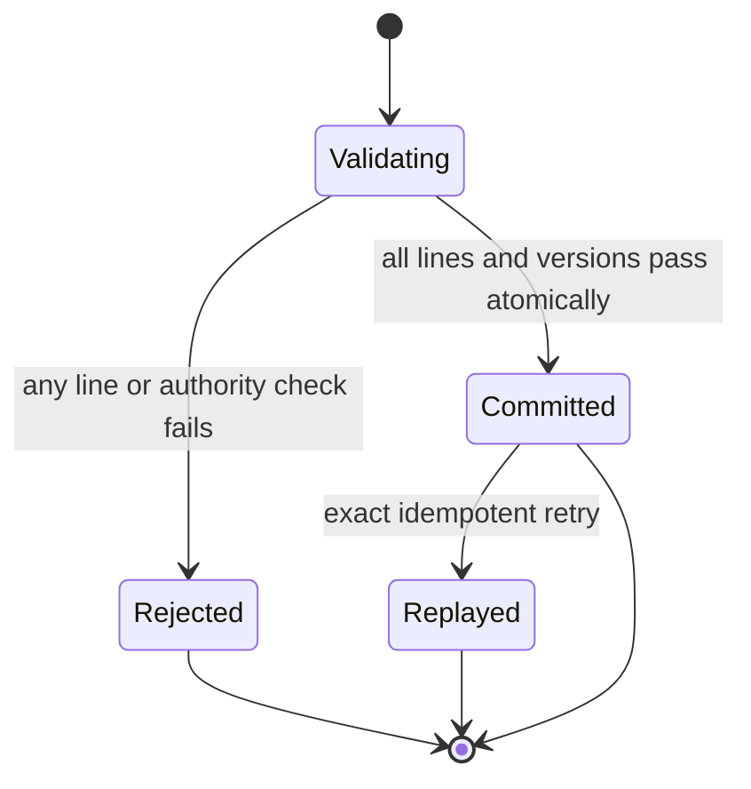
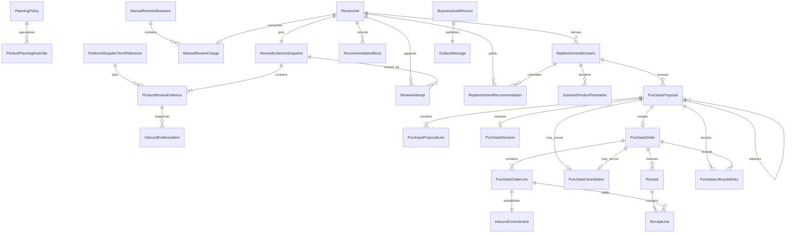

# Planning and Purchasing Functional Specification

Status: Draft for independent review
Unit: `planning-purchasing`
Stage: Functional Design

## Purpose and boundary

Planning/Purchasing turns versioned inventory, forecast, supplier-term, and policy evidence into deterministic replenishment recommendations and then into human-governed purchase orders and simulated receipts. Replenishment owns review admission, allowance, scheduling, evidence snapshots, calculations, scenarios, recommendations, and blocked-product outcomes. Purchasing owns drafts, locked commercial lines, human decisions, dated inbound commitments, and receipts.

Retail Data remains authoritative for retailer/store/product identity, on-hand quantities, stock versions, and stock movements. Supplier Knowledge remains authoritative for accepted supplier-term revisions. Forecasting remains authoritative for forecast series, product coverage, and freshness. Identity Access and Tenant Directory remain authoritative for current memberships, roles, and placement generations. Audit Evidence receives derived searchable projections and never authorizes a business mutation.

No client, assistant, cache, message, or read model supplies authority-bearing retailer placement, supplier routing, forecast selection, recommendation values, order state, allowance, or received quantity. Every command resolves and rechecks those values through server-owned authority.

## Deterministic replenishment calculation

For one retailer, store, product, selected accepted supplier-term revision, and pinned review evidence:

- `coverageDays = leadTimeDays + bufferDays`.
- The protection window contains exactly `coverageDays` consecutive retailer-local forecast dates beginning on the review date. A zero-day lead time and zero-day buffer therefore produce zero coverage days and zero forecast demand.
- `protectedDemand` is the sum of finite nonnegative forecast demand over every date in that window.
- `eligibleInbound` is the sum of outstanding quantities on Approved or PartiallyReceived order lines for the same retailer, store, and product whose immutable expected arrival date falls in the window.
- Draft, Submitted, Rejected, Cancelled, and fully Received order quantities never count as inbound.
- `rawNeed = protectedDemand - onHand - eligibleInbound`.
- If `rawNeed <= 0`, `suggestedQuantity = 0`; a minimum order quantity never forces an unnecessary order.
- If `rawNeed > 0`, first raise it to at least the pinned minimum order quantity, then round upward to the next whole multiple of the pinned pack size.
- Monetary values retain the retailer currency and pinned supplier price. No foreign-exchange conversion or price optimization occurs.

The calculation is valid only when the entire protection window has compatible forecast coverage and every pinned input belongs to the same authorized retailer, store, product, currency, placement generation, and effective period. Missing days, a protection window longer than the available horizon, non-finite demand, nonpositive pack size, negative minimum, stale evidence, or an unavailable preferred term blocks that product. No rule truncates, repeats, extrapolates, or fabricates demand.

### Hand-check fixtures

| Case | Demand | On hand | Eligible inbound | MOQ | Pack | Expected |
| --- | ---: | ---: | ---: | ---: | ---: | ---: |
| Zero need does not trigger MOQ | 0 | 0 | 0 | 10 | 6 | 0 |
| MOQ then pack rounding | 1 | 0 | 0 | 10 | 6 | 12 |
| In-window inbound offsets need | 20 | 5 | 6 | 10 | 4 | 12 |
| Late inbound is excluded | 20 | 5 | 0 | 10 | 4 | 16 |
| Existing stock covers demand | 10 | 12 | 0 | 10 | 6 | 0 |

The third fixture has raw need 9, raised to MOQ 10, then rounded to pack 12. The fourth treats an otherwise identical inbound quantity as zero because its arrival date is outside the protection window; raw need 15 rounds to 16.

## Workflows

### WF1. Change saved planning policy

1. A current Manager requests a new retailer default or product override from 0 through 28 calendar days with the expected policy version.
2. The service resolves current membership, Manager role, retailer ownership, product ownership when applicable, and placement generation.
3. It rejects an out-of-range value, stale expected version, overlapping effective policy, foreign product, or unauthorized actor without changing the current policy.
4. It appends a new immutable policy version. An explicit product value, including zero, overrides the retailer default; absence inherits the current default.
5. Policy state, audit evidence, and an outbox event commit atomically. Exact command replay returns the original result; a changed payload under the same key conflicts.

### WF2. Select a preferred supplier term

1. A current Manager selects one currently accepted supplier-term revision for an authorized retailer product with the expected preference version.
2. The service verifies retailer/product ownership, currency, term acceptance status, effective period, and current placement.
3. It appends a new preferred-term selection version and retires the prior selection prospectively; it never mutates prior review evidence.
4. A missing current selection blocks automatic recommendation for that product. A Planner may still compare another currently accepted term in an explicit scenario.
5. Selection, audit, and outbox state commit atomically and use payload-bound idempotency.

### WF3. Admit one scheduled daily review

1. For each retailer-local date, one logical scheduled request becomes due at 08:00 using the retailer's versioned time-zone rules.
2. If 08:00 is invalid because of a clock change, the first valid later instant is used; if ambiguous, the earlier occurrence is used. Retailer plus local date is the logical schedule key.
3. The scheduler resolves current placement and determines whether another review is active.
4. If none is active, it admits the scheduled Review Job. If one is active, it records the scheduled request as retained due work; it never drops or duplicates it.
5. Scheduled admission consumes no manual allowance. Restart or redelivery returns the same logical request and job.
6. When the active job reaches a terminal outcome, retained scheduled work is admitted exactly once with its original local date and trigger.

### WF4. Admit a manual review

1. A current Planner explicitly requests a review through the UI or the assistant's typed tool with a payload-bound idempotency key.
2. Authority is checked before existing job details are disclosed.
3. Exact replay of an already accepted request returns the same job and original allowance result. A changed payload under the same key conflicts.
4. If another review is active, the caller receives that authorized status and no new allowance is consumed.
5. The service checks the retailer-local date allowance. The fourth distinct accepted request is denied with remaining allowance zero and the next local reset time.
6. It resolves a current inventory snapshot, a current usable forecast, preferred accepted terms, policy, calendar, and placement. A dependency failure before admission consumes no slot.
7. Acceptance atomically increments the shared count, creates the Review Job and immutable input snapshot, and appends audit/outbox records.
8. A later execution failure retains the original slot. Same-job retry, including after local midnight, appends an attempt without charging another day.

### WF5. Execute a review and calculate recommendations

1. A worker claims the admitted job under narrow retailer/job authority and records an execution attempt.
2. It reads only the immutable versions pinned at admission and verifies their digests, compatibility, retailer ownership, placement generation, and product coverage.
3. For each active in-scope product, it resolves the effective saved buffer and preferred accepted supplier term, then applies the deterministic calculation.
4. A product with complete compatible evidence records one immutable recommendation, including demand, on-hand, eligible inbound, raw need, MOQ/pack transformations, expected arrival basis, source versions, and rationale.
5. A product with incomplete or incompatible evidence records a blocked outcome with a safe reason and required-versus-available coverage; it never receives a fabricated zero recommendation.
6. The job becomes Succeeded when all products are valid, PartiallySucceeded when valid and blocked products coexist, and Failed when no product is usable or a review-level dependency fails.
7. The attempt, product outcomes, immutable review result, latest-attempt reference, optional last-success reference, audit, and outbox records commit together. Redelivery cannot append duplicate business outcomes.

### WF6. Compare deterministic scenarios

1. A current Planner selects a completed authorized review and declares one or more changed buffer values or alternate currently accepted supplier terms.
2. The service copies no mutable current inputs; each scenario references the original review snapshot and changes only declared parameters.
3. It validates buffer range, supplier-term compatibility, complete forecast coverage, and product scope.
4. It applies the same calculation and stores an immutable scenario result with changed settings and quantity deltas from the baseline.
5. A scenario that needs more than the available forecast horizon blocks the affected product and reports coverage. The Planner may compare a smaller valid buffer.
6. A new review is required to use newer inventory, forecast, term, policy, calendar, or placement versions.

### WF7. Create and edit a purchase draft

1. A current Planner chooses valid recommendations from one authorized review/scenario for one retailer, store, supplier, and currency. The assistant may call the same typed creation operation only under that Planner's current authority.
2. The service creates an editable Draft and pins the source review/scenario, recommendation IDs, inventory and forecast versions, accepted-term revisions, planning-policy/calculation versions, and placement generation.
3. Every line stores suggested quantity and Planner-entered quantity separately. A changed nonzero recommendation requires a reason.
4. A Planner may edit or remove lines only while the aggregate is Draft and must supply the expected aggregate version.
5. Exact replay returns the original creation/edit result. A stale expected version or changed idempotency payload commits nothing.
6. The agent cannot submit, approve, reject, cancel, or receive. Its successful response labels the resource Draft and links the exact authorized identifier.

### WF8. Submit a draft

1. A current Planner submits a Draft using the expected aggregate version and idempotency key.
2. The service validates that every line belongs to the draft's retailer/store/supplier/currency, has a positive quantity, is a whole pack, meets the pinned minimum, and retains required source evidence and deviation reason.
3. It rejects empty drafts, blocked recommendation lines, stale aggregate versions, invalid commercial data, or any non-Draft source.
4. It transitions Draft to Submitted and locks all commercial fields. State, audit, and outbox records commit atomically.
5. Exact accepted replay returns the original Submitted result without another transition or event.

### WF9. Approve a submitted order

1. A current Manager opens a Submitted order and receives locked lines, suggested/entered quantities, deviation reasons, prices, terms, forecast/inventory/policy versions, and current aggregate version.
2. On approval, the service rechecks Manager authority, tenant/resource ownership, placement generation, expected aggregate version, source review integrity, inventory and forecast versions, term acceptance/effectivity/price/pack/MOQ, and policy/calculation compatibility.
3. If any evidence changed, approval fails atomically with the stale category, current order state, and links to current evidence. The service never refreshes and approves changed lines silently.
4. For valid lines, expected arrival is the approval local date plus the pinned calendar-day lead time. Zero lead time yields the approval local date.
5. The Purchase Proposal becomes Approved and an Approved Purchase Order is created with immutable order-line commitments. Proposal state, order state, dated inbound evidence, Manager decision, audit, and outbox records commit atomically.
6. Exact accepted replay returns the original result. Concurrent or unauthorized decisions cannot produce a second outcome.

### WF10. Reject a submitted order

1. A current Manager rejects a Submitted order under current aggregate version and authority.
2. The Purchase Proposal becomes terminal Rejected; no Purchase Order is created and it contributes no inbound quantity.
3. Correction requires a new linked Draft with fresh evidence, submission, and approval. The source remains unchanged.
4. Rejection state, decision evidence, audit, and outbox records commit atomically; exact replay returns the original result.

### WF11. Cancel before receipt

1. A current Manager requests cancellation of a Submitted Purchase Proposal or an Approved Purchase Order using its current aggregate version and a payload-bound idempotency key.
2. The service verifies that no receipt line has committed and serializes the decision against receipt posting.
3. Draft and terminal Purchase Proposals, PartiallyReceived or terminal Purchase Orders, and any Purchase Order with a committed receipt reject cancellation.
4. A successful cancellation moves the Submitted Purchase Proposal or Approved Purchase Order to terminal Cancelled and removes any approved outstanding quantity from future inventory-position reads.
5. Cancellation state, decision evidence, audit, and outbox records commit atomically. In a cancel/receipt race, only one transaction can satisfy its preconditions.

### WF12. Record a partial or complete receipt

1. A current Planner or Manager submits one receipt against an Approved or PartiallyReceived order with expected order version, expected stock version, positive line quantities, and a payload-bound idempotency key.
2. The coordinator verifies membership/role, retailer/store/order/product ownership, placement generation, order state, line membership, and all cumulative quantities before applying any line.
3. For every line, `newCumulativeReceived` must be less than or equal to `approvedQuantity`. Every line must be positive. One invalid line rejects the whole receipt.
4. It serializes against other receipts and cancellation, then records the immutable Receipt and Receipt Lines, updates cumulative order-line balances, creates corresponding Inventory stock movements, and updates on-hand positions.
5. If any order line remains outstanding, the order is PartiallyReceived. Only when every line is fulfilled does it become terminal Received.
6. Purchasing state, Inventory movements/positions, both domains' audit evidence, and both domains' outbox records commit in one transaction through owned module ports.
7. Exact retry returns the original receipt and movement identities. A changed payload under the same key, stale stock/order version, over-receipt, unapproved/terminal order, or losing race commits nothing.

### WF13. Reconcile an uncertain command outcome

1. A caller that loses a response queries or retries with the original retailer, resource, idempotency key, and byte-equivalent payload.
2. Current authority is rechecked before the original result is disclosed.
3. If the accepted operation exists, the service returns its committed aggregate version and resource identities without repeating effects.
4. If the key exists with a different payload digest, it returns a conflict. If the operation is still processing, it returns its durable status rather than claiming failure.
5. The caller refreshes current order/stock state after a concurrent conflict before another distinct command.

### WF14. Read review, scenario, and purchasing status

1. A current authorized Planner or Manager requests status within one retailer.
2. Review status distinguishes active/queued work, latest attempt, last success, never run, unavailable, partial, failed, and succeeded outcomes. It includes input versions, blocked products, remaining manual allowance, and retailer-local reset time.
3. An older successful review is never relabeled current because a later attempt failed. UI and assistant tools resolve the same job and outcome identities.
4. Purchasing reads expose actual state, locked lines, current aggregate version, decision history, approved/received/outstanding balances, expected arrival, linked replacements, and resulting stock movement identifiers.
5. Foreign identifiers return no resource details. Redis or another disposable cache may accelerate an already-authorized versioned read but cannot authorize or classify it.

### WF15. Restore and reconcile Planning/Purchasing

1. Restore authoritative policy, preference, allowance, review, scenario, recommendation, order, receipt, audit, inbox/outbox, and idempotency state before exposing reads or accepting commands.
2. Reconcile retailer ownership and placement generation, effective policies/preferences, review logical keys, allowance counts, pinned evidence digests, latest-attempt/last-success references, order transitions, approved/received/outstanding totals, expected arrivals, stock movement links, and message checkpoints.
3. A corrupt or incomplete aggregate, impossible transition, over-received line, mismatched stock movement, expired authority, or unresolved message effect keeps the affected resource unavailable for mutation and produces an operator-visible reconciliation finding.
4. Recovery never fabricates recommendations, repeats a receipt, resets consumed allowance, silently changes an order decision, or restores expired audit data into live access.
5. Normal authorized retry, replay, replacement-draft, or new-review workflows repair resolvable business state; controlled operator procedures handle data-level recovery.

## State models

### Review Job

Retained scheduled work remains the same Queued job until the active review ends. The logical job and its consumed manual allowance remain stable across attempts. A retry appends an attempt; it never rewrites the failed attempt or charges another slot.

### Planning policy and scenario

Scenarios never become saved policies implicitly and never mutate their source review.

### Purchase Proposal

Replacement creates a new linked Draft and does not transition the source proposal or order.

### Purchase Order

Every unlisted Proposal and Order transition is forbidden.

### Receipt

`Rejected` is an operation outcome, not a persisted partial Receipt. A committed Receipt is immutable.

## Entity relationships

The entity YAML in `entities.md` is authoritative. This diagram is a readable projection of its main aggregate relationships.

## Rules summary

The fenced YAML in `rules.md` is authoritative. Its final BR identifiers are summarized here after rule generation; workflow steps above remain authoritative for ordering and state transitions.

| Rule area | Required behavior |
| --- | --- |
| Authority and tenancy | Current role, retailer ownership, placement, and machine scope are checked on every operation. |
| Planning policy | Seven-day seeded default; Manager-controlled 0-28 saved values; explicit zero override; temporary Planner scenarios. |
| Review admission | One active review; one daily 08:00 scheduled job; three accepted manual jobs per local day; stable replay and charging. |
| Calculation | Complete protection window, qualifying inbound only, zero clamp, MOQ then pack rounding, no forecast fabrication. |
| Review outcomes | Immutable Succeeded, PartiallySucceeded, and Failed outcomes with explicit blocked products. |
| Drafts and decisions | Bounded Drafts, pinned evidence, locked submission, Manager approval/rejection/cancellation, no agent authority. |
| Receipts | Positive all-or-nothing lines, cumulative limits, serialized races, linked stock movements, effect-free exact replay. |
| Evidence and recovery | Atomic audit/outbox, durable idempotency, authoritative restore and reconciliation before exposure. |

## Contract refinements

The contract package must preserve the approved OpenAPI/AsyncAPI versions while adding the following implementable schemas and examples:

- **C08 Inventory/receipt port:** inventory snapshots identify retailer, store, product, placement generation, stock watermark, on-hand quantity, observation time, and content digest. Receipt posting carries expected order and stock versions, line/product/store identities, positive quantities, and a payload digest. Its response returns receipt and stock-movement identities plus resulting order-line balances, order version/state, and stock version. The v1 in-process port and future REST extraction seam use equivalent semantics.
- **C09 Supplier terms:** return all current accepted terms and immutable revisions needed for explicit scenarios. Planning owns the preferred-term selection; Supplier Knowledge does not choose it. Each term exposes supplier, product, currency, price, pack, MOQ, calendar lead time, effective range, source revision, and citations.
- **C10 Forecast evidence:** latest-usable reads expose exact product coverage, forecast local dates, freshness/compatibility, current revision, and source/model/configuration versions. By-ID status reads cannot bypass Forecasting's publication rules. Planning states its required product/date coverage and blocks uncovered products.
- **Planning REST API:** define policy and preferred-term commands; scheduled/manual review admission; same-job retry; status/allowance; review/result/product coverage reads; scenario compare/read; Draft create/edit/submit; Manager approve/reject/cancel; receipt record/status; idempotency, expected-version, pagination, and safe problem details.
- **C14 Assistant tools:** manual-review and draft tools call the same domain operations as the UI. Responses include actual job/Draft identity, status, allowance, source evidence, and safe failure reason. The tool surface contains no submit, approve, reject, cancel, or receipt operation.
- **C15 audit events:** define `replenishment.audit.recorded` and `purchasing.audit.recorded` profiles with actor type, retailer, placement generation, resource/version, action, outcome, provenance, correlation, causation, and idempotency. Accepted mutations publish from the transaction; denied attempts use a separate durable path without implying a business mutation.
- **C17/C18 BFF contracts:** expose the role-appropriate reads and commands above, preserve provider error codes safely, and distinguish partial downstream composition from a successful zero-shortage review.

Every mutation uses `application/problem+json` errors with stable codes and correlation identity. `403` denotes current authority failure, tenant-hidden resources use `404`, stale versions/state/idempotency mismatches use `409`, domain validation uses `422`, manual allowance exhaustion uses `429`, and required dependency or usable-forecast absence uses `503` where no durable job has been accepted. An accepted job that later fails is read as its durable failed outcome rather than converted into an admission error.

## Concurrency and transaction boundaries

- Review admission serializes the one-active-job invariant and manual allowance increment per retailer. A unique logical key prevents duplicate scheduled work for a local date.
- Policy, preference, scenario, Draft, and purchase commands use expected aggregate versions plus payload-bound idempotency.
- Approval serializes Manager decisions and revalidates external evidence before the commit boundary.
- Cancellation and receipt posting serialize on the same purchase aggregate. Receipt validation checks every line before any Purchasing or Inventory effect.
- The v1 co-located receipt workflow uses public module ports and one local relational transaction so Purchasing Receipt state and Inventory movements cannot diverge. Logical ownership remains separate and direct cross-module table access remains forbidden.
- Outbox publication occurs after the authoritative transaction. Consumers commit inbox and local effect before acknowledgement; retries are bounded and dead-letter replay is audited.
- Disposable caches are populated only after current authority and version resolution. They may fail cold without changing decisions and are invalidated after authoritative commits.

## Assumptions & Open Questions

- Exact command deadlines, worker lease durations, retry/backoff counts, queue limits, page sizes, retention periods, and recovery objectives belong to the NFR and implementation stages; every value must be bounded before release.
- The initial accepted synthetic supplier terms provide valid positive pack sizes, nonnegative minimum quantities, one retailer currency, and calendar-day lead times. Supplier ingestion later supplies equivalent normalized terms.
- A Draft created from a scenario contains only products with valid recommendation evidence. A zero quantity removes a line while the aggregate remains Draft; submitted orders contain positive lines only.
- The direct story text in AC6.3.5 says “Manager-only receipt authority,” while the owner-confirmed FR8 transition matrix authorizes both current Planners and Managers to record receipts. This design follows the confirmed FR8 matrix and treats the AC phrase as referring to Manager-only approval authority; traceability retains the AC and tests both permitted receiver roles.
- StockSense does not model returns, post-receipt cancellation, Draft cancellation, autonomous ordering, real supplier dispatch, price optimization, multiple currencies per retailer, or foreign-exchange conversion in v1.

## Sources

- `construction/planning-purchasing/functional-design/functional-design-questions.md` — confirmed calculation, supplier preference, policy, scheduling, partial result, immutability, Draft, inbound, and coverage decisions.
- `inception/units-generation/unit-of-work.md` and `unit-of-work-story-map.md` — U8 boundary and assigned stories.
- `inception/requirements-analysis/requirements.md` — FR2, FR4, FR6-FR9.5, FR11, FR14, FR17-FR20 and applicable NFRs.
- `inception/user-stories/stories.md` — assigned acceptance criteria for replenishment, purchasing, assistant tools, platform reliability, audit/recovery, and reviewer journey.
- `inception/domain-design/components.md` — Replenishment/Purchasing ownership and upstream/downstream interactions.
- `inception/contract-design/contract-summary.md` — C08-C10, C14-C15, C17-C18, error profiles, and contract refinements.

## Review

**Verdict:** NOT-READY
**Reviewer:** aidlc-architecture-reviewer-agent
**Date:** 2026-09-14T17:58:21Z
**Iteration:** 1

### Findings

| ID | Severity | Location | Finding | Required action | Status |
|---|---|---|---|---|---|
| R-01 | Critical | aidlc/spaces/default/intents/260908-stock-sense-design/construction/planning-purchasing/functional-design/rules.md > BR5.3, BR5.5, BR5.6, and BR5.10 | The rules apply submit-time approval, rejection, Submitted-state cancellation, and decision concurrency to `PurchaseOrder`, but the entity source of truth gives `PurchaseOrder` only `Approved`, `PartiallyReceived`, `Received`, and `Cancelled` states and creates it only after approval. The passed C18 contract compounds this by routing `submit`, `approve`, and `reject` through `/purchase-orders/{orderId}/{command}`, although no order ID exists before approval. These commands cannot target a defined aggregate or concurrency version. | Define distinct proposal and order command resources and identifiers, then align BR5.3/BR5.5/BR5.6/BR5.10, the state models, and C18 so Draft/Submitted decisions use the proposal version and post-approval receipt/cancellation uses the order version. | New |
| R-02 | Major | aidlc/spaces/default/intents/260908-stock-sense-design/construction/planning-purchasing/functional-design/entities.md > `PurchaseProposal.source_scenario_id` and `PurchaseProposal -> ReplenishmentScenario` relationship | WF7 permits a Draft to originate from either a baseline review or a scenario, but `source_scenario_id` and the scenario relationship are required. The authoritative entity model therefore cannot represent a Draft created directly from a baseline recommendation without inventing a scenario. | Model the source as an explicit review-baseline-or-scenario choice, make the scenario reference conditional, and add constraints that bind every line to the selected source kind. | New |
| R-03 | Major | aidlc/spaces/default/intents/260908-stock-sense-design/construction/planning-purchasing/functional-design/functional-spec.md > Deterministic replenishment calculation and Concurrency and transaction boundaries | Replenishment must read Purchasing-owned outstanding order-line commitments to calculate `eligibleInbound`, while the passed component contract declares only the opposite dependency (`Purchasing` depends on `Replenishment`) and asserts an acyclic graph. No governed reverse port, event-fed projection, or orchestration boundary is defined, leaving either an undeclared circular dependency or direct cross-domain data access. | Define the owner-governed inbound-evidence interface and its consistency/version semantics, assign its dependency direction, and update the component contract so the resulting module graph is implementable and acyclic. | New |
| R-04 | Minor | aidlc/spaces/default/intents/260908-stock-sense-design/construction/planning-purchasing/functional-design/entities.md > `minimum_order_quantity` attributes | The entity source requires MOQ to be strictly positive (`PositiveQuantity`, `exclusive_0`), while the functional specification admits nonnegative supplier minimums and blocks only negative minimums. Implementations would disagree on whether an accepted zero-MOQ term is valid. | Decide whether zero MOQ is valid and use the same constraint and validation behavior in the entity model, calculation, rules, and contract examples. | New |

### Validation Tool Results

| Tool | Result | Interpretation |
|---|---|---|
| `sensor-required-sections` | PASS for `entities.md`, `rules.md`, `functional-spec.md`, and `traceability.json` | Required document structure is present. |
| `sensor-upstream-coverage` | PASS; no unreferenced consumed artifact | All five passed upstream artifact classes are cited across the declared deliverables. |
| `sensor-traceability` | PASS; no gaps, orphans, missing IDs, or invalid BR targets | The assigned acceptance-criterion table is mechanically complete. |
| `sensor-linter` | UNAVAILABLE for all four artifacts: `eslint-unavailable` (exit 1) | No linter verdict was produced; this does not address the semantic inconsistencies above. |
| `sensor-type-check` | NOT RUN for all four artifacts: `no-tsconfig-found` (exit 1) | No TypeScript type-check evidence was available for these technology-agnostic artifacts. |

### Summary

The proposal/order lifecycle is not callable as specified, and the design also leaves a baseline-Draft modeling gap and an undeclared reverse dependency between Replenishment and Purchasing. These are material implementation blockers despite complete mechanical traceability.
