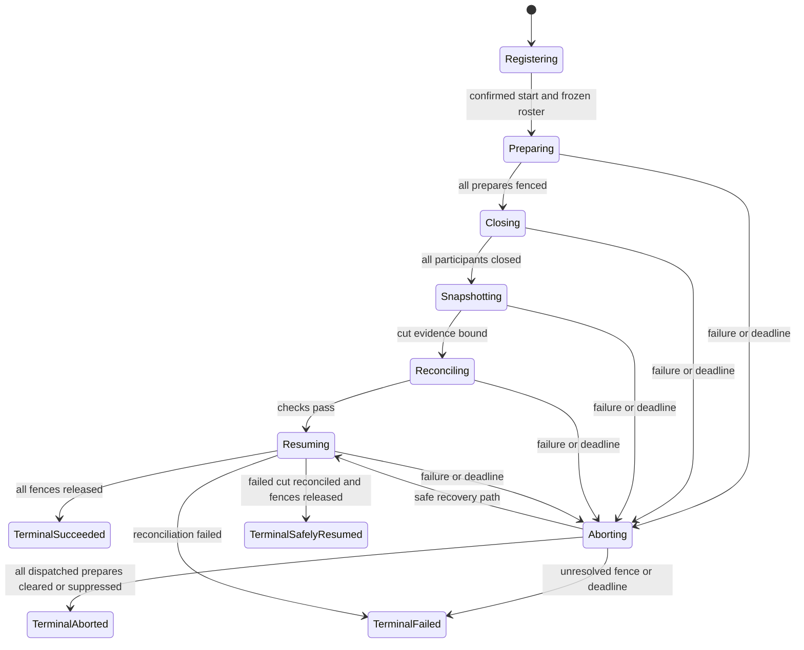
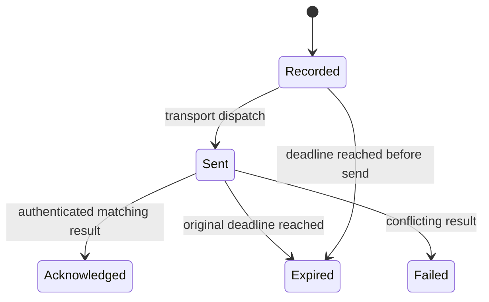
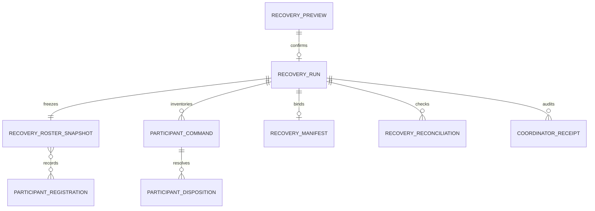

# Recovery Coordination Functional Specification

Unit: U15 Recovery Coordination (`recovery-coordination`)

Status: Draft for independent review

Decision basis: confirmed U15 Functional Design summary and approved C24-C27 / recovery-policy-v1.

U15 coordinates a verifiable tenant-scoped recovery cut. It owns admission, roster, command inventory, deadlines, phase transitions, manifest binding, reconciliation and terminal outcomes. U3/U4 and other participants own their own data, fences, backup/restore mechanics and checkpoints; U14 supplies reusable message mechanics; U10 projects audit; U13 validates the integrated drill.

## Actors and authority

| Actor | Allowed action | Boundary |
| --- | --- | --- |
| Human Operator via U11 BFF | Preview, explicitly confirm start, inspect status/manifest, request reconciliation | U15 validates U3 delegated human token and U4 current retailer membership/placement on every call; browser never supplies authority-bearing identity |
| Registered participant workload | Register capabilities; receive C24/C25 commands; return checkpoint/fence disposition | Workload identity, route, class and transport must match recovery-policy-v1; participant owns its own fence |
| U15 coordinator worker | Advance run, dispatch inventory-backed commands, validate acknowledgements, publish audit | Cannot directly read/write another unit's business store or mark its fence cleared by inference |
| U13 validation runner | Exercise clean-room backup/restore scenarios and measured objectives | Cannot turn test evidence into a successful run without U15 reconciliation |

## Authoritative boundaries

| State | Owner | Derived/read use |
| --- | --- | --- |
| Recovery run, roster snapshot, confirmation consumption, command inventory, reconciliation and audit/outbox | U15 PostgreSQL routines | C26 Operator status and C27 audit events |
| Identity and retailer placement | U3 token issuer; U4 current membership/placement | U15 checks both on every protected request |
| Participant fence and checkpoint | Each registered C24/C25 participant | U15 accepts authenticated generation-bound dispositions |
| PostgreSQL/queue cut and protected backup | Owning participants and platform | U15 binds their digests and opaque references into its manifest |
| RabbitMQ transport and conformance | U14 C23 package against U1 C01/C22/C25 | U15 owns coordinator inbox/outbox and business decisions |

## Workflow WF1 — Register a participant

**Actor:** Policy-named workload with machine credentials.

1. Authenticate workload identity and request scope; resolve the expected participant name from the fixed recovery-policy-v1 roster.
2. Compare protocol and policy version, participant class, four lifecycle capabilities, transport, command/acknowledgement routes, workload identity and lifecycle state with C26 registration rules.
3. Commit a new registration generation or return the exact idempotent prior registration. Changed payload under one key conflicts.
4. Reject missing, stale, incompatible or unavailable registrations at preview/start and revalidate every participant again immediately before its durable `prepare` dispatch. A registration update never changes a roster already frozen for a run.

## Workflow WF2 — Preview and confirm a recovery action

**Actor:** Human Operator through U11.

1. Validate U3 issuer, signature, lifetime, `aud=stocksense-recovery`, `client_id=stocksense-web-bff`, stable human `sub` and appropriate scope. Ask U4 for current retailer Operator membership and placement for the path retailer.
2. Build a non-destructive preview for the C26 operation `snapshot`, `restore`, `rollback` or `tenant-migration`, showing retailer, scope, fixed policy/deadlines, full compatible roster, manifest summary and recovery generations. For a restore, rollback or migration, bind the supplied source-manifest digest to the preview. Reserve the future `runId` now. Freeze all 11 C26 registration value objects, including generations, identities, capabilities, routes, required-for-success flags and per-command class deadlines, with coordinator deadlines, this reserved run ID and one `snapshottedAt` value. Sort by participant and compute the RFC 8785 canonical JSON digest with `rosterDigest` omitted. Persist the complete immutable preview roster document and reserved run ID in U15 PostgreSQL, not only the digest.
3. Mint a short-lived single-use confirmation bound to the preview ID, exact human subject, BFF client, retailer, operation, reserved run ID, roster and manifest digests, placement and recovery generations. Persist this binding and the full frozen preview document together; preview still creates no participant fence or destructive effect.
4. At start, revalidate token, U4 authority and current registration compatibility; compare all bindings, expiry, unconsumed status and the stored preview document/digest. If a registration changed, invalidate start and require a new preview rather than changing frozen values. Consume confirmation and admit one run with `runId=reservedRunId`, copying the exact previously persisted C26 roster bytes, idempotency result, audit and outbox in the authoritative U15 transaction. Do not choose a new run ID or timestamp. Subsequent commands and C26 status use the frozen roster values, never live registration fields. No prepare is sent before this commit.

**Failures:** A machine token, different human, stale role/placement, changed scope/digest, expired token or reused confirmation fails before any barrier effect. Preview/status remain read-only.

## Workflow WF3 — Prepare and close the participant barrier

**Actor:** U15 coordinator and registered participants.

1. Immediately before recording each durable `prepare` dispatch, validate the current authenticated, ready participant registration against recovery-policy-v1 and every corresponding frozen roster value in the same U15 transaction that commits the command/outbox. Compare registration ID and generation, class, transport, protocol/policy, capabilities, workload identity and exact routes. If a value changed or is unavailable, record the named C26 compatibility failure, send no new prepare, and enter WF5 to abort every earlier possibly delivered prepare; unresolved fences stay visible. If valid, commit the `prepare` command and write-ahead possibly-delivered inventory before sending it, using the frozen values. Class A uses C24 synchronous HTTP; B/C use C25 RabbitMQ through U14. Each command binds retailer, run, placement, recovery generation, registration, roster digest, original deadline, stable command ID and payload digest. A change after the transaction cannot rewrite the frozen command; the participant validates the bound generation.
2. Dispatch under the earlier of participant-class and global prepare deadline. Retry only the same command ID/payload and original deadline. Validate authenticated C24 response or C25 acknowledgement against the command and current run authority.
3. Once all prepare dispositions prove active fences, send `close` using the same inventory and class/global deadline rules. Each participant proves its own producer/consumer/relay/acknowledgement/topology quiescence and checkpoint; U15 does not assume a successful send means a closed fence.
4. Persist each validated disposition and inbox receipt with coordinator phase, audit and outbox before acknowledging broker delivery. Exact replay returns the prior result; changed payload, stale generation or mismatched roster is quarantined and cannot satisfy the barrier.
5. A missing, failed or late participant blocks close and enters WF5. The run never starts a snapshot from an incomplete barrier.

## Workflow WF4 — Capture and reconcile one consistent cut

**Actor:** U15 coordinator with owning backup participants.

1. After every roster participant is closed, collect their signed/authorized checkpoint references plus PostgreSQL LSN and transaction evidence, per-queue identity/count/digest, barrier generation, fencing epoch and roster digest.
2. Verify the closed-cut evidence refers to the same generation and exact frozen roster. Append exact PostgreSQL LSN, transaction/database-snapshot protected references and digests; broker cluster/topology/checkpoint identity and digest; each queue identity/count/message digest; all participant checkpoints and protected snapshot state/reference/digest to U15's internal versioned `RecoveryEvidenceJournal`. This is provisional coordinator evidence, not a C26 `RecoveryManifest`, and cannot be returned as verified. For `snapshot`, record the protected backup reference; for `restore`, `rollback` or `tenant-migration`, verify the separately finalized source manifest and journal the new run's cut without pretending it created a new source snapshot. Missing or inconsistent evidence fails closed.
3. On restore, obtain participant-owned restore and projection-rebuild results; compare source versions, deletions, expiry, identity/keys, stock ledger, audit, model/artifact digests, queue state, inbox/outbox and remaining fences to the source manifest and journaled cut evidence. U15 never substitutes a projection for an authoritative record. Journal every reconciliation result and participant disposition.
4. Issue bounded `resume` commands after reconciliation and journal their validated dispositions. Compute the proposed terminal outcome only when every participant, cut, restore/reconciliation and fence predicate is known. A closed snapshot alone is not success.
5. If the checkpoint set is complete, one owned PostgreSQL routine closes it and atomically persists the immutable full versioned C26 `RecoveryManifest`, its canonical SHA-256 digest, terminal run status and C27 audit/outbox. The document includes the frozen roster, exact journaled PostgreSQL/RabbitMQ/queue/checkpoint/snapshot evidence, terminal fencing inventory, reconciliation, final outcome and verification. Verify every nested digest and compute `manifestDigest` from RFC 8785 canonical JSON with that field omitted. Only this commit makes a final manifest available; an incomplete failed cut retains typed run/fence evidence without fabricating one. Report measured RPO/RTO from completed evidence.

## Workflow WF5 — Abort, timeout and restart safely

**Actor:** U15 coordinator.

1. At any failed prepare, close, drain, evidence, snapshot or resume checkpoint, enumerate every possibly delivered prepare from the durable write-ahead inventory, regardless of whether its acknowledgement arrived.
2. Persist and dispatch `abort` to all those participants. Each participant must persist a terminal abort guard for its retailer/run/generation so delayed prepare or close cannot reacquire the fence.
3. Accept Aborted only after every inventory member acknowledges cleared or terminally suppressed fencing. Timeouts and unresolved dispositions remain visibly fenced and cannot be reported as Aborted or Succeeded. If a complete closed-cut checkpoint set exists, finalize any failed/aborted manifest with the actual terminal outcome in the same transaction as terminal status; otherwise retain the internal evidence journal and status without claiming a finalized manifest.
4. On U15 process restart, reload the run, roster, command inventory, receipts and original deadlines. Reissue only stable command identities within policy limits; never reset the clock or publish success from an abandoned generation.
5. A currently authorized human Operator may request C26 reconciliation. U15 rechecks actual participant/manifest evidence, records each attempt and issues only the commands needed for that same run/generation. It cannot clear a participant fence itself.

## Workflow WF6 — Inspect run, manifest and audit evidence

**Actor:** Human Operator through U11; U10 audit consumer.

1. Revalidate delegated human token and current U4 Operator membership and placement on every C26 poll, manifest read or reconciliation request.
2. Return phase, checkpoint, scope, the frozen C26 roster and class/global deadlines, participant dispositions, possibly-delivered inventory, fence status, available manifest/reconciliation evidence and terminal result with safe next action. Until final checkpoint closure, status exposes bounded provisional progress but C26 manifest GET returns `RECOVERY_MANIFEST_NOT_CLOSED`. After finalization, an authorized GET reads the complete immutable stored document, verifies its canonical manifest and nested evidence digests, and returns that same document; it never reconstructs it from live registrations or the provisional journal.
3. Publish C27 event from the same authoritative transition outbox; U10 projects it for investigation. Redact tokens, credentials, raw supplier documents and sensitive backup contents from status, manifest and logs.

## State machines

### Recovery run

Text fallback: confirmed admission starts a monotonic prepare/close/snapshotting/reconcile/resume sequence. Any failure invokes abort against the write-ahead dispatch inventory. Success and Aborted have complete-evidence predicates; an unresolved fence yields Failed with its inventory preserved. `safely-resumed` is terminal only after a failed cut's participant fences were proven cleared and services reconciled, never a retroactive success marker.

### Participant command

Text fallback: a command exists durably before it is sent. Duplicate dispatch uses the same identity, payload and deadline. Only a matching authenticated acknowledgement advances a barrier; expiry leaves its possible delivery in the abort inventory.

## Derived entity-relationship view

The YAML entity model in entities.md remains authoritative.

Text fallback: one confirmed preview admits at most one run. Each run freezes one roster, inventories commands, validates their participant dispositions and may produce one manifest. Reconciliation and receipts retain all attempts and outcomes.

## Derived rules summary

| Rules | Enforced behavior |
| --- | --- |
| BR1.1-BR1.4 | Delegated human Operator, machine registration, exact confirmation and non-destructive reads |
| BR2.1-BR2.4 | Complete immutable roster, fixed deadlines, generation fences and registration revalidation before prepare |
| BR3.1-BR3.4 | Write-ahead prepare, participant close, authenticated acknowledgement and atomic local effects |
| BR4.1-BR4.4 | Internal journal then terminal one-cut manifest persistence, verified GET, participant ownership and secret-safe evidence |
| BR5.1-BR5.5 | Complete abort inventory, late-prepare suppression, restart, terminal outcomes and governed reconciliation |
| BR6.1-BR6.3 | Operator status, C27 audit and measured recovery objectives |

## Error semantics

| Condition | Result |
| --- | --- |
| Invalid or expired delegated human token | 401; no recovery effect |
| Revoked Operator, machine token on human route, or wrong retailer | 403 without tenant existence leak |
| Stale placement/generation, consumed confirmation, changed idempotency payload | 409; no new phase or dispatch |
| Missing/incompatible participant registration | Named 422 compatibility problem; no prepare |
| Registration changed after run admission but before prepare | Named C26 registration-stale or compatibility problem; no new prepare; abort any earlier possibly delivered prepares |
| Late, mismatched or foreign acknowledgement | Quarantine; cannot satisfy barrier |
| Timeout, coordinator restart or lost acknowledgement | Durable inventory drives bounded retry/abort with original deadlines |
| Missing manifest/restore evidence or unresolved fence | Failed or unresolved status; no success marker |
| Manifest GET before checkpoint set closes | `RECOVERY_MANIFEST_NOT_CLOSED`; status still exposes bounded progress |

## Sources

- inception/units-generation/unit-of-work.md
- inception/units-generation/unit-of-work-story-map.md
- inception/requirements-analysis/requirements.md
- inception/domain-design/components.md
- inception/contract-design/contract-summary.md
- construction/recovery-coordination/functional-design/functional-design-questions.md

## Assumptions & Open Questions

- Exact confirmation-token lifetime, backup driver and operator escalation runbook are implementation/NFR details within the approved contract. U15 stores preview-time full roster and reserved run ID, a provisional internal evidence journal, then a complete immutable C26 manifest in its authoritative PostgreSQL data through owned routines; the referenced backup artifacts remain protected elsewhere.
- U13 must measure whether the 16 GB/3 CPU local profile meets the fixed RPO/RTO and three-run reviewer timing criteria; no unmeasured success is claimed.

## Review

**Verdict:** READY
**Reviewer:** aidlc-architecture-reviewer-agent
**Date:** 2026-09-26T08:18:25Z
**Iteration:** 2

### Findings

| ID | Severity | Location | Finding | Required action | Status |
|---|---|---|---|---|---|
| R-04 | Critical | aidlc/spaces/default/intents/260908-stock-sense-design/construction/recovery-coordination/functional-design/functional-spec.md > WF4 steps 2-5; entities.md > RecoveryEvidenceJournal, RecoveryManifest | Provisional cut evidence now stays in an internal journal until reconciliation, resume and terminal outcome are known. Complete C26 manifest, digest, terminal status and audit/outbox close atomically; incomplete cuts do not fabricate a manifest. | Preserve journal-first collection, atomic terminal closure and verified stored-document GET. | Resolved |
| R-05 | Major | aidlc/spaces/default/intents/260908-stock-sense-design/construction/recovery-coordination/functional-design/functional-spec.md > WF2 steps 2-4; entities.md > RecoveryPreview, RecoveryRosterSnapshot | Preview now persists the exact 11-entry C26 roster document and reserved run ID with confirmation. Admission copies those bytes and rejects changed registration. | Preserve the preview-time document and run ID unchanged through admission. | Resolved |

### Validation Tool Results

| Tool | Result | Interpretation |
|---|---|---|
| traceability sensor | PASS: 0 findings | U15 criteria map to valid BR targets. |
| required-sections sensor | PASS: 14 H2 sections, 0 findings | Functional-spec structure is present. |
| upstream-coverage sensor | PASS: 0 findings; no upstream detected | Manual C26 and U15 cross-check supplies bounded upstream evidence. |

### Summary

R-04 and R-05 are resolved against the approved C26 roster, confirmation and manifest contracts. No new contradiction was found in this bounded review.
