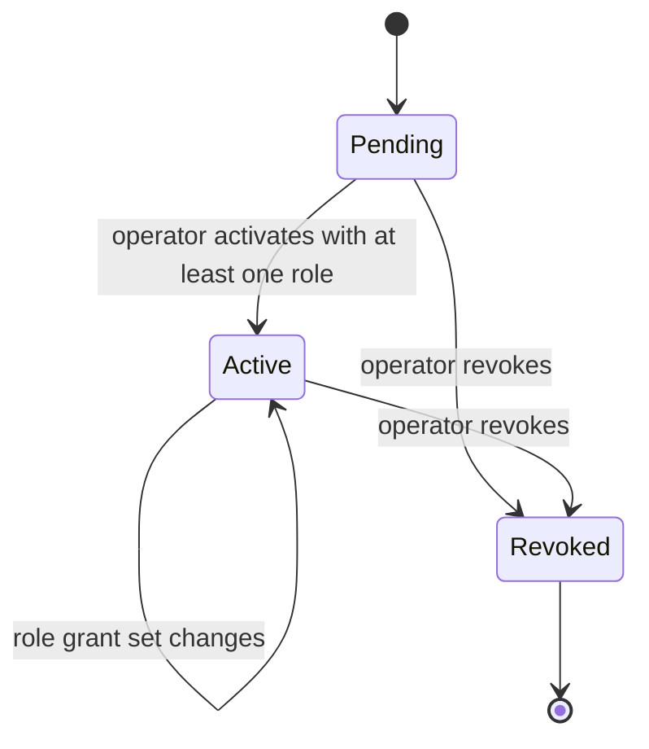
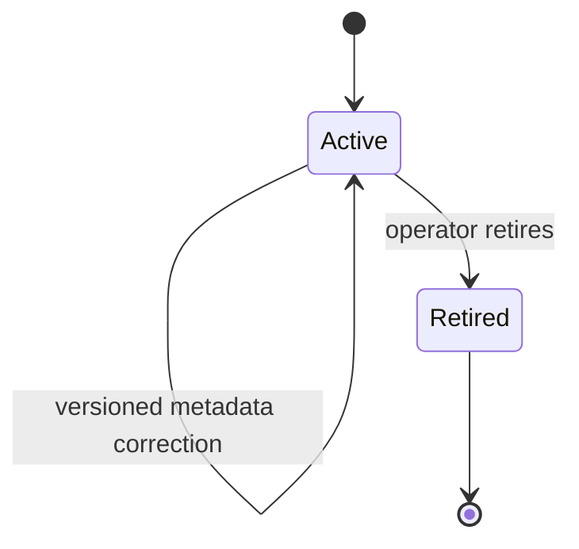
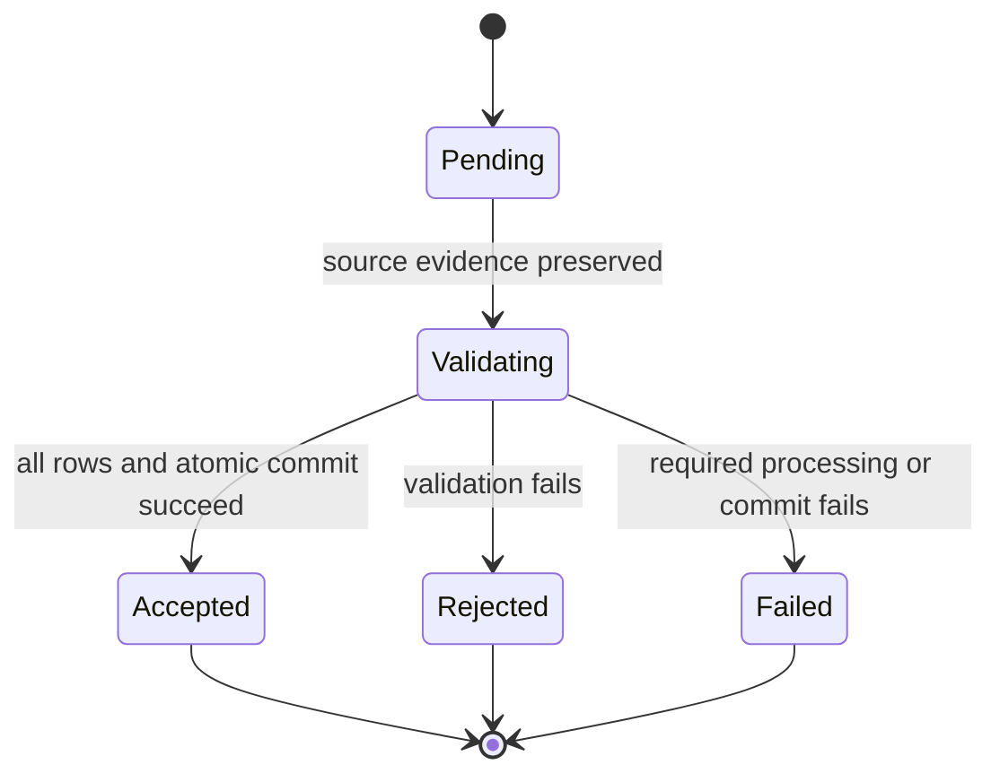
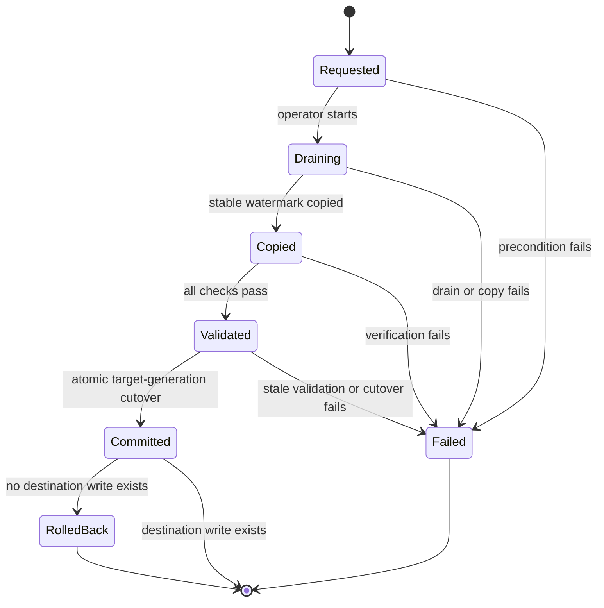
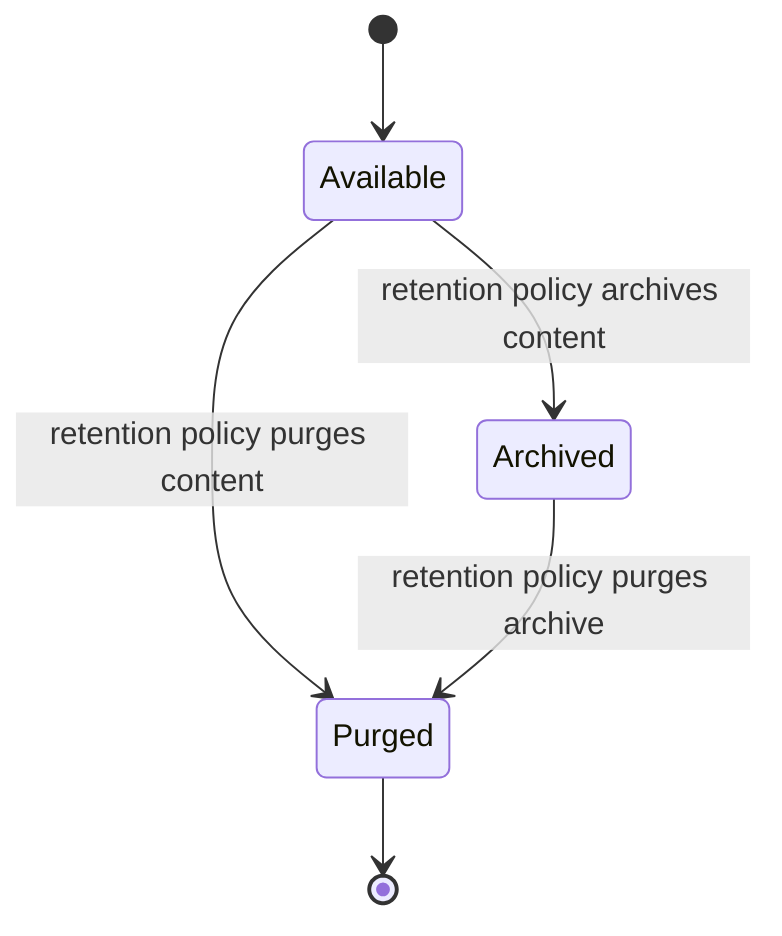
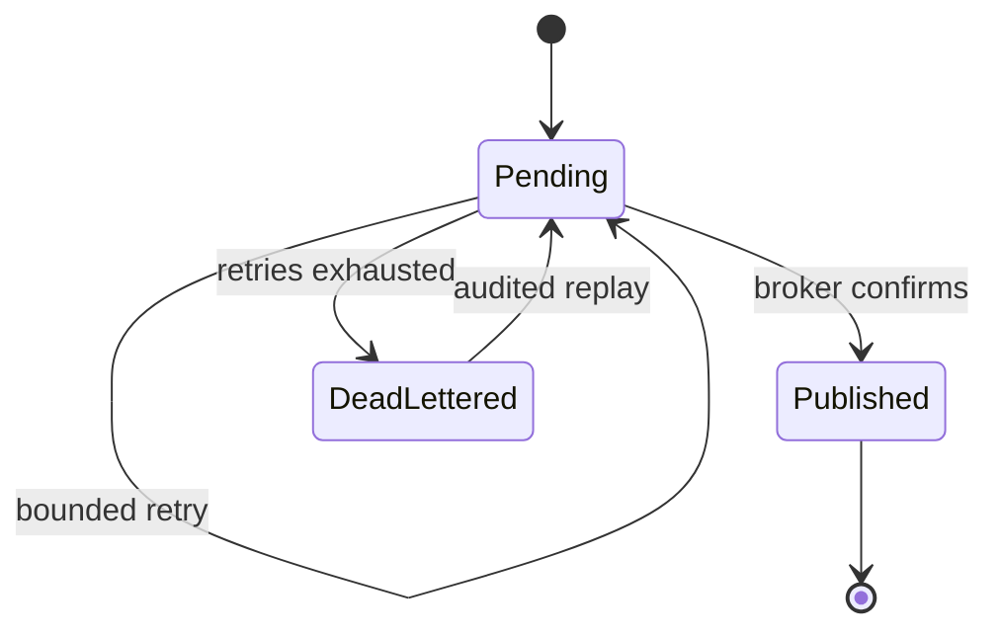
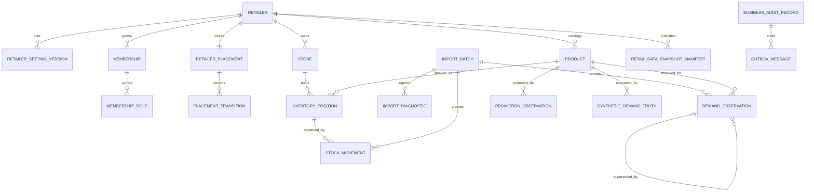

# Retail Data Functional Specification

Unit: U4 Retail Data (`retail-data`)

Decision basis: confirmed Retail Data Functional Design answers dated 2026-09-12.

Status: Draft for independent review

## Purpose and boundary

Retail Data supplies authoritative tenant directory, product, on-hand inventory, movement, demand, calendar, and source-version behavior. Planning/Purchasing owns proposals, orders, receipts, review quotas, and dated inbound supply. For v1, U4 and U8 run in one modular deployment so a receipt and its Inventory effects can share one commit; module schemas, entities, ports, and audit streams remain distinct. The REST receipt boundary is retained as an extraction seam and is not used as a non-atomic hop inside the v1 commit.

The specification is the source of truth for the workflows and state transitions below. `entities.md` is authoritative for entity shape and relationships. `rules.md` is authoritative for decision logic.

## Actors and authority

| Actor | Retail Data authority |
| --- | --- |
| Platform Operator | Creates and manages retailers, stores, settings, placements, memberships, and Planner/Manager role grants; initiates controlled extraction and retention operations. |
| Planner | Lists and selects explicitly assigned retailers; imports inventory and demand; reads authorized inventory, movement, demand, and operation outcomes. |
| Manager | Has Planner behavior when both grants exist; additionally performs governed Purchasing decisions defined by U8. |
| Authorized receiver | A person permitted by the approved Purchasing matrix to record receipt quantities; U8 validates this role before the shared receipt transaction. |
| Machine consumer | Uses a narrow audience, scope, job authority, retailer, and placement generation to request versioned data or process events. |
| Assistant tool | Acts only through a current human session and a bounded typed tool; model-supplied tenant or approval authority is ignored. |

## Workflows

### WF1 — Resolve retailer authority

1. Validate the human or machine identity, audience, scope, and requested operation.
2. Resolve the account reference supplied by Identity Access; do not infer access from identity claims.
3. Establish a clean request and persistence context with the requested retailer and current shared-directory placement generation.
4. Load the current effective Membership and independent role grants through the Tenant Directory authority.
5. Verify that every route, payload, job, and referenced resource belongs to the same retailer.
6. Continue only when membership, role, resource ownership, and placement all match.
7. For a foreign or revoked resource, return no protected value. For no memberships, return an empty list and explicit provisioning guidance.
8. Include retailer identity, membership version, and placement generation in the safe response metadata so late clients can discard stale context.

### WF2 — Administer retailer membership and roles

1. Require platform-operator authority and a payload-bound idempotency key.
2. Resolve the target retailer and account without treating a supplied account or retailer ID as authority.
3. Lock the current Membership and role-grant versions.
4. Validate the requested state transition and prohibit duplicate current role grants.
5. Append or transition Membership and MembershipRole state; never erase historical grants.
6. Increment the affected entity versions.
7. Commit the administrative effect, authoritative audit, and outbox event together.
8. Invalidate membership views. Every later request revalidates authority; revocation takes effect immediately.

### WF3 — Create or change retailer settings

1. Require platform-operator authority and lock the retailer's current setting version.
2. For currency creation or change, check whether any accepted monetary record exists.
3. Permit currency establishment only before the first monetary record; reject later changes.
4. For a time-zone change, require a future retailer-local date boundary and reject overlap or retroactivity.
5. Resolve the corresponding UTC instant using the requested canonical time zone and append a new setting version.
6. Preserve every historical observation's original setting-version reference.
7. Commit the new version, audit, and `retail.reference.changed` outbox event atomically.

### WF4 — Import inventory

1. Authorize a Planner or Manager for the retailer and current placement; require an idempotency key.
2. Accept one UTF-8 RFC 4180 inventory file no larger than 2 MiB or 1,000 data rows.
3. Preserve the raw source object, raw digest, normalized digest, source metadata, and immutable server batch version before authoritative validation.
4. If retailer, store, import kind, and normalized digest match a prior batch, return its authorized result. If the same idempotency key has a different request digest, return conflict.
5. Validate headers and each row: `storeCode`, `sku`, `productName`, `category`, `onHandUnits`, `acquisitionUnitCost`, and `currencyCode`.
6. Resolve every store and product in the authorized retailer; require integer non-negative target stock, non-negative cost, and the retailer currency. Collect at most 100 safe row/field diagnostics and mark truncation.
7. If any error exists, reject the full batch and state that no data became authoritative.
8. Lock every affected Product and InventoryPosition in stable order and revalidate expected versions.
9. Create or version products without reusing SKU identity. For each listed position, calculate target minus current on-hand; append the corresponding opening or reconciliation movement. Leave omitted SKUs unchanged.
10. Advance affected position versions and the retailer inventory watermark.
11. Commit the accepted batch, products, movements, positions, idempotency result, audit, and outbox records together.
12. Return batch version, resulting watermark, accepted state, and correction guidance. A correction is a new version and never edits the original batch.

### WF5 — Import or correct demand history

1. Authorize the retailer and current placement and accept one UTF-8 RFC 4180 demand file no larger than 25 MiB or 100,000 data rows.
2. Preserve the same source evidence and duplicate semantics as WF4.
3. Validate `localDate`, `storeCode`, `sku`, `salesUnits`, `lostDemandUnits`, and optional promotion type/intensity against the effective retailer setting version.
4. Require non-negative integer sales and lost-demand quantities. Resolve product, store, and local date inside the authorized tenant.
5. Reject the whole batch on any error with at most 100 diagnostics and no authoritative observations.
6. For each business key, append a source-versioned DemandObservation and optional PromotionObservation.
7. If the key already has an effective observation, atomically mark the new version effective and retain a supersedes link to the prior version.
8. Keep sales and lost demand separate; expose their sum only as calculated observed demand.
9. If the source is the synthetic generator, write latent true demand to the protected SyntheticDemandTruth boundary. Do not expose it through operational, training, forecasting-input, or assistant ports.
10. Commit batch, observations, supersession links, audit, and outbox together and publish the new demand watermark.

### WF6 — Read inventory and movement history with Redis

1. Execute WF1 and resolve the current Inventory watermark and query shape.
2. Build the cache key from server-verified retailer, placement generation, schema version, entity/watermark version, and query shape.
3. On a valid hit, return the value with data version, observation time, and cache status.
4. On miss or Redis failure, coalesce identical requests and apply load protection before reading the authoritative position and movement routines.
5. Before publishing a fill, compare the loaded version with the current version pointer. Discard a fill that lost a race with a newer commit.
6. Store an eligible result for at most 60 seconds.
7. On a business commit, publish an outbox-backed invalidation. Expiry and version checks remain the recovery path for delayed invalidation.
8. If safe fallback capacity is unavailable, return explicit degraded or unavailable status rather than stale data labeled current.
9. Membership, role, placement, receipt, purchasing, and quota decisions always read authoritative state.

### WF7 — Create and serve a versioned Retail Data snapshot

1. Authorize the machine or human consumer, retailer, purpose, resource range, and current placement.
2. Begin a consistent read at one inventory watermark and resolve the effective product, setting, inventory, demand, promotion, and source versions.
3. For forecasting or training purpose, enforce the allowed temporal cutoff and exclude later-known corrections and SyntheticDemandTruth.
4. For evaluation purpose, include named synthetic truth only when the explicit evaluation scope permits it.
5. For replenishment purpose, reference Purchasing-owned dated inbound separately from Inventory on-hand and include every input version.
6. Calculate a content digest and publish an immutable manifest with purpose, placement generation, local-date range, source versions, watermark, and creation time.
7. Serve current or named manifests through authorized ports. Never silently substitute another version when a named manifest is missing, archived, purged, or stale.
8. Record generation, audit, and outbox evidence atomically when snapshot publication changes shared state.

### WF8 — Answer an assistant inventory or demand tool

1. Accept only a typed server-side tool request bound to the current authenticated account and selected retailer.
2. Execute WF1 and reject any tenant, role, product, date range, or filter authority supplied by the model.
3. Bound product count, time range, result size, and allowed aggregation under the tool contract.
4. Read the named or current authorized snapshot and return facts, status, versions, and evidence identifiers.
5. If evidence is missing, stale, archived, or foreign, return an explicit limitation without substituted content.
6. Record the tool outcome with correlation and snapshot identity; no read tool may mutate inventory or approve Purchasing state.

### WF9 — Post a partial or complete receipt atomically

1. The shared Purchasing module authenticates the receiver and locks the order aggregate, receipt idempotency record, and every affected stock position in stable order.
2. Revalidate current membership and role, placement generation, order state, approved line quantities, product/store ownership, and expected stock versions.
3. Lock order, order lines, and stock positions in one deterministic order, and reuse the original idempotency key for any serialization retry.
4. Revalidate membership, role, and placement immediately before commit so a request admitted before revocation or draining cannot commit afterward.
5. Validate every receipt quantity as a positive integer and calculate cumulative prior plus proposed receipts per line.
6. Reject the complete command if any line is foreign, unapproved, terminal, stale, non-positive, or above its approved quantity.
7. For a matching idempotency replay, revalidate current authority and return the original result. Reject changed payload under the same key.
8. Through the Inventory public module port, append one receipt movement per valid line, update positions, and advance the inventory watermark.
9. Through the Purchasing-owned routine, create the receipt and lines and transition the order to PartiallyReceived or Received.
10. Commit receipt, order balance, movements, positions, both authoritative audits, both outboxes, and idempotency outcome in one transaction.
11. Use neither asynchronous messaging nor loopback network calls inside this commit; publish committed effects afterward from each module's outbox.
12. If any audit, outbox, state, or movement write fails, roll back every effect.
13. If the caller loses the response, reconcile by the original idempotency key before any retry or new receipt is attempted.

### WF10 — Publish and consume asynchronous work

1. Append an event with canonical message identity, type, schema version, retailer, actor, correlation, causation, idempotency, placement generation, and payload in the business transaction.
2. Relay the pending record using the same message identity until publication is confirmed or bounded retries are exhausted.
3. On delivery, the consumer validates schema, machine/job authority, retailer, current placement generation, and payload digest.
4. Lock or create the consumer/message InboxReceipt.
5. For an exact completed redelivery, acknowledge without a duplicate effect. Reject digest mismatch or stale authority.
6. Commit any business effect and completed inbox receipt before acknowledging.
7. Route exhausted transient failures to an observable dead letter. Replay retains the original message identity and creates audited operator evidence.

### WF11 — Extract one retailer to a dedicated database

1. Require platform-operator authority, one selected retailer, a verified destination, and no active transition.
2. Increment placement generation and enter Draining. Stop new selected-retailer mutations and reject or finish selected-tenant jobs by explicit policy; other retailers continue.
3. Establish a stable source watermark and copy tenant-owned products, positions, movements, sources, demand, snapshots, idempotency history, audit links, and pending outbox state.
4. Verify record counts, digests, referential ownership, SKU uniqueness, effective demand keys, stock-ledger reconciliation, source lineage, and outbox watermark.
5. If validation fails, retain source authority, record failure evidence, and do not expose the destination.
6. If validation succeeds and the source watermark is still current, atomically change target and generation in the shared control directory.
7. Publish routing and cache invalidation and resume selected-retailer work at the destination.
8. Reject every request or job carrying an older generation.
9. Before the first destination write, rollback may restore the source under a new generation. After a destination write, recovery requires a new forward transition.

### WF12 — Restore and reconcile Retail Data

1. Restore into an isolated, unavailable target using protected, explicitly selected backup inputs.
2. Verify tenant counts and ownership, product/SKU constraints, position-to-ledger conservation, source and snapshot digests, effective demand uniqueness, audit links, and pending outbox/inbox state.
3. Reject corrupt, incomplete, cross-tenant, or unreconciled restores.
4. Apply current retention policy before exposure so expired records do not reappear.
5. Rebuild disposable cache and downstream projections only from retained authoritative versions.
6. Make the target eligible for placement only after every required check succeeds and evidence records the measured limitations.

### WF13 — Archive or purge retained history

1. Require controlled retention authority and a policy version; business APIs cannot enter this workflow.
2. Select records by tenant, class, age, legal-hold status, and backup-expiry policy.
3. Verify that no retained entity, idempotency result, source lineage, snapshot, or audit reference requires the candidate.
4. Archive or purge only the permitted records and preserve tombstone/evidence required to prevent resurrection through restore or rebuild.
5. Commit retention audit and affected projection-reconciliation work.
6. On any hold, reference, or validation failure, retain the data and report the blocking category.

### WF14 — Generate and verify the reproducible retail fixture

1. Read the checked-in scenario version and fixed seed.
2. Create three isolated retailers with ILS/Asia-Jerusalem, USD/America-New_York, and EUR/Europe-Berlin settings, one store and 100 products each.
3. Generate 18 months of local-date history with seasonality, promotions, intermittent demand, and explicit DST boundaries.
4. Simulate each day chronologically. Sales cannot exceed available stock; lost demand is latent demand minus sales; zero demand produces zero sales and zero lost demand.
5. Preserve fixed versioned acquisition costs and supplier reference inputs without cross-currency aggregation.
6. Import through the same bounded authoritative workflows used by a reviewer; never seed private records directly.
7. Verify counts, source digests, stock conservation, the demand-10/stock-6 result, zero-demand result, tenant isolation, and repeatability under the same seed.
8. Publish evidence only when every claimed check has a concrete result tied to the revision and scenario version.

## State machines

### Membership

- Revoked is terminal for that Membership identity. Restoring access creates a new effective grant record or an explicitly linked new membership under the administrative policy.
- Only Active authorizes access; role grants are evaluated independently.

### Product

- Retired products retain identity, SKU, positions, movements, costs, and observation references.

### Import batch

- Accepted, Rejected, and Failed are immutable outcomes. Corrected content creates a new batch version. Exact replay returns the terminal result.

### Placement transition

- Every placement lifecycle or target transition advances generation; stale generations never resume business effects.

### Snapshot manifest

- Manifest identity and lineage remain immutable. Archived or Purged is returned explicitly; consumers never receive a replacement version silently.

### Outbox publication

- Business state remains committed independently of publication progress. Replays retain the original message identity.

## Derived entity-relationship view

This readability view is derived from the authoritative YAML in `entities.md`.

## Derived rules view

| Rules | Workflow effect |
| --- | --- |
| BR1.1-BR1.10 | WF1-WF3 and WF11 resolve current membership, roles, settings, and placement before work. |
| BR2.1-BR2.12 | WF4, WF6, and WF9 conserve stock and coordinate receipts atomically. |
| BR3.1-BR3.8 | WF4-WF5 preserve bounded source evidence, all-or-nothing authority, and U4 reference ownership. |
| BR4.1-BR4.8 | WF5, WF7, and WF14 preserve temporal truth and prevent feature leakage. |
| BR5.1-BR5.4 | WF6 tolerates cache races and outages without changing authority. |
| BR6.1-BR6.8 | WF7-WF8 provide versioned, purpose-bound data to downstream units. |
| BR7.1-BR7.8 | WF2-WF5 and WF9-WF10 provide atomic audit/outbox and replay-safe messaging. |
| BR8.1-BR8.8 | WF11-WF13 define tenant mobility, restore, and retention safety. |
| BR9.1-BR9.6 | WF9 and WF14 preserve modular ownership, contract seams, and reproducible portfolio evidence. |

## Business scenarios and edge cases

| Scenario | Required outcome |
| --- | --- |
| Retailer A session requests Retailer B product | No foreign resource existence or data is disclosed; no cache value can bypass the denial. |
| A reused connection served Retailer A previously | Prior transaction context is cleared; only the newly verified retailer context can return rows. |
| Inventory batch contains one invalid currency row | The complete batch is Rejected; no product, movement, position, audit-success, or outbox effect commits. |
| Same inventory content is uploaded twice | The authorized original batch result and watermark return without duplicate stock. |
| Import target equals current on-hand | Batch may be Accepted with an explicit no-change row outcome; no quantity-changing movement is appended. |
| V1 cache fill completes after V2 commits | Compare-and-set rejects the V1 fill; it cannot be returned as V2. |
| Redis is unavailable | Reads use coalesced guarded fallback or explicit degradation; authority and mutations remain correct. |
| Demand 10 with stock 6 | Sales is 6 and lost demand is 4; latent truth 10 remains evaluation-only. |
| Demand is zero | Sales and lost demand are both zero; downstream WAPE handles its denominator without altering stored truth. |
| Time-zone changes after history exists | New local dates use the future setting version; historical dates and aggregates keep their original meaning. |
| Receipt lines are 6 then 5 against approved 10 | The second complete receipt rejects with no effects; 6 then 4 completes the line. |
| Two receipts race for the same remainder | Stable locking and expected versions permit at most the valid cumulative quantity; loser receives conflict. |
| Receipt response times out after commit | Reconciliation by the same idempotency key returns the original receipt and movement identities. |
| Audit or outbox write fails during import or receipt | Every accepted business effect rolls back; a safe failed outcome is reported separately. |
| Old job arrives after tenant cutover | Placement generation mismatch returns conflict and creates no destination or source effect. |
| Extraction validation finds a ledger mismatch | Source remains authoritative and destination is not exposed. |
| Restore contains expired audit history | Retention reconciliation completes before any live access or projection rebuild. |

## Error and result semantics

| Condition | Contract result |
| --- | --- |
| Missing or invalid identity | Unauthenticated denial. |
| Valid identity without current membership, role, machine scope, or job authority | Authorized-context denial with no business effect. |
| Foreign tenant-owned resource | Hidden-not-found behavior where disclosure would leak existence. |
| File exceeds the applicable byte or row limit | Payload-too-large result with the accepted limit and no source processing beyond safe intake evidence. |
| Stale entity version, placement generation, idempotency payload, named snapshot, or concurrent receipt | Conflict with safe current-state metadata. |
| Invalid domain content, CSV row, quantity, currency, date, or state transition | Validation failure with bounded diagnostics and no partial effect. |
| Cache, authoritative dependency, or safe fallback unavailable | Explicit degraded or unavailable result; stale data is never relabeled current. |
| Accepted asynchronous work | Stable job or message identity and status; retries preserve identity. |

## Contract refinements to carry forward

1. U4 owns `retail.reference.changed` semantics and publication; U5 consumes it.
2. The contract package must add provider-side inventory and demand import intake, status, diagnostics, and result schemas using the confirmed limits and atomic policy.
3. C08 inventory reads remain REST. The v1 receipt write uses the co-deployed public module port and one transaction; the REST receipt operation remains an extraction seam and cannot claim v1 atomicity after physical separation without a newly approved consistency model.
4. Membership uses a role-grant collection rather than one singular role attribute.
5. Inventory owns on-hand. Purchasing owns dated inbound and order balances; combined snapshots retain both version identities.

## Functional limitations

- One store per retailer is seeded, while the model supports multiple stores.
- Stock uses integer eaches; fractional units and unit conversion are outside v1.
- Currency conversion, business-day lead-time calendars, real supplier fulfillment, and autonomous ordering are outside scope.
- Exact operational retention durations, recovery objectives, queue limits, and performance thresholds are defined in later NFR stages.
- Redis, audit search, and other projections are rebuildable and cannot repair or replace authoritative Retail Data.
