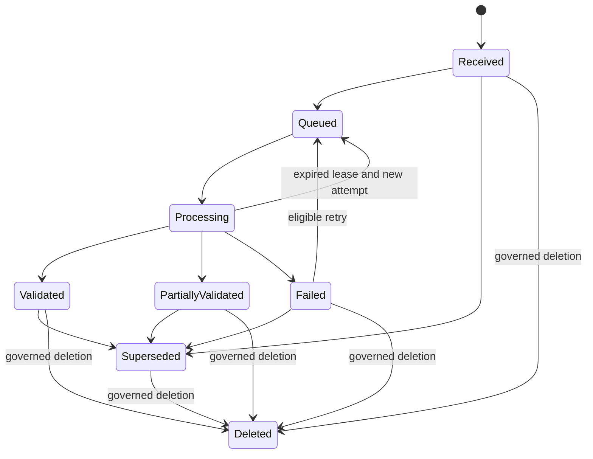
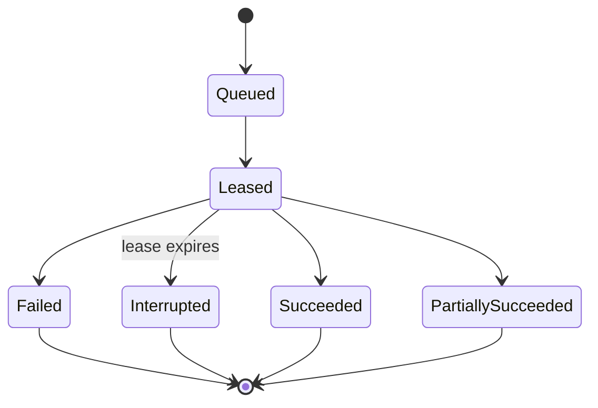
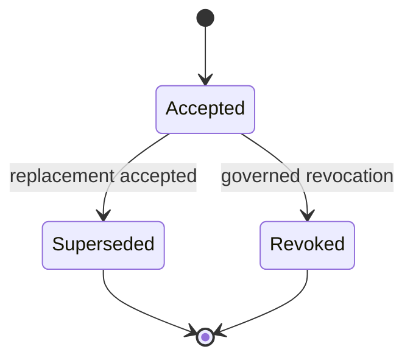
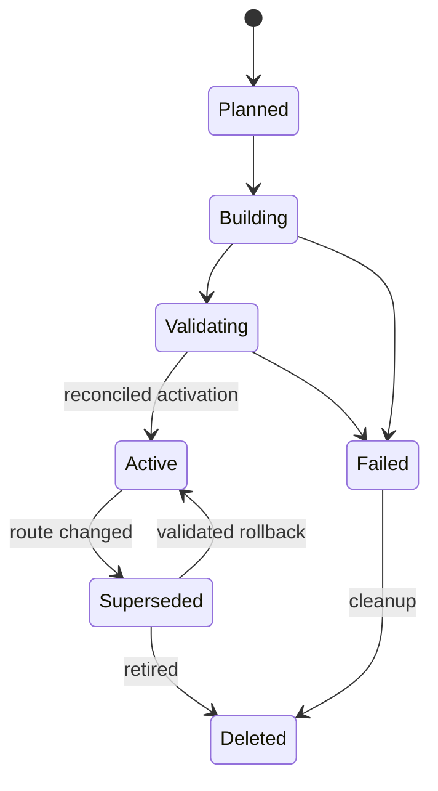
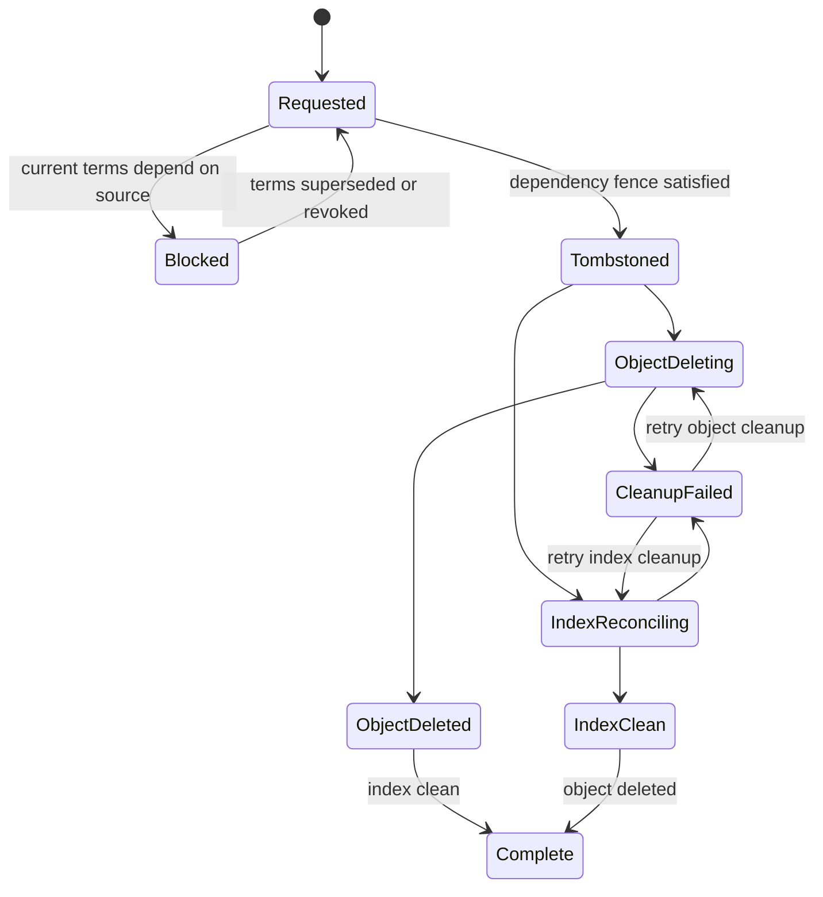
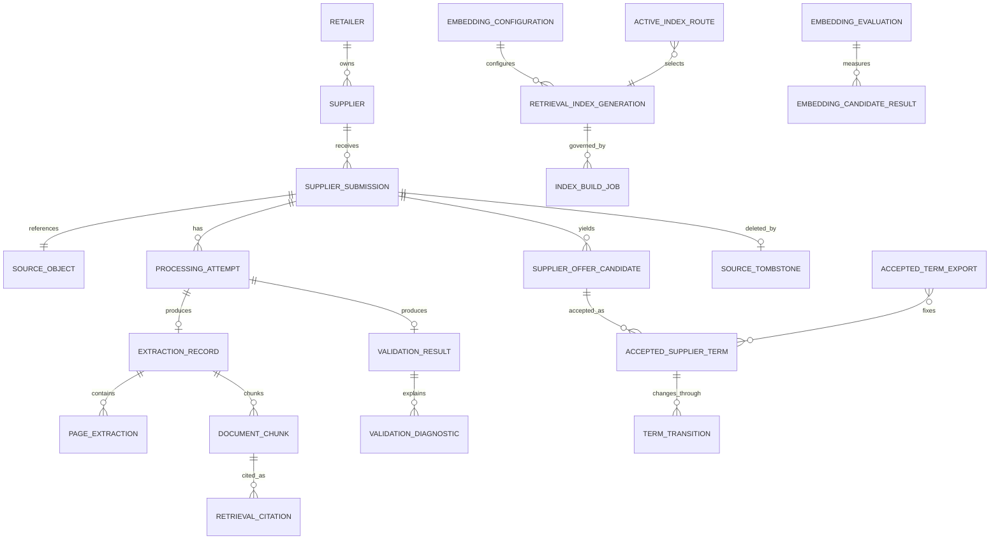

# Supplier Knowledge Functional Specification

Unit: U5 Supplier Knowledge (supplier-knowledge)

Status: Draft for independent review

Decision basis: confirmed Supplier Knowledge Functional Design answers dated 2026-09-13.

Supplier Knowledge turns bounded supplier files into reviewable evidence, Manager-approved commercial terms, and tenant-isolated retrieval projections. Source and extraction history, accepted terms, and vector indexes retain separate authority. Workflows use local authoritative transactions, durable events, idempotency, and reconciliation rather than a distributed transaction.

## Actors and authority

| Actor | Allowed responsibilities | Explicit limits |
| --- | --- | --- |
| Planner | Upload supplier sources; inspect extraction, validation, candidates, and citations; request authorized retrieval and comparison | Cannot accept, supersede, or revoke authoritative terms; cannot manage index routes |
| Manager | All Planner actions; accept, supersede, and revoke commercial terms | Cannot choose infrastructure targets or bypass current membership, placement, and version checks |
| Operator | Repair failed/interrupted processing; rebuild, validate, activate, roll back, retire, and reconcile indexes; run recovery checks | Cannot accept commercial terms solely through Operator authority |
| Reviewer | Inspect embedding evaluation and clean-environment evidence; select the default embedding configuration when authorized by the project process | Cannot grant tenant authority or modify business data by review status alone |
| Service/worker identity | Execute one narrow contract with tenant, purpose, and message authority | Cannot infer tenant authority from payload content or use operator-wide routing |

## Authoritative boundaries

| Information | Authority | Projection or dependent use |
| --- | --- | --- |
| Original CSV/PDF bytes | Immutable S3-compatible source object | Read only after metadata and checksum authorization |
| Submission, attempts, extraction, validation, candidates, chunks, tombstones | MongoDB document records | Events drive audit, indexing, and downstream status |
| Accepted commercial terms and term transitions | PostgreSQL records exposed through authorized routines | Planning, purchasing, model evaluation, and comparison consume versioned reads/exports |
| Retrieval vectors | Qdrant generation selected by a server-owned route | Rebuilt from authoritative chunks, configurations, and tombstones |
| Transport state | Outbox/inbox records in the owning authoritative store | RabbitMQ delivery is durable and at-least-once |
| Searchable audit and operational views | Rebuildable projections | Authoritative audit evidence remains outside those projections |

## Workflow WF1 — Submit and version a supplier source

**Actor:** Planner or Manager.

**Preconditions:** Current retailer membership; supported source kind; current placement generation; supplier belongs to the retailer; request includes an idempotency key.

1. Resolve retailer, supplier, role, placement, supported content type, and configured limits from trusted context.
2. Stream the source through bounded size checks and compute its raw SHA-256 checksum.
3. Resolve the operation-specific idempotency record and compare its request hash.
4. For an exact replay, return the existing submission and current result.
5. For changed bytes, allocate the next immutable source version.
6. Write the original bytes as an immutable object and verify byte length and checksum.
7. Commit submission metadata, object reference, idempotency receipt, business audit entry, and source-received outbox event.
8. Return the source version, Received status, checksum, limits, and correlation identifier.

**Atomic boundary:** Submission metadata, idempotency receipt, audit, and outbox commit together in the document authority. The object write is reconciled by checksum; a committed unreferenced object is eligible for controlled cleanup, while metadata is never committed with an unverified reference.

**Replay:** Exact key and request hash returns the original result. Reused key with changed input conflicts.

**Failures:** Unsupported format, size limit, stale placement, foreign supplier, authorization failure, checksum mismatch, object failure, and commit failure are explicit. No processing job is claimed before its outbox exists.

## Workflow WF2 — Extract and validate a source asynchronously

**Actor:** Authorized processing worker.

**Preconditions:** Valid source-received message; message tenant and placement authority are current; source object is available and checksum-valid.

1. Commit or reuse the inbox receipt and acquire one processing lease.
2. Append a ProcessingAttempt and transition Received or retryable Failed/interrupted work to Queued and then Processing.
3. For CSV, validate UTF-8 RFC 4180 structure, schema version, 20,000-row limit, product mapping, retailer currency, and economic fields.
4. For PDF, enforce the 200-page limit; extract usable text page by page; classify empty, scanned, encrypted, malformed, and failed pages without OCR.
5. Preserve valid candidates and rejected items in one immutable ValidationResult.
6. Return at most 100 deterministic diagnostics while retaining exact total counts.
7. Set Validated only when all in-scope items are valid; set PartiallyValidated when useful evidence and explicit failures coexist; otherwise set Failed or unsupported outcome.
8. Commit attempt, extraction, page, validation, candidate, state, audit, inbox, and outbox evidence together.
9. Acknowledge the message after commit.

**Replay:** A repeated message returns ignoredReplay after the inbox receipt. An expired lease appends a new attempt; it never edits the interrupted attempt.

**Failures:** Object mismatch quarantines the source. Worker interruption leaves a recoverable lease. Retry exhaustion enters an observable dead-letter path.

## Workflow WF3 — Inspect extraction and validation evidence

**Actor:** Planner or Manager.

**Preconditions:** Current membership; retailer and placement resolve from trusted context; source belongs to the retailer.

1. Resolve the exact source version requested.
2. Return source status, checksum, original-object availability, parser/configuration, attempt history, page outcomes, candidates, rejected items, totals, and bounded diagnostics.
3. Label raw extraction and candidates as non-authoritative.
4. Generate evidence locators for the exact row, page, or chunk.
5. If bytes were policy-deleted, retain the source identity and return unavailable instead of another source.

**Failures:** Foreign or unknown identifiers disclose no cross-tenant existence. Missing pages, scans, encryption, partial extraction, and deleted bytes remain explicit text statuses.

## Workflow WF4 — Accept an authoritative commercial term

**Actor:** Manager.

**Preconditions:** Current Manager membership; current placement; valid candidate; available non-deleted source; resolved product mapping; current retailer currency; complete provenance; expected term-set version and idempotency identity.

1. Revalidate actor, role, retailer, placement, supplier, product, source status, candidate validation, currency, and request hash immediately before commit.
2. Validate price, calendar-day lead time, minimum order quantity, pack size, and half-open effective period.
3. Check that no accepted term for the same retailer, supplier, and product overlaps the requested period.
4. Create an immutable AcceptedSupplierTerm and an accept TermTransition.
5. Commit the term, transition, idempotency result, business audit, source-dependency guard, and outbox event in one authoritative-term transaction.
6. Return the accepted term version and full source provenance.

**Replay:** Exact replay returns the same term. Changed payload, stale expected version, concurrent overlap, source deletion fence, or changed authority conflicts.

**Events:** accepted-supplier-term.created with term, source, actor, retailer, and aggregate versions.

## Workflow WF5 — Supersede or revoke a commercial term

**Actor:** Manager.

**Preconditions:** Same authority checks as WF4; current term and expected version are known.

1. Revalidate current authority, placement, source state, term status, and expected version.
2. For supersession, validate the replacement candidate and effective period, close or supersede the prior current version, and append the replacement term.
3. For revocation, append a reasoned revocation transition and remove the term from current eligibility at the effective time.
4. Preserve every prior term and source reference.
5. Commit term versions, transitions, dependency guards, audit, idempotency, and outbox together.

**Conflicts:** Concurrent term change, overlapping period, stale candidate/source, or foreign product blocks the mutation. Proposals that reference a superseded, revoked, or expired term fail downstream revalidation.

## Workflow WF6 — Delete a supplier source safely

**Actors:** Manager for commercial dependency decisions; Operator for retention execution.

**Preconditions:** Current authority and placement; exact source version; idempotency key; deletion reason.

1. Establish a deletion fence against new term acceptance from the source.
2. Discover current accepted terms that depend on the source.
3. If dependencies exist, require a Manager to revoke or supersede them in the same governed commercial action; otherwise block deletion.
4. Commit a SourceTombstone, Deleted source state, idempotency receipt, audit entry, and deletion outbox event.
5. Remove original bytes under retention policy and update object availability.
6. Idempotently remove source chunks from every building and active index generation.
7. Reconcile point counts and preserve the tombstone for every future rebuild.

**Failure behavior:** A failed byte or vector deletion remains visible and retryable. Tombstone authority prevents retrieval and resurrection before physical cleanup completes.

## Workflow WF7 — Publish and consume lifecycle events

**Actor:** Outbox relay and authorized consumers.

1. Select unpublished outbox events in aggregate order.
2. Publish with a stable message ID, tenant, placement generation, aggregate version, event schema version, correlation, and payload digest.
3. Mark published only after broker confirmation.
4. A consumer validates schema, service identity, tenant authority, placement generation, and payload digest.
5. Commit the local effect and inbox receipt together.
6. Acknowledge only after local commit.
7. Exact redelivery returns ignoredReplay; changed bytes under one message ID are quarantined.
8. Bounded retry exhaustion enters a dead-letter queue with safe replay metadata.

**Guarantee:** At-least-once delivery with idempotent effects. Exactly-once transport and cross-store atomicity are not claimed.

## Workflow WF8 — Create deterministic document chunks

**Actor:** Authorized chunking worker.

**Preconditions:** Usable English extraction; source not tombstoned; pinned parser, normalization, and chunking configuration.

1. Normalize extracted text deterministically while preserving the original source and language metadata.
2. Preserve page and section/table boundaries where possible.
3. Split text toward 600-token chunks with about 15 percent overlap, recording any truncation or boundary limitation.
4. Derive each chunk ID from source version, locator, text hash, and chunking configuration.
5. Mark source instructions and other hostile-looking content as untrusted evidence; do not execute or remove content merely because it resembles a prompt.
6. Commit the chunk manifest and chunk-ready outbox event with the processing receipt and audit evidence.

**Replay:** Identical source and configuration reproduce the same chunk IDs. A material configuration change creates distinct chunks and requires a new index generation.

## Workflow WF9 — Build and validate a retrieval generation

**Actor:** Operator and authorized embedding worker.

**Preconditions:** Target retailer and embedding configuration are server-resolved; a fresh Planned generation exists; retained chunks and tombstones are readable.

1. Create a new isolated collection for the retailer, embedding model revision, dimension, preprocessing, pooling, normalization, precision, formatting, and generation.
2. Transition to Building and consume the authoritative chunk manifest.
3. Embed and upsert deterministic point identities idempotently; apply every source tombstone.
4. Checkpoint progress without making the collection routable.
5. Transition to Validating after all work is consumed.
6. Reconcile tenant identity, embedding compatibility, source versions, chunk hashes, tombstones, expected count, indexed count, and checksum manifest.
7. Mark the generation valid for activation or Failed with safe diagnostics.

**Failures:** Interruption resumes from the checkpoint. Wrong-model vectors, mixed dimensions, foreign points, missing sources, count mismatch, or remaining deleted points prevent activation.

## Workflow WF10 — Activate, roll back, retire, or rebuild an index

**Actor:** Operator.

**Preconditions:** Current Operator authority; tenant and configuration resolve from the server; expected route version; target generation is retained and validated.

1. Revalidate target tenant, configuration, generation status, reconciliation evidence, and expected route version.
2. Atomically switch ActiveIndexRoute to the target generation.
3. Mark the previous active generation Superseded without deleting it.
4. For rollback, apply the same checks to a retained compatible generation.
5. For retirement, prevent deletion of the current route target; reroute first.
6. Record route transition, audit, idempotency, and outbox evidence.

**Failure behavior:** Route conflicts preserve the current route. No valid active generation yields explicit unavailable retrieval; the service never chooses a foreign, shared, or incompatible fallback.

## Workflow WF11 — Retrieve authorized supplier evidence

**Actor:** Planner, Manager, or narrowly authorized Assistant service identity.

**Preconditions:** Current tenant authority; English query; bounded query and result limits; server-selected embedding configuration and active route.

1. Resolve actor, tenant, placement, allowed source scope, active embedding configuration, and active route.
2. Reject client/model collection names, arbitrary filters, tenant claims, or unsupported language.
3. Embed the query with the same configuration as the routed generation.
4. Search only that collection and filter against current source, tombstone, and document authorization.
5. Validate every returned point's retailer, configuration, source version, checksum, and chunk identity.
6. Return bounded chunks with document name, exact source version, page/row locator, chunk ID, excerpt, score, quality flags, and availability.
7. Treat all returned text as quoted untrusted evidence.

**Failures:** Missing/stale route, model mismatch, deleted/missing source, or insufficient authorized evidence is explicit. Another version is never substituted for a missing citation.

## Workflow WF12 — Compare eligible suppliers deterministically

**Actor:** Planner, Manager, or narrowly authorized Assistant service identity.

**Preconditions:** Authorized retailer and product; effective time; current accepted-term versions.

1. Select only accepted, effective, non-revoked terms for the retailer and product.
2. Exclude terms with invalid currency, unavailable required provenance, suspended supplier, or failed eligibility checks and report each exclusion.
3. Divide price by positive pack size to obtain normalized unit price within the retailer currency.
4. Order ascending by normalized unit price, calendar-day lead time, minimum order quantity, pack size, supplier display name, then supplier ID.
5. Return every input, term version, source citation, exclusion, and ordering rule.
6. If evidence is insufficient, return available facts and the limitation without inventing a preferred supplier.

**Authority:** Raw extraction and retrieved text may accompany the response as evidence but cannot override accepted terms or the deterministic ordering.

## Workflow WF13 — Export accepted terms for downstream use

**Actor:** Authorized Model Lifecycle, Planning, or evidence service identity.

**Preconditions:** Narrow audience/scope; current tenant and placement; supported purpose; effective time or explicit term versions.

1. Resolve the authorized retailer and purpose.
2. Select accepted term versions valid for the requested effective time or named immutable versions.
3. Create an immutable manifest containing term IDs, source versions, effective time, purpose, and content digest.
4. Return or asynchronously prepare the export under the versioned contract.
5. Preserve the manifest for reproducibility and stale-input checks.

**Failures:** Mixed tenant, revoked/unavailable requested version, unsupported purpose, or stale placement is explicit. No direct storage access is granted.

## Workflow WF14 — Evaluate embedding candidates and select a default

**Actors:** Evaluation worker and human Reviewer.

**Preconditions:** Pinned EmbeddingGemma-300M and Qwen3-Embedding-0.6B configurations; identical authorized corpus, chunk manifest, held-out English questions, relevance labels, and hardware profile.

1. Build separate candidate generations from the same chunks.
2. Evaluate Recall@k, ranking quality, citation correctness, CPU query latency, ingestion throughput, peak RAM, download footprint, and clean-setup reproducibility.
3. Record model revision, dimensions, preprocessing, formatting, hardware, corpus/query checksums, failures, truncation, and limitations.
4. Mark the comparison complete only when both candidate results are comparable.
5. Present evidence to the Reviewer.
6. Record the human-selected default and retain the other configuration as an explicit alternative.
7. Require a compatible validated active generation before serving either configuration.

**Restrictions:** Highest Recall@k alone does not select the model. Ordinary production retrieval does not query both candidates. No external provider or alternate model activates automatically.

## Workflow WF15 — Restore sources and rebuild projections

**Actor:** Operator.

**Preconditions:** Protected backup set; declared recovery policy; isolated restore target.

1. Restore source metadata, attempts, extraction/validation records, term records, configurations, tombstones, audit evidence, and immutable source objects.
2. Verify tenant counts, source versions, object checksums, accepted-term integrity, and expiry/deletion state before exposure.
3. Reject missing, corrupt, or foreign objects without substitution.
4. Rebuild vector generations from retained chunks and tombstones; do not claim Qdrant restored merely because sources are present.
5. Replay pending messages and jobs through normal inbox/idempotency checks.
6. Activate a rebuilt generation only after WF9 validation.
7. Report measured recovery time, data loss, incomplete work, and limitations.

## State machines

### Supplier submission

Text fallback: a source advances from receipt through queued processing to validated, partially validated, or failed. Retry appends a new attempt and returns eligible failed or lease-expired work to queued. Supersession and governed deletion preserve history.

### Processing attempt

Text fallback: each attempt is immutable. Retry creates another attempt rather than reopening a terminal attempt.

### Accepted commercial term

Text fallback: corrections append a new accepted version and supersede the old one. Revocation ends current eligibility while preserving the record. Effective, future, and expired are derived from the half-open effective period.

### Retrieval index generation

Text fallback: a generation is not routable until validation succeeds and the route changes atomically. Rollback can reactivate only a retained valid compatible generation.

### Source deletion

Text fallback: the tombstone is the durable business authority. Physical object and vector cleanup may finish independently and retry, but tombstoned content is unavailable immediately and cannot reappear.

## Derived entity-relationship view

This diagram is derived from entities.md; the YAML entity model remains authoritative.

Text fallback: retailers own suppliers and their source versions. Sources produce immutable processing evidence, candidates, and chunks. Manager actions create accepted term versions. Embedding configurations define isolated index generations selected by server-owned routes. Citations point back to exact chunks and sources.

## Derived rules summary

This view is derived from rules.md; its YAML rule list remains authoritative.

| Rule range | Enforced behavior |
| --- | --- |
| BR1.1-BR1.7 | Current tenant, membership, role, placement, and server-owned routing authority |
| BR2.1-BR2.10 | Bounded source intake, immutable object/checksum identity, lifecycle, retry, and reproducible fixtures |
| BR3.1-BR3.10 | CSV/PDF validation, explicit partial outcomes, non-authoritative candidates, English-first handling, and provenance |
| BR4.1-BR4.10 | Manager-only immutable accepted terms, temporal integrity, stale-input checks, and purpose-scoped exports |
| BR5.1-BR5.8 | Deterministic chunks, hostile-content isolation, complete citations, tombstones, and language gates |
| BR6.1-BR6.9 | Tenant/configuration-isolated generations, reconciliation, atomic routing, rollback, and unavailable behavior |
| BR7.1-BR7.6 | Comparable EmbeddingGemma/Qwen evidence and human default selection |
| BR8.1-BR8.5 | Transparent deterministic supplier comparison and insufficient-evidence behavior |
| BR9.1-BR9.12 | Idempotency, local atomicity, outbox/inbox delivery, DLQ recovery, deletion fencing, and audit |
| BR10.1-BR10.8 | Restore integrity, contracts, supported local setup, secrets, telemetry, and reviewer evidence |

## Contract refinements

The confirmed functional design requires these later updates to the shared contract package:

1. Supplier-source upload and status responses must carry source version, checksum, limits, processing status, validation totals, bounded diagnostics, object availability, and idempotency/conflict semantics.
2. Source lifecycle events belong to Supplier Knowledge. Retail Data remains the owner of product/reference change events consumed by Supplier Knowledge.
3. Accepted-term reads and exports must expose immutable term/source versions, effective time, provenance, and stale/unavailable outcomes.
4. Retrieval contracts must omit collection names and arbitrary filters, carry a bounded English query plus server-resolved tenant authority, and return complete citation and unavailable/conflict states.
5. Index lifecycle commands and events must carry server-owned generation/configuration identities, expected route version, reconciliation result, and idempotency.
6. The earlier statement that original files are retained in MongoDB is superseded by immutable S3-compatible object storage; MongoDB retains authoritative source/extraction metadata and object references.
7. Manager-only accepted-term authority and source-deletion fencing must be represented in authorization, error, and audit examples.

## Error semantics

| Condition | Functional outcome |
| --- | --- |
| Missing/foreign tenant or source | Forbidden without target-existence disclosure |
| Stale placement, entity, term, or route version | Conflict; caller must reload authoritative state |
| Idempotency key reused with changed input | Conflict with no effect |
| Unsupported media, language, scan, encryption, or malformed source | Explicit unsupported/validation outcome |
| CSV/PDF bounds exceeded | Payload or item-limit rejection before processing |
| Partial extraction/validation | Immutable partial result with counts and diagnostics; no automatic authority |
| Missing/corrupt source object | Source unavailable/quarantined; no candidate, term, chunk, or citation substitution |
| Accepted-term overlap or stale dependency | Conflict; no term mutation |
| Missing/stale/incompatible index route | Retrieval unavailable/conflict; no cross-route fallback |
| Worker/broker interruption | Visible retryable status; idempotent redelivery or bounded dead-letter outcome |
| Audit or outbox failure in authoritative transaction | Roll back the business mutation |
| Projection cleanup or rebuild failure | Preserve tombstone/current route and expose recoverable failure |

## Sources

- inception/units-generation/unit-of-work.md
- inception/units-generation/unit-of-work-story-map.md
- inception/requirements-analysis/requirements.md
- inception/domain-design/components.md
- inception/contract-design/contract-summary.md
- construction/supplier-knowledge/functional-design/functional-design-questions.md
- construction/supplier-knowledge/functional-design/entities.md
- construction/supplier-knowledge/functional-design/rules.md

## Assumptions & Open Questions

- Exact parser/runtime/model revisions, retry budgets, retention values, resource limits, and evaluation thresholds are deferred to later NFR and implementation stages.
- The default embedding model remains intentionally unselected pending WF14 evidence and the human decision.
- Additional languages require explicit fixtures and acceptance; no multilingual capability beyond preserved extensibility is claimed.

## Review

**Reviewer:** aidlc-architecture-reviewer-agent
**Iteration:** 1
**Verdict:** NOT-READY
**Date:** 2026-09-13T06:21:44Z

### Findings

| ID | Severity | Location | Finding | Required action | Status |
| --- | --- | --- | --- | --- | --- |
| R-01 | Major | aidlc/spaces/default/intents/260908-stock-sense-design/construction/supplier-knowledge/functional-design/functional-spec.md > WF4 and WF6 | Source-deletion authority is committed in MongoDB while accepted-term dependencies and guards are committed in PostgreSQL, but the design does not define a durable cross-store protocol that closes the race between dependency checking, term acceptance, and tombstoning. The stated local-transaction/outbox approach alone does not prevent a term from being accepted during deletion. | Define the authoritative deletion-fence record, transaction participants, ordering, reservation/acknowledgement states, retry behavior, and reconciliation rule that make WF4 and WF6 mutually exclusive without a distributed transaction. | New |
| R-02 | Major | aidlc/spaces/default/intents/260908-stock-sense-design/construction/supplier-knowledge/functional-design/functional-spec.md > Retrieval index generation state machine, WF9, WF10, and WF14 | The generation state machine has no Validated-but-inactive state: validation flows directly to Active, while WF10 requires a retained validated target before activation and WF14 requires separately validated candidate generations. A developer cannot represent validated candidates or guarantee that validation does not change the active route. | Add a Validated state distinct from Active; specify that route activation and generation-state transition occur under one route-authority operation, including rollback and failure reconciliation. | New |
| R-03 | Major | aidlc/spaces/default/intents/260908-stock-sense-design/construction/supplier-knowledge/functional-design/functional-spec.md > Source deletion state machine and WF6 | Object deletion and index cleanup are described as independent concurrent activities, but the single-state machine models mutually exclusive ObjectDeleted and IndexClean states and provides no durable join state or per-branch status. Completion and retry behavior therefore cannot be implemented deterministically. | Model object cleanup and index cleanup as separate persisted substates, or introduce explicit composite/join states, and define the completion predicate and retries for every partial-success combination. | New |

### Validation Tool Results

| Tool | Result | Interpretation |
| --- | --- | --- |
| Stage validation tools | Not run because the invoking instruction required immediate conclusion without further investigation | The verdict rests on architectural contradictions visible in the primary review artifact. |

### Summary

The design has three implementation-blocking gaps in cross-store deletion fencing and lifecycle state representation. These gaps can produce accepted terms tied to deleted evidence, premature index activation, or cleanup workflows that cannot converge deterministically.
