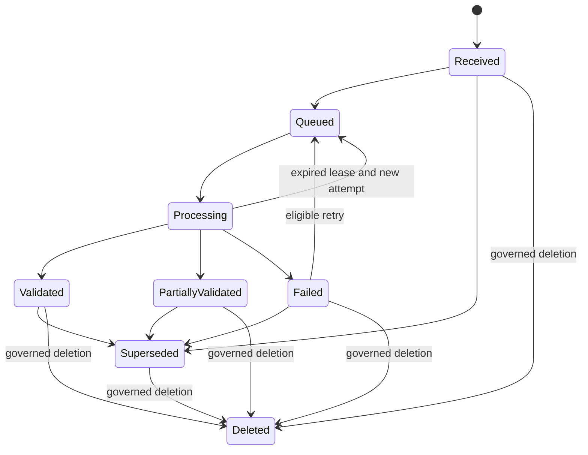
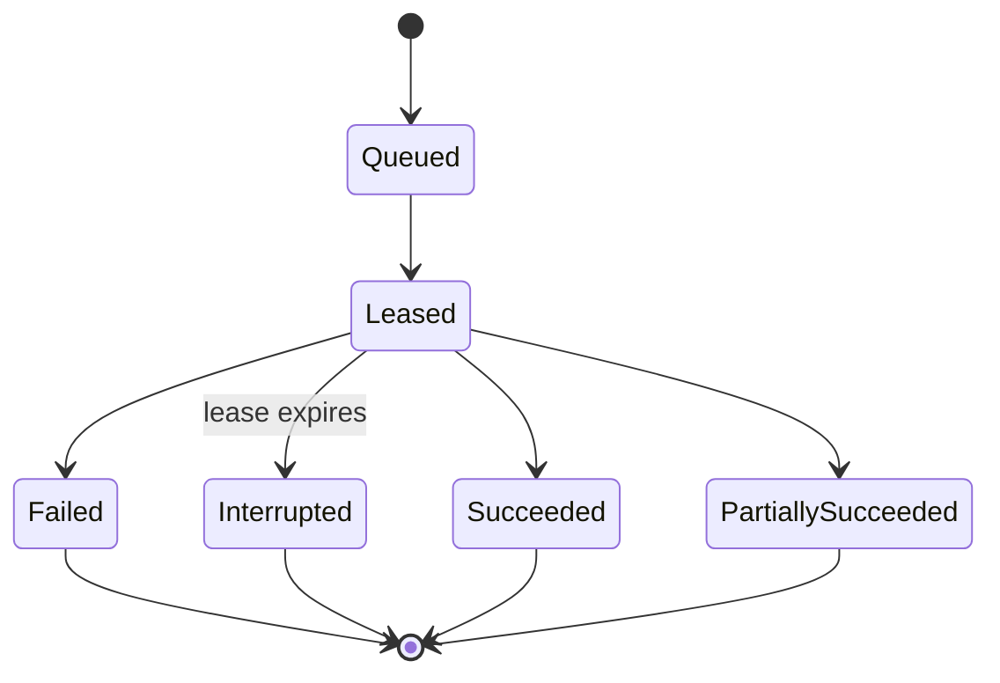
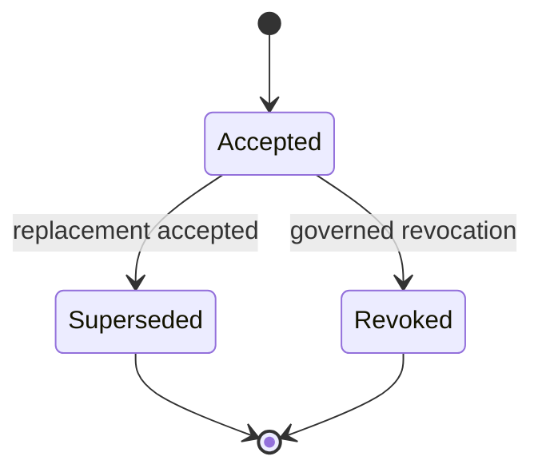
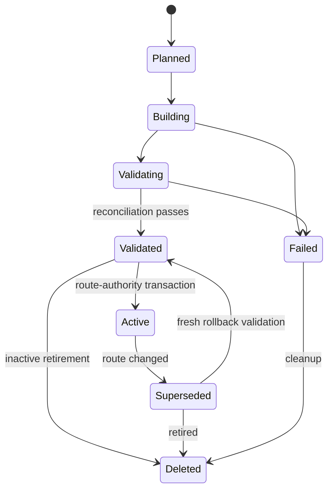
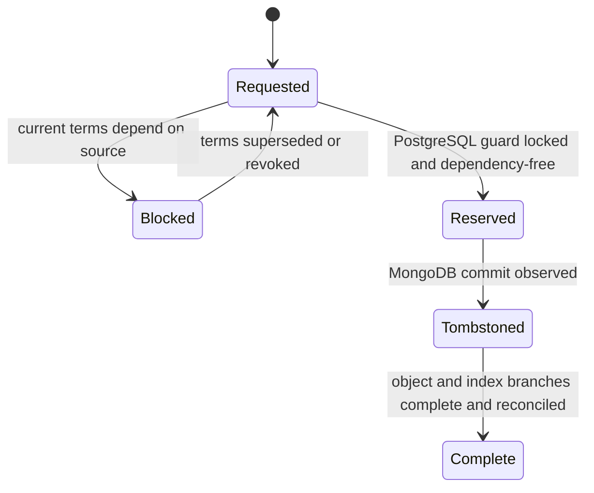
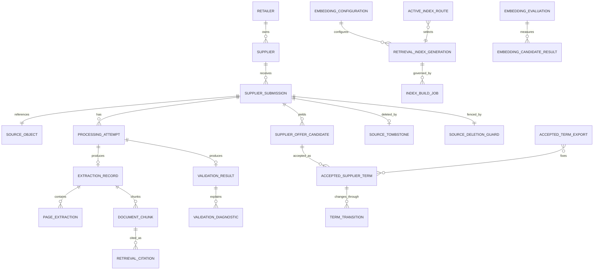

# Supplier Knowledge Functional Specification

Unit: U5 Supplier Knowledge (supplier-knowledge)

Status: Draft for independent review

Decision basis: confirmed Supplier Knowledge Functional Design answers, reconciled with approved contracts on 2026-09-25.

Supplier Knowledge turns bounded supplier files into reviewable evidence, Manager-approved commercial terms, and tenant-isolated retrieval projections. Source and extraction history, accepted terms, and vector indexes retain separate authority. Workflows use local authoritative transactions, durable events, idempotency, and reconciliation rather than a distributed transaction.

## Actors and authority

| Actor | Allowed responsibilities | Explicit limits |
| --- | --- | --- |
| Planner | Upload supplier sources; inspect extraction, validation, candidates, and citations; request authorized retrieval and comparison | Cannot accept, supersede, or revoke authoritative terms; cannot manage index routes |
| Manager | All Planner actions; accept, supersede, and revoke commercial terms | Cannot choose infrastructure targets or bypass current membership, placement, and version checks |
| Operator | Repair failed/interrupted processing; rebuild, validate, activate, roll back, retire, and reconcile indexes; run recovery checks | Cannot accept commercial terms solely through Operator authority |
| Reviewer | Inspect embedding evaluation and clean-environment evidence; select the default embedding configuration when authorized by the project process | Cannot grant tenant authority or modify business data by review status alone |
| Service/worker identity | Execute one narrow contract with tenant, purpose, and message authority | Cannot infer tenant authority from payload content or use operator-wide routing |

## Authoritative boundaries

| Information | Authority | Projection or dependent use |
| --- | --- | --- |
| Original CSV/PDF bytes | Immutable S3-compatible source object | Read only after metadata and checksum authorization |
| Submission, attempts, extraction, validation, candidates, chunks, tombstones | MongoDB document records | Events drive audit, indexing, and downstream status |
| Accepted commercial terms, term transitions, and source-deletion guards | PostgreSQL records exposed through authorized routines | Planning, purchasing, model evaluation, and comparison consume versioned reads/exports; guard locks serialize acceptance and deletion reservation |
| Retrieval vectors | Qdrant generation selected by a server-owned route | Rebuilt from authoritative chunks, configurations, and tombstones |
| Transport state | Outbox/inbox records in the owning authoritative store | RabbitMQ delivery is durable and at-least-once |
| Searchable audit and operational views | Rebuildable projections | Authoritative audit evidence remains outside those projections |

## Workflow WF1 — Submit and version a supplier source

**Actor:** Planner or Manager.

**Preconditions:** Current retailer membership; supported source kind; current placement generation; supplier belongs to the retailer; request includes an idempotency key.

1. Resolve retailer, supplier, role, placement, supported content type, and configured limits from trusted context.
2. Stream the source through bounded size checks and compute its raw SHA-256 checksum.
3. Resolve the operation-specific idempotency record and compare its request hash.
4. For an exact replay, return the existing submission and current result.
5. For changed bytes, allocate the next immutable source version.
6. Write the original bytes as an immutable object and verify byte length and checksum.
7. In the MongoDB transaction, write/compare the retailer's `SupplierSourceRecoveryFence` generation and commit submission metadata, object reference, idempotency receipt, business audit entry, source-received outbox event, and an increment of `SupplierSourceGeneration`. An in-flight commit that races a prepare fence conflicts; an exact replay does not increment the generation.
8. Return the source version, Received status, checksum, limits, and correlation identifier.

**Atomic boundary:** Submission metadata, idempotency receipt, audit, and outbox commit together in the document authority. The object write is reconciled by checksum; a committed unreferenced object is eligible for controlled cleanup, while metadata is never committed with an unverified reference.

**Recovery boundary:** WF1, extraction and chunking workers, and every MongoDB source/evidence-availability transition use the same source fence document in their local transaction. Object bytes written before a rejected metadata commit are unreferenced and reconciled, never evidence of a completed source write. New work fails closed while the store is fenced or its generation cannot be proven.

**Term-eligibility boundary:** Create the exact source-version `SourceDeletionGuard` in PostgreSQL idempotently after the MongoDB source commit. Until the Open guard exists and its source checksum matches, WF4 rejects acceptance. A crash between stores leaves a visible, retryable eligibility gap rather than an unguarded term.

**Replay:** Exact key and request hash returns the original result. Reused key with changed input conflicts.

**Failures:** Unsupported format, size limit, stale placement, foreign supplier, authorization failure, checksum mismatch, object failure, and commit failure are explicit. No processing job is claimed before its outbox exists.

## Workflow WF2 — Extract and validate a source asynchronously

**Actor:** Authorized processing worker.

**Preconditions:** Valid source-received message; message tenant and placement authority are current; source object is available and checksum-valid.

1. Commit or reuse the inbox receipt and acquire one processing lease.
2. Append a ProcessingAttempt and transition Received or retryable Failed/interrupted work to Queued and then Processing.
3. For CSV, validate UTF-8 RFC 4180 structure, schema version, 20,000-row limit, product mapping, retailer currency, and economic fields.
4. For PDF, enforce the 200-page limit; extract usable text page by page; classify empty, scanned, encrypted, malformed, and failed pages without OCR.
5. Preserve valid candidates and rejected items in one immutable ValidationResult.
6. Return at most 100 deterministic diagnostics while retaining exact total counts.
7. Set Validated only when all in-scope items are valid; set PartiallyValidated when useful evidence and explicit failures coexist; otherwise set Failed or unsupported outcome.
8. In the MongoDB transaction, write/compare `SupplierSourceRecoveryFence` and commit attempt, extraction, page, validation, candidate, state, audit, inbox and outbox evidence together. Increment `SupplierSourceGeneration` when the committed status or evidence becomes available or unavailable; exact replay does not increment.
9. Acknowledge the message only after commit and under the same generation-bound worker/consumer permit; close waits for the acknowledgement boundary.

**Replay:** A repeated message returns ignoredReplay after the inbox receipt. An expired lease appends a new attempt; it never edits the interrupted attempt.

**Failures:** Object mismatch quarantines the source. Worker interruption leaves a recoverable lease. Retry exhaustion enters an observable dead-letter path.

## Workflow WF3 — Inspect extraction and validation evidence

**Actor:** Planner or Manager.

**Preconditions:** Current membership; retailer and placement resolve from trusted context; source belongs to the retailer.

1. Resolve the exact source version requested.
2. Return source status, checksum, original-object availability, parser/configuration, attempt history, page outcomes, candidates, rejected items, totals, and bounded diagnostics.
3. Label raw extraction and candidates as non-authoritative.
4. Generate evidence locators for the exact row, page, or chunk.
5. If bytes were policy-deleted, retain the source identity and return unavailable instead of another source.

**Failures:** Foreign or unknown identifiers disclose no cross-tenant existence. Missing pages, scans, encryption, partial extraction, and deleted bytes remain explicit text statuses.

## Workflow WF4 — Accept an authoritative commercial term

**Actor:** Manager.

**Preconditions:** Current Manager membership; current placement; valid candidate; available non-deleted source; resolved product mapping; current retailer currency; complete provenance; expected term-set version and idempotency identity.

1. Revalidate actor, role, retailer, placement, supplier, product, source status, candidate validation, currency, and request hash immediately before commit.
2. Validate price, calendar-day lead time, minimum order quantity, pack size, and half-open effective period.
3. Check that no accepted term for the same retailer, supplier, and product overlaps the requested period.
4. Create an immutable AcceptedSupplierTerm and an accept TermTransition.
5. In PostgreSQL, lock the exact retailer/source/version SourceDeletionGuard row before checking current source availability and term dependencies. The row must exist and be Open; Reserved or Tombstoned rejects acceptance. MongoDB cannot tombstone without first reserving this same guard.
6. In that same PostgreSQL routine and transaction, lock the retailer's `SupplierTermRecoveryFence` row and reject a fenced or changed generation. Commit the term, transition, dependency reference, idempotency result, business audit, outbox event, and one increment of `SupplierTermGeneration` while holding both locks. A prepare that races the commit serializes on the fence row; exact replay does not increment again.
7. Return the accepted term version and full source provenance.

**Replay:** Exact replay returns the same term. Changed payload, stale expected version, concurrent overlap, source deletion fence, or changed authority conflicts.

**Events:** accepted-supplier-term.created with term, source, actor, retailer, and aggregate versions.

## Workflow WF5 — Supersede or revoke a commercial term

**Actor:** Manager.

**Preconditions:** Same authority checks as WF4; current term and expected version are known.

1. Revalidate current authority, placement, source state, term status, and expected version.
2. For supersession, validate the replacement candidate and effective period, close or supersede the prior current version, and append the replacement term.
3. For revocation, append a reasoned revocation transition and remove the term from current eligibility at the effective time.
4. Preserve every prior term and source reference.
5. Lock `SupplierTermRecoveryFence` and each affected source-version guard in one PostgreSQL routine transaction; reject a fenced or changed recovery generation. Commit term versions, transitions, dependency changes, audit, idempotency, outbox and an increment of `SupplierTermGeneration` together. If the Manager also requests deletion, reserve the old source guard in this transaction only after the last current dependency is removed; a replacement term referencing another source locks and checks that source's Open guard too. Exact replay does not increment again.

**Conflicts:** Concurrent term change, overlapping period, stale candidate/source, or foreign product blocks the mutation. Proposals that reference a superseded, revoked, or expired term fail downstream revalidation.

## Workflow WF6 — Delete a supplier source safely

**Actors:** Manager for commercial dependency decisions; Operator for retention execution.

**Preconditions:** Current authority and placement; exact source version; idempotency key; deletion reason.

1. In one PostgreSQL transaction, lock the retailer's `SupplierTermRecoveryFence`, the exact retailer/source/version SourceDeletionGuard and all current dependency rows; require an unfenced current recovery generation, Open guard and no current accepted dependency. A Manager may revoke or supersede the last dependencies and reserve the guard in this same governed transaction. Persist Reserved with a unique deletion request and monotonic deletion-fence generation, idempotency receipt, audit, outbox and any accepted-term generation increment; commit before any MongoDB tombstone or physical deletion.
2. The deletion worker acquires a generation-bound recovery permit, rechecks placement and source identity, then writes/compares `SupplierSourceRecoveryFence` and commits the matching SourceTombstone, Deleted source state, idempotency receipt, audit, outbox and source-generation increment in one MongoDB transaction. The tombstone includes the PostgreSQL request and deletion-fence generation. Duplicate attempts with the same identity reuse the committed result; a different generation conflicts.
3. Observe the MongoDB commit and advance the PostgreSQL guard to Tombstoned idempotently. If observation fails, leave it Reserved and reconcile by request and generation. A committed reservation is irreversible: retry or repair MongoDB until the matching tombstone exists, and never reopen the guard after worker uncertainty.
4. After tombstoning, independently remove original bytes under retention policy and remove source points from every building and active index generation. Persist each branch's pending/running/complete/failed status and evidence digest against the same request/generation; retries touch only incomplete branches.
5. Mark deletion Complete only when both branches are Complete, object unavailability and index point counts reconcile, and the MongoDB tombstone matches the PostgreSQL terminal guard. Keep the tombstone in every future rebuild manifest.

**Failure behavior:** PostgreSQL reservation failure leaves the source untouched. MongoDB failure keeps the PostgreSQL reservation closed and retries forward, with an operator-visible repair path. A failed byte or vector branch remains visible and independently retryable. The tombstone and guard prevent retrieval, new term acceptance, and resurrection before physical cleanup completes; no distributed transaction is claimed.

## Workflow WF7 — Publish and consume lifecycle events

**Actor:** Outbox relay and authorized consumers.

1. Use U14's C23 .NET/Python package for C01/C22 envelope validation, canonical payload digest, publish confirms, durable inbox replay handling, and compatible conformance fixtures. U5 owns its MongoDB and PostgreSQL outbox/inbox persistence, producer identity and business effects.
   A business relay or consumer acquires a permit for its owning store's current recovery generation before a local effect, publish, or acknowledgement. The local effect and inbox/outbox receipt check the corresponding MongoDB fence document or PostgreSQL fence row in the same transaction. The permit is released only after durable commit, publish confirmation and applicable broker acknowledgement; uncertain sends remain in the business drain inventory. The allowlisted C25 recovery-control lane in WF16 uses its own inbox/outbox, relay and generation checks; no supplier business event can use that lane.
2. Select unpublished outbox events in aggregate order.
3. Publish with a stable message ID, tenant, placement generation, aggregate version, event schema version, correlation, and payload digest.
4. Mark published only after broker confirmation.
5. A consumer validates schema, service identity, tenant authority, placement generation, and payload digest.
6. Commit the local effect and inbox receipt together.
7. Acknowledge only after local commit.
8. Exact redelivery returns ignoredReplay; changed bytes under one message ID are quarantined.
9. Bounded retry exhaustion enters a dead-letter queue with safe replay metadata.

**Guarantee:** At-least-once delivery with idempotent effects. Exactly-once transport and cross-store atomicity are not claimed.

## Workflow WF8 — Create deterministic document chunks

**Actor:** Authorized chunking worker.

**Preconditions:** Usable English extraction; source not tombstoned; pinned parser, normalization, and chunking configuration.

1. Normalize extracted text deterministically while preserving the original source and language metadata.
2. Preserve page and section/table boundaries where possible.
3. Split text toward 600-token chunks with about 15 percent overlap, recording any truncation or boundary limitation.
4. Derive each chunk ID from source version, locator, text hash, and chunking configuration.
5. Mark source instructions and other hostile-looking content as untrusted evidence; do not execute or remove content merely because it resembles a prompt.
6. Commit the chunk manifest and chunk-ready outbox event with the processing receipt and audit evidence.

**Replay:** Identical source and configuration reproduce the same chunk IDs. A material configuration change creates distinct chunks and requires a new index generation.

## Workflow WF9 — Build and validate a retrieval generation

**Actor:** Operator and authorized embedding worker.

**Preconditions:** Target retailer and embedding configuration are server-resolved; a fresh Planned generation exists; retained chunks and tombstones are readable.

1. Create a new isolated collection for the retailer, embedding model revision, dimension, preprocessing, pooling, normalization, precision, formatting, and generation.
2. Transition to Building and consume the authoritative chunk manifest.
3. Embed and upsert deterministic point identities idempotently; apply every source tombstone.
4. Checkpoint progress without making the collection routable.
5. Transition to Validating after all work is consumed.
6. Reconcile tenant identity, embedding compatibility, source versions, chunk hashes, tombstones, expected count, indexed count, and checksum manifest.
7. Persist Validated with evidence and validatedAt, or Failed with safe diagnostics. Validation alone never changes ActiveIndexRoute or serves the candidate generation.

**Failures:** Interruption resumes from the checkpoint. Wrong-model vectors, mixed dimensions, foreign points, missing sources, count mismatch, or remaining deleted points prevent activation.

## Workflow WF10 — Activate, roll back, retire, or rebuild an index

**Actor:** Operator.

**Preconditions:** Current Operator authority; tenant and configuration resolve from the server; expected route version; target generation is retained and validated.

1. Revalidate target tenant, configuration, reconciliation evidence, and expected route version. Activation requires Validated; rollback to a retained Superseded generation first repeats validation against current tombstones and manifest without changing the route.
2. In one PostgreSQL route-authority transaction, lock the route and both generations, compare route version, point to the target, increment version, mark target Active and prior Active Superseded, and commit idempotency, audit, and outbox. A first activation creates the route under the same uniqueness guard.
3. A failed transaction changes neither the route nor authoritative generation statuses. After interruption, readers resolve the committed route; the reconciler repairs any stale Qdrant alias or projection from that route and never infers authority from a collection alias.
4. For retirement, prevent deletion of the current route target; reroute first. Retained Superseded candidates are not routable until revalidated and switched by the same transaction.

**Failure behavior:** Route conflicts preserve the current route. No valid active generation yields explicit unavailable retrieval; the service never chooses a foreign, shared, or incompatible fallback.

**Startup/restore:** Before marking retrieval ready, reconcile the PostgreSQL route with Qdrant collection existence, model dimension, tenant, point count, source/tombstone inventory and manifest digest. A missing or mismatched projection leaves retrieval unavailable; an Operator may repair, or perform an expected-version rollback/cutover after validation. Neither Qdrant aliases nor cache entries can silently replace route authority.

## Workflow WF11 — Retrieve authorized supplier evidence

**Actor:** Planner, Manager, or narrowly authorized Assistant service identity.

**Preconditions:** Current tenant authority; English query; bounded query and result limits; server-selected embedding configuration and active route.

1. Resolve actor, tenant, placement, allowed source scope, active embedding configuration, and active route.
2. Reject client/model collection names, arbitrary filters, tenant claims, or unsupported language.
3. Embed the query with the same configuration as the routed generation.
4. Search only that collection and filter against current source, tombstone, and document authorization.
5. Validate every returned point's retailer, configuration, source version, checksum, and chunk identity.
6. Return bounded chunks with document name, exact source version, page/row locator, chunk ID, excerpt, score, quality flags, and availability.
7. Treat all returned text as quoted untrusted evidence.

**Failures:** Missing/stale route, model mismatch, deleted/missing source, or insufficient authorized evidence is explicit. Another version is never substituted for a missing citation.

## Workflow WF12 — Compare eligible suppliers deterministically

**Actor:** Planner, Manager, or narrowly authorized Assistant service identity.

**Preconditions:** Authorized retailer and product; effective time; current accepted-term versions.

1. Select only accepted, effective, non-revoked terms for the retailer and product.
2. Exclude terms with invalid currency, unavailable required provenance, suspended or retired supplier, or failed eligibility checks and report each exclusion. Supplier status and display-name changes advance the MongoDB retailer `SupplierSourceGeneration` in the same local transaction, so comparison eligibility and ordering cannot reuse an older Redis key.
3. Divide price by positive pack size to obtain normalized unit price within the retailer currency.
4. Order ascending by normalized unit price, calendar-day lead time, minimum order quantity, pack size, supplier display name, then supplier ID.
5. Return every input, term version, source citation, exclusion, and ordering rule.
6. If evidence is insufficient, return available facts and the limitation without inventing a preferred supplier.

**Authority:** Raw extraction and retrieved text may accompany the response as evidence but cannot override accepted terms or the deterministic ordering.

## Workflow WF13 — Export accepted terms for downstream use

**Actor:** Authorized Model Lifecycle, Planning, or evidence service identity.

**Preconditions:** Narrow audience/scope; current tenant and placement; supported purpose; effective time or explicit term versions.

1. Resolve the authorized retailer and purpose.
2. Select accepted term versions valid for the requested effective time or named immutable versions.
3. Create an immutable manifest containing term IDs, source versions, effective time, purpose, and content digest.
4. Return or asynchronously prepare the export under the versioned contract.
5. Preserve the manifest for reproducibility and stale-input checks.

**Failures:** Mixed tenant, revoked/unavailable requested version, unsupported purpose, or stale placement is explicit. No direct storage access is granted.

## Workflow WF14 — Evaluate embedding candidates and select a default

**Actors:** Evaluation worker and human Reviewer.

**Preconditions:** Pinned EmbeddingGemma-300M and Qwen3-Embedding-0.6B configurations; identical authorized corpus, chunk manifest, held-out English questions, relevance labels, and hardware profile.

1. Build separate candidate generations from the same chunks.
2. Evaluate Recall@k, ranking quality, citation correctness, CPU query latency, ingestion throughput, peak RAM, download footprint, and clean-setup reproducibility.
3. Record model revision, dimensions, preprocessing, formatting, hardware, corpus/query checksums, failures, truncation, and limitations.
4. Mark the comparison complete only when both candidate results are comparable.
5. Present evidence to the Reviewer.
6. Keep both candidate generations Validated but inactive during comparison. Record the human-selected default and retain the other configuration as an explicit alternative; selection alone does not activate a route.
7. Require a compatible validated active generation before serving either configuration.

**Restrictions:** Highest Recall@k alone does not select the model. Ordinary production retrieval does not query both candidates. No external provider or alternate model activates automatically.

## Workflow WF15 — Restore sources and rebuild projections

**Actor:** Operator.

**Preconditions:** Protected backup set; declared recovery policy; isolated restore target.

1. Restore source metadata, attempts, extraction/validation records, term records, configurations, tombstones, audit evidence, and immutable source objects.
2. Verify tenant counts, source versions, object checksums, accepted-term integrity, and expiry/deletion state before exposure.
3. Reject missing, corrupt, or foreign objects without substitution.
4. Rebuild vector generations from retained chunks and tombstones; do not claim Qdrant restored merely because sources are present.
5. Replay pending messages and jobs through normal inbox/idempotency checks.
6. Activate a rebuilt generation only after WF9 validation.
7. Report measured recovery time, data loss, incomplete work, and limitations.

## Workflow WF16 — Participate in a coordinated recovery cut

**Actor:** U15 Recovery Coordination sends C25 commands to U5 as a Class C RabbitMQ participant.

1. Validate the authenticated C01 tenant envelope, current placement generation, registered `supplier-knowledge` workload identity, C26 roster digest and registration, policy version, recovery generation, command identity and deadline. U14's C23 package supplies envelope and transport conformance; U5 owns durable command effects.
2. Admit only authenticated, registered C25 recovery commands for the current retailer/run/generation on a dedicated control inbox. An owned PostgreSQL control routine persists `RecoveryControlReceipt`, monotonic `RecoveryParticipantState` and the stable acknowledgement outbox under exact command/payload identity even when the business term fence is active. No business mutation or event may use this lane. `prepare` stops new business operation permits and durably installs the same generation fence in the PostgreSQL `SupplierTermRecoveryFence` row and MongoDB `SupplierSourceRecoveryFence` document before success. These are separate local transactions: if either commit is unavailable or mismatched, keep any installed fence, persist an unresolved control disposition where possible, and reconcile forward; never claim an atomic cross-store prepare. Every MongoDB business mutation writes/compares the source fence document in its transaction, and every PostgreSQL business mutation locks the term fence row through an owned routine in its transaction. Concurrent writes conflict or serialize with prepare.
3. `close` waits for business permits held by WF1-WF10 mutations, extraction/deletion/index workers, both stores' business inbox consumers and outbox relays to drain through local commit, broker publish confirmation and applicable acknowledgement. It checkpoints MongoDB sources, tombstones, generation and business inbox/outbox; PostgreSQL terms, deletion guards, route, generation and business inbox/outbox; immutable-object digests; and rebuildable vector status. The C25 control inbox/outbox is outside this business drain so the close command can run under the fence; bind its current cursors and stable message IDs separately to the checkpoint. Only after both store fences and business message boundaries prove quiescence at the same generation may U5 persist a combined checkpoint and a `closed` control disposition. The close acknowledgement itself is post-checkpoint control evidence bound to that digest and U15's command inventory, not an item that must drain before its own close. A timed-out or uncertain business permit, relay, acknowledgement or checkpoint retains the fence.
4. `abort` and `resume` use the same generation-checked control inbox/routine/relay while business work remains fenced, including a partial two-store fence. `abort` clears prepared fences only after both stores' durable dispositions reconcile; when abort arrives before a delayed `prepare`, persist terminal guards in both stores so the later prepare returns terminal and cannot recreate a fence. `resume` releases both fences only after U15-directed reconciliation of store checkpoints, pending business outboxes, guarded deletions and rebuildable indexes. A partial abort/resume stays unresolved and fail-closed; control failure never clears a business fence.
5. The separate control relay publishes only the contracted C25 acknowledgement route with causation to the command, stable idempotency identity, `outcome`, `fenceDisposition`, checkpoint digest and timestamp, using publisher confirms. Acknowledge C25 command delivery only after control state, control inbox and acknowledgement outbox commit locally; a failed publish remains durably retryable with the same message ID. Exact replay returns the prior disposition; stale or changed-payload commands conflict. Class-C prepare/close/abort/resume deadlines are 120/180/60/180 seconds, bounded by U15's earlier global deadline.

**Failure behavior:** Unresolved checkpoints or placement/roster mismatch stay fenced and report `failed` or `unresolved` through the contract. U5 does not make U15's global recovery decision or claim a Qdrant projection is authoritative merely because its source snapshot closed.

## Workflow WF17 — Cache authorized supplier results safely

**Actor:** Supplier Knowledge retrieval or comparison service.

1. Resolve and verify current retailer membership or workload scope, placement generation and contract version. Read the retailer's authoritative `SupplierSourceGeneration` from MongoDB, `SupplierTermGeneration` from PostgreSQL when terms can affect the answer, and the server-owned active route generation when retrieval evidence is involved. MongoDB increments its generation in the same transaction as every upload, source version, supersession, deletion, extraction/validation transition that changes evidence availability, or Supplier.status/display-name change that changes comparison eligibility or ordering. PostgreSQL increments its generation in the same routine transaction as every acceptance, supersession, revocation or eligibility-affecting term transition.
2. Look up a retailer-scoped Redis key containing query digest and that exact applicable generation vector with a five-minute TTL. On a hit, recheck current authority, authorization, supplier eligibility and deletion/tombstone status before returning it; a missed invalidation or supplier suspension cannot make an old key current.
3. On a miss, query authoritative source, term and route state. Before filling Redis, reread the same authoritative vector and discard/recompute a result from a stale-fill race. A later change produces a new key even if invalidation delivery is lost.
4. Publish source, term and index generation invalidations after their authoritative commit. Redis outage or cold start falls back to authoritative state. If a required generation cannot be read, do not serve cached data; return an explicit unavailable result if safe fallback is unavailable.

**Conformance:** U5 runs C22/C23 fixtures at each of its MongoDB and PostgreSQL consumer boundaries, including duplicate, changed-payload, stale-authority, crash-before-commit and crash-after-commit schedules. The result must demonstrate one durable business effect with its inbox and outbox, followed by broker acknowledgement.

## State machines

### Supplier submission

Text fallback: a source advances from receipt through queued processing to validated, partially validated, or failed. Retry appends a new attempt and returns eligible failed or lease-expired work to queued. Supersession and governed deletion preserve history.

### Processing attempt

Text fallback: each attempt is immutable. Retry creates another attempt rather than reopening a terminal attempt.

### Accepted commercial term

Text fallback: corrections append a new accepted version and supersede the old one. Revocation ends current eligibility while preserving the record. Effective, future, and expired are derived from the half-open effective period.

### Retrieval index generation

Text fallback: validation leaves a generation Validated and inactive. A single authoritative transaction moves the route, target status and previous status together. Rollback first revalidates a retained compatible generation; failed validation leaves the previous route intact.

### Source deletion

Text fallback: PostgreSQL reservation blocks new term acceptance before MongoDB tombstoning. The tombstone retains two independent durable cleanup states, each pending, running, complete or failed. Either branch may complete first; only both complete with matching evidence and guard generation permit overall completion. A failed branch retries alone, and partial cleanup never makes tombstoned content available.

## Derived entity-relationship view

This diagram is derived from entities.md; the YAML entity model remains authoritative.

Text fallback: retailers own suppliers and their source versions. Sources produce immutable processing evidence, candidates, and chunks. A PostgreSQL guard serializes term acceptance with source deletion, while MongoDB tombstones govern cleanup. Manager actions create accepted term versions. Embedding configurations define isolated index generations selected by server-owned routes. Citations point back to exact chunks and sources.

## Derived rules summary

This view is derived from rules.md; its YAML rule list remains authoritative.

| Rule range | Enforced behavior |
| --- | --- |
| BR1.1-BR1.7 | Current tenant, membership, role, placement, and server-owned routing authority |
| BR2.1-BR2.10 | Bounded source intake, immutable object/checksum identity, lifecycle, retry, and reproducible fixtures |
| BR3.1-BR3.10 | CSV/PDF validation, explicit partial outcomes, non-authoritative candidates, English-first handling, and provenance |
| BR4.1-BR4.10 | Manager-only immutable accepted terms, temporal integrity, stale-input checks, and purpose-scoped exports |
| BR5.1-BR5.8 | Deterministic chunks, hostile-content isolation, complete citations, tombstones, and language gates |
| BR6.1-BR6.10 | Tenant/configuration-isolated generations, reconciliation, atomic routing, rollback, and unavailable behavior |
| BR7.1-BR7.6 | Comparable EmbeddingGemma/Qwen evidence and human default selection |
| BR8.1-BR8.5 | Transparent deterministic supplier comparison and insufficient-evidence behavior |
| BR9.1-BR9.15 | Idempotency, local atomicity, outbox/inbox delivery, DLQ recovery, cross-store deletion fencing, separate cleanup progress, and audit |
| BR10.1-BR10.12 | Restore integrity, C25 store-local business fences, separate recovery-control messaging and drain, contracts, local setup, secrets, telemetry, and reviewer evidence |
| BR11.1-BR11.2 | Five-minute Redis cache keys use authoritative source, term and route generations; hits and fills revalidate current authority |

## Contract refinements

The U5 implementation and its OpenAPI/AsyncAPI artifacts must preserve the approved shared contract package and these functional details:

1. Supplier-source upload and status responses must carry source version, checksum, limits, processing status, validation totals, bounded diagnostics, object availability, and idempotency/conflict semantics.
2. Source lifecycle events belong to Supplier Knowledge. Retail Data remains the owner of product/reference change events consumed by Supplier Knowledge.
3. Accepted-term reads and exports must expose immutable term/source versions, effective time, provenance, and stale/unavailable outcomes.
4. Retrieval contracts must omit collection names and arbitrary filters, carry a bounded English query plus server-resolved tenant authority, and return complete citation and unavailable/conflict states.
5. Index lifecycle commands and events must carry server-owned generation/configuration identities, expected route version, reconciliation result, and idempotency.
6. The earlier statement that original files are retained in MongoDB is superseded by immutable S3-compatible object storage; MongoDB retains authoritative source/extraction metadata and object references.
7. Manager-only accepted-term authority and source-deletion fencing must be represented in authorization, error, and audit examples.
8. U5 recovery commands and acknowledgements use C25's C01 tenant envelope, C23 package and C26 Class C roster; U5 owns its durable command disposition and checkpoint evidence.

## Error semantics

| Condition | Functional outcome |
| --- | --- |
| Missing/foreign tenant or source | Forbidden without target-existence disclosure |
| Stale placement, entity, term, or route version | Conflict; caller must reload authoritative state |
| Idempotency key reused with changed input | Conflict with no effect |
| Unsupported media, language, scan, encryption, or malformed source | Explicit unsupported/validation outcome |
| CSV/PDF bounds exceeded | Payload or item-limit rejection before processing |
| Partial extraction/validation | Immutable partial result with counts and diagnostics; no automatic authority |
| Missing/corrupt source object | Source unavailable/quarantined; no candidate, term, chunk, or citation substitution |
| Accepted-term overlap or stale dependency | Conflict; no term mutation |
| Missing/stale/incompatible index route | Retrieval unavailable/conflict; no cross-route fallback |
| Worker/broker interruption | Visible retryable status; idempotent redelivery or bounded dead-letter outcome |
| Audit or outbox failure in authoritative transaction | Roll back the business mutation |
| Projection cleanup or rebuild failure | Preserve tombstone/current route and expose recoverable failure |

## Sources

- inception/units-generation/unit-of-work.md
- inception/units-generation/unit-of-work-story-map.md
- inception/requirements-analysis/requirements.md
- inception/domain-design/components.md
- inception/contract-design/contract-summary.md
- construction/supplier-knowledge/functional-design/functional-design-questions.md
- construction/supplier-knowledge/functional-design/entities.md
- construction/supplier-knowledge/functional-design/rules.md

## Assumptions & Open Questions

- Exact parser/runtime/model revisions, retry budgets, retention values, resource limits, and evaluation thresholds are deferred to later NFR and implementation stages.
- The default embedding model remains intentionally unselected pending WF14 evidence and the human decision.
- Additional languages require explicit fixtures and acceptance; no multilingual capability beyond preserved extensibility is claimed.
- Reviewer readiness evidence records three clean reference-host runs separately; each must meet 90 minutes total and 45 minutes after model download, with phase timings retained.

## Review

**Verdict:** READY
**Reviewer:** aidlc-architecture-reviewer-agent
**Date:** 2026-09-26T08:37:46Z
**Iteration:** 2

### Findings

| ID | Severity | Location | Finding | Required action | Status |
|---|---|---|---|---|---|
| R-04 | Critical | aidlc/spaces/default/intents/260908-stock-sense-design/construction/supplier-knowledge/functional-design/functional-spec.md > WF16 steps 2-5; entities.md > RecoveryControlReceipt and RecoveryParticipantState; rules.md > BR10.11-BR10.12 | C25 acknowledgements now have a dedicated, generation-checked PostgreSQL control inbox/outbox and relay that remain operable while business paths are fenced. Close drains business permits and message acknowledgements, binds separate business and control cursors, and treats its own acknowledgement as post-checkpoint evidence. Partial two-store fences remain unresolved until abort or resume reconciles both stores; an early abort leaves terminal guards. This matches C25's delayed-prepare rule and acknowledgement shape. | None; preserve the separate allowlisted control lane, generation checks and partial-fence behavior in implementation. | Resolved |
| R-05 | Major | aidlc/spaces/default/intents/260908-stock-sense-design/construction/supplier-knowledge/functional-design/functional-spec.md > WF17 steps 1-4; entities.md > SupplierSourceGeneration; rules.md > BR11.1-BR11.2 | The authoritative source-version and cache stale-fill issue is resolved: source-version and evidence-availability changes advance retailer-scoped MongoDB SupplierSourceGeneration in the same local transaction; Redis keys bind the current source, term and route generation vector; hits recheck current authority before serving; and fills reread the vector and discard a result computed across a change. | None; retain the atomic generation increment and before-hit and before-fill authority checks. | Resolved |
| R-06 | Major | aidlc/spaces/default/intents/260908-stock-sense-design/construction/supplier-knowledge/functional-design/functional-spec.md > WF12 step 2 and WF17 steps 1-4; entities.md > Supplier and SupplierSourceGeneration; rules.md > BR11.1-BR11.2 | Supplier status and display-name changes that affect comparison eligibility or ordering now increment the retailer's MongoDB source generation in the same local transaction. Comparison cache keys, hits and fills use and recheck that authoritative generation, so a missed invalidation cannot reuse an older answer. | None; implement the supplier mutation and cache generation checks as specified. | Resolved |

### Validation Tool Results

| Tool | Result | Interpretation |
|---|---|---|
| Stage definition validation-tool list | No validation tools declared | Performed bounded structural and contract checks. |
| Bounded rule/traceability reference check | PASS: 95 distinct business-rule IDs, 95 referenced targets, zero missing targets | No broken BR target references in U5 traceability. |
| C25 contract comparison | PASS: command/acknowledgement fields, terminal late-prepare behavior and Class C deadlines align with contract-summary.md C25 and recovery timing | Supports resolution of R-04. |
| Byte and appendix precheck | PASS: 42,633 original bytes; no pre-existing Review section | Appendix can be written without altering original bytes. |

### Summary

The iteration-2 design resolves the material recovery-control and cache-generation gaps. U5's local fences, separate C25 control lane, checkpoint evidence and supplier generation rules are implementable against the approved shared contracts.
