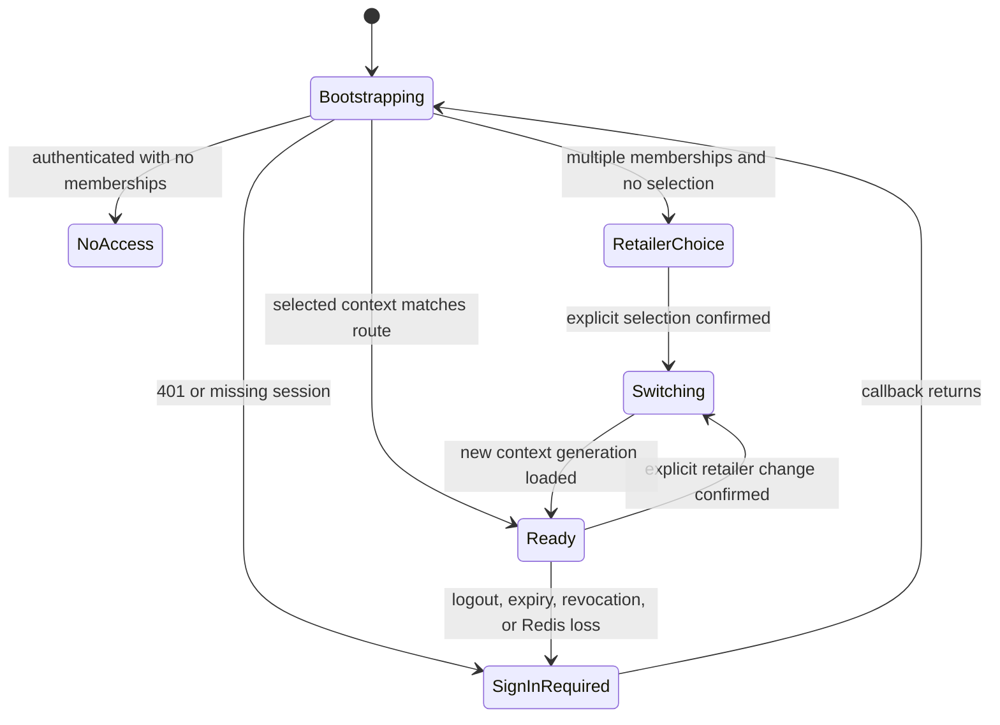
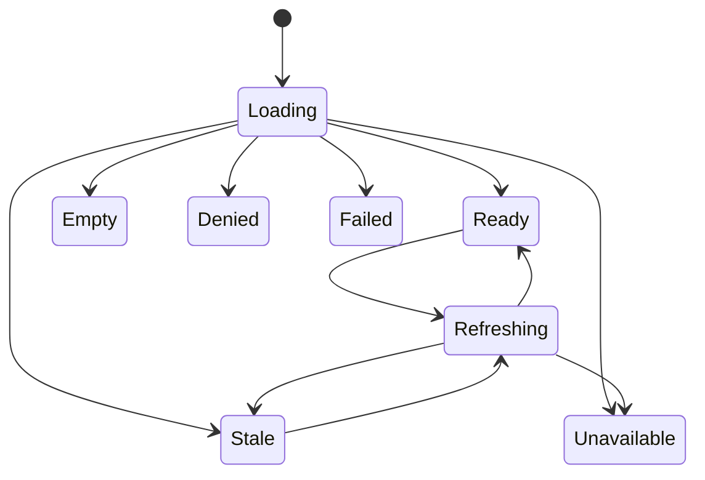
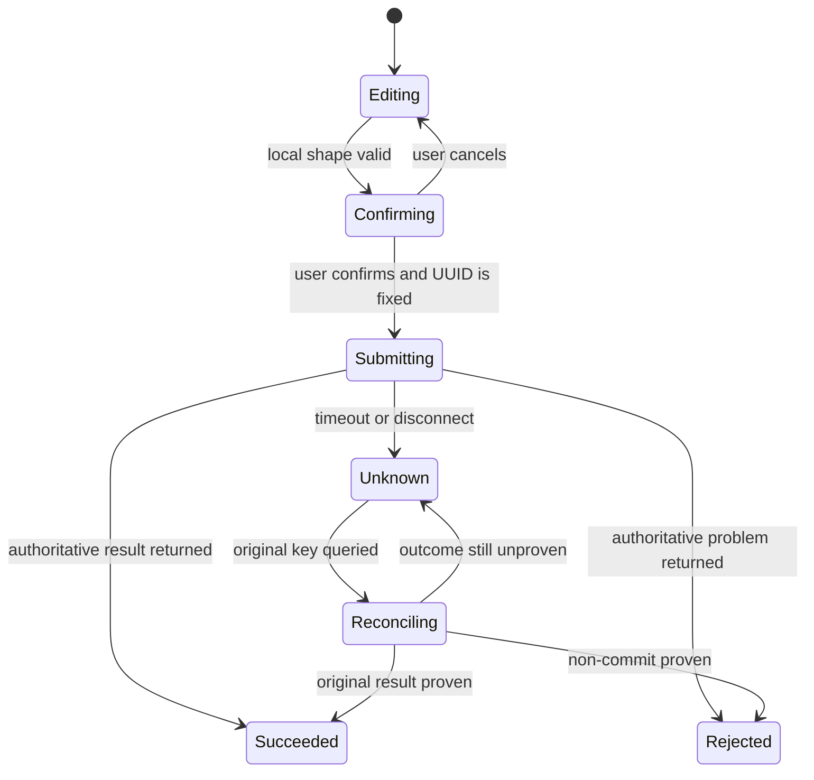
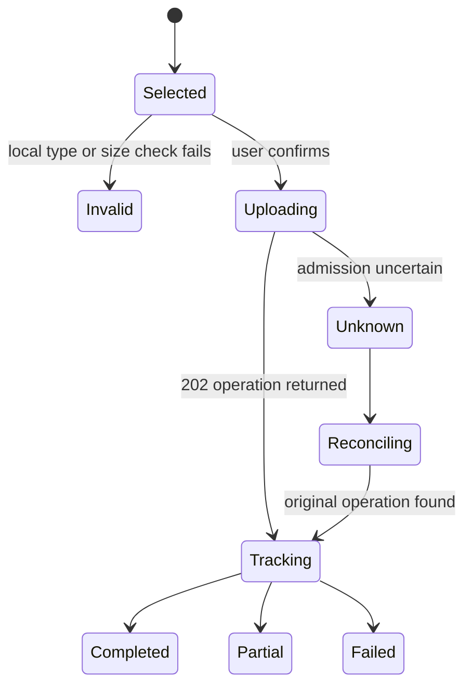
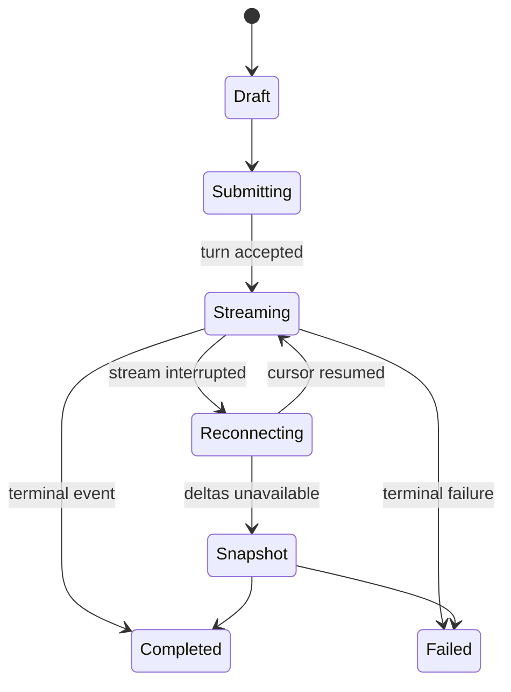

# Web Application Functional Specification

Unit: U12 Web Application (`web-application`)

Confirmation basis: the Web Application consolidated summary was confirmed as `Looks correct` on 2026-09-16.

## Purpose and boundary

U12 is the React, TypeScript, and Vite presentation layer for StockSense. It provides the authenticated shell, explicit retailer selection, exception-focused dashboard, operational workspaces, governed purchasing review, assistant surfaces, audit search, and portfolio evidence views using Ant Design and Ant Design Charts.

U12 owns no business entity or durable business state. It calls only the same-origin U11 Web BFF through the generated C18 TypeScript client. It never calls U3-U10 or infrastructure services directly, holds service tokens, interprets a route retailer as authority, or reproduces provider authorization and business rules. Server responses and provider-originated versions remain authoritative.

Private session, retailer, file, draft, response, and assistant data remain in memory. U12 does not persist them in `localStorage`, `sessionStorage`, IndexedDB, Cache Storage, or service-worker caches. The only cross-tab messages are logout and retailer-context-refresh signals; they contain no private payload.

## Actors and experience modes

| Actor | Primary capabilities | UI limits |
| --- | --- | --- |
| Planner | Import data, inspect inventory/supplier/forecast/replenishment evidence, request reviews, prepare and submit purchase drafts, use the assistant | Cannot approve or reject as a manager; provider remains authoritative |
| Manager | Review evidence, approve or reject submitted proposals, inspect audit evidence, use the assistant | Cannot edit locked submitted lines; provider remains authoritative |
| Authorized receiver | Record partial or completing receipts when the current role allows it | Cannot exceed approved remaining quantities |
| Reviewer | Run the documented local journey and inspect revision-bound evidence | Evidence visibility follows current access and safe publication rules |

Desktop and tablet expose the complete authorized workflow. At 360 px, users can read status, evidence, audit history, and assistant output; select a retailer; and approve or reject with the same evidence and confirmation flow. Imports, purchase-draft editing, cancellation, and receipt entry show a clear tablet/desktop requirement and preserve the deep link for continuation.

## Authority and privacy invariants

- Session bootstrap uses the no-store C18 session resource before a private route renders.
- A route under `/retailers/:retailerId` renders private data only after that ID matches U11's selected retailer context. An authorized mismatch offers an explicit switch; it never changes context automatically.
- A `401`, logout, or lost Redis-backed session clears all TanStack Query caches and transient private UI state, closes streams, removes selected files, and presents sign-in recovery. U12 never automatically replays an uncertain mutation after reauthentication.
- A `403` renders an explicit denied state. A tenant-hidden `404` does not reveal whether a foreign resource exists. A `409` renders conflict or reconciliation behavior. A `422` maps safe provider details to fields or a form summary. A `429` renders allowance and reset information. A `503` renders explicit unavailable state and correlation evidence.
- Every governed command uses current session, CSRF, retailer, expected resource version, and one UUID idempotency key created at user confirmation. UI visibility and disabled state improve safety but do not grant authority.
- Late query or stream results carry the retailer/query identity that created them. Results from an old retailer context are discarded before presentation or mutation binding.
- Logs and browser diagnostics exclude cookies, tokens, CSRF secrets, credentials, raw supplier documents, full private prompts, hidden reasoning, and unredacted provider exceptions.

## Application composition and state ownership

React Router owns route state. TanStack Query owns C18 server state and mutations. Ant Design Form plus typed adapters owns active form state. Component state and narrowly scoped React contexts own ephemeral presentation state such as open drawers, filters, table selection, and assistant-panel visibility. A general-purpose global business store is absent until measured evidence justifies one.

Generated C18 clients are the only HTTP entry point. Query keys start with the effective session generation and retailer context version, followed by feature, resource identity, filters, and contract version. Changing session generation or retailer context cancels in-flight work and removes old private caches before the next workspace renders.

All user-facing text uses stable `react-i18next` keys. Dates, times, numbers, percentages, quantities, and currencies use `Intl` with the current retailer's declared locale/time-zone/currency context where supplied. English is the initial resource bundle; pseudo-localization and RTL layout checks are development acceptance inputs.

## Interaction workflows

### WF1 — Bootstrap, sign in, and recover a session

1. Load public shell assets, then call C18 `getSession` with no application caching before rendering any private route.
2. On `200`, bind the session generation, actor display data, authorized retailer choices, role descriptors, selected retailer, context version, and CSRF state in memory.
3. With one membership, navigate to its dashboard when no retailer route was requested. With multiple memberships, present explicit selection. With no memberships, present no-access/provisioning guidance without signup or self-assignment.
4. On `401`, clear private query/UI state, stop streams, remove files and unsent drafts, and render sign-in-required recovery. Local and configured Google sign-in redirect through U11 only.
5. After callback, bootstrap again; never trust callback parameters or claim success before C18 establishes the session.
6. When `BroadcastChannel` reports logout, perform the same local purge. A context-refresh signal causes a session re-fetch but carries no retailer or private payload.

### WF2 — Select or reconcile retailer context

1. Keep the active retailer name and role visible in the top context bar.
2. For `/retailers/:retailerId/...`, compare the route ID with the bootstrapped U11 selection before feature queries start.
3. If they match, render the route. If they differ and the route retailer is currently listed, present an explicit switch action that describes discarded transient work.
4. On confirmed switch, send the C18 context command, wait for its new context/session generation, cancel old queries and streams, clear transient work, then navigate.
5. If the retailer is unauthorized, missing, or revoked, render tenant-hidden/unavailable guidance without listing foreign data.
6. Never resubmit, copy, or replay a pending command under the new retailer.

### WF3 — Compose the operational dashboard

1. Request the retailer dashboard with inventory as the required core and forecast, review, and supplier summaries as typed sections.
2. Render section skeletons independently, then replace each with `ready`, `empty`, `stale`, `unavailable`, `forbidden`, or `failed` presentation.
3. Use HTTP `200` with aggregate `complete` or `partial` state. Do not use HTTP `206` as the application-partial signal.
4. Keep last-known data visible only when source version and observed time remain visible. Disable actions whose prerequisites are stale or unavailable.
5. Discard any response whose retailer/context generation differs from the active route.

### WF4 — Import inventory, demand, and supplier sources

1. Let the user choose a declared import kind and one file. Validate extension, media type, and size before transmission: CSV up to 10 MiB and supplier PDF up to 25 MiB.
2. Keep the file object in memory only and submit through the progress-capable C18 upload path with current CSRF and one confirmation-time idempotency key.
3. Show bytes/progress without reading the entire file into persistent browser storage.
4. On `202`, discard the file reference and follow the returned operation resource through queued, processing, partial, failed, or completed states.
5. On disconnect or uncertain admission, reconcile the original idempotency key before enabling resubmission.
6. Render row/page/source validation outcomes, correlation identity, safe limitations, and links to resulting inventory, demand, supplier, or evidence views.

### WF5 — Inspect inventory and movement history

1. Query inventory by bounded filters and stable paging/sort state encoded in the URL where shareable.
2. Present a dense Ant Design table with freshness, source version, stock state, and exception indicators.
3. Open a keyboard-accessible right-side detail drawer for product context and chronological movements.
4. Preserve table focus when the drawer closes and announce refreshed, stale, empty, or failed results.
5. Never calculate an authoritative stock balance from incomplete client history; display the provider result and provenance.

### WF6 — Inspect suppliers, terms, model, and forecast evidence

1. Present supplier submissions and extraction status separately from accepted commercial terms.
2. Show source/page citations and safe evidence links without exposing raw foreign-tenant source locations.
3. Present model promotion/rollback status and forecast quality/freshness with their source, model, configuration, and data versions.
4. Mark missing, stale, unavailable, failed, rolled-back, or incompatible evidence explicitly; do not silently substitute a model or supplier term.
5. Actions remain disabled when provider evidence says required inputs are stale or unavailable.

### WF7 — Compare replenishment scenarios and request a review

1. Load current recommendation evidence and available buffer scenarios for the selected retailer.
2. Present scenario assumptions, quantities, shortage dates, evidence versions, and differences using accessible tables/charts with textual equivalents.
3. Request manual review only after an accessible confirmation; create one idempotency key and show current remaining allowance and reset time.
4. On `202`, follow the review operation. On `429`, show quota exhausted with the authoritative reset time and no retry countdown that implies success.
5. Show one active review, scheduled/manual origin, progress, terminal status, and failure/limitation evidence.

### WF8 — Draft and submit a purchase proposal

1. Start from an authorized recommendation or an assistant-proposed draft, then fetch the provider-created Draft before editing.
2. Use typed Ant Design forms for quantities and lines; client checks cover required shape, numeric format, safe bounds, and cross-field usability only.
3. Keep unsent edits in memory, warn before navigation, and render provider validation as authoritative field/form errors.
4. Before submission, show actor, retailer, supplier, lines, totals, evidence versions, and expected aggregate version in an accessible confirmation.
5. Submit once with the confirmation-time idempotency key. Disable duplicate controls and reconcile unknown outcomes before another action.
6. After provider confirmation, render locked submitted lines and new version; do not retain an editable clone that could imply the submitted record changed.

### WF9 — Approve, reject, cancel, and receive

1. Present a master-detail queue with status, version, evidence freshness, supplier/forecast/inventory references, prior decisions, and receipt balance.
2. Manager approve/reject requires full evidence and an accessible confirmation showing actor, action, retailer, target, and version. Rejection captures required reason when the contract requires it.
3. Cancellation is available only when provider state permits it and only on tablet/desktop. The UI never infers eligibility from a locally cached status.
4. Receipt entry is tablet/desktop only. Validate nonnegative shape and visible remaining quantities for usability, then let U8 enforce cumulative and atomic multi-line rules.
5. Every transition uses one idempotency key, expected version, duplicate suppression, and unknown-outcome reconciliation.
6. Map stale-version, replay-mismatch, over-receipt, cancellation/receipt race, and invalid-state conflicts to distinct recovery guidance without claiming success.

### WF10 — Use contextual and full-page assistant surfaces

1. Start or resume a conversation bound to the current actor, retailer, language, provider/model, and conversation version through C18.
2. Submit one bounded turn with CSRF, expected version, and idempotency key, then subscribe to the same-origin SSE stream.
3. Deduplicate events by conversation, turn, and event identity; resume with the bounded cursor after disconnect; fall back to the authorized operation snapshot when deltas are unavailable.
4. Render ordinary prose as sanitized Markdown and structured output only through the allowlisted GenUI registry: evidence card, typed table, citation list, comparison, review-request draft, and purchase-proposal draft.
5. Reject arbitrary HTML, scripts, component names, callbacks, retailer/authority values, and hidden parameters from model output.
6. State-changing drafts show exact payload/evidence and enter the same conventional confirmation, authorization, idempotency, and reconciliation workflow. The assistant cannot submit, approve, reject, cancel, or receive an order.

### WF11 — Search audit and inspect portfolio evidence

1. Query audit history with bounded date/filter/page inputs and display correlation, actor, target, outcome, projection generation, checkpoint, freshness, and lag.
2. Preserve tenant-hidden `404`, stale, partial, and unavailable distinctions; do not present a lagging projection as complete.
3. Present reviewer evidence by revision, environment profile, scenario seed, check outcome, limitation, and checksum through the supported C18/U13 boundary.
4. Artifact presence is labeled separately from measured pass/fail/limited results.

### WF12 — Run the reproducible browser journey

1. Serve U12 and U11 from the approved same-origin ingress and use local sign-in by default; Google remains optional.
2. Traverse retailer selection, dashboard, imports, review, purchasing, assistant, audit, logout, and Redis-loss recovery through generated C18 calls only.
3. Capture visible complete, partial, empty, denied, stale, unavailable, quota, idempotent replay, and recovery states against the immutable revision.
4. Keep the clean CPU-only reviewer path free of owner credentials, paid API use, required GPU use, and browser-stored secrets.

## Screen and interaction state models

### Private application shell

### Query section

### Governed command

### Upload and operation

### Assistant turn

## Interaction rules and story coverage

These BR identifiers are UI interaction rules for traceability. They do not grant business authority or duplicate provider invariants.

| Rule | Story | Authoritative U12 behavior |
| --- | --- | --- |
| BR1.1 | US1.1 Local sign-in | Render local sign-in and callback recovery through U11; claim no session until bootstrap succeeds; clear private state on expiry and never replay uncertain work. |
| BR1.2 | US1.2 Google federation and safe linking | Offer Google only when configured; render exact callback/linking outcomes without treating matching email as proof or authority. |
| BR1.3 | US1.3 Logout | Invoke U11 logout, purge all private in-memory state across tabs, show signed-out state, and require a new StockSense session. |
| BR1.4 | US1.4 Retailer authorization | Show only returned memberships, keep selected retailer visible, require route/context agreement, discard late old-context results, and show no-access guidance. |
| BR2.2 | US2.2 Validated inventory imports | Validate bounded CSV presentation inputs, stream to U11 with progress/idempotency, and render operation plus row-level outcomes. |
| BR2.3 | US2.3 Inventory and movement history | Present provider-owned positions and ordered movement evidence with explicit empty/failure/stale states and accessible detail navigation. |
| BR2.4 | US2.4 Trustworthy cache behavior | Display source version and observed time for retained data, discard cross-context results, and never use browser cache as authority. |
| BR2.5 | US2.5 Import sales history | Submit bounded demand CSV through U11 and render accepted, partial, failed, duplicate, and validation outcomes with operation evidence. |
| BR3.1 | US3.1 Supplier CSV offers | Upload bounded supplier CSV and present extraction/validation status separately from accepted terms. |
| BR3.2 | US3.2 Supplier PDF evidence | Upload text PDF up to 25 MiB, follow extraction operation, and render page/source evidence and explicit scan/unsupported outcomes. |
| BR3.3 | US3.3 Accepted commercial terms | Present provider-accepted terms with currency, validity, source version, citation, and stale/replaced status. |
| BR4.5 | US4.5 Model promotion and rollback | Present candidate/current/rolled-back model status and immutable evidence; expose only authorized provider actions and outcomes. |
| BR4.6 | US4.6 Forecast quality and freshness | Present forecast horizon, quality, freshness, provenance, stale/unavailable/failed states, and no silent fallback claim. |
| BR5.3 | US5.3 Compare buffer scenarios | Compare scenario assumptions and outputs with accessible tabular/chart alternatives and stable evidence versions. |
| BR5.4 | US5.4 Manual inventory review | Confirm once, submit one idempotent request, track the operation, and render accepted, active, quota, conflict, and failure states. |
| BR5.5 | US5.5 Review status and allowance | Show review origin/status, remaining accepted allowance and reset time, without locally consuming or restoring quota. |
| BR6.1 | US6.1 Draft a purchase proposal | Create or open the provider Draft, allow authorized line edits in memory, show evidence/version, and map validation errors. |
| BR6.2 | US6.2 Submit a draft | Confirm exact immutable payload, submit once, reconcile uncertainty, and render provider-locked lines and new version. |
| BR6.3 | US6.3 Approve or reject a proposal | Show full evidence and current version, require explicit manager confirmation, and render provider-authoritative decision/conflict outcome. |
| BR6.4 | US6.4 Cancel before receipt | Offer cancellation only for provider-eligible state on tablet/desktop, confirm it, and reconcile races without optimistic success. |
| BR6.5 | US6.5 Record partial receipt | Capture typed receipt lines on tablet/desktop, show remaining approved quantities, and render atomic provider validation and stock outcome. |
| BR6.6 | US6.6 Complete receipt | Show cumulative balances and completion result from the provider; never infer completion from client arithmetic alone. |
| BR7.1 | US7.1 Local assistant inference | Display active local provider/model status, explicit unavailable/failure state, and no automatic external fallback. |
| BR7.4 | US7.4 Bounded assistant conversation | Bind conversation to current context, enforce one visible active turn, bound input/history presentation, and expose citations/limitations. |
| BR7.6 | US7.6 Investigate inventory shortages | Render typed inventory/forecast/recommendation evidence with citations and explicit missing/stale/conflicting states. |
| BR7.7 | US7.7 Compare suppliers conversationally | Render allowlisted comparison UI using accepted terms and citations without treating model prose as commercial truth. |
| BR7.8 | US7.8 Explain replenishment scenarios | Render typed scenario comparison and explanation with source versions and deterministic-result precedence. |
| BR7.9 | US7.9 Request review in conversation | Convert an assistant review draft into the conventional confirmation/idempotency/operation flow; show quota and reconciliation states. |
| BR7.10 | US7.10 Draft a proposal conversationally | Show exact typed draft payload/evidence, require human confirmation, and open the provider-created editable Draft; assistant has no submit authority. |
| BR7.11 | US7.11 Recover interrupted agent work | Deduplicate/resume SSE by bounded identity, use snapshot fallback, and preserve explicit uncertain or failed state. |
| BR8.1 | US8.1 Build the application skeleton | Provide runnable same-origin shell, generated-client seam, navigation, health/recovery presentation, and representative end-to-end route. |
| BR8.2 | US8.2 Validate integration contracts | Generate and type-check C18 clients; fail integration on incompatible operations/models and map stable RFC 9457 codes. |
| BR8.3 | US8.3 Provision local Kubernetes | Run from configured same-origin ingress without machine-specific URLs and expose actionable startup/unavailable states. |
| BR8.7 | US8.7 Check changes before integration | Run formatting, lint, type, unit/component, accessibility, contract-client, and browser checks for affected UI behavior. |
| BR8.8 | US8.8 Deploy trusted revisions | Display revision/build identity and avoid claiming a release healthy before the deployed checks report it. |
| BR9.2 | US9.2 Search authorized audit history | Render bounded tenant-authorized audit queries with freshness, checkpoint, lag, correlation, pagination, and unavailable states. |
| BR10.1 | US10.1 Reproduce the reviewer journey | Provide a local CPU-only browser journey covering success, degradation, safety, and recovery without owner credentials. |
| BR10.2 | US10.2 Inspect portfolio evidence | Present revision-bound evidence, checksums, outcomes, and limitations while distinguishing artifact presence from measured success. |

## Error, freshness, and recovery presentation

| Contract outcome | Presentation behavior | Mutation behavior |
| --- | --- | --- |
| `401` | Sign-in-required screen after private-state purge | Never replay automatically |
| `403` | Access denied with safe role/context guidance | Disable affected action |
| tenant-hidden `404` | Not available without existence disclosure | Clear selected foreign resource |
| `409` | Version/state/idempotency conflict with refresh or reconcile action | Reuse original key only for reconciliation; require a new user decision for a changed command |
| `422` | Field errors plus accessible form summary, or safe operation validation details | Keep editable input in memory when safe |
| `429` | Quota exhausted, remaining allowance, and reset time | Disable until an authoritative refresh allows another request |
| `503` | Section or page unavailable with correlation ID and safe retry affordance | Do not imply commit or model fallback |
| network timeout/disconnect | Last-known data labeled by time/version, or unknown command state | Reconcile before enabling another logical action |

Every async section has explicit loading, empty, ready, stale, denied, quota, unavailable, and failed representations when applicable. Refresh controls preserve keyboard focus and announce status through an appropriate live region without repeatedly announcing streaming text fragments.

## Accessibility and responsive behavior

- Meet WCAG 2.2 AA for color contrast, focus visibility, target sizing, reflow, labels, status announcements, error identification, and keyboard operation.
- Use semantic headings and landmarks; one logical page heading describes the active workspace. Skip navigation reaches primary content.
- Ant Design tables provide meaningful headers, sort state, accessible row actions, and a non-chart textual alternative. Virtualization is allowed only when screen-reader and keyboard behavior remains verified.
- Drawers and dialogs trap focus while open, name their purpose, restore focus to the invoking control, and never rely on color alone.
- Confirmation dialogs enumerate actor, action, retailer, target, version, and consequences. Destructive actions use explicit verbs.
- Charts use accessible palettes, labels/tooltips, and an equivalent summary or table. Animations respect reduced-motion preferences.
- The desktop left sidebar collapses for tablet and becomes a drawer for mobile. The context bar keeps retailer identity visible. Unsupported mobile actions render explanatory guidance and a preserved continuation link rather than hidden or broken controls.

## Verification seams

- Generated-client contract tests prove U12 calls declared C18 operations and handles declared problem codes and typed section states.
- Component tests cover query-state rendering, focus restoration, form summaries, command confirmation, duplicate suppression, and unknown-outcome reconciliation.
- Accessibility tests combine automated checks with keyboard, screen-reader landmark/name/state checks, zoom/reflow, pseudo-localization, and RTL layout inspection.
- Browser tests cover login recovery, explicit retailer switch, late-response rejection, upload progress/operation tracking, purchasing conflicts, SSE reconnect/deduplication, mobile action boundaries, logout propagation, and Redis-loss reauthentication.
- Negative tests prove no direct service URL, access token, CSRF secret, private payload, selected file, or business draft enters persistent browser storage or logs.
- Exact performance, browser-version, bundle-size, accessibility-threshold, and concurrency targets are specified in NFR Requirements rather than invented here.

## Contract dependencies and corrections

U12 depends on C18 supplying generated schemas and operations for every screen described here: session/login/logout/context selection; dashboard; inventory/movement queries; bounded imports and operation reconciliation; supplier evidence and accepted terms; model/forecast evidence; scenarios/reviews/allowance; purchase Draft CRUD and all transitions; assistant conversations/turns/SSE/snapshot; audit search; and reviewer evidence.

The current inception `contract-summary.md` shows only a subset of those operations and still describes dashboard partiality with HTTP `206`. Before code generation, U1/U11 must publish the complete C18 OpenAPI shapes and replace application-level `206` with HTTP `200` plus typed aggregate `complete` or `partial` state, as confirmed in U11 and U12 Functional Design. C18 must also expose an authoritative operation/idempotency reconciliation resource, refresh-rotation-safe session generation, and contract-version metadata used by generated clients and cache keys. U12 does not invent missing wire shapes.

## Assumptions and open questions

- The exact C18 route/model names will come from U1; this specification fixes behavior, not unapproved wire syntax.
- Exact breakpoint pixels beyond the confirmed 360 px boundary, supported browser versions, interaction budgets, stream retry timing, polling cadence, and bundle budgets remain NFR decisions.
- Google federation remains optional and hidden or clearly unavailable when not configured.
- External model providers remain explicit server-side configuration and never become a browser-selected automatic fallback.

## Sources

- `inception/units-generation/unit-of-work.md`
- `inception/units-generation/unit-of-work-story-map.md`
- `inception/requirements-analysis/requirements.md`
- `inception/user-stories/stories.md`
- `inception/domain-design/components.md`
- `inception/contract-design/contract-summary.md`
- `inception/refined-mockups/`
- `construction/web-application/functional-design/functional-design-questions.md`
- `construction/web-bff/functional-design/functional-spec.md`
- `construction/assistant/functional-design/functional-spec.md`
- `construction/planning-purchasing/functional-design/functional-spec.md`
- `construction/audit-evidence/functional-design/functional-spec.md`

## Review

**Verdict:** NOT-READY
**Reviewer:** aidlc-architecture-reviewer-agent
**Date:** 2026-09-16T11:47:52Z
**Iteration:** 1

### Findings

| ID | Severity | Location | Finding | Required action | Status |
|---|---|---|---|---|---|
| R-01 | Major | `aidlc/spaces/default/intents/260908-stock-sense-design/construction/web-application/functional-design/functional-spec.md` > Contract dependencies and corrections; `aidlc/spaces/default/intents/260908-stock-sense-design/inception/contract-design/contract-summary.md` > C18 — Browser API exposed by the Web BFF | The design requires C18 operations and models for session context changes, workspace reads, operation/idempotency reconciliation, Draft CRUD, assistant SSE/snapshots, and reviewer evidence, but the passed C18 contract defines only a subset. It also still specifies dashboard partiality as HTTP `206`, while WF3 requires HTTP `200` with a typed `complete`/`partial` state. U12 cannot generate its only HTTP client or implement several workflows without inventing wire shapes. | Complete and version C18 before code generation, including request/response schemas, problem codes, operation reconciliation, session/context generation, SSE event/cursor/snapshot envelopes, and the corrected dashboard partial-state response. | New |
| R-02 | Major | `aidlc/spaces/default/intents/260908-stock-sense-design/construction/web-application/functional-design/functional-spec.md` > WF1 step 6 and Private application shell state model; `frontend-components.md` > Provider composition and state ownership | A cross-tab `retailer-context-refresh` only triggers a session refetch. The shell state model has no revalidation/fenced state for that signal, and cache/stream cancellation is specified only once a changed generation is observed. During a slow or failed refetch, the old retailer UI and commands can remain active even though U11 may already have changed context. Server authorization limits tenant disclosure, but the UI can bind a user action to a retailer different from the one still displayed. | Define an immediate context-revalidation transition on the signal: fence mutations, stop streams, suspend private rendering, clear or quarantine old-context data, and specify success, failure, and unchanged-generation outcomes before actions resume. | New |
| R-03 | Major | `aidlc/spaces/default/intents/260908-stock-sense-design/construction/web-application/functional-design/functional-spec.md` > Governed command and Upload and operation state models; `frontend-components.md` > SH-011 `UnknownOutcomePanel` | Command reconciliation can cycle `Reconciling → Unknown` indefinitely, while SH-011 says a user may deliberately abandon the block. The specification defines neither that transition nor when a non-commit is proven, whether the original idempotency key remains reserved, or how upload admission returns to a safe resubmittable state. Different implementations can therefore duplicate commands or permanently strand a workflow. | Add explicit reconciliation outcomes and transitions for committed success, authoritative rejection/non-admission, still-unknown retry, and deliberate abandonment; define key retention, payload-change rules, resubmission eligibility, and user-visible evidence for each outcome. | New |
| R-04 | Major | `aidlc/spaces/default/intents/260908-stock-sense-design/construction/web-application/functional-design/frontend-components.md` > SSE behavior; `functional-spec.md` > WF10 and Assistant turn state model | SSE handling rejects duplicate or decreasing event IDs but does not define detection or recovery for a forward gap. A terminal event received after a missing delta can be accepted and rendered as complete with omitted content or action evidence. The absent C18 event-envelope contract compounds this ambiguity. | Require contiguous sequence validation (or an equivalent server-declared completeness rule), route any gap to snapshot reconciliation before accepting later or terminal events, and define snapshot/event merge and terminal-completeness rules in C18 and the UI state model. | New |

### Validation Tool Results

| Tool | Result | Interpretation |
|---|---|---|
| required-sections (read-only heading check) | PASS for `functional-spec.md` and `frontend-components.md` | Both artifacts contain the stage-relevant boundary, workflow/state, rule/component, error, accessibility/responsive, verification/test, and dependency sections. |
| traceability content check | PASS: 138 upstream IDs, 138 unique coverage entries, 138 `OK`, and 38 unique BR targets | Structural coverage exactly matches the 38 U12 story assignments and the 38 story-rule rows. The UI-kind `rules.md` lookup mismatch is a framework sensor limitation; independent target resolution against `functional-spec.md` succeeds and does not contribute to the verdict. |
| `git diff --check -- construction/web-application/functional-design` | PASS | No whitespace errors were reported before the review append. |

### Summary

The U12 interaction design is broad and structurally traceable, but implementation remains dependent on an incomplete and contradictory C18 contract. Context-refresh fencing, uncertain-command termination, and SSE gap recovery also need explicit state semantics to prevent wrong-context actions, duplicate or stranded commands, and incomplete assistant output.
