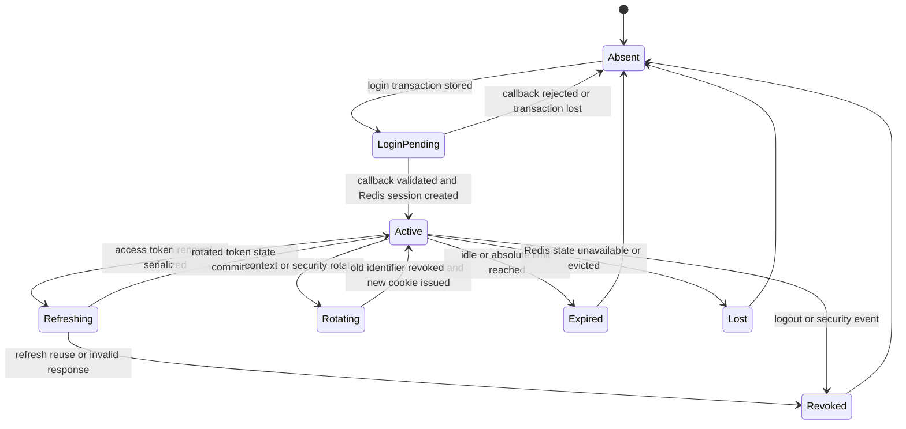
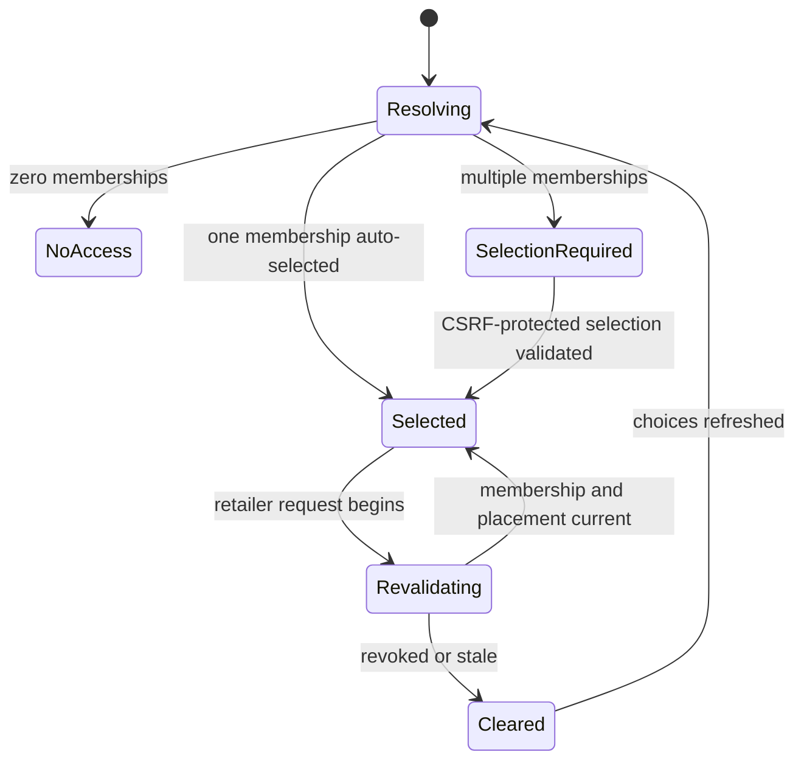
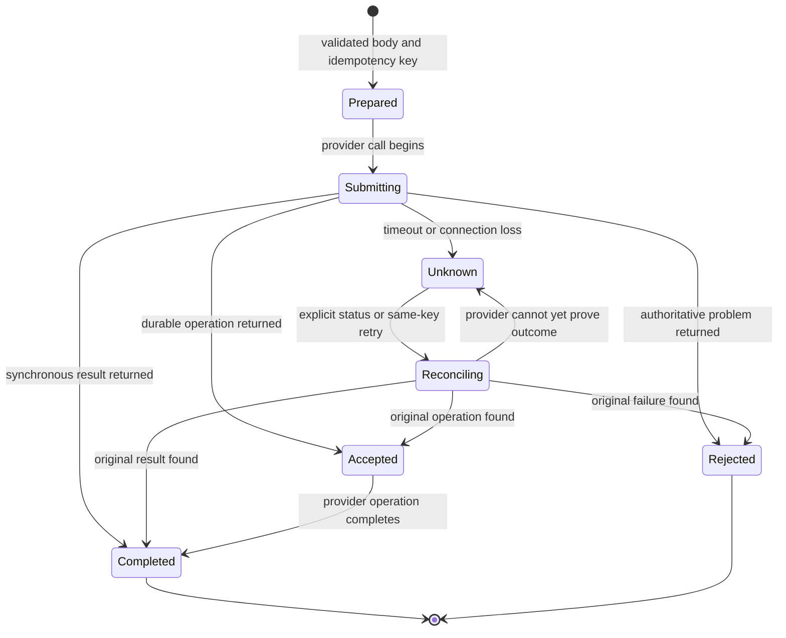
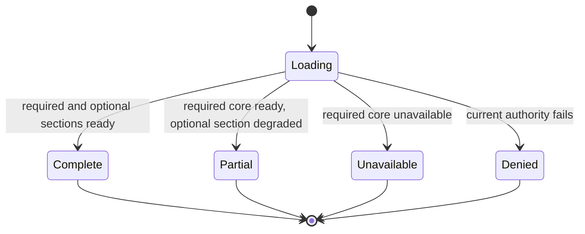
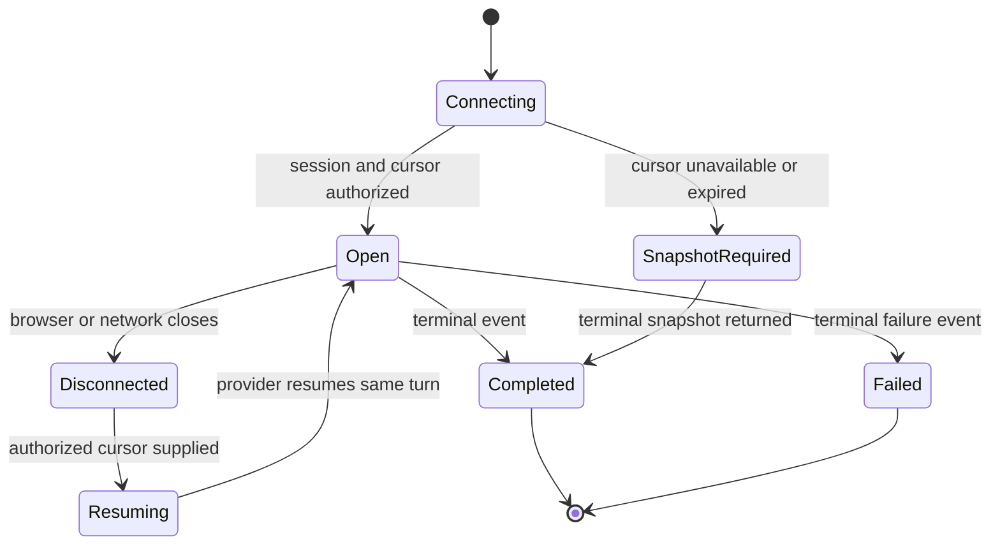
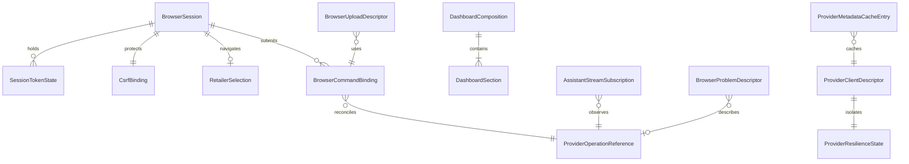

# Web BFF Functional Specification

Unit: U11 Web BFF (`web-bff`)

Confirmation basis: the Web BFF consolidated summary was confirmed as `Looks correct` on 2026-09-15.

## Purpose and boundary

The Web BFF is StockSense's same-origin browser security and composition boundary. It alone acts as the browser-facing OIDC client, keeps delegated user tokens server-side, converts the authenticated session and selected retailer into provider calls, protects browser mutations against CSRF, composes read models, streams bounded uploads, proxies long-running operation status and assistant events, and maps provider failures into browser-safe states.

U11 owns no retailer, inventory, demand, supplier, model, forecast, recommendation, purchase, conversation, audit, or evidence fact. A BFF session, selected retailer, cached provider descriptor, composed response, or operation link cannot grant authority or make a provider mutation valid. U3 owns authentication and token issuance, U4 owns retailer memberships and placement, and U4-U10 remain authoritative for their domain resources and operation outcomes.

Redis is U11's sole session store. Its state is intentionally ephemeral: losing Redis invalidates every browser session and requires sign-in again. Provider-owned commands and jobs remain available under their own idempotency and operation contracts after the user reauthenticates. U11 has no PostgreSQL schema and stores no uploaded body or provider business record.

## Authority and trust model

- The browser sends an opaque Secure, HttpOnly, host-only `__Host-stocksense-session` cookie. It never receives access tokens, refresh tokens, service credentials, signing keys, or provider secrets.
- The BFF accepts a session only when the Redis record exists, its idle and absolute limits have not expired, its cookie generation is current, and its U3 token state is valid. Missing Redis state is an unauthenticated session.
- U11 calls U4-U10 with one short-lived delegated user token for the shared `stocksense-api` audience and narrow scopes. Machine credentials cannot replace the user token for a human operation.
- The selected retailer is navigation state. U11 validates route and session agreement and obtains current membership and placement context; every provider independently validates membership, role, resource ownership, and placement generation.
- Mutation authority comes from the current user token plus provider-owned state and rules. CSRF, an idempotency key, a cached response, an operation URL, or an LLM answer is never authority.
- Return URLs are local allowlisted paths. Callback state, nonce, PKCE verifier, cookie generation, and correlation identifiers are untrusted until validated against the Redis session transaction.
- Provider responses are untrusted at the BFF boundary for shape, size, tenant context, and disclosure. Generated U1 clients validate the declared contract; U11 maps only allowlisted fields and safe problem codes.
- Logs, metrics, traces, caches, and browser responses exclude tokens, cookies, CSRF secrets, credentials, full prompts, hidden reasoning, raw supplier documents, unrestricted exception data, and tenant-hidden identifiers.

## Workflows

### WF1 — Begin local or federated login

1. Validate the requested return path against the local application allowlist; replace an invalid value with the safe default route.
2. Create a short-lived login transaction in Redis containing a random state, nonce, PKCE verifier, return path, creation time, expiry, and one-time-use marker.
3. Redirect to U3's authorization endpoint using authorization code with PKCE. Google federation remains an optional U3 concern; U11 uses the same OIDC client callback.
4. Do not create an authenticated browser session before the callback succeeds.
5. If Redis loses the login transaction, reject the callback and begin a new sign-in rather than reconstructing state from browser parameters.

### WF2 — Complete the OIDC callback and establish a session

1. Require an exact, unexpired, unused login transaction and validate state, nonce, issuer, audience, code, redirect URI, PKCE result, and token response.
2. Mark the login transaction consumed atomically so a replayed callback cannot create a second session.
3. Create a high-entropy opaque session identifier and Redis record containing subject/account reference, delegated token state, refresh-token rotation state, 30-minute idle expiry, 8-hour absolute expiry, CSRF binding, cookie generation, and no selected retailer until memberships are resolved.
4. Resolve current retailer choices through U4. Auto-select exactly one membership, retain no selection for zero memberships, and require explicit selection for multiple memberships.
5. Set the Secure, HttpOnly, `SameSite=Lax`, `Path=/`, no-`Domain` `__Host-stocksense-session` cookie and redirect only to the validated local path.
6. Return no token or provider secret to the browser. Record safe authentication outcome and correlation evidence through the supported audit boundary.

### WF3 — Use, refresh, revoke, or lose a browser session

1. Resolve the opaque cookie to Redis and reject absent, expired, revoked, or superseded generations as unauthenticated.
2. Update idle activity without extending the absolute expiry. Concurrent requests use atomic compare-and-set session versioning.
3. Serialize access-token refresh per session. Rotate a refresh token once, persist the returned token state before releasing waiting calls, and revoke the session when reuse or an inconsistent response is detected.
4. Rotate the session identifier and CSRF token after privilege-sensitive reauthentication, token-reuse recovery, and retailer-context reset; invalidate the previous identifier before returning the replacement cookie.
5. Logout revokes the Redis session first, expires the browser cookie, and then performs the supported U3 end-session flow. Repeated logout remains safe.
6. Redis restart or eviction removes the session. The next browser request returns `401`; the UI clears private state and starts a new login when the user chooses.

### WF4 — Select and enforce retailer context

1. Return current authorized retailer choices and CSRF token from the no-store session resource.
2. If more than one current membership exists, accept a CSRF-protected selection command for one listed retailer.
3. Revalidate the selected retailer and placement generation with U4, atomically update the Redis session, rotate CSRF state, and return the selected context version.
4. Require every retailer-scoped browser route to match the selected session context. A different URL does not switch context implicitly.
5. Before every provider call, resolve current membership and placement context. Providers revalidate the delegated subject, role, resource, and placement independently.
6. Clear a revoked, missing, or stale selection and return an explicit context-required or access-denied state. Never replay a mutation against a new placement or retailer.

### WF5 — Validate CSRF and browser mutation preconditions

1. Allow safe reads only on methods declared safe by C18 and provider contracts.
2. For every state-changing request, require the current synchronizer token in `X-CSRF-Token`, constant-time match against the Redis session binding, route/session retailer agreement, and a same-origin `Origin` or valid fallback `Referer`.
3. Reject missing or mismatched CSRF state before reading an upload body or calling a provider.
4. Rotate CSRF state after login, logout, session/cookie rotation, and retailer change. A token from an older session or retailer is invalid.
5. Apply request shape and size validation before provider work and return a stable safe problem code on failure.

### WF6 — Compose the role-aware dashboard

1. Resolve one current membership/placement snapshot and correlation identity for the request.
2. Call the required inventory summary and requested optional forecast, review, and supplier sections through independently isolated generated clients.
3. Validate each provider response against its contract, retailer context, source version, size bound, and freshness descriptor.
4. Return `200` when every requested section is current and ready.
5. Return `206` when membership and inventory are valid but one or more optional sections are `stale`, `unavailable`, or `forbidden`. Include every requested section with a typed state rather than silently omitting it.
6. Return `503` when the required inventory core is unavailable, or the applicable `401`, `403`, or tenant-hiding `404` when authority cannot be established.
7. Include section source version, observed time, freshness, safe code, and correlation identity. A partial result cannot authorize a command that requires missing or stale evidence.

### WF7 — Stream an import or supplier upload

1. Authenticate the session, enforce retailer context, validate CSRF and one UUID idempotency key, and select the provider endpoint from the declared import kind.
2. Reject unsupported kinds, filenames, extensions, declared media types, or initial content signatures before forwarding substantive content.
3. Enforce deployment-configurable defaults of 10 MiB for CSV and 25 MiB for PDF plus the provider's decompressed, row, page, and content constraints.
4. Stream the body directly to the owning provider while computing a SHA-256 digest and enforcing byte/time limits. U11 never stores the body durably or logs content.
5. Abort the provider stream on browser disconnect or limit violation when the provider has not admitted the job.
6. Return `202` and the same-origin operation location after provider admission. If admission outcome is uncertain, return an explicit reconciliation state and never submit a new key automatically.

### WF8 — Submit and reconcile a provider command

1. Require the current session, retailer context, CSRF token, UUID idempotency key, expected aggregate/source version where applicable, and a contract-valid body.
2. Bind the key in Redis to subject, session, retailer, operation, expected version, and canonical request hash for the session lifetime; changed content under the same key is a conflict.
3. Forward the key and delegated user token unchanged to the authoritative provider. The provider owns durable idempotency and transition validation.
4. Do not retry a mutation automatically. A timeout or connection loss returns an explicit unknown/pending outcome with the operation reconciliation route when available.
5. A matching browser repeat queries or resubmits through the provider's idempotent contract and returns the original outcome; it does not create a new logical command.
6. After BFF session loss, require reauthentication and current authority before querying the provider-owned operation. Redis loss cannot erase, complete, or repeat the provider command.

### WF9 — Request manual review and handle allowance state

1. Apply WF8 to the review request with the same idempotency key and current retailer context.
2. Return the provider's accepted job identity, remaining retailer-local-day allowance, reset time, and active-job state.
3. Preserve `409` for matching active work or idempotency mismatch and `429` for an exhausted allowance, using browser-safe typed details.
4. Poll the provider-owned operation. U11 never calculates, consumes, restores, or caches the allowance as authority.

### WF10 — Execute purchasing transitions

1. Route draft creation/edit, submit, approve, reject, cancel, and receipt commands only to U8's declared operation with the delegated actor and current context.
2. Require the operation's expected version and idempotency key. Preserve planner/manager/receiver role distinctions without deciding them in U11.
3. Return provider-authoritative versions, line locks, decisions, receipts, balances, and conflicts through contract-shaped browser DTOs.
4. Never retry a purchasing mutation automatically or infer success from a later read. Use operation/status reconciliation after uncertainty.
5. Hide foreign-tenant orders and map stale version, replay mismatch, over-receipt, cancel/receipt race, and atomic multi-line validation to safe distinct codes.

### WF11 — Start, observe, disconnect, and resume long-running work

1. For imports, reviews, forecasts, and assistant turns, translate provider admission into `202` plus an opaque same-origin operation URL.
2. A status GET revalidates the session, retailer, role, operation ownership, and placement before proxying provider state.
3. Poll with a bounded cadence and respect provider retry guidance. Safe GETs may receive one retry only inside the request budget.
4. Browser disconnect stops the BFF request but does not cancel admitted provider work. Cancellation exists only when the provider contract declares and authorizes it.
5. Terminal results remain provider-owned and include source versions, failures, and limitations without U11 rewriting business meaning.

### WF12 — Create and resume an assistant turn

1. Validate session, retailer context, CSRF, conversation ownership, expected conversation version, idempotency key, and bounded turn input.
2. Submit one turn to U9 and return the provider-owned turn/operation identity. U11 never invokes tools or interprets model text as authority.
3. Proxy a same-origin server-sent event stream whose events carry bounded IDs, turn identity, event kind, safe payload, and terminal state.
4. On reconnect, validate `Last-Event-ID` or the equivalent bounded cursor against the same subject, retailer, conversation, and turn before resuming from U9.
5. Reject a cursor that is foreign, expired, ahead, or incompatible. Fall back to the current operation snapshot when retained deltas are unavailable.
6. Never duplicate a turn, persist generated text in the BFF, expose hidden reasoning, or cancel provider work merely because the stream disconnected.

### WF13 — Query audit history

1. Revalidate session, selected retailer, membership, role, placement, date range, filters, page size, and opaque cursor.
2. Call U10 through its generated client. The browser cannot supply an OpenSearch index, projection route, or authority-bearing tenant header.
3. Return only tenant-authorized evidence descriptors with projection generation, checkpoint, freshness, lag, correlation fields, and stable ordering.
4. Preserve explicit stale, partial, and unavailable semantics; never present a lagging or failed projection as complete.
5. Tenant-hidden resources return `404`, and unsafe provider details are removed.

### WF14 — Cache safe metadata and contain provider failure

1. Cache only Redis session state, validated OIDC discovery/JWKS within issuer lifetimes, and provider metadata explicitly marked cacheable.
2. Key provider metadata by subject, retailer, placement generation, scope, provider, contract version, and source version. Do not use stale membership or cached mutation output as authority.
3. Give each generated provider client an independent timeout, concurrency bulkhead, and circuit state.
4. Permit at most one bounded retry for a safe GET when the total browser deadline still allows it. Never retry a mutation automatically.
5. Convert malformed, oversized, timed-out, circuit-open, and unavailable provider results into stable BFF problem codes or typed partial sections.
6. Propagate one valid correlation ID or generate a new one; never echo unbounded identifiers or provider exception bodies.

### WF15 — Run the reproducible browser journey

1. Serve U12 and U11 through the fixed same-origin application ingress while U3 remains at its approved identity origin.
2. Exercise local login, retailer choice, dashboard composition, imports, review, purchasing, assistant status/SSE, audit search, logout, and Redis-loss sign-in recovery only through C16-C18.
3. Validate generated clients against U1 contracts and record actual complete, partial, denied, stale, unavailable, idempotent-replay, and recovery outcomes.
4. Keep Google optional and keep the clean CPU-only local journey free of external credentials.
5. Publish evidence only through U13's C19 boundary; artifact presence cannot substitute for a measured passing result.

## State models

### Browser session

### Retailer context

### Browser command

### Dashboard composition

### Assistant event stream

## Entity relationships

The entity YAML in `entities.md` is authoritative. This readable projection uses the same entity names and shows the relationships most relevant to browser workflows.

## Rules summary

The fenced YAML in `rules.md` is authoritative. It contains 38 rules aligned one-to-one with U11's assigned stories and covers all 138 assigned acceptance criteria.

| Rule group | Count | Required behavior |
| --- | ---: | --- |
| BR1 | 4 | Login, federation, logout, retailer authority |
| BR2 | 4 | Inventory and demand imports, history, and cache trust |
| BR3 | 3 | Supplier uploads, accepted terms, and citations |
| BR4 | 2 | Model actions and forecast evidence |
| BR5 | 3 | Replenishment scenarios and manual reviews |
| BR6 | 6 | Purchase drafts, decisions, cancellation, and receipts |
| BR7 | 8 | Assistant inference, tools, commands, and interruption recovery |
| BR8 | 5 | Skeleton, contracts, Kubernetes, CI, and trusted deployment |
| BR9 | 1 | Tenant-authorized audit search |
| BR10 | 2 | Reproducible reviewer journey and portfolio evidence |

## Contract refinements

The U1 package must preserve existing versions while adding implementable schemas and examples for:

- **C16 session security:** opaque cookie behavior, Redis-session expiry, cookie generation, CSRF binding, login transaction, local return-path allowlist, token refresh serialization, logout, replay rejection, and explicit Redis-loss `401` behavior.
- **Shared delegated token profile:** issuer, `stocksense-api` audience, scopes, subject/actor propagation, token lifetime, provider validation, placement context, and prohibition on substituting a BFF machine token for a user action.
- **C18 retailer context:** available choices, zero/one/many behavior, CSRF-protected selection command, selected-context version, stale clearing, and route/session mismatch.
- **C18 dashboard:** required and optional section schemas, typed section states, `200`/`206`/`503` behavior, source version, freshness, observation time, safe error code, and response-size bounds.
- **C18 command envelope:** UUID idempotency key, expected version, canonical request hash semantics, provider operation identity, matching replay, mismatch conflict, uncertain outcome, and reauthenticated reconciliation.
- **Provider operation resources:** stable admission and status representations for imports, reviews, forecasts, purchasing where asynchronous, and assistant turns; authorization and tenant-hiding behavior for every status read.
- **C18 uploads:** import-kind routing, 10 MiB CSV and 25 MiB PDF defaults, media detection, filename and provider content limits, digest, disconnect behavior, `413`, `415`, `422`, and uncertain admission.
- **Assistant SSE:** same-origin stream route, event types, bounded event IDs/cursors, keepalive, terminal events, reconnect semantics, snapshot fallback, authorization, expiry, and no turn duplication.
- **Provider registry C17:** generated-client contract version, per-operation timeout/retry class, independently keyed bulkhead/circuit state, safe problem-code map, maximum response size, and correlation propagation.
- **Audit query:** bounded filters and pagination, projection generation/checkpoint, freshness/lag, stable ordering, tenant hiding, and explicit unavailable semantics.

All browser responses containing session, retailer, operation, assistant, audit, or provider-derived private data use `Cache-Control: no-store`. Every error uses RFC 9457 problem details with a stable BFF code and correlation ID. Provider detail is preserved only when its contract classifies the field as browser-safe.

## Concurrency and transaction boundaries

- Redis session creation, login-transaction consumption, cookie-generation rotation, CSRF rotation, retailer selection, idle-expiry update, and refresh-token rotation use atomic compare-and-set behavior. U11 cannot coordinate a transaction with U3 or any domain provider.
- A provider business transaction, audit row, outbox row, idempotency record, and operation state commit under that provider's authority. A BFF timeout cannot roll them back or prove failure.
- Browser idempotency bindings in Redis are defensive session state. The provider's durable idempotency record is authoritative and survives Redis loss.
- Parallel browser requests share one token-refresh operation. Requests that cannot use the newly committed token state fail or retry only as safe reads within their original deadline.
- Changing retailer context rotates CSRF state and invalidates in-flight browser composition results. It never redirects an in-flight command to the new retailer.
- Dashboard calls run concurrently only inside per-provider and per-session bounds. Completion order cannot change section identity or freshness metadata.
- Upload streaming has bounded memory and backpressure. No retry starts after any provider admission unless the same idempotency contract is explicitly reconciled.
- SSE delivery is at-least-once at the display-event boundary. Event IDs and turn identity let the UI deduplicate; provider turn state remains authoritative.
- Circuit state is isolated by provider and operation class. One failed provider cannot open every domain client or bypass required-core behavior.

## Assumptions & Open Questions

- NFR Requirements must set exact per-client connect/total deadlines, overall browser budget, bulkhead capacities, circuit thresholds, safe-read retry delay, polling cadence, SSE keepalive and cursor retention, response-size limits, and Redis capacity/eviction policy.
- Redis persistence may be configured operationally, but U11 never relies on it for recovery. Any lost session state requires sign-in again.
- C18 currently lacks several approved routes and schemas, including explicit retailer selection, generic operation status, assistant SSE, and detailed command/upload representations. Contract Design must incorporate the refinements before implementation.
- Providers must expose durable status or same-key reconciliation for commands that can return an uncertain outcome. Where a provider lacks that boundary, U11 must return unknown and cannot manufacture success or retry automatically.
- The exact safe provider-to-BFF error-code registry and generated-client versions remain U1 deliverables; unknown provider errors map to a generic stable code.
- Google federation remains optional for the clean reviewer path and does not change U11's callback, session, or retailer rules.

## Sources

- `construction/web-bff/functional-design/functional-design-questions.md` — confirmed Q1-Q10 and consolidated summary.
- `inception/units-generation/unit-of-work.md` and `unit-of-work-story-map.md` — U11 boundary and 38 assigned stories.
- `inception/requirements-analysis/requirements.md` — browser identity, tenant isolation, API, reliability, accessibility, observability, recovery, and resource constraints.
- `inception/user-stories/stories.md` — 138 acceptance criteria assigned to U11 across identity, retail, purchasing, assistant, platform, audit, and reviewer journeys.
- `inception/domain-design/components.md` — WebExperience interactions, authority boundaries, state handling, and external dependencies.
- `inception/contract-design/contract-summary.md` — C16 browser identity, C17 provider registry, C18 browser API, provider contracts, error profiles, and C19 evidence.

## Review

**Verdict:** NOT-READY
**Reviewer:** aidlc-architecture-reviewer-agent
**Date:** 2026-09-15T17:07:15Z
**Iteration:** 1

### Findings

| ID | Severity | Evidence | Consequence | Required action | Status |
|---|---|---|---|---|---|
| R-01 | Major | `functional-spec.md` > WF8 steps 2 and 6 says command bindings live in Redis but provider operations remain reconcilable after Redis loss. `entities.md` > WB07/WB08 makes the command binding Redis-ephemeral and the opaque `same_origin_location` transient or Redis-ephemeral; no surviving lookup key or resolvable locator is defined. | After Redis loss and reauthentication, U11 may have no safe way to translate a retained same-origin operation URL or idempotency key into the owning provider operation. An implementer must either reject the promised recovery, expose provider identifiers, guess a lookup protocol, or risk resubmission. | Define a Redis-independent, provider-authoritative reconciliation contract. Specify the browser-held locator or idempotency lookup shape, integrity protection, provider routing, retention, tenant-hiding response, and current subject/retailer/placement reauthorization performed after reauthentication. | New |
| R-02 | Major | `functional-spec.md` > Contract refinements and Assumptions & Open Questions explicitly state that C18 lacks retailer selection, generic operation status, assistant SSE, and detailed command/upload schemas. The passed `contract-summary.md` > C16 defines only login, callback, logout, and session operations and does not pin the CSRF delivery/selection/refresh behavior required by WF2-WF5. | U11, U12, U1-generated clients, and providers do not share an implementable request/response contract for several central workflows. Teams can produce incompatible routes, status models, error codes, and authorization metadata while each still follows this prose. | Add and version the required C16-C18 operations and schemas before Web BFF code generation: CSRF/session and retailer-context resources, delegated-token and placement propagation, command replay/reconciliation, operation resources, dashboard section states, upload admission, SSE resume/snapshot behavior, and the safe problem map. Pin operation IDs and compatibility examples consumed by U11/U12/providers. | New |
| R-03 | Major | `functional-spec.md` > WF6 and Dashboard composition require HTTP `206` whenever required sections succeed and an optional section is degraded, without defining a Range request or `Content-Range` representation. | Generic HTTP clients, generated clients, caches, and observability can interpret `206 Partial Content` as byte-range semantics rather than an application-level partial dashboard, producing invalid handling or caching behavior across C18 consumers. | Use `200` with an explicit aggregate completeness state and typed per-section outcomes, or define standards-compliant range semantics if `206` is retained. Update C18 and all examples so U11 and U12 have one unambiguous contract. | New |
| R-04 | Major | `functional-spec.md` > WF3 and Concurrency and transaction boundaries require one serialized rotating refresh operation, but `entities.md` > WB02/WB03 defines only `status`, `session_version`, `refresh_generation`, and token state. No lock lease/fencing identity, waiter outcome, or rule covers the case where U3 consumes the old refresh token but U11 cannot commit the replacement to Redis. | A pod crash, timeout, or Redis failure during rotation can leave concurrent requests stuck on `refreshing`, reuse a consumed refresh token, or disagree about whether the session must be revoked. The security outcome and client-visible retry behavior depend on implementation guesses. | Specify the refresh single-flight state machine, including lease/fencing and expiry, waiter behavior, commit ordering, stale-owner rejection, and the fail-closed result for an indeterminate token-endpoint/Redis commit. Map each outcome to session revocation or reauthentication and permit automatic retry only for a safe read within its original deadline. | New |
| R-05 | Minor | `entities.md` > WB13 defines the metadata-cache key from subject, retailer, placement, scopes, provider, metadata kind, and source version, while `functional-spec.md` > WF14 step 2 also requires contract version. WB13 has no `contract_version` attribute. | A developer following the entity source of truth can reuse a cached DTO across incompatible generated-client contract versions, contrary to the workflow and C17 compatibility boundary. | Add the provider contract version to WB13 and its derived key, then align the cache rule and readable specification with the entity source of truth. | New |

### Validation Tool Results

| Tool | Result | Interpretation |
|---|---|---|
| Bounded traceability and rule-reference check over the authorized files | PASS: `stage=functional-design`, `unit=web-bff`; 138 unique upstream IDs, 138 unique coverage rows, all `OK`; 38 unique BR IDs, every target resolves, and no BR is orphaned | The submitted traceability set is internally exact and consistent with `rules.md`; the allowed inception files identify the 38 assigned stories but do not contain the acceptance-criterion source text needed to independently reconstruct the 138-ID upstream set. |
| Architecture cross-reference review against the passed C16-C18 contract summary | FAIL: required browser and provider operation shapes are explicitly deferred | Confirms R-02; prose refinements do not yet provide generated-client compatibility. |

### Summary

The design has strong authority boundaries, explicit Redis-only sign-out behavior, tenant reauthorization, upload streaming, failure isolation, safe error mapping, and internally consistent 138-row traceability. Approval should weigh four major implementation gaps: Redis-independent operation reconciliation, missing C16-C18 contract shapes, nonstandard dashboard `206` semantics, and incomplete refresh-rotation failure concurrency.
