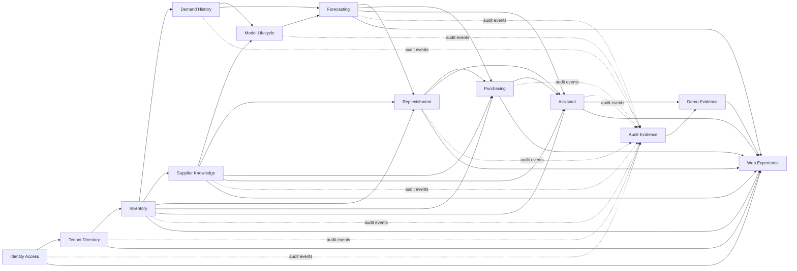

# StockSense logical component model

Date: 2026-09-10
Stage: Domain Design
Status: Draft for independent review

The fenced YAML block is the machine-readable source of truth. Components are logical code boundaries; Units Generation decides packaging and deployment.

```yaml
components:
  - name: IdentityAccess
    summary: "Authenticates human and machine identities and manages sessions without granting retailer authority."
    behaviour:
      - "Manage local accounts, Google federation, explicit linking, sessions, and signing keys."
      - "Enforce BFF and service-credential security boundaries."
      - "Append identity audit/outbox records with mutations."
    responsibilities:
      - "Manage local accounts, Google federation, explicit linking, sessions, and signing keys."
      - "Enforce BFF and service-credential security boundaries."
      - "Append identity audit/outbox records with mutations."
    depends_on: []
    dependents:
      - component: TenantDirectory
        interaction: "resolve authenticated account references"
        style: sync
      - component: AuditEvidence
        interaction: "consume identity audit events"
        style: event
      - component: DemoEvidence
        interaction: "seed and verify local identities through supported contracts"
        style: sync
      - component: WebExperience
        interaction: "manage BFF-backed sessions"
        style: sync
    external_dependencies:
      - "Duende IdentityServer"
      - "Google OIDC"
      - "PostgreSQL"
      - "HashiCorp Vault"
    entities:
      - name: UserAccount
        identifier: account_id
        attributes:
          - username
          - email
          - status
        references: []
      - name: ExternalIdentity
        identifier: external_identity_id
        attributes:
          - provider
          - subject
          - linked_at
        references:
          - IdentityAccess.UserAccount
      - name: UserSession
        identifier: session_id
        attributes:
          - issued_at
          - expires_at
          - revoked_at
        references:
          - IdentityAccess.UserAccount
      - name: SigningKeyVersion
        identifier: key_id
        attributes:
          - algorithm
          - status
          - activated_at
        references: []
  - name: TenantDirectory
    summary: "Owns retailers, stores, memberships, roles, regional settings, and storage placements."
    behaviour:
      - "Maintain retailer currency, time zone, stores, memberships, and roles."
      - "Resolve current retailer authority and reject stale placement generations."
      - "Append membership and placement audit/outbox records."
    responsibilities:
      - "Maintain retailer currency, time zone, stores, memberships, and roles."
      - "Resolve current retailer authority and reject stale placement generations."
      - "Append membership and placement audit/outbox records."
    depends_on:
      - component: IdentityAccess
        interaction: "resolve authenticated account references"
        style: sync
    dependents:
      - component: Inventory
        interaction: "validate retailer, store, membership, and placement context"
        style: sync
      - component: DemandHistory
        interaction: "validate retailer and local-calendar context"
        style: sync
      - component: SupplierKnowledge
        interaction: "validate retailer and currency context"
        style: sync
      - component: ModelLifecycle
        interaction: "validate retailer context for datasets and promotions"
        style: sync
      - component: Forecasting
        interaction: "validate retailer schedule and local-calendar context"
        style: sync
      - component: Replenishment
        interaction: "validate retailer authority and local-day quota context"
        style: sync
      - component: Purchasing
        interaction: "validate current planner or manager authority"
        style: sync
      - component: Assistant
        interaction: "validate user and retailer context for every tool call"
        style: sync
      - component: AuditEvidence
        interaction: "consume membership and placement audit events"
        style: event
      - component: DemoEvidence
        interaction: "seed and verify retailers, memberships, and placements"
        style: sync
      - component: WebExperience
        interaction: "select authorized retailer context"
        style: sync
    external_dependencies:
      - "PostgreSQL"
      - "HashiCorp Vault"
    entities:
      - name: Retailer
        identifier: retailer_id
        attributes:
          - name
          - currency_code
          - time_zone
          - status
        references: []
      - name: Store
        identifier: store_id
        attributes:
          - name
          - status
        references:
          - TenantDirectory.Retailer
      - name: Membership
        identifier: membership_id
        attributes:
          - role
          - status
          - revoked_at
        references:
          - TenantDirectory.Retailer
          - IdentityAccess.UserAccount
      - name: RetailerPlacement
        identifier: placement_id
        attributes:
          - generation
          - database_target
          - document_target
          - status
        references:
          - TenantDirectory.Retailer
  - name: Inventory
    summary: "Owns the initial product catalog and authoritative stock position and movement ledger."
    behaviour:
      - "Import and maintain products and stock with source-versioned idempotency."
      - "Record adjustments and receipt movements while conserving stock."
      - "Serve versioned positions and disposable cache views; append local audit/outbox records."
    responsibilities:
      - "Import and maintain products and stock with source-versioned idempotency."
      - "Record adjustments and receipt movements while conserving stock."
      - "Serve versioned positions and disposable cache views; append local audit/outbox records."
    depends_on:
      - component: TenantDirectory
        interaction: "validate retailer, store, membership, and placement context"
        style: sync
    dependents:
      - component: DemandHistory
        interaction: "resolve authorized product identities"
        style: sync
      - component: SupplierKnowledge
        interaction: "resolve authorized product identities"
        style: sync
      - component: ModelLifecycle
        interaction: "read versioned inventory inputs for policy evaluation"
        style: sync
      - component: Replenishment
        interaction: "read versioned positions and products"
        style: sync
      - component: Purchasing
        interaction: "revalidate stock versions and post receipt movements"
        style: sync
      - component: Assistant
        interaction: "query authorized inventory evidence"
        style: sync
      - component: AuditEvidence
        interaction: "consume inventory audit events"
        style: event
      - component: DemoEvidence
        interaction: "seed and verify product and stock outcomes"
        style: sync
      - component: WebExperience
        interaction: "render inventory workflows"
        style: sync
    external_dependencies:
      - "PostgreSQL"
      - "Redis"
    entities:
      - name: Product
        identifier: product_id
        attributes:
          - sku
          - name
          - category
          - status
        references:
          - TenantDirectory.Retailer
      - name: InventoryPosition
        identifier: position_id
        attributes:
          - on_hand
          - allocated
          - inbound
          - version
        references:
          - TenantDirectory.Retailer
          - TenantDirectory.Store
          - Inventory.Product
      - name: StockMovement
        identifier: movement_id
        attributes:
          - movement_type
          - quantity
          - occurred_at
          - source_id
        references:
          - TenantDirectory.Retailer
          - TenantDirectory.Store
          - Inventory.Product
      - name: InventoryImportBatch
        identifier: inventory_import_id
        attributes:
          - source_version
          - status
          - accepted_count
          - rejected_count
        references:
          - TenantDirectory.Retailer
          - TenantDirectory.Store
  - name: DemandHistory
    summary: "Owns observed demand inputs and protected synthetic evaluation truth independently of inventory."
    behaviour:
      - "Import sales, lost demand, promotions, and source versions."
      - "Keep synthetic true demand distinct and unavailable to model features."
      - "Publish immutable demand-data versions and append local audit/outbox records."
    responsibilities:
      - "Import sales, lost demand, promotions, and source versions."
      - "Keep synthetic true demand distinct and unavailable to model features."
      - "Publish immutable demand-data versions and append local audit/outbox records."
    depends_on:
      - component: TenantDirectory
        interaction: "validate retailer and local-calendar context"
        style: sync
      - component: Inventory
        interaction: "resolve authorized product identities"
        style: sync
    dependents:
      - component: ModelLifecycle
        interaction: "assemble versioned demand datasets"
        style: sync
      - component: Forecasting
        interaction: "read approved versioned demand observations"
        style: sync
      - component: AuditEvidence
        interaction: "consume demand audit events"
        style: event
      - component: DemoEvidence
        interaction: "seed and verify demand observations and truth"
        style: sync
      - component: WebExperience
        interaction: "render demand-import outcomes"
        style: sync
    external_dependencies:
      - "PostgreSQL"
      - "Object storage"
    entities:
      - name: DemandObservation
        identifier: demand_observation_id
        attributes:
          - local_date
          - observed_sales
          - lost_demand
          - synthetic_true_demand
          - source_version
        references:
          - TenantDirectory.Retailer
          - Inventory.Product
      - name: PromotionObservation
        identifier: promotion_observation_id
        attributes:
          - local_date
          - promotion_type
          - intensity
          - source_version
        references:
          - TenantDirectory.Retailer
          - Inventory.Product
      - name: DemandImportBatch
        identifier: demand_import_id
        attributes:
          - source_version
          - status
          - accepted_count
          - rejected_count
        references:
          - TenantDirectory.Retailer
  - name: SupplierKnowledge
    summary: "Owns supplier sources, extraction, accepted terms, provenance, and authorized retrieval indexes."
    behaviour:
      - "Ingest bounded CSV and text-PDF sources with explicit outcomes."
      - "Promote validated offers to authoritative terms with source provenance."
      - "Manage tenant/model-specific retrieval index lifecycle and append local audit/outbox records."
    responsibilities:
      - "Ingest bounded CSV and text-PDF sources with explicit outcomes."
      - "Promote validated offers to authoritative terms with source provenance."
      - "Manage tenant/model-specific retrieval index lifecycle and append local audit/outbox records."
    depends_on:
      - component: TenantDirectory
        interaction: "validate retailer and currency context"
        style: sync
      - component: Inventory
        interaction: "resolve authorized product identities"
        style: sync
    dependents:
      - component: ModelLifecycle
        interaction: "read versioned supplier inputs for policy evaluation"
        style: sync
      - component: Replenishment
        interaction: "read current accepted supplier terms"
        style: sync
      - component: Purchasing
        interaction: "revalidate accepted supplier-term versions"
        style: sync
      - component: Assistant
        interaction: "retrieve authorized terms and citations"
        style: sync
      - component: AuditEvidence
        interaction: "consume supplier audit events"
        style: event
      - component: DemoEvidence
        interaction: "seed and verify sources, terms, and indexes"
        style: sync
      - component: WebExperience
        interaction: "render supplier evidence"
        style: sync
    external_dependencies:
      - "MongoDB"
      - "PostgreSQL"
      - "Qdrant"
      - "Object storage"
      - "RabbitMQ"
    entities:
      - name: Supplier
        identifier: supplier_id
        attributes:
          - name
          - status
        references:
          - TenantDirectory.Retailer
      - name: SupplierSubmission
        identifier: submission_id
        attributes:
          - source_version
          - format
          - status
          - content_hash
        references:
          - TenantDirectory.Retailer
          - SupplierKnowledge.Supplier
      - name: ExtractionRecord
        identifier: extraction_id
        attributes:
          - outcome
          - page_provenance
          - diagnostics
        references:
          - SupplierKnowledge.SupplierSubmission
      - name: SupplierOffer
        identifier: offer_id
        attributes:
          - unit_price
          - currency_code
          - valid_from
          - valid_to
        references:
          - SupplierKnowledge.Supplier
          - Inventory.Product
          - SupplierKnowledge.SupplierSubmission
      - name: AcceptedSupplierTerm
        identifier: term_id
        attributes:
          - lead_time_days
          - minimum_order_quantity
          - pack_size
          - version
        references:
          - SupplierKnowledge.Supplier
          - Inventory.Product
          - SupplierKnowledge.SupplierOffer
          - SupplierKnowledge.SupplierSubmission
      - name: RetrievalIndexVersion
        identifier: retrieval_index_id
        attributes:
          - embedding_model
          - embedding_config
          - source_set_version
          - status
        references:
          - TenantDirectory.Retailer
      - name: DocumentChunk
        identifier: chunk_id
        attributes:
          - source_locator
          - text_hash
          - index_status
        references:
          - SupplierKnowledge.SupplierSubmission
          - SupplierKnowledge.RetrievalIndexVersion
  - name: ModelLifecycle
    summary: "Owns reproducible datasets, experiments, evaluations, model artifacts, promotion, and rollback."
    behaviour:
      - "Build leakage-safe dataset versions and track baseline/candidate experiments."
      - "Evaluate forecast and inventory-policy outcomes under matched scenarios."
      - "Register, promote, and roll back checksummed models with audit evidence."
    responsibilities:
      - "Build leakage-safe dataset versions and track baseline/candidate experiments."
      - "Evaluate forecast and inventory-policy outcomes under matched scenarios."
      - "Register, promote, and roll back checksummed models with audit evidence."
    depends_on:
      - component: TenantDirectory
        interaction: "validate retailer context for datasets and promotions"
        style: sync
      - component: DemandHistory
        interaction: "assemble versioned demand datasets"
        style: sync
      - component: Inventory
        interaction: "read versioned inventory inputs for policy evaluation"
        style: sync
      - component: SupplierKnowledge
        interaction: "read versioned supplier inputs for policy evaluation"
        style: sync
    dependents:
      - component: Forecasting
        interaction: "resolve promoted compatible model and dataset metadata"
        style: sync
      - component: AuditEvidence
        interaction: "consume model audit events"
        style: event
      - component: DemoEvidence
        interaction: "collect model lifecycle evidence"
        style: sync
      - component: WebExperience
        interaction: "render model evidence"
        style: sync
    external_dependencies:
      - "MLflow"
      - "Object storage"
      - "RabbitMQ"
    entities:
      - name: DatasetVersion
        identifier: dataset_version_id
        attributes:
          - content_hash
          - feature_schema
          - cutoff_date
        references:
          - TenantDirectory.Retailer
      - name: ExperimentRun
        identifier: experiment_run_id
        attributes:
          - code_version
          - configuration
          - status
        references:
          - ModelLifecycle.DatasetVersion
      - name: ModelCandidate
        identifier: model_candidate_id
        attributes:
          - algorithm
          - artifact_uri
          - metrics
          - status
        references:
          - ModelLifecycle.ExperimentRun
      - name: ModelVersion
        identifier: model_version_id
        attributes:
          - semantic_version
          - artifact_checksum
          - compatibility
          - status
        references:
          - ModelLifecycle.ModelCandidate
      - name: ModelPromotion
        identifier: promotion_id
        attributes:
          - promoted_at
          - rollback_from
          - reason
        references:
          - TenantDirectory.Retailer
          - ModelLifecycle.ModelVersion
      - name: EvaluationRun
        identifier: evaluation_id
        attributes:
          - evaluation_type
          - scenario_version
          - metrics
          - status
        references:
          - ModelLifecycle.DatasetVersion
          - ModelLifecycle.ModelCandidate
  - name: Forecasting
    summary: "Produces versioned operational forecasts with run health, freshness, and provenance."
    behaviour:
      - "Execute idempotent daily baseline and promoted-model forecasts."
      - "Persist 28-day product forecasts with complete version provenance."
      - "Expose stale/unavailable/failed outcomes and publish lifecycle events."
    responsibilities:
      - "Execute idempotent daily baseline and promoted-model forecasts."
      - "Persist 28-day product forecasts with complete version provenance."
      - "Expose stale/unavailable/failed outcomes and publish lifecycle events."
    depends_on:
      - component: TenantDirectory
        interaction: "validate retailer schedule and local-calendar context"
        style: sync
      - component: DemandHistory
        interaction: "read approved versioned demand observations"
        style: sync
      - component: ModelLifecycle
        interaction: "resolve promoted compatible model and dataset metadata"
        style: sync
    dependents:
      - component: Replenishment
        interaction: "read valid versioned forecasts and freshness"
        style: sync
      - component: Purchasing
        interaction: "revalidate forecast freshness and version"
        style: sync
      - component: Assistant
        interaction: "query forecast status and evidence"
        style: sync
      - component: AuditEvidence
        interaction: "consume forecast audit events"
        style: event
      - component: DemoEvidence
        interaction: "run and verify forecasts"
        style: sync
      - component: WebExperience
        interaction: "render forecast status"
        style: sync
    external_dependencies:
      - "PostgreSQL"
      - "Python forecasting runtime"
      - "RabbitMQ"
    entities:
      - name: ForecastRequest
        identifier: forecast_request_id
        attributes:
          - retailer_local_date
          - configuration_version
          - idempotency_key
          - status
        references:
          - TenantDirectory.Retailer
      - name: ForecastRun
        identifier: forecast_run_id
        attributes:
          - status
          - started_at
          - completed_at
          - failure_reason
        references:
          - Forecasting.ForecastRequest
          - ModelLifecycle.DatasetVersion
          - ModelLifecycle.ModelVersion
      - name: ForecastSeries
        identifier: forecast_series_id
        attributes:
          - horizon_start
          - horizon_days
          - generated_at
          - fresh_until
        references:
          - Forecasting.ForecastRun
          - Inventory.Product
  - name: Replenishment
    summary: "Owns governed reviews, scenarios, recommendations, quotas, policies, and evidence snapshots."
    behaviour:
      - "Serialize scheduled and manual reviews and enforce the daily allowance."
      - "Apply supplier constraints and buffer policies deterministically."
      - "Expose input versions, freshness, rationale, and local audit/outbox records."
    responsibilities:
      - "Serialize scheduled and manual reviews and enforce the daily allowance."
      - "Apply supplier constraints and buffer policies deterministically."
      - "Expose input versions, freshness, rationale, and local audit/outbox records."
    depends_on:
      - component: TenantDirectory
        interaction: "validate retailer authority and local-day quota context"
        style: sync
      - component: Inventory
        interaction: "read versioned positions and products"
        style: sync
      - component: SupplierKnowledge
        interaction: "read current accepted supplier terms"
        style: sync
      - component: Forecasting
        interaction: "read valid versioned forecasts and freshness"
        style: sync
    dependents:
      - component: Purchasing
        interaction: "consume recommendation and evidence snapshots"
        style: sync
      - component: Assistant
        interaction: "explain scenarios and request governed reviews"
        style: sync
      - component: AuditEvidence
        interaction: "consume review audit events"
        style: event
      - component: DemoEvidence
        interaction: "run and verify planning"
        style: sync
      - component: WebExperience
        interaction: "render planning workflows"
        style: sync
    external_dependencies:
      - "PostgreSQL"
      - "RabbitMQ"
    entities:
      - name: PlanningPolicy
        identifier: planning_policy_id
        attributes:
          - retailer_buffer_days
          - version
          - effective_from
        references:
          - TenantDirectory.Retailer
      - name: ProductPlanningOverride
        identifier: override_id
        attributes:
          - buffer_days
          - version
        references:
          - Replenishment.PlanningPolicy
          - Inventory.Product
      - name: ReviewJob
        identifier: review_job_id
        attributes:
          - trigger
          - retailer_local_date
          - status
          - attempt
        references:
          - TenantDirectory.Retailer
          - Forecasting.ForecastRun
      - name: ManualReviewAllowance
        identifier: allowance_id
        attributes:
          - retailer_local_date
          - accepted_count
          - limit
          - reset_at
        references:
          - TenantDirectory.Retailer
      - name: ReplenishmentScenario
        identifier: scenario_id
        attributes:
          - buffer_days
          - input_version
          - status
        references:
          - Replenishment.ReviewJob
      - name: ReplenishmentRecommendation
        identifier: recommendation_id
        attributes:
          - suggested_quantity
          - shortage_date
          - rationale
          - version
        references:
          - Replenishment.ReplenishmentScenario
          - Inventory.Product
          - SupplierKnowledge.AcceptedSupplierTerm
          - Inventory.InventoryPosition
          - Forecasting.ForecastSeries
      - name: EvidenceSnapshot
        identifier: evidence_snapshot_id
        attributes:
          - captured_at
          - input_versions
          - stale_after
        references:
          - Replenishment.ReplenishmentRecommendation
  - name: Purchasing
    summary: "Owns human-governed proposals, orders, transitions, and exactly-once receipts."
    behaviour:
      - "Create editable drafts and lock submitted/approved lines."
      - "Enforce manager approval, rejection, pre-receipt cancellation, and concurrency rules."
      - "Revalidate evidence and coordinate atomic receipt/stock effects through component ports."
    responsibilities:
      - "Create editable drafts and lock submitted/approved lines."
      - "Enforce manager approval, rejection, pre-receipt cancellation, and concurrency rules."
      - "Revalidate evidence and coordinate atomic receipt/stock effects through component ports."
    depends_on:
      - component: TenantDirectory
        interaction: "validate current planner or manager authority"
        style: sync
      - component: Inventory
        interaction: "revalidate stock versions and post receipt movements"
        style: sync
      - component: SupplierKnowledge
        interaction: "revalidate accepted supplier-term versions"
        style: sync
      - component: Forecasting
        interaction: "revalidate forecast freshness and version"
        style: sync
      - component: Replenishment
        interaction: "consume recommendation and evidence snapshots"
        style: sync
    dependents:
      - component: Assistant
        interaction: "prepare governed drafts without approval authority"
        style: sync
      - component: AuditEvidence
        interaction: "consume purchasing audit events"
        style: event
      - component: DemoEvidence
        interaction: "run and verify purchasing"
        style: sync
      - component: WebExperience
        interaction: "render purchasing workflows"
        style: sync
    external_dependencies:
      - "PostgreSQL"
      - "RabbitMQ"
    entities:
      - name: PurchaseProposal
        identifier: proposal_id
        attributes:
          - status
          - version
          - created_at
          - submitted_at
        references:
          - TenantDirectory.Retailer
          - SupplierKnowledge.Supplier
          - Replenishment.ReplenishmentScenario
      - name: PurchaseProposalLine
        identifier: proposal_line_id
        attributes:
          - quantity
          - unit_price
          - pack_size
          - version
        references:
          - Purchasing.PurchaseProposal
          - Inventory.Product
          - SupplierKnowledge.AcceptedSupplierTerm
          - Replenishment.ReplenishmentRecommendation
      - name: PurchaseOrder
        identifier: order_id
        attributes:
          - status
          - approved_at
          - rejected_at
          - cancelled_at
        references:
          - Purchasing.PurchaseProposal
      - name: PurchaseOrderLine
        identifier: order_line_id
        attributes:
          - approved_quantity
          - unit_price
          - status
        references:
          - Purchasing.PurchaseOrder
          - Purchasing.PurchaseProposalLine
      - name: Receipt
        identifier: receipt_id
        attributes:
          - idempotency_key
          - received_at
          - status
        references:
          - Purchasing.PurchaseOrder
          - TenantDirectory.Store
      - name: ReceiptLine
        identifier: receipt_line_id
        attributes:
          - quantity
        references:
          - Purchasing.Receipt
          - Purchasing.PurchaseOrderLine
          - Inventory.Product
  - name: Assistant
    summary: "Runs bounded agent conversations and typed tools without becoming a business authority."
    behaviour:
      - "Run local-first Strands conversations through provider-neutral ports."
      - "Invoke authorized read, review-request, and draft-proposal tools with bounded retries."
      - "Reject model-supplied authority and purchase approvals; retain citations and audit evidence."
    responsibilities:
      - "Run local-first Strands conversations through provider-neutral ports."
      - "Invoke authorized read, review-request, and draft-proposal tools with bounded retries."
      - "Reject model-supplied authority and purchase approvals; retain citations and audit evidence."
    depends_on:
      - component: TenantDirectory
        interaction: "validate user and retailer context for every tool call"
        style: sync
      - component: Inventory
        interaction: "query authorized inventory evidence"
        style: sync
      - component: SupplierKnowledge
        interaction: "retrieve authorized terms and citations"
        style: sync
      - component: Forecasting
        interaction: "query forecast status and evidence"
        style: sync
      - component: Replenishment
        interaction: "explain scenarios and request governed reviews"
        style: sync
      - component: Purchasing
        interaction: "prepare governed drafts without approval authority"
        style: sync
    dependents:
      - component: AuditEvidence
        interaction: "consume agent audit events"
        style: event
      - component: DemoEvidence
        interaction: "run and verify agent evaluations"
        style: sync
      - component: WebExperience
        interaction: "render agent conversations"
        style: sync
    external_dependencies:
      - "Strands Agents"
      - "llama.cpp"
      - "Amazon Bedrock (optional)"
      - "RabbitMQ"
    entities:
      - name: Conversation
        identifier: conversation_id
        attributes:
          - started_at
          - status
          - provider_id
          - model_id
        references:
          - IdentityAccess.UserAccount
          - TenantDirectory.Retailer
      - name: ConversationTurn
        identifier: turn_id
        attributes:
          - role
          - content_reference
          - created_at
          - outcome
        references:
          - Assistant.Conversation
      - name: ToolInvocation
        identifier: tool_invocation_id
        attributes:
          - tool_name
          - request_hash
          - status
          - completed_at
        references:
          - Assistant.Conversation
          - Assistant.ConversationTurn
      - name: Citation
        identifier: citation_id
        attributes:
          - source_type
          - source_version
          - locator
        references:
          - Assistant.ConversationTurn
          - SupplierKnowledge.SupplierSubmission
      - name: AssistantActionDraft
        identifier: action_draft_id
        attributes:
          - action_type
          - payload_hash
          - status
          - expires_at
        references:
          - Assistant.ConversationTurn
  - name: AuditEvidence
    summary: "Builds authorized audit/search evidence from immutable component audit events."
    behaviour:
      - "Consume audit events idempotently and project them into OpenSearch."
      - "Serve tenant-authorized queries and operator investigations."
      - "Track lag, replay, dead letters, and coordinated retention."
    responsibilities:
      - "Consume audit events idempotently and project them into OpenSearch."
      - "Serve tenant-authorized queries and operator investigations."
      - "Track lag, replay, dead letters, and coordinated retention."
    depends_on:
      - component: IdentityAccess
        interaction: "consume identity audit events"
        style: event
      - component: TenantDirectory
        interaction: "consume membership and placement audit events"
        style: event
      - component: Inventory
        interaction: "consume inventory audit events"
        style: event
      - component: DemandHistory
        interaction: "consume demand audit events"
        style: event
      - component: SupplierKnowledge
        interaction: "consume supplier audit events"
        style: event
      - component: ModelLifecycle
        interaction: "consume model audit events"
        style: event
      - component: Forecasting
        interaction: "consume forecast audit events"
        style: event
      - component: Replenishment
        interaction: "consume review audit events"
        style: event
      - component: Purchasing
        interaction: "consume purchasing audit events"
        style: event
      - component: Assistant
        interaction: "consume agent audit events"
        style: event
    dependents:
      - component: DemoEvidence
        interaction: "verify search, replay, retention, and correlation"
        style: sync
      - component: WebExperience
        interaction: "render authorized audit evidence"
        style: sync
    external_dependencies:
      - "PostgreSQL"
      - "RabbitMQ"
      - "OpenSearch"
      - "OpenSearch Dashboards"
      - "OpenTelemetry"
    entities:
      - name: AuditProjection
        identifier: audit_projection_id
        attributes:
          - event_id
          - actor_id
          - target_type
          - outcome
          - occurred_at
        references:
          - TenantDirectory.Retailer
          - IdentityAccess.UserAccount
      - name: IndexCheckpoint
        identifier: checkpoint_id
        attributes:
          - partition
          - last_event_id
          - indexed_at
          - lag_seconds
        references: []
      - name: ReplayRequest
        identifier: replay_request_id
        attributes:
          - event_range
          - status
          - requested_at
          - completed_at
        references: []
      - name: RetentionRun
        identifier: retention_run_id
        attributes:
          - cutoff
          - status
          - deleted_count
          - completed_at
        references: []
  - name: DemoEvidence
    summary: "Owns reproducible demo scenarios, verification runs, measurements, and evidence manifests."
    behaviour:
      - "Define deterministic multi-retailer scenario seeds and use supported import contracts."
      - "Verify clean setup, CPU inference, recovery, migration, rollback, performance, and capacity."
      - "Publish revision-bound evidence linking requirements, stories, designs, tests, and failures."
    responsibilities:
      - "Define deterministic multi-retailer scenario seeds and use supported import contracts."
      - "Verify clean setup, CPU inference, recovery, migration, rollback, performance, and capacity."
      - "Publish revision-bound evidence linking requirements, stories, designs, tests, and failures."
    depends_on:
      - component: IdentityAccess
        interaction: "seed and verify local identities through supported contracts"
        style: sync
      - component: TenantDirectory
        interaction: "seed and verify retailers, memberships, and placements"
        style: sync
      - component: Inventory
        interaction: "seed and verify product and stock outcomes"
        style: sync
      - component: DemandHistory
        interaction: "seed and verify demand observations and truth"
        style: sync
      - component: SupplierKnowledge
        interaction: "seed and verify sources, terms, and indexes"
        style: sync
      - component: ModelLifecycle
        interaction: "collect model lifecycle evidence"
        style: sync
      - component: Forecasting
        interaction: "run and verify forecasts"
        style: sync
      - component: Replenishment
        interaction: "run and verify planning"
        style: sync
      - component: Purchasing
        interaction: "run and verify purchasing"
        style: sync
      - component: Assistant
        interaction: "run and verify agent evaluations"
        style: sync
      - component: AuditEvidence
        interaction: "verify search, replay, retention, and correlation"
        style: sync
    dependents:
      - component: WebExperience
        interaction: "render reviewer evidence"
        style: sync
    external_dependencies:
      - "Docker Desktop Kubernetes"
      - "Terraform and Terragrunt"
      - "Helm"
      - "GitHub Actions"
      - "Object storage"
    entities:
      - name: DemoScenario
        identifier: demo_scenario_id
        attributes:
          - seed
          - configuration_version
          - retailer_count
          - history_range
        references: []
      - name: DatasetGenerationRun
        identifier: generation_run_id
        attributes:
          - seed
          - status
          - completed_at
          - output_manifest_hash
        references:
          - DemoEvidence.DemoScenario
      - name: SetupVerificationRun
        identifier: setup_verification_id
        attributes:
          - revision
          - environment_profile
          - status
          - measurements
        references: []
      - name: EvidenceManifest
        identifier: evidence_manifest_id
        attributes:
          - revision
          - requirements_version
          - status
          - published_at
        references:
          - DemoEvidence.SetupVerificationRun
  - name: WebExperience
    summary: "Composes the role-aware React experience without owning business entities."
    behaviour:
      - "Provide the authenticated shell, retailer context, dashboard, workspaces, and assistant surfaces."
      - "Render explicit loading, empty, error, stale, and recovery states."
      - "Meet responsive WCAG 2.2 AA behavior and display source evidence without mutating it."
    responsibilities:
      - "Provide the authenticated shell, retailer context, dashboard, workspaces, and assistant surfaces."
      - "Render explicit loading, empty, error, stale, and recovery states."
      - "Meet responsive WCAG 2.2 AA behavior and display source evidence without mutating it."
    depends_on:
      - component: IdentityAccess
        interaction: "manage BFF-backed sessions"
        style: sync
      - component: TenantDirectory
        interaction: "select authorized retailer context"
        style: sync
      - component: Inventory
        interaction: "render inventory workflows"
        style: sync
      - component: DemandHistory
        interaction: "render demand-import outcomes"
        style: sync
      - component: SupplierKnowledge
        interaction: "render supplier evidence"
        style: sync
      - component: ModelLifecycle
        interaction: "render model evidence"
        style: sync
      - component: Forecasting
        interaction: "render forecast status"
        style: sync
      - component: Replenishment
        interaction: "render planning workflows"
        style: sync
      - component: Purchasing
        interaction: "render purchasing workflows"
        style: sync
      - component: Assistant
        interaction: "render agent conversations"
        style: sync
      - component: AuditEvidence
        interaction: "render authorized audit evidence"
        style: sync
      - component: DemoEvidence
        interaction: "render reviewer evidence"
        style: sync
    dependents: []
    external_dependencies:
      - "React"
      - "TypeScript"
      - "Vite"
      - "Ant Design"
      - "Ant Design Charts"
    entities: []
```

## Component diagram



Text fallback: identity establishes the account; tenancy establishes current retailer authority; source-data components feed model lifecycle and forecasting; replenishment creates advice; purchasing owns human-governed transactions; the assistant uses typed tools; audit search is derived; demo evidence verifies the journey; and the web component composes user workflows.

## Component summary

| Component | Owned entities | Purpose |
| --- | --- | --- |
| IdentityAccess | UserAccount, ExternalIdentity, UserSession, SigningKeyVersion | Authenticates human and machine identities and manages sessions without granting retailer authority. |
| TenantDirectory | Retailer, Store, Membership, RetailerPlacement | Owns retailers, stores, memberships, roles, regional settings, and storage placements. |
| Inventory | Product, InventoryPosition, StockMovement, InventoryImportBatch | Owns the initial product catalog and authoritative stock position and movement ledger. |
| DemandHistory | DemandObservation, PromotionObservation, DemandImportBatch | Owns observed demand inputs and protected synthetic evaluation truth independently of inventory. |
| SupplierKnowledge | Supplier, SupplierSubmission, ExtractionRecord, SupplierOffer, AcceptedSupplierTerm, RetrievalIndexVersion, DocumentChunk | Owns supplier sources, extraction, accepted terms, provenance, and authorized retrieval indexes. |
| ModelLifecycle | DatasetVersion, ExperimentRun, ModelCandidate, ModelVersion, ModelPromotion, EvaluationRun | Owns reproducible datasets, experiments, evaluations, model artifacts, promotion, and rollback. |
| Forecasting | ForecastRequest, ForecastRun, ForecastSeries | Produces versioned operational forecasts with run health, freshness, and provenance. |
| Replenishment | PlanningPolicy, ProductPlanningOverride, ReviewJob, ManualReviewAllowance, ReplenishmentScenario, ReplenishmentRecommendation, EvidenceSnapshot | Owns governed reviews, scenarios, recommendations, quotas, policies, and evidence snapshots. |
| Purchasing | PurchaseProposal, PurchaseProposalLine, PurchaseOrder, PurchaseOrderLine, Receipt, ReceiptLine | Owns human-governed proposals, orders, transitions, and exactly-once receipts. |
| Assistant | Conversation, ConversationTurn, ToolInvocation, Citation, AssistantActionDraft | Runs bounded agent conversations and typed tools without becoming a business authority. |
| AuditEvidence | AuditProjection, IndexCheckpoint, ReplayRequest, RetentionRun | Builds authorized audit/search evidence from immutable component audit events. |
| DemoEvidence | DemoScenario, DatasetGenerationRun, SetupVerificationRun, EvidenceManifest | Owns reproducible demo scenarios, verification runs, measurements, and evidence manifests. |
| WebExperience | No business entities | Composes the role-aware React experience without owning business entities. |

## Entity ownership and interaction rules

- Every listed entity has exactly one owning component.
- Cross-component references use identifiers and explicit contracts; they never grant storage access.
- Each mutating component appends its own authoritative audit and outbox records in the business transaction. AuditEvidence owns only derived query and processing state.
- Redis, OpenSearch, and Qdrant contents are rebuildable projections governed by their owning component.
- WebExperience owns transient view state only.

## External dependency map

| Concern | Adapter owner | Dependency |
| --- | --- | --- |
| Identity | IdentityAccess | Duende, Google OIDC, PostgreSQL, Vault |
| Relational state | Each owning component | Dapper/Npgsql stored procedures/functions; Flyway migrations |
| Supplier sources and retrieval | SupplierKnowledge | MongoDB, object storage, Qdrant |
| ML lifecycle | ModelLifecycle | Python, MLflow, object storage |
| Forecast execution | Forecasting | Python runtime and PostgreSQL |
| Agent runtime | Assistant | Strands, local llama.cpp, optional Bedrock |
| Async integration | Publisher/consumer owner | RabbitMQ and AsyncAPI |
| Logs and audit search | AuditEvidence | OpenTelemetry and OpenSearch |
| UI | WebExperience | React, Vite, Ant Design, Ant Design Charts |
| Local reproducibility | DemoEvidence | Kubernetes, Terraform/Terragrunt, Helm, GitHub Actions |

## Dependency rationale

The complete YAML graph is acyclic. Authority and source data sit upstream; analysis feeds planning; planning feeds purchasing; the assistant invokes governed capabilities; audit consumes events; and UI/demo composition sits at the edge. Synchronous contracts serve immediate commands, queries, and co-located atomic coordination. RabbitMQ events serve durable propagation. Purchasing and Inventory may participate through public ports and owned stored routines in one database transaction for receipts; neither accesses the other's tables.

## Future extraction seams

- Inventory can yield a Catalog component when assortment or multi-store complexity requires it.
- RetailerPlacement provides a generation-checked seam for moving one tenant to dedicated stores.
- Model and embedding adapters preserve local reviewer choice and later external providers.
- Units Generation may package multiple logical components together and may extract them later when evidence supports it.

