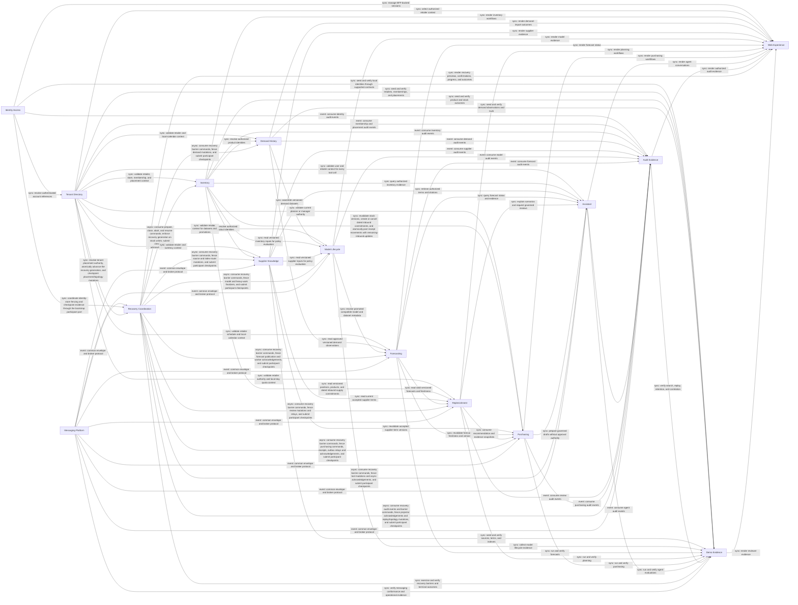

# StockSense logical component model

Date: 2026-09-23
Stage: Domain Design
Status: Reconciled draft for independent review
Summary confirmation: Looks correct (R-02/R-09/R-10/R-11 resolution cycle, 2026-09-23)
Confirmation receipt: recorded after owner response on 2026-09-23

The fenced YAML block is the machine-readable source of truth. Components are logical code boundaries; Units Generation decides packaging and deployment.

```yaml
components:
  - name: IdentityAccess
    summary: "Authenticates human and machine identities and manages sessions without granting retailer authority."
    behaviour:
      - "Manage local accounts, Google federation, explicit linking, sessions, and signing keys."
      - "Enforce BFF and service-credential security boundaries."
      - "Append identity audit/outbox records with mutations."
      - "Implement the synchronous recovery participant lifecycle: idempotent prepare fences identity writes and key rotation, close returns durable identity-store checkpoint evidence, abort releases a pre-snapshot fence, and resume reopens writes only after coordinator-authorized reconciliation. Existing token validation and read-only discovery remain available while fenced."
    responsibilities:
      - "Manage local accounts, Google federation, explicit linking, sessions, and signing keys."
      - "Enforce BFF and service-credential security boundaries."
      - "Append identity audit/outbox records with mutations."
      - "Persist and expose generation-checked recovery participant state for prepare, close, abort, and resume."
    depends_on: []
    dependents:
      - component: TenantDirectory
        interaction: "resolve authenticated account references"
        style: sync
      - component: AuditEvidence
        interaction: "consume identity audit events"
        style: event
      - component: RecoveryCoordination
        interaction: "coordinate identity-store fencing and checkpoint evidence through the bootstrap participant port"
        style: sync
      - component: DemoEvidence
        interaction: "seed and verify local identities through supported contracts"
        style: sync
      - component: WebExperience
        interaction: "manage BFF-backed sessions"
        style: sync
    external_dependencies:
      - name: "Duende IdentityServer"
        kind: third-party-api
        purpose: "OIDC/OAuth authorization server"
      - name: "Google OIDC"
        kind: third-party-api
        purpose: "federated sign-in provider"
      - name: "PostgreSQL"
        kind: database
        purpose: "authoritative relational state and coordination records"
      - name: "HashiCorp Vault"
        kind: other
        purpose: "Kubernetes-hosted secrets and key material"
    entities:
      - name: UserAccount
        identifier: account_id
        attributes:
          - username
          - email
          - status
        references: []
      - name: ExternalIdentity
        identifier: external_identity_id
        attributes:
          - provider
          - subject
          - linked_at
        references:
          - entity: UserAccount
            owned_by: IdentityAccess
            relationship: "Links this record to the authoritative UserAccount owned by IdentityAccess."
      - name: UserSession
        identifier: session_id
        attributes:
          - issued_at
          - expires_at
          - revoked_at
        references:
          - entity: UserAccount
            owned_by: IdentityAccess
            relationship: "Links this record to the authoritative UserAccount owned by IdentityAccess."
      - name: SigningKeyVersion
        identifier: key_id
        attributes:
          - algorithm
          - status
          - activated_at
        references: []
  - name: TenantDirectory
    summary: "Owns retailers, stores, memberships, roles, regional settings, and storage placements."
    behaviour:
      - "Maintain retailer currency, time zone, stores, memberships, and roles."
      - "Resolve current retailer authority and reject stale placement generations."
      - "Append membership and placement audit/outbox records."
      - "Implement the synchronous recovery authority lifecycle: idempotent prepare atomically advances the tenant recovery generation and fences membership, placement, and topology writes; close returns durable placement checkpoint evidence; abort releases a pre-snapshot fence; resume activates only the reconciled placement generation."
    responsibilities:
      - "Maintain retailer currency, time zone, stores, memberships, and roles."
      - "Resolve current retailer authority and reject stale placement generations."
      - "Append membership and placement audit/outbox records."
      - "Persist the authoritative recovery generation and generation-checked prepare, close, abort, and resume state."
    depends_on:
      - component: IdentityAccess
        interaction: "resolve authenticated account references"
        style: sync
    dependents:
      - component: Inventory
        interaction: "validate retailer, store, membership, and placement context"
        style: sync
      - component: DemandHistory
        interaction: "validate retailer and local-calendar context"
        style: sync
      - component: SupplierKnowledge
        interaction: "validate retailer and currency context"
        style: sync
      - component: ModelLifecycle
        interaction: "validate retailer context for datasets and promotions"
        style: sync
      - component: Forecasting
        interaction: "validate retailer schedule and local-calendar context"
        style: sync
      - component: Replenishment
        interaction: "validate retailer authority and local-day quota context"
        style: sync
      - component: Purchasing
        interaction: "validate current planner or manager authority"
        style: sync
      - component: Assistant
        interaction: "validate user and retailer context for every tool call"
        style: sync
      - component: AuditEvidence
        interaction: "consume membership and placement audit events"
        style: event
      - component: RecoveryCoordination
        interaction: "resolve tenant placement authority and recovery generation"
        style: sync
      - component: DemoEvidence
        interaction: "seed and verify retailers, memberships, and placements"
        style: sync
      - component: WebExperience
        interaction: "select authorized retailer context"
        style: sync
    external_dependencies:
      - name: "PostgreSQL"
        kind: database
        purpose: "authoritative relational state and coordination records"
      - name: "HashiCorp Vault"
        kind: other
        purpose: "Kubernetes-hosted secrets and key material"
    entities:
      - name: Retailer
        identifier: retailer_id
        attributes:
          - name
          - currency_code
          - time_zone
          - status
        references: []
      - name: Store
        identifier: store_id
        attributes:
          - name
          - status
        references:
          - entity: Retailer
            owned_by: TenantDirectory
            relationship: "Links this record to the authoritative Retailer owned by TenantDirectory."
      - name: Membership
        identifier: membership_id
        attributes:
          - role
          - status
          - revoked_at
        references:
          - entity: Retailer
            owned_by: TenantDirectory
            relationship: "Links this record to the authoritative Retailer owned by TenantDirectory."
          - entity: UserAccount
            owned_by: IdentityAccess
            relationship: "Links this record to the authoritative UserAccount owned by IdentityAccess."
      - name: RetailerPlacement
        identifier: placement_id
        attributes:
          - generation
          - database_target
          - document_target
          - status
        references:
          - entity: Retailer
            owned_by: TenantDirectory
            relationship: "Links this record to the authoritative Retailer owned by TenantDirectory."
  - name: Inventory
    summary: "Owns the product catalog, authoritative stock position and movement ledger, and versioned dated inbound-supply commitments."
    behaviour:
      - "Import and maintain products and stock with source-versioned idempotency."
      - "Record adjustments and receipt movements while conserving stock."
      - "Create and update versioned dated inbound-supply commitments through the Purchasing port on approval, cancellation, partial receipt, and full receipt."
      - "Serve versioned positions, dated inbound commitments, and disposable cache views; append local audit/outbox records."
    responsibilities:
      - "Import and maintain products and stock with source-versioned idempotency."
      - "Record adjustments and receipt movements while conserving stock."
      - "Own the dated inbound-supply projection and update it atomically with Purchasing transitions and receipt stock movements through public ports."
      - "Serve versioned positions, dated inbound commitments, and disposable cache views; append local audit/outbox records."
    depends_on:
      - component: TenantDirectory
        interaction: "validate retailer, store, membership, and placement context"
        style: sync
      - component: RecoveryCoordination
        interaction: "consume prepare, close, abort, and resume commands; enforce recovery generation on stock writes; submit checkpoint acknowledgements"
        style: async
    dependents:
      - component: DemandHistory
        interaction: "resolve authorized product identities"
        style: sync
      - component: SupplierKnowledge
        interaction: "resolve authorized product identities"
        style: sync
      - component: ModelLifecycle
        interaction: "read versioned inventory inputs for policy evaluation"
        style: sync
      - component: Replenishment
        interaction: "read versioned positions, products, and dated inbound-supply commitments"
        style: sync
      - component: Purchasing
        interaction: "revalidate stock versions, create or cancel dated inbound commitments, and atomically post receipt movements with remaining-inbound updates"
        style: sync
      - component: Assistant
        interaction: "query authorized inventory evidence"
        style: sync
      - component: AuditEvidence
        interaction: "consume inventory audit events"
        style: event
      - component: DemoEvidence
        interaction: "seed and verify product and stock outcomes"
        style: sync
      - component: WebExperience
        interaction: "render inventory workflows"
        style: sync
    external_dependencies:
      - name: "PostgreSQL"
        kind: database
        purpose: "authoritative relational state and coordination records"
      - name: "Redis"
        kind: cache
        purpose: "disposable low-latency projections and route cache"
    entities:
      - name: Product
        identifier: product_id
        attributes:
          - sku
          - name
          - category
          - status
        references:
          - entity: Retailer
            owned_by: TenantDirectory
            relationship: "Links this record to the authoritative Retailer owned by TenantDirectory."
      - name: InventoryPosition
        identifier: position_id
        attributes:
          - on_hand
          - allocated
          - version
        references:
          - entity: Retailer
            owned_by: TenantDirectory
            relationship: "Links this record to the authoritative Retailer owned by TenantDirectory."
          - entity: Store
            owned_by: TenantDirectory
            relationship: "Links this record to the authoritative Store owned by TenantDirectory."
          - entity: Product
            owned_by: Inventory
            relationship: "Links this record to the authoritative Product owned by Inventory."
      - name: InboundSupplyCommitment
        identifier: inbound_commitment_id
        attributes:
          - source_order_id
          - source_order_line_id
          - approved_quantity
          - received_quantity
          - open_quantity
          - expected_arrival_date
          - status
          - version
          - updated_at
        references:
          - entity: Retailer
            owned_by: TenantDirectory
            relationship: "Links this record to the authoritative Retailer owned by TenantDirectory."
          - entity: Store
            owned_by: TenantDirectory
            relationship: "Links this record to the authoritative Store owned by TenantDirectory."
          - entity: Product
            owned_by: Inventory
            relationship: "Links this record to the authoritative Product owned by Inventory."
      - name: StockMovement
        identifier: movement_id
        attributes:
          - movement_type
          - quantity
          - occurred_at
          - source_id
        references:
          - entity: Retailer
            owned_by: TenantDirectory
            relationship: "Links this record to the authoritative Retailer owned by TenantDirectory."
          - entity: Store
            owned_by: TenantDirectory
            relationship: "Links this record to the authoritative Store owned by TenantDirectory."
          - entity: Product
            owned_by: Inventory
            relationship: "Links this record to the authoritative Product owned by Inventory."
      - name: InventoryImportBatch
        identifier: inventory_import_id
        attributes:
          - source_version
          - status
          - accepted_count
          - rejected_count
        references:
          - entity: Retailer
            owned_by: TenantDirectory
            relationship: "Links this record to the authoritative Retailer owned by TenantDirectory."
          - entity: Store
            owned_by: TenantDirectory
            relationship: "Links this record to the authoritative Store owned by TenantDirectory."
  - name: DemandHistory
    summary: "Owns observed demand inputs and protected synthetic evaluation truth independently of inventory."
    behaviour:
      - "Import sales, lost demand, promotions, and source versions."
      - "Keep synthetic true demand distinct and unavailable to model features."
      - "Publish immutable demand-data versions and append local audit/outbox records."
    responsibilities:
      - "Import sales, lost demand, promotions, and source versions."
      - "Keep synthetic true demand distinct and unavailable to model features."
      - "Publish immutable demand-data versions and append local audit/outbox records."
    depends_on:
      - component: TenantDirectory
        interaction: "validate retailer and local-calendar context"
        style: sync
      - component: Inventory
        interaction: "resolve authorized product identities"
        style: sync
      - component: RecoveryCoordination
        interaction: "consume recovery barrier commands, fence demand mutations, and submit participant checkpoints"
        style: async
    dependents:
      - component: ModelLifecycle
        interaction: "assemble versioned demand datasets"
        style: sync
      - component: Forecasting
        interaction: "read approved versioned demand observations"
        style: sync
      - component: AuditEvidence
        interaction: "consume demand audit events"
        style: event
      - component: DemoEvidence
        interaction: "seed and verify demand observations and truth"
        style: sync
      - component: WebExperience
        interaction: "render demand-import outcomes"
        style: sync
    external_dependencies:
      - name: "PostgreSQL"
        kind: database
        purpose: "authoritative relational state and coordination records"
      - name: "Object storage"
        kind: object-store
        purpose: "versioned source, model, checkpoint, and evidence artifacts"
    entities:
      - name: DemandObservation
        identifier: demand_observation_id
        attributes:
          - local_date
          - observed_sales
          - lost_demand
          - synthetic_true_demand
          - source_version
        references:
          - entity: Retailer
            owned_by: TenantDirectory
            relationship: "Links this record to the authoritative Retailer owned by TenantDirectory."
          - entity: Product
            owned_by: Inventory
            relationship: "Links this record to the authoritative Product owned by Inventory."
      - name: PromotionObservation
        identifier: promotion_observation_id
        attributes:
          - local_date
          - promotion_type
          - intensity
          - source_version
        references:
          - entity: Retailer
            owned_by: TenantDirectory
            relationship: "Links this record to the authoritative Retailer owned by TenantDirectory."
          - entity: Product
            owned_by: Inventory
            relationship: "Links this record to the authoritative Product owned by Inventory."
      - name: DemandImportBatch
        identifier: demand_import_id
        attributes:
          - source_version
          - status
          - accepted_count
          - rejected_count
        references:
          - entity: Retailer
            owned_by: TenantDirectory
            relationship: "Links this record to the authoritative Retailer owned by TenantDirectory."
  - name: SupplierKnowledge
    summary: "Owns supplier sources, extraction, accepted terms, provenance, authoritative retrieval routes, and authorized indexes."
    behaviour:
      - "Ingest bounded CSV and text-PDF sources with explicit outcomes."
      - "Promote validated offers to authoritative terms with source provenance."
      - "Own authoritative tenant/model retrieval routes and generations, reconcile Qdrant indexes, invalidate disposable Redis route caches, and append local audit/outbox records."
    responsibilities:
      - "Ingest bounded CSV and text-PDF sources with explicit outcomes."
      - "Promote validated offers to authoritative terms with source provenance."
      - "Own authoritative tenant/model retrieval routes and generations, reconcile Qdrant indexes, invalidate disposable Redis route caches, and append local audit/outbox records."
    depends_on:
      - component: TenantDirectory
        interaction: "validate retailer and currency context"
        style: sync
      - component: Inventory
        interaction: "resolve authorized product identities"
        style: sync
      - component: RecoveryCoordination
        interaction: "consume recovery barrier commands, fence source and index-route mutations, and submit participant checkpoints"
        style: async
      - component: MessagingPlatform
        interaction: "publish and consume through the common envelope, delivery identity, confirm, retry, DLQ, replay, and size-limit capability"
        style: event
    dependents:
      - component: ModelLifecycle
        interaction: "read versioned supplier inputs for policy evaluation"
        style: sync
      - component: Replenishment
        interaction: "read current accepted supplier terms"
        style: sync
      - component: Purchasing
        interaction: "revalidate accepted supplier-term versions"
        style: sync
      - component: Assistant
        interaction: "retrieve authorized terms and citations"
        style: sync
      - component: AuditEvidence
        interaction: "consume supplier audit events"
        style: event
      - component: DemoEvidence
        interaction: "seed and verify sources, terms, and indexes"
        style: sync
      - component: WebExperience
        interaction: "render supplier evidence"
        style: sync
    external_dependencies:
      - name: "MongoDB"
        kind: database
        purpose: "supplier document and extraction state"
      - name: "PostgreSQL"
        kind: database
        purpose: "authoritative relational state and coordination records"
      - name: "Qdrant"
        kind: database
        purpose: "rebuildable vector retrieval index"
      - name: "Redis"
        kind: cache
        purpose: "disposable low-latency projections and route cache"
      - name: "Object storage"
        kind: object-store
        purpose: "versioned source, model, checkpoint, and evidence artifacts"
    entities:
      - name: Supplier
        identifier: supplier_id
        attributes:
          - name
          - status
        references:
          - entity: Retailer
            owned_by: TenantDirectory
            relationship: "Links this record to the authoritative Retailer owned by TenantDirectory."
      - name: SupplierSubmission
        identifier: submission_id
        attributes:
          - source_version
          - format
          - status
          - content_hash
        references:
          - entity: Retailer
            owned_by: TenantDirectory
            relationship: "Links this record to the authoritative Retailer owned by TenantDirectory."
          - entity: Supplier
            owned_by: SupplierKnowledge
            relationship: "Links this record to the authoritative Supplier owned by SupplierKnowledge."
      - name: ExtractionRecord
        identifier: extraction_id
        attributes:
          - outcome
          - page_provenance
          - diagnostics
        references:
          - entity: SupplierSubmission
            owned_by: SupplierKnowledge
            relationship: "Links this record to the authoritative SupplierSubmission owned by SupplierKnowledge."
      - name: SupplierOffer
        identifier: offer_id
        attributes:
          - unit_price
          - currency_code
          - valid_from
          - valid_to
        references:
          - entity: Supplier
            owned_by: SupplierKnowledge
            relationship: "Links this record to the authoritative Supplier owned by SupplierKnowledge."
          - entity: Product
            owned_by: Inventory
            relationship: "Links this record to the authoritative Product owned by Inventory."
          - entity: SupplierSubmission
            owned_by: SupplierKnowledge
            relationship: "Links this record to the authoritative SupplierSubmission owned by SupplierKnowledge."
      - name: AcceptedSupplierTerm
        identifier: term_id
        attributes:
          - lead_time_days
          - minimum_order_quantity
          - pack_size
          - version
        references:
          - entity: Supplier
            owned_by: SupplierKnowledge
            relationship: "Links this record to the authoritative Supplier owned by SupplierKnowledge."
          - entity: Product
            owned_by: Inventory
            relationship: "Links this record to the authoritative Product owned by Inventory."
          - entity: SupplierOffer
            owned_by: SupplierKnowledge
            relationship: "Links this record to the authoritative SupplierOffer owned by SupplierKnowledge."
          - entity: SupplierSubmission
            owned_by: SupplierKnowledge
            relationship: "Links this record to the authoritative SupplierSubmission owned by SupplierKnowledge."
      - name: RetrievalIndexVersion
        identifier: retrieval_index_id
        attributes:
          - embedding_model
          - embedding_config
          - source_set_version
          - status
        references:
          - entity: Retailer
            owned_by: TenantDirectory
            relationship: "Links this record to the authoritative Retailer owned by TenantDirectory."
      - name: ActiveRetrievalRoute
        identifier: retrieval_route_id
        attributes:
          - embedding_profile
          - embedding_dimension
          - index_name
          - index_generation
          - expected_point_count
          - source_set_digest
          - status
          - version
        references:
          - entity: Retailer
            owned_by: TenantDirectory
            relationship: "Links this record to the authoritative Retailer owned by TenantDirectory."
          - entity: RetrievalIndexVersion
            owned_by: SupplierKnowledge
            relationship: "Links this record to the authoritative RetrievalIndexVersion owned by SupplierKnowledge."
      - name: DocumentChunk
        identifier: chunk_id
        attributes:
          - source_locator
          - text_hash
          - index_status
        references:
          - entity: SupplierSubmission
            owned_by: SupplierKnowledge
            relationship: "Links this record to the authoritative SupplierSubmission owned by SupplierKnowledge."
          - entity: RetrievalIndexVersion
            owned_by: SupplierKnowledge
            relationship: "Links this record to the authoritative RetrievalIndexVersion owned by SupplierKnowledge."
  - name: ModelLifecycle
    summary: "Owns reproducible datasets, experiments, model promotion, rollback, and fenced heavy-work coordination."
    behaviour:
      - "Build leakage-safe dataset versions and track baseline/candidate experiments."
      - "Evaluate forecast and inventory-policy outcomes under matched scenarios."
      - "Register, promote, and roll back checksummed models with audit evidence."
      - "Own the durable heavy-work queue, renewable leases, deadlines, and monotonic fencing tokens used by training and forecast workers; reject stale finalizers."
    responsibilities:
      - "Build leakage-safe dataset versions and track baseline/candidate experiments."
      - "Evaluate forecast and inventory-policy outcomes under matched scenarios."
      - "Register, promote, and roll back checksummed models with audit evidence."
      - "Own the durable heavy-work queue, renewable leases, deadlines, and monotonic fencing tokens used by training and forecast workers; reject stale finalizers."
    depends_on:
      - component: TenantDirectory
        interaction: "validate retailer context for datasets and promotions"
        style: sync
      - component: DemandHistory
        interaction: "assemble versioned demand datasets"
        style: sync
      - component: Inventory
        interaction: "read versioned inventory inputs for policy evaluation"
        style: sync
      - component: SupplierKnowledge
        interaction: "read versioned supplier inputs for policy evaluation"
        style: sync
      - component: RecoveryCoordination
        interaction: "consume recovery barrier commands, fence model and heavy-work finalizers, and submit participant checkpoints"
        style: async
      - component: MessagingPlatform
        interaction: "publish and consume through the common envelope, delivery identity, confirm, retry, DLQ, replay, and size-limit capability"
        style: event
    dependents:
      - component: Forecasting
        interaction: "resolve promoted compatible model and dataset metadata"
        style: sync
      - component: AuditEvidence
        interaction: "consume model audit events"
        style: event
      - component: DemoEvidence
        interaction: "collect model lifecycle evidence"
        style: sync
      - component: WebExperience
        interaction: "render model evidence"
        style: sync
    external_dependencies:
      - name: "PostgreSQL"
        kind: database
        purpose: "authoritative relational state and coordination records"
      - name: "MLflow"
        kind: other
        purpose: "experiment and model metadata tracking"
      - name: "Object storage"
        kind: object-store
        purpose: "versioned source, model, checkpoint, and evidence artifacts"
    entities:
      - name: DatasetVersion
        identifier: dataset_version_id
        attributes:
          - content_hash
          - feature_schema
          - cutoff_date
        references:
          - entity: Retailer
            owned_by: TenantDirectory
            relationship: "Links this record to the authoritative Retailer owned by TenantDirectory."
      - name: ExperimentRun
        identifier: experiment_run_id
        attributes:
          - code_version
          - configuration
          - status
        references:
          - entity: DatasetVersion
            owned_by: ModelLifecycle
            relationship: "Links this record to the authoritative DatasetVersion owned by ModelLifecycle."
      - name: ModelCandidate
        identifier: model_candidate_id
        attributes:
          - algorithm
          - artifact_uri
          - metrics
          - status
        references:
          - entity: ExperimentRun
            owned_by: ModelLifecycle
            relationship: "Links this record to the authoritative ExperimentRun owned by ModelLifecycle."
      - name: ModelVersion
        identifier: model_version_id
        attributes:
          - semantic_version
          - artifact_checksum
          - compatibility
          - status
        references:
          - entity: ModelCandidate
            owned_by: ModelLifecycle
            relationship: "Links this record to the authoritative ModelCandidate owned by ModelLifecycle."
      - name: ModelPromotion
        identifier: promotion_id
        attributes:
          - promoted_at
          - rollback_from
          - reason
        references:
          - entity: Retailer
            owned_by: TenantDirectory
            relationship: "Links this record to the authoritative Retailer owned by TenantDirectory."
          - entity: ModelVersion
            owned_by: ModelLifecycle
            relationship: "Links this record to the authoritative ModelVersion owned by ModelLifecycle."
      - name: EvaluationRun
        identifier: evaluation_id
        attributes:
          - evaluation_type
          - scenario_version
          - metrics
          - status
        references:
          - entity: DatasetVersion
            owned_by: ModelLifecycle
            relationship: "Links this record to the authoritative DatasetVersion owned by ModelLifecycle."
          - entity: ModelCandidate
            owned_by: ModelLifecycle
            relationship: "Links this record to the authoritative ModelCandidate owned by ModelLifecycle."
      - name: HeavyWorkRequest
        identifier: heavy_work_request_id
        attributes:
          - work_type
          - request_hash
          - priority
          - deadline_at
          - status
          - result_reference
        references:
          - entity: Retailer
            owned_by: TenantDirectory
            relationship: "Links this record to the authoritative Retailer owned by TenantDirectory."
      - name: HeavyWorkLease
        identifier: heavy_work_lease_id
        attributes:
          - worker_id
          - acquired_at
          - expires_at
          - heartbeat_at
          - fencing_token
          - status
        references:
          - entity: HeavyWorkRequest
            owned_by: ModelLifecycle
            relationship: "Links this record to the authoritative HeavyWorkRequest owned by ModelLifecycle."
  - name: Forecasting
    summary: "Produces versioned operational forecasts with run health, freshness, and provenance."
    behaviour:
      - "Execute idempotent daily baseline and promoted-model forecasts."
      - "Persist 28-day product forecasts with complete version provenance."
      - "Expose stale/unavailable/failed outcomes and publish lifecycle events."
    responsibilities:
      - "Execute idempotent daily baseline and promoted-model forecasts."
      - "Persist 28-day product forecasts with complete version provenance."
      - "Expose stale/unavailable/failed outcomes and publish lifecycle events."
    depends_on:
      - component: TenantDirectory
        interaction: "validate retailer schedule and local-calendar context"
        style: sync
      - component: DemandHistory
        interaction: "read approved versioned demand observations"
        style: sync
      - component: ModelLifecycle
        interaction: "resolve promoted compatible model and dataset metadata"
        style: sync
      - component: RecoveryCoordination
        interaction: "consume recovery barrier commands, fence forecast publication and worker acknowledgements, and submit participant checkpoints"
        style: async
      - component: MessagingPlatform
        interaction: "publish and consume through the common envelope, delivery identity, confirm, retry, DLQ, replay, and size-limit capability"
        style: event
    dependents:
      - component: Replenishment
        interaction: "read valid versioned forecasts and freshness"
        style: sync
      - component: Purchasing
        interaction: "revalidate forecast freshness and version"
        style: sync
      - component: Assistant
        interaction: "query forecast status and evidence"
        style: sync
      - component: AuditEvidence
        interaction: "consume forecast audit events"
        style: event
      - component: DemoEvidence
        interaction: "run and verify forecasts"
        style: sync
      - component: WebExperience
        interaction: "render forecast status"
        style: sync
    external_dependencies:
      - name: "PostgreSQL"
        kind: database
        purpose: "authoritative relational state and coordination records"
      - name: "Python forecasting runtime"
        kind: other
        purpose: "forecast algorithm execution"
    entities:
      - name: ForecastRequest
        identifier: forecast_request_id
        attributes:
          - retailer_local_date
          - configuration_version
          - idempotency_key
          - status
        references:
          - entity: Retailer
            owned_by: TenantDirectory
            relationship: "Links this record to the authoritative Retailer owned by TenantDirectory."
      - name: ForecastRun
        identifier: forecast_run_id
        attributes:
          - status
          - started_at
          - completed_at
          - failure_reason
        references:
          - entity: ForecastRequest
            owned_by: Forecasting
            relationship: "Links this record to the authoritative ForecastRequest owned by Forecasting."
          - entity: DatasetVersion
            owned_by: ModelLifecycle
            relationship: "Links this record to the authoritative DatasetVersion owned by ModelLifecycle."
          - entity: ModelVersion
            owned_by: ModelLifecycle
            relationship: "Links this record to the authoritative ModelVersion owned by ModelLifecycle."
      - name: ForecastSeries
        identifier: forecast_series_id
        attributes:
          - horizon_start
          - horizon_days
          - generated_at
          - fresh_until
        references:
          - entity: ForecastRun
            owned_by: Forecasting
            relationship: "Links this record to the authoritative ForecastRun owned by Forecasting."
          - entity: Product
            owned_by: Inventory
            relationship: "Links this record to the authoritative Product owned by Inventory."
  - name: Replenishment
    summary: "Owns governed reviews, scenarios, recommendations, quotas, policies, and evidence snapshots."
    behaviour:
      - "Serialize scheduled and manual reviews and enforce the daily allowance."
      - "Apply supplier constraints and compare versioned buffer scenarios deterministically before a planner selects one."
      - "Expose input versions, freshness, rationale, and local audit/outbox records."
    responsibilities:
      - "Serialize scheduled and manual reviews and enforce the daily allowance."
      - "Apply supplier constraints and compare versioned buffer scenarios deterministically before a planner selects one."
      - "Expose input versions, freshness, rationale, and local audit/outbox records."
    depends_on:
      - component: TenantDirectory
        interaction: "validate retailer authority and local-day quota context"
        style: sync
      - component: Inventory
        interaction: "read versioned positions, products, and dated inbound-supply commitments"
        style: sync
      - component: SupplierKnowledge
        interaction: "read current accepted supplier terms"
        style: sync
      - component: Forecasting
        interaction: "read valid versioned forecasts and freshness"
        style: sync
      - component: RecoveryCoordination
        interaction: "consume recovery barrier commands, fence review mutations and relays, and submit participant checkpoints"
        style: async
      - component: MessagingPlatform
        interaction: "publish and consume through the common envelope, delivery identity, confirm, retry, DLQ, replay, and size-limit capability"
        style: event
    dependents:
      - component: Purchasing
        interaction: "consume recommendation and evidence snapshots"
        style: sync
      - component: Assistant
        interaction: "explain scenarios and request governed reviews"
        style: sync
      - component: AuditEvidence
        interaction: "consume review audit events"
        style: event
      - component: DemoEvidence
        interaction: "run and verify planning"
        style: sync
      - component: WebExperience
        interaction: "render planning workflows"
        style: sync
    external_dependencies:
      - name: "PostgreSQL"
        kind: database
        purpose: "authoritative relational state and coordination records"
    entities:
      - name: PlanningPolicy
        identifier: planning_policy_id
        attributes:
          - retailer_buffer_days
          - version
          - effective_from
        references:
          - entity: Retailer
            owned_by: TenantDirectory
            relationship: "Links this record to the authoritative Retailer owned by TenantDirectory."
      - name: ProductPlanningOverride
        identifier: override_id
        attributes:
          - buffer_days
          - version
        references:
          - entity: PlanningPolicy
            owned_by: Replenishment
            relationship: "Links this record to the authoritative PlanningPolicy owned by Replenishment."
          - entity: Product
            owned_by: Inventory
            relationship: "Links this record to the authoritative Product owned by Inventory."
      - name: ReviewJob
        identifier: review_job_id
        attributes:
          - trigger
          - retailer_local_date
          - status
          - attempt
        references:
          - entity: Retailer
            owned_by: TenantDirectory
            relationship: "Links this record to the authoritative Retailer owned by TenantDirectory."
          - entity: ForecastRun
            owned_by: Forecasting
            relationship: "Links this record to the authoritative ForecastRun owned by Forecasting."
      - name: ManualReviewAllowance
        identifier: allowance_id
        attributes:
          - retailer_local_date
          - accepted_count
          - limit
          - reset_at
        references:
          - entity: Retailer
            owned_by: TenantDirectory
            relationship: "Links this record to the authoritative Retailer owned by TenantDirectory."
      - name: ReplenishmentScenario
        identifier: scenario_id
        attributes:
          - buffer_days
          - input_version
          - baseline_scenario_id
          - projected_shortage_count
          - projected_inventory_value
          - status
        references:
          - entity: ReviewJob
            owned_by: Replenishment
            relationship: "Links this record to the authoritative ReviewJob owned by Replenishment."
      - name: ReplenishmentRecommendation
        identifier: recommendation_id
        attributes:
          - suggested_quantity
          - shortage_date
          - rationale
          - version
        references:
          - entity: ReplenishmentScenario
            owned_by: Replenishment
            relationship: "Links this record to the authoritative ReplenishmentScenario owned by Replenishment."
          - entity: Product
            owned_by: Inventory
            relationship: "Links this record to the authoritative Product owned by Inventory."
          - entity: AcceptedSupplierTerm
            owned_by: SupplierKnowledge
            relationship: "Links this record to the authoritative AcceptedSupplierTerm owned by SupplierKnowledge."
          - entity: InventoryPosition
            owned_by: Inventory
            relationship: "Links this record to the authoritative InventoryPosition owned by Inventory."
          - entity: ForecastSeries
            owned_by: Forecasting
            relationship: "Links this record to the authoritative ForecastSeries owned by Forecasting."
      - name: EvidenceSnapshot
        identifier: evidence_snapshot_id
        attributes:
          - captured_at
          - input_versions
          - stale_after
        references:
          - entity: ReplenishmentRecommendation
            owned_by: Replenishment
            relationship: "Links this record to the authoritative ReplenishmentRecommendation owned by Replenishment."
  - name: Purchasing
    summary: "Owns human-governed proposals, orders, workflow evidence, idempotency outcomes, and exactly-once receipts while commanding Inventory-owned dated inbound commitments."
    behaviour:
      - "Create editable drafts and lock submitted/approved lines."
      - "Enforce manager approval, rejection, pre-receipt cancellation, and concurrency rules."
      - "Revalidate evidence, persist immutable workflow handoffs and decisions, and coordinate atomic receipt/stock effects through component ports."
      - "On approval create the Inventory-owned dated inbound commitment; on cancellation close its remaining quantity; on partial or full receipt reduce or close it atomically with the stock movement."
      - "Retain aggregate-scoped idempotency outcomes for the active workflow and for at least 90 days after a terminal state."
    responsibilities:
      - "Create editable drafts and lock submitted/approved lines."
      - "Enforce manager approval, rejection, pre-receipt cancellation, and concurrency rules."
      - "Revalidate evidence, persist immutable workflow handoffs and decisions, and coordinate atomic receipt/stock effects through component ports."
      - "Drive the Inventory port that maintains dated inbound commitments without duplicating their authority in Purchasing."
      - "Retain aggregate-scoped idempotency outcomes for the active workflow and for at least 90 days after a terminal state."
    depends_on:
      - component: TenantDirectory
        interaction: "validate current planner or manager authority"
        style: sync
      - component: Inventory
        interaction: "revalidate stock versions, create or cancel dated inbound commitments, and atomically post receipt movements with remaining-inbound updates"
        style: sync
      - component: SupplierKnowledge
        interaction: "revalidate accepted supplier-term versions"
        style: sync
      - component: Forecasting
        interaction: "revalidate forecast freshness and version"
        style: sync
      - component: Replenishment
        interaction: "consume recommendation and evidence snapshots"
        style: sync
      - component: RecoveryCoordination
        interaction: "consume recovery barrier commands, fence purchasing commands, receipts, outbox relays and acknowledgements, and submit participant checkpoints"
        style: async
      - component: MessagingPlatform
        interaction: "publish and consume through the common envelope, delivery identity, confirm, retry, DLQ, replay, and size-limit capability"
        style: event
    dependents:
      - component: Assistant
        interaction: "prepare governed drafts without approval authority"
        style: sync
      - component: AuditEvidence
        interaction: "consume purchasing audit events"
        style: event
      - component: DemoEvidence
        interaction: "run and verify purchasing"
        style: sync
      - component: WebExperience
        interaction: "render purchasing workflows"
        style: sync
    external_dependencies:
      - name: "PostgreSQL"
        kind: database
        purpose: "authoritative relational state and coordination records"
    entities:
      - name: PurchaseProposal
        identifier: proposal_id
        attributes:
          - status
          - version
          - created_at
          - submitted_at
        references:
          - entity: Retailer
            owned_by: TenantDirectory
            relationship: "Links this record to the authoritative Retailer owned by TenantDirectory."
          - entity: Supplier
            owned_by: SupplierKnowledge
            relationship: "Links this record to the authoritative Supplier owned by SupplierKnowledge."
          - entity: ReplenishmentScenario
            owned_by: Replenishment
            relationship: "Links this record to the authoritative ReplenishmentScenario owned by Replenishment."
      - name: PurchaseProposalLine
        identifier: proposal_line_id
        attributes:
          - quantity
          - unit_price
          - pack_size
          - version
        references:
          - entity: PurchaseProposal
            owned_by: Purchasing
            relationship: "Links this record to the authoritative PurchaseProposal owned by Purchasing."
          - entity: Product
            owned_by: Inventory
            relationship: "Links this record to the authoritative Product owned by Inventory."
          - entity: AcceptedSupplierTerm
            owned_by: SupplierKnowledge
            relationship: "Links this record to the authoritative AcceptedSupplierTerm owned by SupplierKnowledge."
          - entity: ReplenishmentRecommendation
            owned_by: Replenishment
            relationship: "Links this record to the authoritative ReplenishmentRecommendation owned by Replenishment."
      - name: PurchaseOrder
        identifier: order_id
        attributes:
          - status
          - approved_at
          - rejected_at
          - cancelled_at
        references:
          - entity: PurchaseProposal
            owned_by: Purchasing
            relationship: "Links this record to the authoritative PurchaseProposal owned by Purchasing."
      - name: PurchaseOrderLine
        identifier: order_line_id
        attributes:
          - approved_quantity
          - unit_price
          - status
        references:
          - entity: PurchaseOrder
            owned_by: Purchasing
            relationship: "Links this record to the authoritative PurchaseOrder owned by Purchasing."
          - entity: PurchaseProposalLine
            owned_by: Purchasing
            relationship: "Links this record to the authoritative PurchaseProposalLine owned by Purchasing."
          - entity: InboundSupplyCommitment
            owned_by: Inventory
            relationship: "Links the approved order line to the authoritative dated inbound commitment maintained by Inventory."
      - name: Receipt
        identifier: receipt_id
        attributes:
          - idempotency_key
          - received_at
          - status
        references:
          - entity: PurchaseOrder
            owned_by: Purchasing
            relationship: "Links this record to the authoritative PurchaseOrder owned by Purchasing."
          - entity: Store
            owned_by: TenantDirectory
            relationship: "Links this record to the authoritative Store owned by TenantDirectory."
      - name: ReceiptLine
        identifier: receipt_line_id
        attributes:
          - quantity
        references:
          - entity: Receipt
            owned_by: Purchasing
            relationship: "Links this record to the authoritative Receipt owned by Purchasing."
          - entity: PurchaseOrderLine
            owned_by: Purchasing
            relationship: "Links this record to the authoritative PurchaseOrderLine owned by Purchasing."
          - entity: Product
            owned_by: Inventory
            relationship: "Links this record to the authoritative Product owned by Inventory."
      - name: PurchasingWorkflowEvidence
        identifier: purchasing_evidence_id
        attributes:
          - event_type
          - actor_id
          - acting_role
          - authority_context_version
          - placement_generation
          - from_status
          - to_status
          - reason
          - occurred_at
          - correlation_id
        references:
          - entity: PurchaseProposal
            owned_by: Purchasing
            relationship: "Links this record to the authoritative PurchaseProposal owned by Purchasing."
          - entity: PurchaseOrder
            owned_by: Purchasing
            relationship: "Links this record to the authoritative PurchaseOrder owned by Purchasing."
      - name: PurchasingIdempotencyResult
        identifier: idempotency_result_id
        attributes:
          - aggregate_type
          - aggregate_id
          - operation
          - idempotency_key
          - request_hash
          - outcome
          - response_reference
          - retained_until
        references:
          - entity: Retailer
            owned_by: TenantDirectory
            relationship: "Links this record to the authoritative Retailer owned by TenantDirectory."
  - name: Assistant
    summary: "Runs bounded agent conversations and typed tools without becoming a business authority."
    behaviour:
      - "Run local-first Strands conversations through provider-neutral ports."
      - "Invoke authorized read, review-request, and draft-proposal tools with bounded retries."
      - "Reject model-supplied authority and purchase approvals; retain citations and audit evidence."
    responsibilities:
      - "Run local-first Strands conversations through provider-neutral ports."
      - "Invoke authorized read, review-request, and draft-proposal tools with bounded retries."
      - "Reject model-supplied authority and purchase approvals; retain citations and audit evidence."
    depends_on:
      - component: TenantDirectory
        interaction: "validate user and retailer context for every tool call"
        style: sync
      - component: Inventory
        interaction: "query authorized inventory evidence"
        style: sync
      - component: SupplierKnowledge
        interaction: "retrieve authorized terms and citations"
        style: sync
      - component: Forecasting
        interaction: "query forecast status and evidence"
        style: sync
      - component: Replenishment
        interaction: "explain scenarios and request governed reviews"
        style: sync
      - component: Purchasing
        interaction: "prepare governed drafts without approval authority"
        style: sync
      - component: RecoveryCoordination
        interaction: "consume recovery barrier commands, fence tool mutations and async acknowledgements, and submit participant checkpoints"
        style: async
      - component: MessagingPlatform
        interaction: "publish and consume through the common envelope, delivery identity, confirm, retry, DLQ, replay, and size-limit capability"
        style: event
    dependents:
      - component: AuditEvidence
        interaction: "consume agent audit events"
        style: event
      - component: DemoEvidence
        interaction: "run and verify agent evaluations"
        style: sync
      - component: WebExperience
        interaction: "render agent conversations"
        style: sync
    external_dependencies:
      - name: "Strands Agents"
        kind: other
        purpose: "agent orchestration and typed tool execution"
      - name: "llama.cpp"
        kind: other
        purpose: "local model inference"
      - name: "Amazon Bedrock (optional)"
        kind: third-party-api
        purpose: "optional external model provider"
    entities:
      - name: Conversation
        identifier: conversation_id
        attributes:
          - started_at
          - status
          - provider_id
          - model_id
        references:
          - entity: UserAccount
            owned_by: IdentityAccess
            relationship: "Links this record to the authoritative UserAccount owned by IdentityAccess."
          - entity: Retailer
            owned_by: TenantDirectory
            relationship: "Links this record to the authoritative Retailer owned by TenantDirectory."
      - name: ConversationTurn
        identifier: turn_id
        attributes:
          - role
          - content_reference
          - created_at
          - outcome
        references:
          - entity: Conversation
            owned_by: Assistant
            relationship: "Links this record to the authoritative Conversation owned by Assistant."
      - name: ToolInvocation
        identifier: tool_invocation_id
        attributes:
          - tool_name
          - request_hash
          - status
          - completed_at
        references:
          - entity: Conversation
            owned_by: Assistant
            relationship: "Links this record to the authoritative Conversation owned by Assistant."
          - entity: ConversationTurn
            owned_by: Assistant
            relationship: "Links this record to the authoritative ConversationTurn owned by Assistant."
      - name: Citation
        identifier: citation_id
        attributes:
          - source_type
          - source_version
          - locator
        references:
          - entity: ConversationTurn
            owned_by: Assistant
            relationship: "Links this record to the authoritative ConversationTurn owned by Assistant."
          - entity: SupplierSubmission
            owned_by: SupplierKnowledge
            relationship: "Links this record to the authoritative SupplierSubmission owned by SupplierKnowledge."
      - name: AssistantActionDraft
        identifier: action_draft_id
        attributes:
          - action_type
          - payload_hash
          - status
          - expires_at
        references:
          - entity: ConversationTurn
            owned_by: Assistant
            relationship: "Links this record to the authoritative ConversationTurn owned by Assistant."
  - name: AuditEvidence
    summary: "Builds authorized audit/search evidence from immutable component audit events."
    behaviour:
      - "Consume audit events idempotently and project them into OpenSearch."
      - "Serve tenant-authorized queries and operator investigations."
      - "Track lag, replay, dead letters, and coordinated retention."
    responsibilities:
      - "Consume audit events idempotently and project them into OpenSearch."
      - "Serve tenant-authorized queries and operator investigations."
      - "Track lag, replay, dead letters, and coordinated retention."
    depends_on:
      - component: IdentityAccess
        interaction: "consume identity audit events"
        style: event
      - component: TenantDirectory
        interaction: "consume membership and placement audit events"
        style: event
      - component: Inventory
        interaction: "consume inventory audit events"
        style: event
      - component: DemandHistory
        interaction: "consume demand audit events"
        style: event
      - component: SupplierKnowledge
        interaction: "consume supplier audit events"
        style: event
      - component: ModelLifecycle
        interaction: "consume model audit events"
        style: event
      - component: Forecasting
        interaction: "consume forecast audit events"
        style: event
      - component: Replenishment
        interaction: "consume review audit events"
        style: event
      - component: Purchasing
        interaction: "consume purchasing audit events"
        style: event
      - component: Assistant
        interaction: "consume agent audit events"
        style: event
      - component: RecoveryCoordination
        interaction: "consume recovery audit events and barrier commands, fence projector acknowledgements and replay/topology mutations, and submit participant checkpoints"
        style: async
      - component: MessagingPlatform
        interaction: "consume through the common envelope and use shared delivery identity, retry, DLQ, replay, and size-limit enforcement"
        style: event
    dependents:
      - component: DemoEvidence
        interaction: "verify search, replay, retention, and correlation"
        style: sync
      - component: WebExperience
        interaction: "render authorized audit evidence"
        style: sync
    external_dependencies:
      - name: "PostgreSQL"
        kind: database
        purpose: "authoritative relational state and coordination records"
      - name: "OpenSearch"
        kind: database
        purpose: "rebuildable audit and log search projections"
      - name: "OpenSearch Dashboards"
        kind: database
        purpose: "operator search and investigation views"
      - name: "OpenTelemetry"
        kind: other
        purpose: "traces, metrics, and structured telemetry"
    entities:
      - name: AuditProjection
        identifier: audit_projection_id
        attributes:
          - event_id
          - actor_id
          - target_type
          - outcome
          - occurred_at
        references:
          - entity: Retailer
            owned_by: TenantDirectory
            relationship: "Links this record to the authoritative Retailer owned by TenantDirectory."
          - entity: UserAccount
            owned_by: IdentityAccess
            relationship: "Links this record to the authoritative UserAccount owned by IdentityAccess."
      - name: IndexCheckpoint
        identifier: checkpoint_id
        attributes:
          - partition
          - last_event_id
          - indexed_at
          - lag_seconds
        references: []
      - name: ReplayRequest
        identifier: replay_request_id
        attributes:
          - event_range
          - status
          - requested_at
          - completed_at
        references: []
      - name: RetentionRun
        identifier: retention_run_id
        attributes:
          - cutoff
          - status
          - deleted_count
          - completed_at
        references: []
  - name: RecoveryCoordination
    summary: "Owns tenant-scoped recovery runs, fencing barriers, participant checkpoints, and terminal recovery evidence."
    behaviour:
      - "Fence one tenant recovery generation, quiesce registered participants, and reject work carrying stale placement or recovery generations."
      - "Capture and verify participant checkpoints and manifests before resume; abort safely when the barrier cannot become consistent."
      - "Require explicit destructive confirmation for replacement or rollback and reconcile PostgreSQL and RabbitMQ outcomes to a terminal result."
      - "Own barrier registration and phase transitions; publish idempotent prepare, close, abort, and resume commands; require every participant to enforce the current generation on its own mutations, relays, acknowledgements, finalizers, and topology changes."
      - "Apply recovery policy v1 deadlines by participant class and phase; a timeout never implies success or automatic un-fencing. Abort or resume timeout leaves the affected participant fenced and terminates the run as Failed for explicit operator reconciliation."
    responsibilities:
      - "Fence one tenant recovery generation, quiesce registered participants, and reject work carrying stale placement or recovery generations."
      - "Capture and verify participant checkpoints and manifests before resume; abort safely when the barrier cannot become consistent."
      - "Require explicit destructive confirmation for replacement or rollback and reconcile PostgreSQL and RabbitMQ outcomes to a terminal result."
      - "Own barrier registration and phase transitions; publish idempotent prepare, close, abort, and resume commands; require every participant to enforce the current generation on its own mutations, relays, acknowledgements, finalizers, and topology changes."
      - "Persist policy version, per-command deadlines, failure class, retries, and terminal fencing disposition as recovery evidence."
    depends_on:
      - component: IdentityAccess
        interaction: "coordinate identity-store fencing and checkpoint evidence through the bootstrap participant port"
        style: sync
      - component: TenantDirectory
        interaction: "resolve tenant placement authority, atomically advance the recovery generation, and checkpoint placement/topology mutations"
        style: sync
      - component: MessagingPlatform
        interaction: "publish recovery commands and consume acknowledgements through the common envelope, delivery identity, confirm, retry, DLQ, replay, and size-limit capability"
        style: event
    dependents:
      - component: Inventory
        interaction: "consume barrier commands, validate recovery generations, and submit stock participant checkpoints"
        style: async
      - component: DemandHistory
        interaction: "consume barrier commands, validate recovery generations, and submit demand participant checkpoints"
        style: async
      - component: SupplierKnowledge
        interaction: "consume barrier commands, validate recovery generations, and submit source/index participant checkpoints"
        style: async
      - component: ModelLifecycle
        interaction: "consume barrier commands, validate recovery generations, and submit model/heavy-work participant checkpoints"
        style: async
      - component: Forecasting
        interaction: "consume barrier commands, validate recovery generations, and submit forecast-worker participant checkpoints"
        style: async
      - component: Replenishment
        interaction: "consume barrier commands, validate recovery generations, and submit planning/relay participant checkpoints"
        style: async
      - component: Purchasing
        interaction: "consume barrier commands, validate recovery generations, and submit purchasing/receipt participant checkpoints"
        style: async
      - component: Assistant
        interaction: "consume barrier commands, validate recovery generations, and submit tool/async participant checkpoints"
        style: async
      - component: AuditEvidence
        interaction: "consume recovery audit and barrier events, validate recovery generations, and submit projector/replay participant checkpoints"
        style: async
      - component: DemoEvidence
        interaction: "exercise and verify recovery barriers and terminal outcomes"
        style: sync
      - component: WebExperience
        interaction: "render recovery previews, confirmations, progress, and outcomes"
        style: sync
    external_dependencies:
      - name: "PostgreSQL"
        kind: database
        purpose: "authoritative relational state and coordination records"
      - name: "Object storage"
        kind: object-store
        purpose: "versioned source, model, checkpoint, and evidence artifacts"
      - name: "HashiCorp Vault"
        kind: other
        purpose: "Kubernetes-hosted secrets and key material"
    entities:
      - name: RecoveryRun
        identifier: recovery_run_id
        attributes:
          - operation
          - requested_by
          - placement_generation
          - recovery_generation
          - deadline_policy_version
          - active_phase_deadline_at
          - failure_class
          - status
          - destructive_confirmation_at
          - started_at
          - completed_at
          - terminal_outcome
        references:
          - entity: Retailer
            owned_by: TenantDirectory
            relationship: "Links this record to the authoritative Retailer owned by TenantDirectory."
          - entity: RetailerPlacement
            owned_by: TenantDirectory
            relationship: "Links this record to the authoritative RetailerPlacement owned by TenantDirectory."
      - name: RecoveryParticipantRegistration
        identifier: participant_registration_id
        attributes:
          - participant_name
          - participant_role
          - command_route
          - acknowledgement_route
          - supported_protocol_version
          - required_for_success
          - deadline_class
          - lifecycle_state
          - prepare_dispatch_recorded_at
          - abort_required
          - terminal_phase_seen
          - abort_acknowledged_at
          - fence_disposition
          - status
        references:
          - entity: RecoveryRun
            owned_by: RecoveryCoordination
            relationship: "Links this record to the authoritative RecoveryRun owned by RecoveryCoordination."
      - name: RecoveryParticipantCheckpointSet
        identifier: participant_checkpoint_set_id
        attributes:
          - expected_participant_count
          - captured_participant_count
          - checkpoint_set_digest
          - status
          - closed_at
        references:
          - entity: RecoveryRun
            owned_by: RecoveryCoordination
            relationship: "Links this record to the authoritative RecoveryRun owned by RecoveryCoordination."
      - name: RecoveryParticipantCheckpoint
        identifier: participant_checkpoint_id
        attributes:
          - participant_name
          - checkpoint_reference
          - checkpoint_digest
          - observed_generation
          - command
          - command_deadline_at
          - acknowledged_at
          - status
          - captured_at
        references:
          - entity: RecoveryRun
            owned_by: RecoveryCoordination
            relationship: "Links this record to the authoritative RecoveryRun owned by RecoveryCoordination."
          - entity: RecoveryParticipantRegistration
            owned_by: RecoveryCoordination
            relationship: "Links this record to the authoritative RecoveryParticipantRegistration owned by RecoveryCoordination."
          - entity: RecoveryParticipantCheckpointSet
            owned_by: RecoveryCoordination
            relationship: "Links this record to the authoritative RecoveryParticipantCheckpointSet owned by RecoveryCoordination."
      - name: RecoveryManifest
        identifier: recovery_manifest_id
        attributes:
          - manifest_version
          - barrier_id
          - barrier_generation
          - fencing_epoch
          - postgresql_lsn
          - transaction_evidence_digest
          - queue_identity_digest
          - queue_message_digest
          - participant_state_digest
          - checkpoint_set_digest
          - database_snapshot_reference
          - broker_checkpoint_reference
          - snapshot_state
          - terminal_outcome
          - verification_status
          - verified_at
        references:
          - entity: RecoveryRun
            owned_by: RecoveryCoordination
            relationship: "Links this record to the authoritative RecoveryRun owned by RecoveryCoordination."
          - entity: RecoveryParticipantCheckpointSet
            owned_by: RecoveryCoordination
            relationship: "Links this record to the authoritative RecoveryParticipantCheckpointSet owned by RecoveryCoordination."
  - name: MessagingPlatform
    summary: "Owns the reusable asynchronous messaging code and broker-facing operational protocol while domain components retain their outbox, inbox, and atomic-effect state."
    behaviour:
      - "Provide the versioned AsyncAPI-aligned message envelope, delivery identity, correlation and tenant metadata, publisher confirms, and payload-size enforcement."
      - "Apply common retry, dead-letter, replay, duplicate-detection, and observability policies through reusable libraries and broker adapters."
      - "Expose conformance fixtures so each producer and consumer proves its own transactional outbox, inbox, authorization, idempotency, and atomic business effect."
    responsibilities:
      - "Own and version the shared messaging libraries, RabbitMQ adapter, topology conventions, and protocol conformance suite."
      - "Keep broker mechanics separate from domain message ownership and from DemoEvidence verification."
      - "Require domain components to own their message schemas, outbox/inbox records, consumer effects, and replay-safe business semantics."
    depends_on: []
    dependents:
      - component: SupplierKnowledge
        interaction: "use the common messaging protocol for supplier and retrieval lifecycle commands and events"
        style: event
      - component: ModelLifecycle
        interaction: "use the common messaging protocol for heavy-work and model lifecycle commands and events"
        style: event
      - component: Forecasting
        interaction: "use the common messaging protocol for forecast work and lifecycle events"
        style: event
      - component: Replenishment
        interaction: "use the common messaging protocol for review commands and planning events"
        style: event
      - component: Purchasing
        interaction: "use the common messaging protocol for purchasing commands, events, and receipt coordination"
        style: event
      - component: Assistant
        interaction: "use the common messaging protocol for bounded asynchronous tool work"
        style: event
      - component: AuditEvidence
        interaction: "use the common messaging protocol for audit projection, dead-letter, and replay processing"
        style: event
      - component: RecoveryCoordination
        interaction: "use the common messaging protocol for recovery commands and participant acknowledgements"
        style: event
      - component: DemoEvidence
        interaction: "verify messaging conformance and operational evidence without owning the shared implementation"
        style: sync
    external_dependencies:
      - name: "RabbitMQ"
        kind: queue
        purpose: "durable asynchronous command and event broker behind the shared messaging adapter"
    entities: []
  - name: DemoEvidence
    summary: "Owns reproducible demo scenarios, browser profiles, deterministic replay results, measurements, and evidence manifests."
    behaviour:
      - "Define deterministic multi-retailer scenario seeds and use supported import contracts."
      - "Verify clean setup, CPU inference, recovery, migration, rollback, performance, capacity, and the declared browser profiles."
      - "Publish immutable revision-bound evidence, including deterministic concurrency and replay results, linking requirements, stories, designs, tests, and failures."
    responsibilities:
      - "Define deterministic multi-retailer scenario seeds and use supported import contracts."
      - "Verify clean setup, CPU inference, recovery, migration, rollback, performance, capacity, and the declared browser profiles."
      - "Publish immutable revision-bound evidence, including deterministic concurrency and replay results, linking requirements, stories, designs, tests, and failures."
    depends_on:
      - component: IdentityAccess
        interaction: "seed and verify local identities through supported contracts"
        style: sync
      - component: TenantDirectory
        interaction: "seed and verify retailers, memberships, and placements"
        style: sync
      - component: Inventory
        interaction: "seed and verify product and stock outcomes"
        style: sync
      - component: DemandHistory
        interaction: "seed and verify demand observations and truth"
        style: sync
      - component: SupplierKnowledge
        interaction: "seed and verify sources, terms, and indexes"
        style: sync
      - component: ModelLifecycle
        interaction: "collect model lifecycle evidence"
        style: sync
      - component: Forecasting
        interaction: "run and verify forecasts"
        style: sync
      - component: Replenishment
        interaction: "run and verify planning"
        style: sync
      - component: Purchasing
        interaction: "run and verify purchasing"
        style: sync
      - component: Assistant
        interaction: "run and verify agent evaluations"
        style: sync
      - component: AuditEvidence
        interaction: "verify search, replay, retention, and correlation"
        style: sync
      - component: RecoveryCoordination
        interaction: "exercise and verify recovery barriers and terminal outcomes"
        style: sync
      - component: MessagingPlatform
        interaction: "verify envelope, confirms, delivery identity, retry, DLQ, replay, payload limits, and per-consumer conformance"
        style: sync
    dependents:
      - component: WebExperience
        interaction: "render reviewer evidence"
        style: sync
    external_dependencies:
      - name: "Docker Desktop Kubernetes"
        kind: other
        purpose: "portable local Kubernetes environment"
      - name: "Terraform and Terragrunt"
        kind: other
        purpose: "declarative environment provisioning"
      - name: "Helm"
        kind: other
        purpose: "Kubernetes application packaging"
      - name: "GitHub Actions"
        kind: other
        purpose: "continuous integration and delivery automation"
      - name: "Object storage"
        kind: object-store
        purpose: "versioned source, model, checkpoint, and evidence artifacts"
    entities:
      - name: DemoScenario
        identifier: demo_scenario_id
        attributes:
          - seed
          - configuration_version
          - retailer_count
          - history_range
        references: []
      - name: DatasetGenerationRun
        identifier: generation_run_id
        attributes:
          - seed
          - status
          - completed_at
          - output_manifest_hash
        references:
          - entity: DemoScenario
            owned_by: DemoEvidence
            relationship: "Links this record to the authoritative DemoScenario owned by DemoEvidence."
      - name: SetupVerificationRun
        identifier: setup_verification_id
        attributes:
          - revision
          - environment_profile
          - status
          - measurements
        references: []
      - name: EvidenceManifest
        identifier: evidence_manifest_id
        attributes:
          - revision
          - requirements_version
          - status
          - published_at
        references:
          - entity: SetupVerificationRun
            owned_by: DemoEvidence
            relationship: "Links this record to the authoritative SetupVerificationRun owned by DemoEvidence."
      - name: BrowserProfileEvidence
        identifier: browser_profile_evidence_id
        attributes:
          - browser_family
          - browser_version
          - viewport_profile
          - accessibility_profile
          - revision
          - status
          - evidence_digest
          - captured_at
        references:
          - entity: SetupVerificationRun
            owned_by: DemoEvidence
            relationship: "Links this record to the authoritative SetupVerificationRun owned by DemoEvidence."
      - name: ConcurrencyReplayEvidence
        identifier: concurrency_replay_evidence_id
        attributes:
          - scenario_id
          - execution_seed
          - initial_state_digest
          - synchronization_barrier_id
          - competing_command_set_digest
          - worker_count
          - replay_count
          - allowed_winner_count
          - observed_winner_count
          - final_state_digest
          - audit_event_count
          - outbox_message_count
          - inbox_message_count
          - idempotency_result_count
          - exact_replay_response_reference
          - expected_outcome_digest
          - actual_outcome_digest
          - evidence_artifact_uri
          - evidence_artifact_digest
          - status
          - captured_at
        references:
          - entity: DemoScenario
            owned_by: DemoEvidence
            relationship: "Links this record to the authoritative DemoScenario owned by DemoEvidence."
          - entity: SetupVerificationRun
            owned_by: DemoEvidence
            relationship: "Links this record to the authoritative SetupVerificationRun owned by DemoEvidence."
          - entity: RecoveryRun
            owned_by: RecoveryCoordination
            relationship: "Links this record to the authoritative RecoveryRun owned by RecoveryCoordination."
  - name: WebExperience
    summary: "Composes the role-aware React experience without owning business entities."
    behaviour:
      - "Provide the authenticated shell, retailer context, dashboard, workspaces, and assistant surfaces."
      - "Render explicit loading, empty, error, stale, and recovery states."
      - "Meet responsive WCAG 2.2 AA behavior and display source evidence without mutating it."
    responsibilities:
      - "Provide the authenticated shell, retailer context, dashboard, workspaces, and assistant surfaces."
      - "Render explicit loading, empty, error, stale, and recovery states."
      - "Meet responsive WCAG 2.2 AA behavior and display source evidence without mutating it."
    depends_on:
      - component: IdentityAccess
        interaction: "manage BFF-backed sessions"
        style: sync
      - component: TenantDirectory
        interaction: "select authorized retailer context"
        style: sync
      - component: Inventory
        interaction: "render inventory workflows"
        style: sync
      - component: DemandHistory
        interaction: "render demand-import outcomes"
        style: sync
      - component: SupplierKnowledge
        interaction: "render supplier evidence"
        style: sync
      - component: ModelLifecycle
        interaction: "render model evidence"
        style: sync
      - component: Forecasting
        interaction: "render forecast status"
        style: sync
      - component: Replenishment
        interaction: "render planning workflows"
        style: sync
      - component: Purchasing
        interaction: "render purchasing workflows"
        style: sync
      - component: Assistant
        interaction: "render agent conversations"
        style: sync
      - component: AuditEvidence
        interaction: "render authorized audit evidence"
        style: sync
      - component: RecoveryCoordination
        interaction: "render recovery previews, confirmations, progress, and outcomes"
        style: sync
      - component: DemoEvidence
        interaction: "render reviewer evidence"
        style: sync
    dependents: []
    external_dependencies:
      - name: "React"
        kind: other
        purpose: "browser UI framework"
      - name: "TypeScript"
        kind: other
        purpose: "typed browser application language"
      - name: "Vite"
        kind: other
        purpose: "browser build and development tooling"
      - name: "Ant Design"
        kind: other
        purpose: "accessible application components"
      - name: "Ant Design Charts"
        kind: other
        purpose: "forecast and inventory visualization components"
    entities: []
```

## Component diagram


```mermaid
flowchart LR
  C1["Identity Access"]
  C2["Tenant Directory"]
  C3["Inventory"]
  C4["Demand History"]
  C5["Supplier Knowledge"]
  C6["Model Lifecycle"]
  C7["Forecasting"]
  C8["Replenishment"]
  C9["Purchasing"]
  C10["Assistant"]
  C11["Audit Evidence"]
  C12["Recovery Coordination"]
  C13["Demo Evidence"]
  C14["Web Experience"]
  C15["Messaging Platform"]
  C1 -->|"sync: resolve authenticated account references"| C2
  C2 -->|"sync: validate retailer, store, membership, and placement context"| C3
  C12 -->|"async: consume prepare, close, abort, and resume commands; enforce recovery generation on stock writes; submit checkpoint acknowledgements"| C3
  C2 -->|"sync: validate retailer and local-calendar context"| C4
  C3 -->|"sync: resolve authorized product identities"| C4
  C12 -->|"async: consume recovery barrier commands, fence demand mutations, and submit participant checkpoints"| C4
  C2 -->|"sync: validate retailer and currency context"| C5
  C3 -->|"sync: resolve authorized product identities"| C5
  C12 -->|"async: consume recovery barrier commands, fence source and index-route mutations, and submit participant checkpoints"| C5
  C2 -->|"sync: validate retailer context for datasets and promotions"| C6
  C4 -->|"sync: assemble versioned demand datasets"| C6
  C3 -->|"sync: read versioned inventory inputs for policy evaluation"| C6
  C5 -->|"sync: read versioned supplier inputs for policy evaluation"| C6
  C12 -->|"async: consume recovery barrier commands, fence model and heavy-work finalizers, and submit participant checkpoints"| C6
  C2 -->|"sync: validate retailer schedule and local-calendar context"| C7
  C4 -->|"sync: read approved versioned demand observations"| C7
  C6 -->|"sync: resolve promoted compatible model and dataset metadata"| C7
  C12 -->|"async: consume recovery barrier commands, fence forecast publication and worker acknowledgements, and submit participant checkpoints"| C7
  C2 -->|"sync: validate retailer authority and local-day quota context"| C8
  C3 -->|"sync: read versioned positions, products, and dated inbound-supply commitments"| C8
  C5 -->|"sync: read current accepted supplier terms"| C8
  C7 -->|"sync: read valid versioned forecasts and freshness"| C8
  C12 -->|"async: consume recovery barrier commands, fence review mutations and relays, and submit participant checkpoints"| C8
  C2 -->|"sync: validate current planner or manager authority"| C9
  C3 -->|"sync: revalidate stock versions, create or cancel dated inbound commitments, and atomically post receipt movements with remaining-inbound updates"| C9
  C5 -->|"sync: revalidate accepted supplier-term versions"| C9
  C7 -->|"sync: revalidate forecast freshness and version"| C9
  C8 -->|"sync: consume recommendation and evidence snapshots"| C9
  C12 -->|"async: consume recovery barrier commands, fence purchasing commands, receipts, outbox relays and acknowledgements, and submit participant checkpoints"| C9
  C2 -->|"sync: validate user and retailer context for every tool call"| C10
  C3 -->|"sync: query authorized inventory evidence"| C10
  C5 -->|"sync: retrieve authorized terms and citations"| C10
  C7 -->|"sync: query forecast status and evidence"| C10
  C8 -->|"sync: explain scenarios and request governed reviews"| C10
  C9 -->|"sync: prepare governed drafts without approval authority"| C10
  C12 -->|"async: consume recovery barrier commands, fence tool mutations and async acknowledgements, and submit participant checkpoints"| C10
  C1 -->|"event: consume identity audit events"| C11
  C2 -->|"event: consume membership and placement audit events"| C11
  C3 -->|"event: consume inventory audit events"| C11
  C4 -->|"event: consume demand audit events"| C11
  C5 -->|"event: consume supplier audit events"| C11
  C6 -->|"event: consume model audit events"| C11
  C7 -->|"event: consume forecast audit events"| C11
  C8 -->|"event: consume review audit events"| C11
  C9 -->|"event: consume purchasing audit events"| C11
  C10 -->|"event: consume agent audit events"| C11
  C12 -->|"async: consume recovery audit events and barrier commands, fence projector acknowledgements and replay/topology mutations, and submit participant checkpoints"| C11
  C15 -->|"event: common envelope and broker protocol"| C5
  C15 -->|"event: common envelope and broker protocol"| C6
  C15 -->|"event: common envelope and broker protocol"| C7
  C15 -->|"event: common envelope and broker protocol"| C8
  C15 -->|"event: common envelope and broker protocol"| C9
  C15 -->|"event: common envelope and broker protocol"| C10
  C15 -->|"event: common envelope and broker protocol"| C11
  C15 -->|"event: common envelope and broker protocol"| C12
  C1 -->|"sync: coordinate identity-store fencing and checkpoint evidence through the bootstrap participant port"| C12
  C2 -->|"sync: resolve tenant placement authority, atomically advance the recovery generation, and checkpoint placement/topology mutations"| C12
  C1 -->|"sync: seed and verify local identities through supported contracts"| C13
  C2 -->|"sync: seed and verify retailers, memberships, and placements"| C13
  C3 -->|"sync: seed and verify product and stock outcomes"| C13
  C4 -->|"sync: seed and verify demand observations and truth"| C13
  C5 -->|"sync: seed and verify sources, terms, and indexes"| C13
  C6 -->|"sync: collect model lifecycle evidence"| C13
  C7 -->|"sync: run and verify forecasts"| C13
  C8 -->|"sync: run and verify planning"| C13
  C9 -->|"sync: run and verify purchasing"| C13
  C10 -->|"sync: run and verify agent evaluations"| C13
  C11 -->|"sync: verify search, replay, retention, and correlation"| C13
  C12 -->|"sync: exercise and verify recovery barriers and terminal outcomes"| C13
  C15 -->|"sync: verify messaging conformance and operational evidence"| C13
  C1 -->|"sync: manage BFF-backed sessions"| C14
  C2 -->|"sync: select authorized retailer context"| C14
  C3 -->|"sync: render inventory workflows"| C14
  C4 -->|"sync: render demand-import outcomes"| C14
  C5 -->|"sync: render supplier evidence"| C14
  C6 -->|"sync: render model evidence"| C14
  C7 -->|"sync: render forecast status"| C14
  C8 -->|"sync: render planning workflows"| C14
  C9 -->|"sync: render purchasing workflows"| C14
  C10 -->|"sync: render agent conversations"| C14
  C11 -->|"sync: render authorized audit evidence"| C14
  C12 -->|"sync: render recovery previews, confirmations, progress, and outcomes"| C14
  C13 -->|"sync: render reviewer evidence"| C14
```

Text fallback: identity establishes the account; tenancy establishes current retailer authority; source-data components feed model lifecycle and forecasting; replenishment creates advice; purchasing owns human-governed transactions; the assistant uses typed tools; MessagingPlatform owns shared envelope and broker mechanics while each domain owns its outbox, inbox, and effects; recovery coordination owns tenant fencing and consistent recovery outcomes; audit search is derived; demo evidence verifies the journey; and the web component composes user workflows.

## Component summary

| Component | Purpose | Depends On | Dependents | Entities Owned |
| --- | --- | --- | --- | --- |
| IdentityAccess | Authenticates human and machine identities and manages sessions without granting retailer authority. | None | TenantDirectory, AuditEvidence, RecoveryCoordination, DemoEvidence, WebExperience | UserAccount, ExternalIdentity, UserSession, SigningKeyVersion |
| TenantDirectory | Owns retailers, stores, memberships, roles, regional settings, and storage placements. | IdentityAccess | Inventory, DemandHistory, SupplierKnowledge, ModelLifecycle, Forecasting, Replenishment, Purchasing, Assistant, AuditEvidence, RecoveryCoordination, DemoEvidence, WebExperience | Retailer, Store, Membership, RetailerPlacement |
| Inventory | Owns the product catalog, authoritative stock position and movement ledger, and versioned dated inbound-supply commitments. | TenantDirectory, RecoveryCoordination | DemandHistory, SupplierKnowledge, ModelLifecycle, Replenishment, Purchasing, Assistant, AuditEvidence, DemoEvidence, WebExperience | Product, InventoryPosition, InboundSupplyCommitment, StockMovement, InventoryImportBatch |
| DemandHistory | Owns observed demand inputs and protected synthetic evaluation truth independently of inventory. | TenantDirectory, Inventory, RecoveryCoordination | ModelLifecycle, Forecasting, AuditEvidence, DemoEvidence, WebExperience | DemandObservation, PromotionObservation, DemandImportBatch |
| SupplierKnowledge | Owns supplier sources, extraction, accepted terms, provenance, authoritative retrieval routes, and authorized indexes. | TenantDirectory, Inventory, RecoveryCoordination, MessagingPlatform | ModelLifecycle, Replenishment, Purchasing, Assistant, AuditEvidence, DemoEvidence, WebExperience | Supplier, SupplierSubmission, ExtractionRecord, SupplierOffer, AcceptedSupplierTerm, RetrievalIndexVersion, ActiveRetrievalRoute, DocumentChunk |
| ModelLifecycle | Owns reproducible datasets, experiments, model promotion, rollback, and fenced heavy-work coordination. | TenantDirectory, DemandHistory, Inventory, SupplierKnowledge, RecoveryCoordination, MessagingPlatform | Forecasting, AuditEvidence, DemoEvidence, WebExperience | DatasetVersion, ExperimentRun, ModelCandidate, ModelVersion, ModelPromotion, EvaluationRun, HeavyWorkRequest, HeavyWorkLease |
| Forecasting | Produces versioned operational forecasts with run health, freshness, and provenance. | TenantDirectory, DemandHistory, ModelLifecycle, RecoveryCoordination, MessagingPlatform | Replenishment, Purchasing, Assistant, AuditEvidence, DemoEvidence, WebExperience | ForecastRequest, ForecastRun, ForecastSeries |
| Replenishment | Owns governed reviews, scenarios, recommendations, quotas, policies, and evidence snapshots. | TenantDirectory, Inventory, SupplierKnowledge, Forecasting, RecoveryCoordination, MessagingPlatform | Purchasing, Assistant, AuditEvidence, DemoEvidence, WebExperience | PlanningPolicy, ProductPlanningOverride, ReviewJob, ManualReviewAllowance, ReplenishmentScenario, ReplenishmentRecommendation, EvidenceSnapshot |
| Purchasing | Owns human-governed proposals, orders, workflow evidence, idempotency outcomes, and exactly-once receipts while commanding Inventory-owned dated inbound commitments. | TenantDirectory, Inventory, SupplierKnowledge, Forecasting, Replenishment, RecoveryCoordination, MessagingPlatform | Assistant, AuditEvidence, DemoEvidence, WebExperience | PurchaseProposal, PurchaseProposalLine, PurchaseOrder, PurchaseOrderLine, Receipt, ReceiptLine, PurchasingWorkflowEvidence, PurchasingIdempotencyResult |
| Assistant | Runs bounded agent conversations and typed tools without becoming a business authority. | TenantDirectory, Inventory, SupplierKnowledge, Forecasting, Replenishment, Purchasing, RecoveryCoordination, MessagingPlatform | AuditEvidence, DemoEvidence, WebExperience | Conversation, ConversationTurn, ToolInvocation, Citation, AssistantActionDraft |
| AuditEvidence | Builds authorized audit/search evidence from immutable component audit events. | IdentityAccess, TenantDirectory, Inventory, DemandHistory, SupplierKnowledge, ModelLifecycle, Forecasting, Replenishment, Purchasing, Assistant, RecoveryCoordination, MessagingPlatform | DemoEvidence, WebExperience | AuditProjection, IndexCheckpoint, ReplayRequest, RetentionRun |
| RecoveryCoordination | Owns tenant-scoped recovery runs, fencing barriers, participant checkpoints, and terminal recovery evidence. | IdentityAccess, TenantDirectory, MessagingPlatform | Inventory, DemandHistory, SupplierKnowledge, ModelLifecycle, Forecasting, Replenishment, Purchasing, Assistant, AuditEvidence, DemoEvidence, WebExperience | RecoveryRun, RecoveryParticipantRegistration, RecoveryParticipantCheckpointSet, RecoveryParticipantCheckpoint, RecoveryManifest |
| MessagingPlatform | Owns reusable asynchronous messaging code, RabbitMQ integration, and the common delivery protocol without owning domain effects. | None | SupplierKnowledge, ModelLifecycle, Forecasting, Replenishment, Purchasing, Assistant, AuditEvidence, RecoveryCoordination, DemoEvidence | No business entities |
| DemoEvidence | Owns reproducible demo scenarios, browser profiles, deterministic replay results, measurements, and evidence manifests. | IdentityAccess, TenantDirectory, Inventory, DemandHistory, SupplierKnowledge, ModelLifecycle, Forecasting, Replenishment, Purchasing, Assistant, AuditEvidence, RecoveryCoordination, MessagingPlatform | WebExperience | DemoScenario, DatasetGenerationRun, SetupVerificationRun, EvidenceManifest, BrowserProfileEvidence, ConcurrencyReplayEvidence |
| WebExperience | Composes the role-aware React experience without owning business entities. | IdentityAccess, TenantDirectory, Inventory, DemandHistory, SupplierKnowledge, ModelLifecycle, Forecasting, Replenishment, Purchasing, Assistant, AuditEvidence, RecoveryCoordination, DemoEvidence | None | No business entities |

## Entity ownership

| Entity | Owning Component | Identifier | Attributes | References |
| --- | --- | --- | --- | --- |
| UserAccount | IdentityAccess | account_id | username, email, status | None |
| ExternalIdentity | IdentityAccess | external_identity_id | provider, subject, linked_at | IdentityAccess.UserAccount — Links this record to the authoritative UserAccount owned by IdentityAccess. |
| UserSession | IdentityAccess | session_id | issued_at, expires_at, revoked_at | IdentityAccess.UserAccount — Links this record to the authoritative UserAccount owned by IdentityAccess. |
| SigningKeyVersion | IdentityAccess | key_id | algorithm, status, activated_at | None |
| Retailer | TenantDirectory | retailer_id | name, currency_code, time_zone, status | None |
| Store | TenantDirectory | store_id | name, status | TenantDirectory.Retailer — Links this record to the authoritative Retailer owned by TenantDirectory. |
| Membership | TenantDirectory | membership_id | role, status, revoked_at | TenantDirectory.Retailer — Links this record to the authoritative Retailer owned by TenantDirectory.; IdentityAccess.UserAccount — Links this record to the authoritative UserAccount owned by IdentityAccess. |
| RetailerPlacement | TenantDirectory | placement_id | generation, database_target, document_target, status | TenantDirectory.Retailer — Links this record to the authoritative Retailer owned by TenantDirectory. |
| Product | Inventory | product_id | sku, name, category, status | TenantDirectory.Retailer — Links this record to the authoritative Retailer owned by TenantDirectory. |
| InventoryPosition | Inventory | position_id | on_hand, allocated, version | TenantDirectory.Retailer — Links this record to the authoritative Retailer owned by TenantDirectory.; TenantDirectory.Store — Links this record to the authoritative Store owned by TenantDirectory.; Inventory.Product — Links this record to the authoritative Product owned by Inventory. |
| InboundSupplyCommitment | Inventory | inbound_commitment_id | source_order_id, source_order_line_id, approved_quantity, received_quantity, open_quantity, expected_arrival_date, status, version, updated_at | TenantDirectory.Retailer — Links this record to the authoritative Retailer owned by TenantDirectory.; TenantDirectory.Store — Links this record to the authoritative Store owned by TenantDirectory.; Inventory.Product — Links this record to the authoritative Product owned by Inventory. |
| StockMovement | Inventory | movement_id | movement_type, quantity, occurred_at, source_id | TenantDirectory.Retailer — Links this record to the authoritative Retailer owned by TenantDirectory.; TenantDirectory.Store — Links this record to the authoritative Store owned by TenantDirectory.; Inventory.Product — Links this record to the authoritative Product owned by Inventory. |
| InventoryImportBatch | Inventory | inventory_import_id | source_version, status, accepted_count, rejected_count | TenantDirectory.Retailer — Links this record to the authoritative Retailer owned by TenantDirectory.; TenantDirectory.Store — Links this record to the authoritative Store owned by TenantDirectory. |
| DemandObservation | DemandHistory | demand_observation_id | local_date, observed_sales, lost_demand, synthetic_true_demand, source_version | TenantDirectory.Retailer — Links this record to the authoritative Retailer owned by TenantDirectory.; Inventory.Product — Links this record to the authoritative Product owned by Inventory. |
| PromotionObservation | DemandHistory | promotion_observation_id | local_date, promotion_type, intensity, source_version | TenantDirectory.Retailer — Links this record to the authoritative Retailer owned by TenantDirectory.; Inventory.Product — Links this record to the authoritative Product owned by Inventory. |
| DemandImportBatch | DemandHistory | demand_import_id | source_version, status, accepted_count, rejected_count | TenantDirectory.Retailer — Links this record to the authoritative Retailer owned by TenantDirectory. |
| Supplier | SupplierKnowledge | supplier_id | name, status | TenantDirectory.Retailer — Links this record to the authoritative Retailer owned by TenantDirectory. |
| SupplierSubmission | SupplierKnowledge | submission_id | source_version, format, status, content_hash | TenantDirectory.Retailer — Links this record to the authoritative Retailer owned by TenantDirectory.; SupplierKnowledge.Supplier — Links this record to the authoritative Supplier owned by SupplierKnowledge. |
| ExtractionRecord | SupplierKnowledge | extraction_id | outcome, page_provenance, diagnostics | SupplierKnowledge.SupplierSubmission — Links this record to the authoritative SupplierSubmission owned by SupplierKnowledge. |
| SupplierOffer | SupplierKnowledge | offer_id | unit_price, currency_code, valid_from, valid_to | SupplierKnowledge.Supplier — Links this record to the authoritative Supplier owned by SupplierKnowledge.; Inventory.Product — Links this record to the authoritative Product owned by Inventory.; SupplierKnowledge.SupplierSubmission — Links this record to the authoritative SupplierSubmission owned by SupplierKnowledge. |
| AcceptedSupplierTerm | SupplierKnowledge | term_id | lead_time_days, minimum_order_quantity, pack_size, version | SupplierKnowledge.Supplier — Links this record to the authoritative Supplier owned by SupplierKnowledge.; Inventory.Product — Links this record to the authoritative Product owned by Inventory.; SupplierKnowledge.SupplierOffer — Links this record to the authoritative SupplierOffer owned by SupplierKnowledge.; SupplierKnowledge.SupplierSubmission — Links this record to the authoritative SupplierSubmission owned by SupplierKnowledge. |
| RetrievalIndexVersion | SupplierKnowledge | retrieval_index_id | embedding_model, embedding_config, source_set_version, status | TenantDirectory.Retailer — Links this record to the authoritative Retailer owned by TenantDirectory. |
| ActiveRetrievalRoute | SupplierKnowledge | retrieval_route_id | embedding_profile, embedding_dimension, index_name, index_generation, expected_point_count, source_set_digest, status, version | TenantDirectory.Retailer — Links this record to the authoritative Retailer owned by TenantDirectory.; SupplierKnowledge.RetrievalIndexVersion — Links this record to the authoritative RetrievalIndexVersion owned by SupplierKnowledge. |
| DocumentChunk | SupplierKnowledge | chunk_id | source_locator, text_hash, index_status | SupplierKnowledge.SupplierSubmission — Links this record to the authoritative SupplierSubmission owned by SupplierKnowledge.; SupplierKnowledge.RetrievalIndexVersion — Links this record to the authoritative RetrievalIndexVersion owned by SupplierKnowledge. |
| DatasetVersion | ModelLifecycle | dataset_version_id | content_hash, feature_schema, cutoff_date | TenantDirectory.Retailer — Links this record to the authoritative Retailer owned by TenantDirectory. |
| ExperimentRun | ModelLifecycle | experiment_run_id | code_version, configuration, status | ModelLifecycle.DatasetVersion — Links this record to the authoritative DatasetVersion owned by ModelLifecycle. |
| ModelCandidate | ModelLifecycle | model_candidate_id | algorithm, artifact_uri, metrics, status | ModelLifecycle.ExperimentRun — Links this record to the authoritative ExperimentRun owned by ModelLifecycle. |
| ModelVersion | ModelLifecycle | model_version_id | semantic_version, artifact_checksum, compatibility, status | ModelLifecycle.ModelCandidate — Links this record to the authoritative ModelCandidate owned by ModelLifecycle. |
| ModelPromotion | ModelLifecycle | promotion_id | promoted_at, rollback_from, reason | TenantDirectory.Retailer — Links this record to the authoritative Retailer owned by TenantDirectory.; ModelLifecycle.ModelVersion — Links this record to the authoritative ModelVersion owned by ModelLifecycle. |
| EvaluationRun | ModelLifecycle | evaluation_id | evaluation_type, scenario_version, metrics, status | ModelLifecycle.DatasetVersion — Links this record to the authoritative DatasetVersion owned by ModelLifecycle.; ModelLifecycle.ModelCandidate — Links this record to the authoritative ModelCandidate owned by ModelLifecycle. |
| HeavyWorkRequest | ModelLifecycle | heavy_work_request_id | work_type, request_hash, priority, deadline_at, status, result_reference | TenantDirectory.Retailer — Links this record to the authoritative Retailer owned by TenantDirectory. |
| HeavyWorkLease | ModelLifecycle | heavy_work_lease_id | worker_id, acquired_at, expires_at, heartbeat_at, fencing_token, status | ModelLifecycle.HeavyWorkRequest — Links this record to the authoritative HeavyWorkRequest owned by ModelLifecycle. |
| ForecastRequest | Forecasting | forecast_request_id | retailer_local_date, configuration_version, idempotency_key, status | TenantDirectory.Retailer — Links this record to the authoritative Retailer owned by TenantDirectory. |
| ForecastRun | Forecasting | forecast_run_id | status, started_at, completed_at, failure_reason | Forecasting.ForecastRequest — Links this record to the authoritative ForecastRequest owned by Forecasting.; ModelLifecycle.DatasetVersion — Links this record to the authoritative DatasetVersion owned by ModelLifecycle.; ModelLifecycle.ModelVersion — Links this record to the authoritative ModelVersion owned by ModelLifecycle. |
| ForecastSeries | Forecasting | forecast_series_id | horizon_start, horizon_days, generated_at, fresh_until | Forecasting.ForecastRun — Links this record to the authoritative ForecastRun owned by Forecasting.; Inventory.Product — Links this record to the authoritative Product owned by Inventory. |
| PlanningPolicy | Replenishment | planning_policy_id | retailer_buffer_days, version, effective_from | TenantDirectory.Retailer — Links this record to the authoritative Retailer owned by TenantDirectory. |
| ProductPlanningOverride | Replenishment | override_id | buffer_days, version | Replenishment.PlanningPolicy — Links this record to the authoritative PlanningPolicy owned by Replenishment.; Inventory.Product — Links this record to the authoritative Product owned by Inventory. |
| ReviewJob | Replenishment | review_job_id | trigger, retailer_local_date, status, attempt | TenantDirectory.Retailer — Links this record to the authoritative Retailer owned by TenantDirectory.; Forecasting.ForecastRun — Links this record to the authoritative ForecastRun owned by Forecasting. |
| ManualReviewAllowance | Replenishment | allowance_id | retailer_local_date, accepted_count, limit, reset_at | TenantDirectory.Retailer — Links this record to the authoritative Retailer owned by TenantDirectory. |
| ReplenishmentScenario | Replenishment | scenario_id | buffer_days, input_version, baseline_scenario_id, projected_shortage_count, projected_inventory_value, status | Replenishment.ReviewJob — Links this record to the authoritative ReviewJob owned by Replenishment. |
| ReplenishmentRecommendation | Replenishment | recommendation_id | suggested_quantity, shortage_date, rationale, version | Replenishment.ReplenishmentScenario — Links this record to the authoritative ReplenishmentScenario owned by Replenishment.; Inventory.Product — Links this record to the authoritative Product owned by Inventory.; SupplierKnowledge.AcceptedSupplierTerm — Links this record to the authoritative AcceptedSupplierTerm owned by SupplierKnowledge.; Inventory.InventoryPosition — Links this record to the authoritative InventoryPosition owned by Inventory.; Forecasting.ForecastSeries — Links this record to the authoritative ForecastSeries owned by Forecasting. |
| EvidenceSnapshot | Replenishment | evidence_snapshot_id | captured_at, input_versions, stale_after | Replenishment.ReplenishmentRecommendation — Links this record to the authoritative ReplenishmentRecommendation owned by Replenishment. |
| PurchaseProposal | Purchasing | proposal_id | status, version, created_at, submitted_at | TenantDirectory.Retailer — Links this record to the authoritative Retailer owned by TenantDirectory.; SupplierKnowledge.Supplier — Links this record to the authoritative Supplier owned by SupplierKnowledge.; Replenishment.ReplenishmentScenario — Links this record to the authoritative ReplenishmentScenario owned by Replenishment. |
| PurchaseProposalLine | Purchasing | proposal_line_id | quantity, unit_price, pack_size, version | Purchasing.PurchaseProposal — Links this record to the authoritative PurchaseProposal owned by Purchasing.; Inventory.Product — Links this record to the authoritative Product owned by Inventory.; SupplierKnowledge.AcceptedSupplierTerm — Links this record to the authoritative AcceptedSupplierTerm owned by SupplierKnowledge.; Replenishment.ReplenishmentRecommendation — Links this record to the authoritative ReplenishmentRecommendation owned by Replenishment. |
| PurchaseOrder | Purchasing | order_id | status, approved_at, rejected_at, cancelled_at | Purchasing.PurchaseProposal — Links this record to the authoritative PurchaseProposal owned by Purchasing. |
| PurchaseOrderLine | Purchasing | order_line_id | approved_quantity, unit_price, status | Purchasing.PurchaseOrder — Links this record to the authoritative PurchaseOrder owned by Purchasing.; Purchasing.PurchaseProposalLine — Links this record to the authoritative PurchaseProposalLine owned by Purchasing.; Inventory.InboundSupplyCommitment — Links the approved order line to the authoritative dated inbound commitment maintained by Inventory. |
| Receipt | Purchasing | receipt_id | idempotency_key, received_at, status | Purchasing.PurchaseOrder — Links this record to the authoritative PurchaseOrder owned by Purchasing.; TenantDirectory.Store — Links this record to the authoritative Store owned by TenantDirectory. |
| ReceiptLine | Purchasing | receipt_line_id | quantity | Purchasing.Receipt — Links this record to the authoritative Receipt owned by Purchasing.; Purchasing.PurchaseOrderLine — Links this record to the authoritative PurchaseOrderLine owned by Purchasing.; Inventory.Product — Links this record to the authoritative Product owned by Inventory. |
| PurchasingWorkflowEvidence | Purchasing | purchasing_evidence_id | event_type, actor_id, acting_role, authority_context_version, placement_generation, from_status, to_status, reason, occurred_at, correlation_id | Purchasing.PurchaseProposal — Links this record to the authoritative PurchaseProposal owned by Purchasing.; Purchasing.PurchaseOrder — Links this record to the authoritative PurchaseOrder owned by Purchasing. |
| PurchasingIdempotencyResult | Purchasing | idempotency_result_id | aggregate_type, aggregate_id, operation, idempotency_key, request_hash, outcome, response_reference, retained_until | TenantDirectory.Retailer — Links this record to the authoritative Retailer owned by TenantDirectory. |
| Conversation | Assistant | conversation_id | started_at, status, provider_id, model_id | IdentityAccess.UserAccount — Links this record to the authoritative UserAccount owned by IdentityAccess.; TenantDirectory.Retailer — Links this record to the authoritative Retailer owned by TenantDirectory. |
| ConversationTurn | Assistant | turn_id | role, content_reference, created_at, outcome | Assistant.Conversation — Links this record to the authoritative Conversation owned by Assistant. |
| ToolInvocation | Assistant | tool_invocation_id | tool_name, request_hash, status, completed_at | Assistant.Conversation — Links this record to the authoritative Conversation owned by Assistant.; Assistant.ConversationTurn — Links this record to the authoritative ConversationTurn owned by Assistant. |
| Citation | Assistant | citation_id | source_type, source_version, locator | Assistant.ConversationTurn — Links this record to the authoritative ConversationTurn owned by Assistant.; SupplierKnowledge.SupplierSubmission — Links this record to the authoritative SupplierSubmission owned by SupplierKnowledge. |
| AssistantActionDraft | Assistant | action_draft_id | action_type, payload_hash, status, expires_at | Assistant.ConversationTurn — Links this record to the authoritative ConversationTurn owned by Assistant. |
| AuditProjection | AuditEvidence | audit_projection_id | event_id, actor_id, target_type, outcome, occurred_at | TenantDirectory.Retailer — Links this record to the authoritative Retailer owned by TenantDirectory.; IdentityAccess.UserAccount — Links this record to the authoritative UserAccount owned by IdentityAccess. |
| IndexCheckpoint | AuditEvidence | checkpoint_id | partition, last_event_id, indexed_at, lag_seconds | None |
| ReplayRequest | AuditEvidence | replay_request_id | event_range, status, requested_at, completed_at | None |
| RetentionRun | AuditEvidence | retention_run_id | cutoff, status, deleted_count, completed_at | None |
| RecoveryRun | RecoveryCoordination | recovery_run_id | operation, requested_by, placement_generation, recovery_generation, deadline_policy_version, active_phase_deadline_at, failure_class, status, destructive_confirmation_at, started_at, completed_at, terminal_outcome | TenantDirectory.Retailer — Links this record to the authoritative Retailer owned by TenantDirectory.; TenantDirectory.RetailerPlacement — Links this record to the authoritative RetailerPlacement owned by TenantDirectory. |
| RecoveryParticipantRegistration | RecoveryCoordination | participant_registration_id | participant_name, participant_role, command_route, acknowledgement_route, supported_protocol_version, required_for_success, deadline_class, lifecycle_state, prepare_dispatch_recorded_at, abort_required, terminal_phase_seen, abort_acknowledged_at, fence_disposition, status | RecoveryCoordination.RecoveryRun — Links this record to the authoritative RecoveryRun owned by RecoveryCoordination. |
| RecoveryParticipantCheckpointSet | RecoveryCoordination | participant_checkpoint_set_id | expected_participant_count, captured_participant_count, checkpoint_set_digest, status, closed_at | RecoveryCoordination.RecoveryRun — Links this record to the authoritative RecoveryRun owned by RecoveryCoordination. |
| RecoveryParticipantCheckpoint | RecoveryCoordination | participant_checkpoint_id | participant_name, checkpoint_reference, checkpoint_digest, observed_generation, command, command_deadline_at, acknowledged_at, status, captured_at | RecoveryCoordination.RecoveryRun — Links this record to the authoritative RecoveryRun owned by RecoveryCoordination.; RecoveryCoordination.RecoveryParticipantRegistration — Links this record to the authoritative RecoveryParticipantRegistration owned by RecoveryCoordination.; RecoveryCoordination.RecoveryParticipantCheckpointSet — Links this record to the authoritative RecoveryParticipantCheckpointSet owned by RecoveryCoordination. |
| RecoveryManifest | RecoveryCoordination | recovery_manifest_id | manifest_version, barrier_id, barrier_generation, fencing_epoch, postgresql_lsn, transaction_evidence_digest, queue_identity_digest, queue_message_digest, participant_state_digest, checkpoint_set_digest, database_snapshot_reference, broker_checkpoint_reference, snapshot_state, terminal_outcome, verification_status, verified_at | RecoveryCoordination.RecoveryRun — Links this record to the authoritative RecoveryRun owned by RecoveryCoordination.; RecoveryCoordination.RecoveryParticipantCheckpointSet — Links this record to the authoritative RecoveryParticipantCheckpointSet owned by RecoveryCoordination. |
| DemoScenario | DemoEvidence | demo_scenario_id | seed, configuration_version, retailer_count, history_range | None |
| DatasetGenerationRun | DemoEvidence | generation_run_id | seed, status, completed_at, output_manifest_hash | DemoEvidence.DemoScenario — Links this record to the authoritative DemoScenario owned by DemoEvidence. |
| SetupVerificationRun | DemoEvidence | setup_verification_id | revision, environment_profile, status, measurements | None |
| EvidenceManifest | DemoEvidence | evidence_manifest_id | revision, requirements_version, status, published_at | DemoEvidence.SetupVerificationRun — Links this record to the authoritative SetupVerificationRun owned by DemoEvidence. |
| BrowserProfileEvidence | DemoEvidence | browser_profile_evidence_id | browser_family, browser_version, viewport_profile, accessibility_profile, revision, status, evidence_digest, captured_at | DemoEvidence.SetupVerificationRun — Links this record to the authoritative SetupVerificationRun owned by DemoEvidence. |
| ConcurrencyReplayEvidence | DemoEvidence | concurrency_replay_evidence_id | scenario_id, execution_seed, initial_state_digest, synchronization_barrier_id, competing_command_set_digest, worker_count, replay_count, allowed_winner_count, observed_winner_count, final_state_digest, audit_event_count, outbox_message_count, inbox_message_count, idempotency_result_count, exact_replay_response_reference, expected_outcome_digest, actual_outcome_digest, evidence_artifact_uri, evidence_artifact_digest, status, captured_at | DemoEvidence.DemoScenario — Links this record to the authoritative DemoScenario owned by DemoEvidence.; DemoEvidence.SetupVerificationRun — Links this record to the authoritative SetupVerificationRun owned by DemoEvidence.; RecoveryCoordination.RecoveryRun — Links this record to the authoritative RecoveryRun owned by RecoveryCoordination. |

## Entity ownership and interaction rules

- Every listed entity has exactly one owning component.
- Cross-component references use identifiers and explicit contracts; they never grant storage access.
- Each mutating component appends its own authoritative audit and outbox records in the business transaction. AuditEvidence owns only derived query and processing state.
- Inventory owns dated inbound commitments. Purchasing commands their creation, cancellation, and receipt updates through the Inventory port; Replenishment reads the versioned commitments with stock positions for time-phased shortage calculations.
- MessagingPlatform owns shared envelope, confirm, delivery identity, retry, DLQ, replay, size-limit, broker-adapter, and conformance code. Each domain component still owns its AsyncAPI message schema, transactional outbox/inbox records, authorization, idempotency, and atomic business effects.
- Redis, OpenSearch, and Qdrant contents are rebuildable projections governed by their owning component; SupplierKnowledge's PostgreSQL retrieval route is authoritative over Redis route caches and Qdrant generations.
- ModelLifecycle leases use monotonic fencing tokens, so expired or superseded workers cannot publish a terminal result.
- RecoveryCoordination owns registration and barrier phase transitions; each registered participant owns generation checks and fencing for its mutations, relays, acknowledgements, finalizers, and topology changes.
- WebExperience owns transient view state only.

## Recovery participant contract

Recovery policy v1 defines three deadline classes. Values are wall-clock limits from durable command acceptance, include idempotent retries, and fit within the accepted two-hour local RTO. Before sending `prepare`, RecoveryCoordination durably marks that participant's registration with `prepare_dispatch_recorded_at` and `abort_required`; this write-ahead dispatch inventory is the conservative set of participants to which `prepare` may have been delivered. A participant that reaches a deadline remains fenced until an acknowledged abort or resume; elapsed time never authorizes success or un-fencing.

Every participant persists a monotonic command state keyed by retailer, recovery run, and generation. `abort` may arrive before `prepare`: it durably records the terminal `Aborted` phase and returns an idempotent acknowledgement. A later or redelivered `prepare`/`close` for that run and generation observes the terminal guard, returns the same terminal disposition, and cannot establish or re-establish a fence. If `prepare` established a fence but its acknowledgement was lost, `abort` clears that pre-snapshot fence and returns the durable terminal result. Commands for an older generation remain rejected. RecoveryCoordination retains each participant's terminal phase, abort acknowledgement, and fence disposition in the registration-backed terminal fencing inventory.

| Participant | Direction and lifecycle semantics | Deadline class | Participant-owned fencing and checkpoint responsibility |
| --- | --- | --- | --- |
| IdentityAccess | Synchronous `prepare`, `close`, `abort`, and `resume` bootstrap port. Each call carries run ID, generation, command ID, policy version, and deadline; retries return the durable result for the same command. `prepare` fences identity writes and key rotation while token validation and read-only discovery remain available; `close` returns identity-store checkpoint evidence; `abort` releases a pre-snapshot fence; `resume` reopens writes only after reconciliation. | A | Fence identity-store mutations and return identity database checkpoint evidence before barrier close. |
| TenantDirectory | Synchronous `prepare`, `close`, `abort`, and `resume` authority port with the same idempotent command envelope. `prepare` atomically advances recovery generation and fences membership, placement, and topology writes; `close` returns placement checkpoint evidence; `abort` releases a pre-snapshot fence; `resume` activates only the reconciled placement generation. | A | Own the authoritative recovery generation, reject stale generations, and checkpoint placement/topology state. |
| Inventory | Async prepare/close/abort/resume commands; idempotent checkpoint acknowledgements to RecoveryCoordination. | B | Validate recovery generation on stock writes, receipt movements, outbox relay and acknowledgements. |
| Purchasing | Async commands and idempotent checkpoint acknowledgements. | B | Fence proposals, approvals, receipts, outbox relays and consumer acknowledgements. |
| DemandHistory | Async commands and idempotent checkpoint acknowledgements. | C | Fence demand imports/mutations and their outbox relay and acknowledgements. |
| SupplierKnowledge | Async commands and idempotent checkpoint acknowledgements. | C | Fence source, accepted-term, retrieval-route and index lifecycle mutations and their relays. |
| ModelLifecycle | Async commands and idempotent checkpoint acknowledgements. | C | Fence model registration/promotion, heavy-work lease finalizers and related relays. |
| Forecasting | Async commands and idempotent checkpoint acknowledgements. | C | Fence forecast publication, worker finalization and acknowledgements. |
| Replenishment | Async commands and idempotent checkpoint acknowledgements. | C | Fence review/scenario/recommendation mutations and related relays. |
| Assistant | Async commands and idempotent checkpoint acknowledgements. | C | Fence mutating tool invocations and assistant-owned async acknowledgements. |
| AuditEvidence | Async recovery/audit/barrier events and idempotent checkpoint acknowledgements. | C | Fence projector acknowledgements, replay, retention and projection-topology mutations. |

| Deadline class | Participants | Prepare | Close/checkpoint | Abort acknowledgement | Resume acknowledgement |
| --- | --- | ---: | ---: | ---: | ---: |
| A — authority/bootstrap | IdentityAccess, TenantDirectory | 30 seconds | 30 seconds | 30 seconds | 60 seconds |
| B — transactional | Inventory, Purchasing | 60 seconds | 60 seconds | 60 seconds | 120 seconds |
| C — asynchronous/data/compute | DemandHistory, SupplierKnowledge, ModelLifecycle, Forecasting, Replenishment, Assistant, AuditEvidence | 120 seconds | 180 seconds | 60 seconds | 180 seconds |

The coordinator additionally enforces a 60-second registration deadline, a five-minute all-participant prepare deadline, a five-minute close/drain/evidence deadline, a 30-minute local snapshot deadline, a five-minute global abort deadline, and a ten-minute global resume/reconciliation deadline. Coordinator restart must reload the durable run and reissue the current idempotent command within two minutes. These bounds are acceptance targets for the local portfolio profile and may be versioned for another deployment without changing participant semantics.

| Partial-failure class | Required coordinator behavior | Terminal and fencing rule |
| --- | --- | --- |
| Missing registration before any prepare dispatch | Stop before snapshot and retain the incomplete roster. If any participant nevertheless has a durable prepare-dispatch intent, treat it as potentially delivered and run the lost-acknowledgement path below. | `Aborted` only when every participant in the write-ahead dispatch inventory acknowledges abort and reports a cleared or terminally suppressed fence; otherwise `Failed` with unresolved inventory entries fenced. |
| Missing prepare acknowledgement or acknowledgement lost after fencing | Stop before snapshot and issue idempotent abort to every participant whose prepare-dispatch intent was recorded, regardless of whether its prepare acknowledgement arrived. Retain the incomplete checkpoint set and every dispatch/abort result. | `Aborted` only when the entire write-ahead dispatch inventory acknowledges abort and reports a cleared or terminally suppressed fence; otherwise `Failed`, and every unresolved participant remains in the terminal fencing inventory. |
| Abort arrives before a delayed or redelivered prepare | The participant durably records terminal `Aborted` before acknowledging abort. Any later prepare/close for the same run and generation returns that terminal disposition without acquiring a fence; the coordinator reconciles this response against the dispatch inventory. | A lost-acknowledgement/abort-before-prepare schedule must pass for every participant contract before the run may claim `Aborted`. A late prepare can never reopen the generation. |
| Close, drain, checkpoint, LSN, queue-identity, or digest failure | Reject manifest closure, issue abort, and preserve mismatch evidence. | Success is forbidden; use `Aborted` after complete abort acknowledgement, otherwise `Failed` with the affected scope fenced. |
| Snapshot timeout, partial snapshot, or snapshot checksum failure | Mark the snapshot unusable, quarantine or delete partial output through the storage adapter, and enter resume/reconciliation. | `Safely resumed` only after every participant acknowledges resume and authoritative reconciliation passes; otherwise `Failed` and the unresolved scope remains fenced. |
| Coordinator restart | Reload durable phase, generation, command IDs, deadlines, and acknowledgements; reissue only the current idempotent command. | The original deadlines remain authoritative; an abandoned generation can never publish success. |
| Abort acknowledgement timeout | Record the non-responding participant and expose an operator reconciliation action. | `Failed`; never auto-resume or clear its fence. |
| Resume acknowledgement or reconciliation timeout | Record the unresolved participant/state and expose retry-from-checkpoint or operator rollback. | `Failed`; only fully reconciled participants may report resumed, and overall success remains unavailable. |
| Stale, duplicate, conflicting, or digest-mismatched response | Ignore it for barrier completion, retain it as audit evidence, and continue waiting until the applicable deadline. | It cannot satisfy a checkpoint or clear a fence. |

RecoveryCoordination owns registration, required-participant membership, write-ahead command dispatch inventory, phase transitions, deadlines, checkpoint-set closure, manifest verification, terminal fencing inventory, and terminal outcome. Participants own their business state, persist monotonic terminal command guards, and reject stale or terminal generations before committing any authoritative effect.

## External dependencies

| Component | Dependency | Kind | Purpose |
| --- | --- | --- | --- |
| IdentityAccess | Duende IdentityServer | third-party-api | OIDC/OAuth authorization server |
| IdentityAccess | Google OIDC | third-party-api | federated sign-in provider |
| IdentityAccess | PostgreSQL | database | authoritative relational state and coordination records |
| IdentityAccess | HashiCorp Vault | other | Kubernetes-hosted secrets and key material |
| TenantDirectory | PostgreSQL | database | authoritative relational state and coordination records |
| TenantDirectory | HashiCorp Vault | other | Kubernetes-hosted secrets and key material |
| Inventory | PostgreSQL | database | authoritative relational state and coordination records |
| Inventory | Redis | cache | disposable low-latency projections and route cache |
| DemandHistory | PostgreSQL | database | authoritative relational state and coordination records |
| DemandHistory | Object storage | object-store | versioned source, model, checkpoint, and evidence artifacts |
| SupplierKnowledge | MongoDB | database | supplier document and extraction state |
| SupplierKnowledge | PostgreSQL | database | authoritative relational state and coordination records |
| SupplierKnowledge | Qdrant | database | rebuildable vector retrieval index |
| SupplierKnowledge | Redis | cache | disposable low-latency projections and route cache |
| SupplierKnowledge | Object storage | object-store | versioned source, model, checkpoint, and evidence artifacts |
| ModelLifecycle | PostgreSQL | database | authoritative relational state and coordination records |
| ModelLifecycle | MLflow | other | experiment and model metadata tracking |
| ModelLifecycle | Object storage | object-store | versioned source, model, checkpoint, and evidence artifacts |
| Forecasting | PostgreSQL | database | authoritative relational state and coordination records |
| Forecasting | Python forecasting runtime | other | forecast algorithm execution |
| Replenishment | PostgreSQL | database | authoritative relational state and coordination records |
| Purchasing | PostgreSQL | database | authoritative relational state and coordination records |
| Assistant | Strands Agents | other | agent orchestration and typed tool execution |
| Assistant | llama.cpp | other | local model inference |
| Assistant | Amazon Bedrock (optional) | third-party-api | optional external model provider |
| AuditEvidence | PostgreSQL | database | authoritative relational state and coordination records |
| AuditEvidence | OpenSearch | database | rebuildable audit and log search projections |
| AuditEvidence | OpenSearch Dashboards | database | operator search and investigation views |
| AuditEvidence | OpenTelemetry | other | traces, metrics, and structured telemetry |
| RecoveryCoordination | PostgreSQL | database | authoritative relational state and coordination records |
| RecoveryCoordination | Object storage | object-store | versioned source, model, checkpoint, and evidence artifacts |
| RecoveryCoordination | HashiCorp Vault | other | Kubernetes-hosted secrets and key material |
| MessagingPlatform | RabbitMQ | queue | durable asynchronous command and event broker behind the shared messaging adapter |
| DemoEvidence | Docker Desktop Kubernetes | other | portable local Kubernetes environment |
| DemoEvidence | Terraform and Terragrunt | other | declarative environment provisioning |
| DemoEvidence | Helm | other | Kubernetes application packaging |
| DemoEvidence | GitHub Actions | other | continuous integration and delivery automation |
| DemoEvidence | Object storage | object-store | versioned source, model, checkpoint, and evidence artifacts |
| WebExperience | React | other | browser UI framework |
| WebExperience | TypeScript | other | typed browser application language |
| WebExperience | Vite | other | browser build and development tooling |
| WebExperience | Ant Design | other | accessible application components |
| WebExperience | Ant Design Charts | other | forecast and inventory visualization components |

## Rationale

| Component | Why it is a separate building block |
| --- | --- |
| IdentityAccess | Identity protocols, credentials, sessions, and signing keys have a distinct security lifecycle from retailer authorization. |
| TenantDirectory | Tenant authority, regional context, and placement generations govern every downstream capability and must evolve independently. |
| Inventory | Stock conservation, movement, and the dated inbound-supply projection require one authoritative owner; Purchasing updates that projection through a port while Replenishment reads it without creating a reverse dependency. |
| DemandHistory | Demand observations and protected synthetic truth have a different lifecycle and leakage boundary from operational inventory. |
| SupplierKnowledge | Supplier provenance, accepted terms, retrieval routes, and vector-index reconciliation share one source-authority boundary. |
| ModelLifecycle | Dataset, experiment, promotion, rollback, and scarce heavy-work arbitration form the governed ML lifecycle. |
| Forecasting | Operational forecast requests, series, freshness, and run outcomes require a stable serving lifecycle separate from experimentation. |
| Replenishment | Review quotas, buffer scenarios, recommendations, and evidence are advisory planning concerns rather than purchasing authority. |
| Purchasing | Human approvals, immutable handoffs, receipts, and idempotency are one transactional authority; it commands Inventory-owned dated inbound commitments so planning sees approval, cancellation, and partial-receipt changes. |
| Assistant | Agent conversations and typed tool invocations evolve with model providers while remaining outside business authority. |
| AuditEvidence | Search, replay, retention, and lag are derived evidence concerns and cannot be coupled to business commit availability. |
| RecoveryCoordination | Multi-system tenant recovery needs one fencing barrier, manifest, destructive-confirmation rule, and terminal result. |
| MessagingPlatform | Common envelope, confirm, delivery identity, retry, DLQ, replay, payload-limit, and RabbitMQ adapter code needs one implementation owner while domain components retain their message and transactional-effect ownership. |
| DemoEvidence | Reproducibility, browser profiles, replay experiments, and revision-bound proof have a lifecycle distinct from runtime product state. |
| WebExperience | Cross-capability UI composition, accessibility, and transient view state change independently without owning domain entities. |
## Dependency rationale

The complete YAML graph is acyclic. MessagingPlatform is an upstream shared-code dependency with no domain authority; authority and source data feed analysis and planning; planning feeds purchasing; the assistant invokes governed capabilities; recovery coordinates tenant-scoped barriers; audit consumes events; and UI/demo composition sits at the edge. Synchronous contracts serve immediate commands, queries, and co-located atomic coordination. RabbitMQ events use the MessagingPlatform protocol for durable propagation. Purchasing and Inventory may participate through public ports and owned stored routines in one database transaction for approval, cancellation, and receipts; neither accesses the other's tables. Recovery participants expose checkpoint contracts while retaining ownership of their state.

## Future extraction seams

- Inventory can yield a Catalog component when assortment or multi-store complexity requires it.
- RetailerPlacement provides a generation-checked seam for moving one tenant to dedicated stores.
- Model and embedding adapters preserve local reviewer choice and later external providers.
- RecoveryCoordination can move into an operator service without relocating participant-owned data or recovery implementations.
- Units Generation may package multiple logical components together and may extract them later when evidence supports it.

## Review

**Verdict:** READY
**Reviewer:** aidlc-architecture-reviewer-agent
**Date:** 2026-09-23T07:54:02Z
**Iteration:** 1

### Findings

No material evidence-grounded concerns were identified. No blocking or major findings remain.

### Validation Tool Results

| Tool | Result | Interpretation |
|---|---|---|
| Review-boundary check | PASS: `components.md` was exactly 132465 bytes before append | The review was appended at the recorded immutable boundary; no pre-existing bytes were changed |

### Summary

The domain design is sufficiently complete and internally structured for downstream implementation planning. The advisory review found no material concern that should prevent owner approval.
