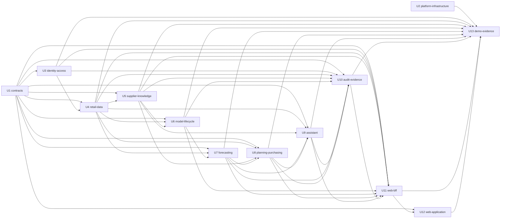

# StockSense unit dependency topology

Date: 2026-09-10
Stage: Units Generation
Status: Draft for independent review

This artifact records direct construction and integration dependencies. It does not recommend a delivery sequence or identify a critical path.

## Upstream basis

The topology mirrors the acyclic component relationships in `../domain-design/components.md`, preserves `../domain-design/decisions.md`, carries the integration and isolation constraints from `../requirements-analysis/requirements.md`, and supports the assignments in `../user-stories/stories.md` and `unit-of-work-story-map.md`.

## Machine-readable dependency DAG

An edge means “this unit depends on the listed unit.” Infrastructure packaging is an independent foundation; application code consumes its documented platform conventions without creating a construction dependency edge.

```yaml
units:
  - name: contracts
    kind: spec
    depends_on: []
  - name: platform-infrastructure
    kind: packaging
    depends_on: []
  - name: identity-access
    kind: service
    depends_on: [contracts]
  - name: retail-data
    kind: service
    depends_on: [contracts, identity-access]
  - name: supplier-knowledge
    kind: service
    depends_on: [contracts, retail-data]
  - name: model-lifecycle
    kind: service
    depends_on: [contracts, retail-data, supplier-knowledge]
  - name: forecasting
    kind: service
    depends_on: [contracts, retail-data, model-lifecycle]
  - name: planning-purchasing
    kind: service
    depends_on: [contracts, retail-data, supplier-knowledge, forecasting]
  - name: assistant
    kind: service
    depends_on: [contracts, retail-data, supplier-knowledge, forecasting, planning-purchasing]
  - name: audit-evidence
    kind: service
    depends_on: [contracts, identity-access, retail-data, supplier-knowledge, model-lifecycle, forecasting, planning-purchasing, assistant]
  - name: web-bff
    kind: service
    depends_on: [contracts, identity-access, retail-data, supplier-knowledge, model-lifecycle, forecasting, planning-purchasing, assistant, audit-evidence]
  - name: web-application
    kind: ui
    depends_on: [contracts, web-bff]
  - name: demo-evidence
    kind: packaging
    depends_on: [platform-infrastructure, identity-access, retail-data, supplier-knowledge, model-lifecycle, forecasting, planning-purchasing, assistant, audit-evidence, web-bff, web-application]
```

## Dependency diagram



Text fallback: Contracts and Platform Infrastructure are independent roots. Identity Access consumes Contracts. Retail Data consumes Contracts and Identity Access. Supplier Knowledge consumes Retail Data. Model Lifecycle consumes Retail Data and Supplier Knowledge. Forecasting consumes Retail Data and Model Lifecycle. Planning and Purchasing consumes Retail Data, Supplier Knowledge, and Forecasting. Assistant consumes the governed data, forecast, planning, and purchasing APIs. Audit Evidence consumes events from every authoritative publisher. Web BFF composes the authorized service APIs. Web Application calls Web BFF. Demo Evidence verifies the deployed system through Platform Infrastructure and supported application interfaces.

## Direct integration points

| Dependent | Dependency | Integration point |
| --- | --- | --- |
| Runtime consumers | Contracts | Versioned OpenAPI/AsyncAPI documents, examples, generated clients, compatibility checks |
| Retail Data | Identity Access | Authenticated account reference and machine-token validation; Retail Data performs current membership authorization |
| Supplier Knowledge | Retail Data | Authorized retailer/currency/product queries over REST; source and index events over RabbitMQ |
| Model Lifecycle | Retail Data | Versioned inventory and demand dataset exports over REST/job contracts |
| Model Lifecycle | Supplier Knowledge | Versioned accepted-term datasets and provenance over REST/job contracts |
| Forecasting | Retail Data | Authorized demand observations, retailer calendar, and persisted forecast routines through Forecasting ownership |
| Forecasting | Model Lifecycle | Promoted compatible model metadata and immutable artifact references |
| Planning and Purchasing | Retail Data | Inventory positions, versions, policies' retailer context, and receipt stock-posting command |
| Planning and Purchasing | Supplier Knowledge | Current accepted terms and source/version evidence |
| Planning and Purchasing | Forecasting | Valid 28-day forecast and freshness/status contract |
| Assistant | Retail Data | Tenant-authorized inventory and demand tools |
| Assistant | Supplier Knowledge | Authorized retrieval and supplier comparison tools with citations |
| Assistant | Forecasting | Forecast status and evidence tools |
| Assistant | Planning and Purchasing | Review-request and draft-proposal tools; approval is never exposed |
| Audit Evidence | Event publishers | Authoritative audit/outbox events over RabbitMQ AsyncAPI; idempotent OpenSearch projection and replay |
| Web BFF | Identity Access | OIDC authorization-code/PKCE, server-side tokens, logout, and session validation |
| Web BFF | Domain services | Versioned REST APIs with current retailer context and correlation metadata |
| Web Application | Web BFF | Same-origin browser API and secure HttpOnly session cookie; no direct domain-service calls |
| Demo Evidence | Platform and runtime units | Helm/deployment interfaces, supported APIs/events, smoke/recovery commands, and evidence outputs |

## Parallel development opportunities

- U1 Contracts and U2 Platform Infrastructure have no dependency between them and can progress independently.
- Contract examples, platform dependency packaging, and service-local domain design can be prepared concurrently as long as integration code waits for the declared direct dependency.
- Once U4 Retail Data contracts are stable, U5 Supplier Knowledge can progress while U4 continues internal implementation behind those contracts.
- U10 Audit Evidence consumers can be developed against U1 event examples while publishers implement their outboxes; final integration still depends on every declared publisher.
- U12 Web Application screens can be developed against U1 examples and U11 mocks while the BFF and domain services mature; final integration retains the DAG edges.
- U13 Demo Evidence scenarios and harness structure can be drafted against U2 conventions and U1 contracts, although end-to-end verification depends on the assembled units listed in the DAG.

## Topology constraints

- The fenced YAML block is authoritative and cycle-free.
- Edges record direct construction/integration dependencies, not runtime startup order, business value, risk priority, or a recommended implementation sequence.
- No edge authorizes direct storage access. Every cross-unit interaction uses an owned REST contract, an AsyncAPI event, or a documented deployment interface.
- Grouping TenantDirectory, Inventory, and DemandHistory in U4 and Replenishment with Purchasing in U8 does not erase the logical component boundaries or ownership rules.
- Future extraction may split an internal logical component into a new deployable while retaining its contract identity and tenant boundary.

