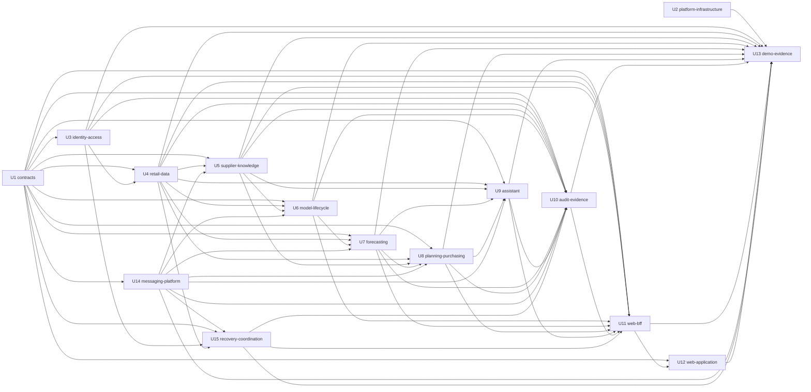

# StockSense unit dependency topology

Date: 2026-09-23
Stage: Units Generation
Status: Draft for independent review
Summary confirmation: Looks correct (2026-09-23)

This artifact records direct construction and integration dependencies. It does not recommend a delivery sequence or identify a critical path.

## Upstream basis

The topology mirrors the acyclic component relationships in `../domain-design/components.md`, preserves `../domain-design/decisions.md`, carries the integration and isolation constraints from `../requirements-analysis/requirements.md`, and supports the assignments in `../user-stories/stories.md` and `unit-of-work-story-map.md`.

## Machine-readable dependency DAG

An edge means “this unit depends on the listed unit.” Infrastructure packaging is an independent foundation; application code consumes its documented platform conventions without creating a construction dependency edge.

```yaml
units:
  - name: contracts
    kind: spec
    depends_on: []
  - name: platform-infrastructure
    kind: packaging
    depends_on: []
  - name: identity-access
    kind: service
    depends_on: [contracts]
  - name: retail-data
    kind: service
    depends_on: [contracts, identity-access]
  - name: supplier-knowledge
    kind: service
    depends_on: [contracts, retail-data, messaging-platform]
  - name: model-lifecycle
    kind: service
    depends_on: [contracts, retail-data, supplier-knowledge, messaging-platform]
  - name: forecasting
    kind: service
    depends_on: [contracts, retail-data, model-lifecycle, messaging-platform]
  - name: planning-purchasing
    kind: service
    depends_on: [contracts, retail-data, supplier-knowledge, forecasting, messaging-platform]
  - name: assistant
    kind: service
    depends_on: [contracts, retail-data, supplier-knowledge, forecasting, planning-purchasing, messaging-platform]
  - name: audit-evidence
    kind: service
    depends_on: [contracts, identity-access, retail-data, supplier-knowledge, model-lifecycle, forecasting, planning-purchasing, assistant, messaging-platform, recovery-coordination]
  - name: web-bff
    kind: service
    depends_on: [contracts, identity-access, retail-data, supplier-knowledge, model-lifecycle, forecasting, planning-purchasing, assistant, audit-evidence, recovery-coordination]
  - name: web-application
    kind: ui
    depends_on: [contracts, web-bff]
  - name: demo-evidence
    kind: packaging
    depends_on: [platform-infrastructure, identity-access, retail-data, supplier-knowledge, model-lifecycle, forecasting, planning-purchasing, assistant, audit-evidence, web-bff, web-application, messaging-platform, recovery-coordination]
  - name: messaging-platform
    kind: library
    depends_on: [contracts]
  - name: recovery-coordination
    kind: service
    depends_on: [contracts, identity-access, retail-data, messaging-platform]
```

## Dependency diagram


```mermaid
flowchart LR
  U1[U1 contracts]
  U2[U2 platform-infrastructure]
  U3[U3 identity-access]
  U4[U4 retail-data]
  U5[U5 supplier-knowledge]
  U6[U6 model-lifecycle]
  U7[U7 forecasting]
  U8[U8 planning-purchasing]
  U9[U9 assistant]
  U10[U10 audit-evidence]
  U11[U11 web-bff]
  U12[U12 web-application]
  U13[U13 demo-evidence]
  U14[U14 messaging-platform]
  U15[U15 recovery-coordination]

  U1 --> U3
  U1 --> U4
  U3 --> U4
  U1 --> U5
  U4 --> U5
  U1 --> U6
  U4 --> U6
  U5 --> U6
  U1 --> U7
  U4 --> U7
  U6 --> U7
  U1 --> U8
  U4 --> U8
  U5 --> U8
  U7 --> U8
  U1 --> U9
  U4 --> U9
  U5 --> U9
  U7 --> U9
  U8 --> U9
  U1 --> U10
  U3 --> U10
  U4 --> U10
  U5 --> U10
  U6 --> U10
  U7 --> U10
  U8 --> U10
  U9 --> U10
  U1 --> U11
  U3 --> U11
  U4 --> U11
  U5 --> U11
  U6 --> U11
  U7 --> U11
  U8 --> U11
  U9 --> U11
  U10 --> U11
  U1 --> U12
  U11 --> U12
  U2 --> U13
  U3 --> U13
  U4 --> U13
  U5 --> U13
  U6 --> U13
  U7 --> U13
  U8 --> U13
  U9 --> U13
  U10 --> U13
  U11 --> U13
  U12 --> U13
  U1 --> U14
  U14 --> U5
  U14 --> U6
  U14 --> U7
  U14 --> U8
  U14 --> U9
  U14 --> U10
  U14 --> U15
  U1 --> U15
  U3 --> U15
  U4 --> U15
  U15 --> U10
  U15 --> U11
  U14 --> U13
  U15 --> U13
```

Text fallback: Contracts and Platform Infrastructure are independent roots. Messaging Platform consumes the authoritative Contracts specifications and supplies reusable broker mechanics to asynchronous units. Identity Access consumes Contracts. Retail Data consumes Contracts and Identity Access. Supplier Knowledge consumes Retail Data and Messaging Platform. Model Lifecycle consumes Retail Data, Supplier Knowledge, and Messaging Platform. Forecasting consumes Retail Data, Model Lifecycle, and Messaging Platform. Planning and Purchasing consumes Retail Data, Supplier Knowledge, Forecasting, and Messaging Platform. Assistant consumes governed APIs and Messaging Platform. Recovery Coordination consumes Contracts, Identity Access, Retail Data, and Messaging Platform. Audit Evidence consumes events from authoritative publishers plus recovery evidence. Web BFF composes authorized service and recovery-status APIs. Web Application calls Web BFF. Demo Evidence verifies the deployed system, messaging conformance, and recovery outcomes through supported interfaces.

## Direct integration points

| Dependent | Dependency | Integration point |
| --- | --- | --- |
| Runtime consumers | Contracts | Versioned OpenAPI/AsyncAPI documents, examples, generated clients, compatibility checks |
| Messaging Platform | Contracts | Authoritative envelope and AsyncAPI schemas used to build the reusable broker libraries and conformance fixtures |
| Retail Data | Identity Access | Authenticated account reference and machine-token validation; Retail Data performs current membership authorization |
| Supplier Knowledge | Retail Data | Authorized retailer/currency/product queries over REST; source and index events over RabbitMQ |
| Model Lifecycle | Retail Data | Versioned inventory and demand dataset exports over REST/job contracts |
| Model Lifecycle | Supplier Knowledge | Versioned accepted-term datasets and provenance over REST/job contracts |
| Forecasting | Retail Data | Authorized demand observations, retailer calendar, and persisted forecast routines through Forecasting ownership |
| Forecasting | Model Lifecycle | C07 route-pin admission/drain, signed model package, global heavy-work lease, and the narrow same-transaction U6 finalization port |
| Planning and Purchasing | Retail Data | Inventory positions, versions, dated inbound commitments, retailer context, and approval/cancellation/receipt commands through owned ports and routines in the shared v1 deployment |
| Planning and Purchasing | Supplier Knowledge | Current accepted terms and source/version evidence |
| Planning and Purchasing | Forecasting | Valid 28-day forecast and freshness/status contract |
| Assistant | Retail Data | Tenant-authorized inventory and demand tools |
| Assistant | Supplier Knowledge | Authorized retrieval and supplier comparison tools with citations |
| Assistant | Forecasting | Forecast status and evidence tools |
| Assistant | Planning and Purchasing | Review-request and draft-proposal tools; approval is never exposed |
| Asynchronous producers and consumers | Messaging Platform | Versioned envelope implementation, RabbitMQ adapter, confirms, delivery identity, retry/DLQ/replay policy, payload limits, telemetry, and conformance fixtures |
| Recovery Coordination | Identity Access and Retail Data | Authenticated operator authority, retailer placement generation, fencing, and tenant-scoped recovery membership |
| Recovery Coordination | Messaging Platform | Deadline-bound recovery commands and participant acknowledgements using the common delivery protocol |
| Audit Evidence | Event publishers | Authoritative audit/outbox events over RabbitMQ AsyncAPI; idempotent OpenSearch projection and replay |
| Audit Evidence | Recovery Coordination | Recovery-run, checkpoint, fencing, and terminal-outcome events for authorized investigation |
| Web BFF | Identity Access | OIDC authorization-code/PKCE, server-side tokens, logout, and session validation |
| Web BFF | Domain services | Versioned REST APIs with current retailer context, recovery status where exposed, and correlation metadata |
| Web Application | Web BFF | Same-origin browser API and secure HttpOnly session cookie; no direct domain-service calls |
| Demo Evidence | Platform and runtime units | Helm/deployment interfaces, supported APIs/events, U14 conformance, U15 recovery commands, and evidence outputs |

## Parallel development opportunities

- U1 Contracts and U2 Platform Infrastructure have no dependency between them and can progress independently.
- After U1 envelope specifications stabilize, U14 Messaging Platform can progress in parallel with U3 Identity Access and U4 Retail Data.
- Contract examples, platform dependency packaging, and service-local domain design can be prepared concurrently as long as integration code waits for the declared direct dependency.
- Once U4 Retail Data contracts are stable, U5 Supplier Knowledge can progress while U4 continues internal implementation behind those contracts.
- U10 Audit Evidence consumers can be developed against U1 event examples and U14 conformance fixtures while publishers implement their outboxes; final integration still depends on every declared publisher and U15 recovery events.
- U12 Web Application screens can be developed against U1 examples and U11 mocks while the BFF and domain services mature; final integration retains the DAG edges.
- U15 Recovery Coordination can implement its state machine against U1 contracts and U14 fixtures while participant units implement their own checkpoints and generation guards.
- U13 Demo Evidence scenarios and harness structure can be drafted against U2 conventions and U1 contracts, although end-to-end verification depends on the assembled units listed in the DAG.

## Topology constraints

- The fenced YAML block is authoritative and cycle-free.
- Edges record direct construction/integration dependencies, not runtime startup order, business value, risk priority, or a recommended implementation sequence.
- No edge authorizes direct table or collection access. Every cross-unit interaction uses an owned REST contract, an AsyncAPI event, a documented deployment interface, or C07's single EXECUTE-only U6 stored-function port called by U5/U7 owner routines in the same retailer-local PostgreSQL transaction. This narrow runtime port does not add a generated-client or unit-build dependency edge; its versioned signature and fixtures are packaged by U1.
- Grouping TenantDirectory, Inventory, and DemandHistory in U4 and Replenishment with Purchasing in U8 does not erase the logical component boundaries or ownership rules. U4 and U8 remain separate construction units while sharing the v1 Retail Operations deployment for atomic purchasing/inventory routines.
- U14 owns common messaging mechanics only; U1 and each domain unit retain contract meaning and domain effects. U15 owns coordination state only; recovery participants retain their data and implementations.
- Future extraction may split an internal logical component into a new deployable while retaining its contract identity and tenant boundary.

