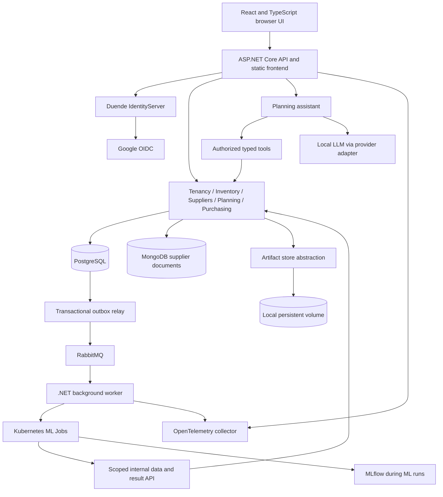

# StockSense — System Design

**Version:** 0.6 · **Date:** 2026-09-08 · **Status:** Draft for review

This document turns the owner's confirmed requirements into a proposed system
design. It is not an implementation report or a record of architecture approval.
It covers the first demonstrable release and the path to stronger tenant isolation.

MongoDB, Python and MLflow are owner-confirmed for supplier document storage,
forecasting/training/evaluation and experiment/model management respectively
(ADR 0008). Versions and detailed algorithms remain implementation decisions.

Initial supplier formats are owner-confirmed: CSV offers and text-based PDF
catalogs/terms (ADR 0009). Scanned PDFs and OCR are deferred. SS-21 must report
unsupported or partially extractable documents explicitly and preserve provenance.

Currency/calendar rules are owner-confirmed (ADR 0010): one configurable currency
and time zone per retailer; supplier prices in that currency with no conversion;
UTC timestamps, retailer-local sales dates and daily forecast scheduling; supplier
lead times in calendar days. Verify DST boundaries and idempotent scheduling.

Daily replenishment review, supplier constraints, configurable buffer-day safety
stock and manager approval are confirmed (ADR 0011). Add quota-limited manual
reviews using current inventory/terms and the latest valid forecast, without model
retraining. SS-35 covers atomic quotas, deduplication, async jobs and UI; three
requests per retailer/local day is confirmed, shared across users and excluding
scheduled daily reviews.

Reviewer reproducibility is required (ADR 0013): a clean local setup must run
without owner hardware/secrets. Version and script configuration/bootstrap;
validate real CPU inference and optional accelerated profiles. Google/Bedrock
credentials are optional. Model weights and secrets are acquired/generated locally,
not committed. Publish measured minimum requirements rather than assuming fit.

Strands Agents in a Python service is selected (ADR 0014). Its model-provider
interface unifies local llama.cpp and optional Bedrock integration. StockSense
OpenAPI contracts isolate callers from framework types; authenticated .NET tools
retain tenant authorization and purchasing authority. Include the Python agent
service in resource sizing.

EmbeddingGemma-300M and Qwen3-Embedding-0.6B are owner-approved embedding
candidates (ADR 0015). Compare them on CPU with separate versioned Qdrant indexes,
then choose a default from retrieval quality, latency, memory and setup evidence.
English is the initial supported document/query language. Preserve multilingual
extensibility and original source text; additional language and cross-language
validation follows when those languages are selected.
Do not mix embeddings from different configurations.

Qdrant uses separate collections per retailer and embedding-model/configuration
version (ADR 0018). Trusted backend routing selects the authorized active index;
collection separation does not replace tenant/document authorization. Validate
reindex cutover, deletion reconciliation, rollback and tenant migration.

OpenSearch and OpenSearch Dashboards are selected for logs and audit search
(ADR 0019), replacing the Loki proposal. PostgreSQL retains authoritative business
audit entries committed atomically with mutations and outbox events; RabbitMQ
drives idempotent indexing. Search is eventually consistent and tenant-authorized.
SS-37/38 cover recording, indexing and investigations; SS-24 must validate the
additional services within 16 GB/3 CPU. Metrics/trace storage remains open.

## 1. Intent and confirmed constraints

StockSense helps retailers decide what to reorder, when, and why. It combines
demand forecasts, inventory position, supplier constraints, and an AI planning
assistant in a purchasing workflow whose decisions can be inspected and evaluated.

| Confirmed requirement | Design implication |
| --- | --- |
| Non-perishable specialty retail, such as household goods | No expiry, cold-chain or waste optimization in the initial domain |
| Multiple independent retailers from the first release | Tenant authorization applies to every business operation and stored result |
| Shared database initially, strict tenant boundaries | Shared storage with defense in depth; no tenant-selected arbitrary database identifiers |
| Future separate databases per tenant | Central tenant placement directory and explicit migration procedure |
| Reproducible synthetic sales, inventory and supplier data | Seeded simulation and repeatable evaluation scenarios |
| Cloud-native, initially Docker Desktop Kubernetes | Containerized workloads, portable deployment manifests, persistent storage and health checks |
| Terraform and Terragrunt for infrastructure delivery | Terraform modules define resources; Terragrunt composes environment configuration and dependencies |
| Flyway for PostgreSQL migrations; Dapper instead of EF Core | Versioned database deployment and explicit, parameterized routine calls |
| Application PostgreSQL access only through stored procedures and functions | No direct application table queries, writes, or generated SQL |
| RabbitMQ for asynchronous flows | Durable messaging with transactional outbox, acknowledgements and idempotent consumers |
| AsyncAPI for async contracts; OpenAPI for REST contracts | Version-controlled, validated contracts for every integration, including internal APIs |
| Dedicated standards-based identity with native OIDC/OAuth and federation | Duende IdentityServer selected; dedicated .NET identity service with custom persistence |
| 16 GB RAM; at most 25% of a reported 12-core machine | Planning envelope of 3 CPU units; verify Docker Desktop's exposed logical CPU count at deployment |
| Demonstrate React, .NET, SQL, NoSQL, ML/MLOps, agents and DevOps | Each technology has a defined responsibility and verifiable portfolio evidence |

Three CPU units are a resource-planning interpretation of the owner's numbers,
not a guarantee of exactly 25% utilization shown by the host OS. Hyperthreading,
Docker Desktop's VM/WSL configuration and other workloads affect that reading.

### Proposed release boundary

Seed three retailers, one store per retailer and 100 products per store. Use
18 months of daily synthetic history and a 28-day forecast horizon, refreshed
daily. The owner accepted this demo baseline (ADR 0004), including seasonality,
promotions and intermittent demand across retailers. It is not a production
capacity guarantee.

The release includes import, inventory history, supplier offers, forecasts,
shortage prioritization, scenario comparison, purchase approval and simulated
receipt. Defer real purchasing, payments, inter-store transfers, price optimization,
public signup and production high availability.

## 2. Users and primary workflow

| Role | Responsibilities |
| --- | --- |
| Planner | Inspect stock risk, compare options, create and submit proposals |
| Manager | Review, approve or reject submitted orders |
| Retailer administrator | Manage memberships and retailer planning settings |
| Platform operator | Provision tenants and operate infrastructure; cross-tenant access is privileged and audited |

Memberships assign roles per tenant. A user may belong to multiple retailers but
operates within one selected tenant at a time. The demo uses separate planner and
manager identities to demonstrate the approval boundary.

1. Import validated sales, inventory movements and supplier terms.
2. Produce a versioned daily forecast for each tenant's products.
3. Rank likely shortages using inventory and expected arrivals.
4. Inspect a recommendation's inputs and compare scenarios.
5. Create a draft purchase order, then submit it for review.
6. A manager approves or rejects it after backend revalidation.
7. A simulated supplier acknowledgement and receipt update order and stock state.
8. Evaluate forecast error and inventory outcomes against the baseline policy.

The agent is optional to completing this workflow. A model-provider outage must
not prevent planners from using forecasts, calculators and purchasing screens.

## 3. Architecture

Use a modular ASP.NET Core application plus a background worker and a Python ML
job image. Avoid separate microservices for each business module in the first
release: the local CPU budget and transactional purchasing workflow favor fewer
deployments.



The diagram is logical: domain modules and internal endpoints live in the same
API deployment. Serve the compiled React application from that deployment locally
to reduce containers and simplify cookie authentication. A cloud deployment can
move static assets to a CDN without changing business APIs.

The outbox relay runs inside the .NET worker deployment; it is not an additional
always-on deployment. RabbitMQ transports asynchronous work and domain events.

| Component | Responsibility |
| --- | --- |
| React + TypeScript | Worklist, forecasts, inventory timeline, scenario comparison, order review, assistant evidence |
| ASP.NET Core + Dapper/Npgsql | HTTP APIs, authentication, authorization, validation, transactions, typed database routine calls and agent tools |
| Duende IdentityServer | OIDC/OAuth authentication, SSO, MFA and identity federation; custom Dapper stores and a Flyway-managed identity database |
| Flyway | PostgreSQL schema, routine, RLS policy and grant migrations |
| .NET worker | Reliable job processing, import normalization, simulation and bounded ML job launching |
| RabbitMQ | Asynchronous commands/events, consumer queues, retries and dead-letter handling |
| PostgreSQL | Tenant directory, business data, inventory ledger, forecasts, audit records and durable jobs |
| MongoDB | Heterogeneous source supplier documents and their validation/extraction history |
| Python + scikit-learn | Features, baselines, candidate training, temporal evaluation and batch predictions |
| MLflow | Operator-only experiment tracking, model registration and evaluation evidence |
| Artifact store adapter | Versioned datasets, model files, reports and original import files |
| Kubernetes + Helm | Portable deployment, resource configuration, Jobs, probes and persistence |
| Terraform + Terragrunt | Infrastructure provisioning and deployment configuration from the local release onward |

## 4. Module and data ownership

| Module | Principal entities | Important rules |
| --- | --- | --- |
| Tenancy and access | Tenant, User, Membership, TenantPlacement | Tenant identity comes from authenticated membership; placement is operator-controlled |
| Catalog and suppliers | Product, Supplier, SupplierOffer | Offers have currency, lead time, validity, pack size and minimum order quantity |
| Inventory | InventoryMovement, InventoryBalance | Append-only movements; balance changes atomically with the movement |
| Demand planning | DailySales, ForecastRun, ForecastPoint, PlanningPolicy, Scenario | Forecasts are immutable by run; active selection is explicit |
| Purchasing | Proposal, PurchaseOrder, OrderLine, Receipt | Valid transitions, optimistic concurrency and idempotent receipts |
| Operations | ImportRun, Job, AuditEvent | Correlation, durable state, bounded retries and tenant ownership |

Every tenant-owned SQL row has a non-null `tenant_id`. Primary/unique keys and
foreign keys include the tenant where needed to prevent cross-tenant associations.
Product codes, external order IDs and idempotency keys are unique within a tenant.
Platform identity and placement tables are a separate control-plane boundary.

Store monetary amounts as decimal values with an explicit currency; quantities
are whole units for v1. Store instants in UTC and daily sales by the retailer's
business date/time zone. Cross-currency purchasing is deferred. Corrections create
compensating inventory movements rather than rewriting stock history.

MongoDB records include `tenantId`, `submissionId`, `schemaVersion`, `sourceHash`,
`receivedAt`, source content, and extraction/validation revisions. Normalized,
accepted offers live in PostgreSQL and retain the source submission/revision ID.

## 5. Tenant isolation

### Request and SQL boundary

- Authenticate first, then resolve the selected tenant against server-side membership.
- Reject an absent, disabled or unauthorized tenant before accessing business data.
- Tenant IDs in routes, headers or bodies are selectors, never proof of authority.
- Apply PostgreSQL row-level security (RLS), including write checks, to all
  tenant-owned tables. Missing tenant context fails closed.
- Runtime roles receive execution rights on approved routines, not direct table
  privileges. Neither runtime nor routine-owner roles have superuser or `BYPASSRLS`
  privileges. Enable `FORCE ROW LEVEL SECURITY`; keep migration credentials separate.
- Approved routines validate tenant context and set it transaction-locally before
  data access. Never leave tenant state on a pooled connection. Background jobs
  follow the same contract. Routines must fail closed for missing context.
- Routine predicates and tenant-aware Dapper adapters provide an additional
  application boundary alongside RLS. No EF Core dependency or query filters are used.

PostgreSQL owners and privileged roles can bypass ordinary RLS; role design and
forced policies are therefore part of the design, not optional configuration.
[PostgreSQL row security documentation](https://www.postgresql.org/docs/current/ddl-rowsecurity.html)

### NoSQL, artifacts and asynchronous work

MongoDB shared collections do not inherit PostgreSQL RLS. Only the backend's
tenant-scoped repository accesses them; clients and Python jobs receive no shared
MongoDB credentials. Every read, update, delete and aggregation starts with a
tenant constraint. Test this adapter with adversarial cross-tenant identifiers.
This is an application-enforced boundary: a compromised privileged backend can
access shared documents. Separate storage/credentials is the stronger future option.

Artifact keys include an internal tenant ID and immutable run ID. They are served
through authorized API endpoints, not public volume paths. Cache keys, job claims,
imports, conversations, forecast selection and audit queries are tenant-scoped.

The worker consumes RabbitMQ messages and resolves the referenced operation using
approved routines before opening a tenant-scoped unit of work. Broker messages
cannot supply arbitrary connection strings. Validate message tenant, operation
ownership and placement generation; a tenant header alone is not authorization.
Python jobs receive short-lived credentials restricted to one tenant,
one job, allowed dataset downloads and result uploads.

Models are trained and registered per tenant initially; do not pool one retailer's
data into another retailer's model. MLflow is an internal operator tool, not a
tenant-facing authorization layer. Application access to models is mediated by the API.

### Migration to a dedicated tenant database

`TenantPlacement` resolves a tenant to SQL, document and artifact storage locations
through secret references and a placement generation. Business modules depend on
tenant-aware storage factories, not hard-coded shared connections.

1. Provision destination storage at the same schema version.
2. Pause that tenant's writes and job dispatch; drain or cancel active jobs.
3. Export its business rows, documents, artifacts and relevant audit history.
4. Import and validate counts, checksums, relationships and forecast/model references.
5. Atomically change placement generation, invalidate routing caches and reject
   any stale-generation job or in-flight write.
6. Run tenant-specific smoke checks, then reopen writes and scheduling.
7. Retain the old copy read-only for a defined rollback/retention window.

Before new writes, rollback can restore the old route. After new writes occur,
rollback requires reconciliation or reverse migration; simply switching back
would lose data. V1 permits tenant maintenance downtime and does not promise live migration.

## 6. Business rules and APIs

### PostgreSQL access contract

All StockSense PostgreSQL access from APIs, workers, membership stores, imports,
health checks and jobs uses schema-qualified stored procedures or functions.
Dapper maps parameters and result sets over Npgsql. There are no inline table
queries, ad hoc DML, query builders or generic CRUD repositories in application code.
SQL data access lives inside database routines deployed by Flyway.

A fixed, parameterized `CALL api.submit_order(...)` or
`SELECT * FROM api.get_inventory(...)` is a routine invocation, not an exception
allowing application-side table queries. Application code may not append joins,
filters or arbitrary SQL to those calls. Procedure and function invocation differ
in PostgreSQL/Npgsql; `CommandType.StoredProcedure` invokes a procedure, not a
function. [Npgsql invocation documentation](https://www.npgsql.org/doc/basic-usage.html)

Version routine contracts with named inputs, explicit result columns, tenant
context, concurrency versions and stable domain error codes. Replenishment math
remains testable .NET domain logic; routines own persistence, atomic transitions,
integrity checks and tenant-scoped reads. Do not duplicate calculation logic in SQL.

To enforce execute-only access, routines needing table access use narrowly scoped
`SECURITY DEFINER` owners distinct from migration/table-owner roles. Give each
owner only required data privileges, retain RLS, fix `search_path` to trusted
schemas with `pg_temp` last, schema-qualify objects and revoke default `PUBLIC`
execution privileges. Do not expose arbitrary SQL or object names as routine inputs.
Cross-tenant scheduling metadata uses separate privileged routines rather than
bypassing tenant business-data policies.
[PostgreSQL secure function guidance](https://www.postgresql.org/docs/current/sql-createfunction.html)

Flyway migration scripts necessarily contain DDL and routine definitions; this
deployment-time SQL is distinct from prohibited direct application queries.
Use versioned migrations under `database/postgresql/migrations/` for tables,
indexes, constraints, routines, policies and grants. Applied versioned migrations
are immutable; corrections roll forward through new migrations. Run Flyway
`validate` and `migrate` in a dedicated release Job, and block application rollout
on failure. Do not migrate on every API startup or use EF migrations.
[Flyway versioned migrations](https://documentation.red-gate.com/flyway/flyway-concepts/migrations/versioned-migrations)

The same migration chain applies to the shared database and future dedicated
tenant databases. Track migration success per placement. Terraform/Terragrunt
configure infrastructure and the migration Job; Flyway owns the database schema.
Backup/restore and operator migration tooling remain separate from application
credentials. MLflow owns its own isolated metadata store and receives no access
to StockSense business tables.
The Duende identity service uses custom Dapper/Npgsql stores calling stored
procedures/functions only. Flyway manages a separate identity database migration
chain. Runtime roles have execute-only routine access and no business-database
privileges. EF Core and direct table access are prohibited in this service too.

The replenishment engine is deterministic. For each SKU, project daily stock
using on-hand, allocations/backorders, dated inbound orders and forecast demand.
An inbound order arriving after a projected stockout must not hide that shortage.

For an eligible supplier, calculate demand over lead time plus review period,
add policy safety stock, subtract eligible inventory position, and clamp at zero.
If positive, apply the supplier minimum and round upward to a pack multiple.
Flag budget violations for review; do not claim globally optimal allocation.

The owner-confirmed v1 policy uses configurable buffer days for safety stock,
with retailer defaults and product overrides selected through simulation (ADR 0011). It does
not claim a calibrated service-level guarantee. Forecast intervals and probabilistic
service-level policies are later extensions.

Order lifecycle:

```text
Draft -> Submitted -> Approved -> Sent (simulated) -> PartiallyReceived -> Received
                   -> Rejected
Draft / Submitted -> Cancelled
```

Approval revalidates offer validity, prices, quantities, permissions and inventory
snapshot. A material difference returns a conflict requiring a revised proposal.
An approved order's commercial lines are immutable; changes create a revision.
Receipts use an idempotency key and atomically update receipt, order and inventory.

Illustrative API surface:

| Route | Purpose |
| --- | --- |
| `GET /api/tenants` | List the authenticated user's memberships |
| `POST /api/tenants/{tenantId}/imports` | Validate/queue an import; return an operation ID |
| `GET /api/tenants/{tenantId}/inventory` | Paginated/filterable stock positions |
| `GET /api/tenants/{tenantId}/planning/risks` | Prioritized shortage worklist |
| `POST /api/tenants/{tenantId}/planning/scenarios` | Calculate and store a reproducible scenario |
| `POST /api/tenants/{tenantId}/orders` | Create a draft |
| `POST /api/tenants/{tenantId}/orders/{id}/submit` | Submit a versioned draft |
| `POST /api/tenants/{tenantId}/orders/{id}/approve` | Manager-only approval with expected version |
| `POST /api/tenants/{tenantId}/orders/{id}/receipts` | Record an authorized simulated receipt |
| `POST /api/tenants/{tenantId}/assistant/messages` | Stream assistant response and evidence |

### API and message contracts

Use contract-first, version-controlled **OpenAPI for all REST flows**, including
internal data/result APIs, and **AsyncAPI for all asynchronous message flows**.
Describe an HTTP-triggered asynchronous operation in both: OpenAPI defines the
request, accepted response and operation-status endpoint; AsyncAPI defines the
commands/events emitted and consumed behind it.

Proposed contract locations:

- `contracts/openapi/stocksense.yaml`: public application REST surface.
- `contracts/openapi/internal.yaml`: scoped worker/ML REST surface.
- `contracts/asyncapi/stocksense.yaml`: logical messages, producers/consumers,
  RabbitMQ channels, AMQP bindings, routing and security requirements.
- `contracts/schemas/`: reusable payload schemas, using dialects compatible with
  the pinned OpenAPI/AsyncAPI tools. Do not assume all schema dialects interoperate.

REST contracts define request/response schemas, stable operation IDs, authorization,
validation errors, pagination, idempotency and optimistic concurrency. Generate
the TypeScript client and validate server behavior against the reviewed contracts.
Unauthorized foreign-tenant object IDs should not disclose object existence.
[OpenAPI overview](https://www.openapis.org/what-is-openapi)

AsyncAPI contracts define commands separately from events, channel direction,
payload/header schemas, correlation IDs, bindings and examples. Include delivery,
ordering, retry and replay semantics in descriptions/extensions where the schema
does not encode them. Validate the RabbitMQ topology against those declarations;
AsyncAPI documentation alone does not provision or enforce broker behavior.
[AsyncAPI message documentation](https://www.asyncapi.com/docs/concepts/asyncapi-document/adding-messages)

Every message carries a unique `messageId`, `messageType`, `schemaVersion`,
`tenantId`, `operationId`, `correlationId`, `causationId`, `occurredAt` and
`placementGeneration`, plus its typed payload. Retransmission preserves message
identity. Carry trace context separately; never put secrets or large datasets in
messages. Use authorized artifact references for bulk data.

Illustrative flows to specify before implementation:

| Command/event | Producer -> consumer | Purpose |
| --- | --- | --- |
| `ImportRequested.v1` | API outbox -> import worker | Process a validated import reference |
| `ForecastRequested.v1` | scheduler/API outbox -> ML coordinator | Launch one bounded scoring operation |
| `ForecastCompleted.v1` | result-import outbox -> planning consumer | Recompute risk from a committed forecast run |
| `PurchaseOrderApproved.v1` | approval outbox -> supplier simulator | Simulate supplier acknowledgement |
| `SupplierReceiptAvailable.v1` | simulator outbox -> receipt consumer | Apply an idempotent inventory receipt |

All API/message changes update the appropriate contract first. CI validates/lints
specifications, resolves references, checks examples and flags breaking changes.
REST integration tests and message producer/consumer tests check actual behavior.
Deploy consumers compatible with new messages before enabling producers. Breaking
changes use explicit contract versions and a documented coexistence/deprecation plan.

## 7. Jobs and consistency

Use RabbitMQ from the first asynchronous slice. PostgreSQL retains operation
state and transactional outbox/inbox records, not a replacement transport queue.
All access to these records uses approved stored procedures/functions via Dapper.

1. A business routine commits its state change and outbox message atomically.
2. The relay claims pending outbox rows through routines and publishes persistent
   messages to durable exchanges/queues, with publisher confirms and mandatory
   routing checks. Unroutable messages remain failed/pending for investigation.
3. Mark publication complete only after successful routing/confirmation. A crash
   after publish but before marking can produce duplicates; do not claim exactly once.
4. A consumer validates schema, tenant and placement, then atomically records its
   inbox deduplication key and business effect through a routine. Acknowledge the
   RabbitMQ delivery only after that commit.
5. Transient errors use bounded delayed retries, not immediate requeue loops.
   Invalid/poison messages reach a dead-letter queue with operator-visible status.
   Confirm successful retry/dead-letter publication before acknowledging the
   original if the application performs that republish itself.

Use tenant/message/consumer identity for deduplication so separate subscribers
can each handle an event. External effects, such as Kubernetes Job creation, use
deterministic operation IDs and reconciliation. A durable accepted ML operation
can acknowledge its command after recording launch intent; completion is a
separate event, not a RabbitMQ delivery held open for the duration of training.

Publisher confirms and consumer acknowledgements address separate failure windows;
recovery can still redeliver messages. [RabbitMQ reliability guide](https://www.rabbitmq.com/docs/reliability)

Use separate command/event exchanges and a durable queue per consumer capability,
with retry/dead-letter topology. The initial broker has one application vhost;
retailers never receive broker credentials. Routing keys are not a tenant security
boundary. Apply least-privilege producer/consumer permissions, bounded prefetch,
per-tenant submission/concurrency quotas, and no global FIFO assumption. Entity
versions and routine preconditions handle out-of-order events.

During tenant migration, pause dispatch and drain active work as described above;
queued messages with an old placement generation must be reconciled/reissued by
the coordinator, never executed against stale storage.

Supplier ingestion crosses stores without a distributed transaction: create an
idempotent SQL import record, store a source document under its deterministic ID,
then transactionally accept normalized offers and mark the import complete. Retries
reconcile incomplete records. Unaccepted documents never become purchasing truth.

RabbitMQ is the selected broker; Kafka and a service mesh are outside initial scope.

## 8. ML and MLOps

The seeded generator produces seasonal demand, promotions, intermittent products,
supplier delays and stockouts. Preserve both latent demand and fulfilled sales;
the latter alone is censored when stock is unavailable. Keep generation version,
seed and scenario parameters with each dataset.

Pipeline:

1. Validate tenant data and freeze a dataset snapshot/cutoff.
2. Create lag, rolling-window and calendar features without future leakage.
3. Evaluate seasonal-naive and moving-average baselines.
4. Train a small tree-based candidate with bounded CPU/thread counts.
5. Backtest using rolling origins and the same forecast horizon as deployment.
6. Record code revision, dataset hash, features, parameters and metrics in MLflow.
7. Select a candidate only when it passes agreed quality checks; otherwise retain
   the baseline. Store immutable model version IDs with production forecasts.
8. Generate daily batch predictions and measure error as actuals arrive.

Report MAE, aggregate WAPE with an explicit zero-demand handling rule, bias and
per-product/volume-segment results. Use a held-out final window after tuning.
Inventory simulations compare lost demand, stockout days and average inventory
value under identical demand, starting inventory and supplier scenarios.

Training uses one Kubernetes Job at a time, with a maximum runtime and memory limit.
Batch scoring reads the approved immutable model version. A model failure retains
the last valid forecast with an age indicator; stale forecasts beyond the configured
threshold block automatic proposal creation and direct the user to review.

Training is on demand initially; daily scoring uses CronJob scheduling. Monitor
error and input distributions, but trigger retraining manually until the dataset
and evaluation process are stable. Rollback selects a prior approved version and
regenerates predictions; historical runs are never overwritten.

## 9. Agentic planning assistant

The assistant answers business questions and performs a bounded tool loop:
retrieve evidence, calculate options, explain results and optionally create a draft.

Tools: `GetInventoryPosition`, `GetForecast`, `GetSupplierOffers`,
`CalculateReplenishment`, `CompareScenarios`, `CreateDraftProposal`.

Tenant identity and user authority are bound by the server and are not editable
tool arguments. Validate every tool input and authorize every call. The agent
cannot approve orders, send real purchases, execute arbitrary SQL or access the shell.

Supplier text is untrusted input. Instructions inside documents cannot grant
permissions. Responses cite the underlying record/run versions and distinguish
measured facts from scenario assumptions. Require an explicit user request before
draft creation; enforce cost, timeout and tool-call budgets (proposed: eight calls
and 45 seconds per turn). Persist a sanitized trace for evaluation.

Use a local LLM initially (owner decision, ADR 0012). Keep a provider-neutral
application interface with a local adapter and an extension point for external
APIs such as Bedrock. Local runtime/model and host-versus-Kubernetes placement
require runtime/resource validation. The owner reports an RX 6700 XT with 12 GB
VRAM; GPU passthrough and additional host RAM/CPU are not assumed. Do not
automatically fall back to a remote provider. Keep domain authorization outside
adapters and test capability differences explicitly. A deterministic fake provider
is reserved for tests and is clearly labeled as a simulation.

## 10. Kubernetes deployment and resource plan

Use one application namespace, not a namespace per retailer. Deploy the API,
worker, PostgreSQL, MongoDB, RabbitMQ, Duende IdentityServer and a
lightweight telemetry collector.
PostgreSQL, MongoDB and RabbitMQ use persistent volumes; the local artifact adapter
uses a separate PVC. The local single-node broker is not highly available; durable
queues do not protect against loss of its disk. Cloud broker replication and queue
policies require a separate availability design.
Expose only the application via port-forward initially; add ingress when needed.

The local artifact backend assumes a single-node cluster. Access files through
the API, so jobs need no direct volume mount. A cloud/multi-node profile replaces
this backend with object storage before scaling the API across nodes.

### Initial resource estimates

This table predates the accepted Vault addition (ADR 0006) and is incomplete for
the final deployment. SS-29 must recalculate it within the same 16 GB/3-CPU budget,
including local LLM inference where deployed, the selected injection mechanism,
Redis and the standalone vector
service. Redis and Qdrant are selected (ADR 0007).
These are testable starting values, not benchmark results. One replica per
long-running component; do not automatically scale beyond the local budget.

| Workload | CPU request / limit | Memory request / limit | Mode |
| --- | --- | --- | --- |
| API + static UI | 250m / 500m | 512 MiB / 1 GiB | Always on |
| .NET worker | 100m / 150m | 256 MiB / 512 MiB | Always on |
| PostgreSQL | 250m / 500m | 1 GiB / 2 GiB | Always on |
| MongoDB | 150m / 300m | 768 MiB / 1.5 GiB | Always on |
| RabbitMQ | 150m / 250m | 512 MiB / 1 GiB | Always on |
| Duende IdentityServer | 200m / 350m | 768 MiB / 1 GiB | Always on; separate logical database on local PostgreSQL |
| Telemetry collector | 100m / 150m | 256 MiB / 512 MiB | Always on |
| Python training/scoring Job | 250m / 250m | 2 GiB / 4 GiB | One at a time |
| MLflow | 50m / 100m | 256 MiB / 512 MiB | Enabled during ML work |
| **Maximum active application total** | **1.50 / 2.55 CPUs** | **6.25 GiB / 12 GiB** | Includes IdentityServer and one ML job |

Reserve the remaining CPU capacity (approximately 0.45 CPU at these limits) and
at least 2 GiB RAM for Kubernetes, Docker Desktop overhead and transient work.
IdentityServer retains the identity-service reservation below; these are initial
estimates, not measured Duende requirements. The constrained ML CPU limit implies
slower training. Serialize identity migrations/startup and training; measure startup,
steady-state memory and CPU before tuning limits.
Validate node allocatable resources and actual host configuration before applying
these settings. If control-plane overhead exceeds the reserve, reduce workload
concurrency or revise the estimates; do not silently increase the owner's budget.

Kubernetes schedules using requests; CPU limits can throttle workloads and memory
limits can cause termination. Do not interpret requests as maximum usage.
[Kubernetes resource management](https://kubernetes.io/docs/concepts/configuration/manage-resources-containers/)

Configure application namespace quotas, per-container requests/limits, startup
and readiness probes, graceful shutdown and job deadlines. Serialize ML jobs and
avoid rolling-update surge that breaches the CPU envelope. Resource settings for
PostgreSQL buffers, MongoDB cache, RabbitMQ memory/disk watermarks and Python
threads must match container limits. Monitor broker backpressure and queue growth.

A Helm chart has local and future cloud values. Docker Desktop itself is an
external prerequisite, not provisioned by Terraform. From the first local release,
Terraform manages application infrastructure and Helm releases in the existing
cluster; Terragrunt supplies environment inputs and dependency ordering. The same
module boundaries support a later cloud environment. A full metrics/dashboard stack is an
optional diagnostics profile, not part of the always-on resource estimate.

## 11. Authentication, operations and delivery

### Cache and standalone vector retrieval

Redis is the selected application cache; a standalone vector service is required
for RAG (ADR 0007). Qdrant is selected; start with one persistent instance
deployed through Terraform/Terragrunt with Vault-managed credentials.
Use tenant-scoped, bounded, disposable caching with authoritative permission and
purchasing checks. Keep identity sessions outside the evictable cache. Vector
retrieval must enforce tenant/document authorization through a trusted adapter;
index asynchronously with versioned chunks/embeddings and explicit deletion and
rebuild behavior. SS-32–34 cover deployment, integration and adversarial evaluation.
Both services require a revised resource budget before deployment.

### Secrets management: HashiCorp Vault

The owner selected Vault inside Kubernetes (ADR 0006). Use a persistent single
instance with TLS, deployed through Terraform/Terragrunt and the official Helm
chart. Bootstrap/init/unseal separately, then configure policies and Kubernetes
authentication through the Vault provider. Keep secret values and unseal material
outside Git and Terraform state; use scoped workload identities and test rotation,
sealed-server behavior and snapshot recovery. Manual unseal is the initial local
approach, with recovery material held outside the cluster. Define
consumer reload/rollout behavior and Duende key integration in SS-30. Use Vault
Secrets Operator (ADR 0017) to synchronize Vault values into Kubernetes Secrets;
verify RBAC, at-rest protection and rotation adoption. Never use development mode.

### Selected identity provider: Duende IdentityServer

The owner selected Duende IdentityServer on 2026-09-08 (ADR 0002). Deploy a
dedicated ASP.NET Core identity service on Docker Desktop Kubernetes. Start with
OIDC federation with Google, alongside seeded local demo accounts and local-only
initial access (owner decision, ADR 0005).
Provide login/account integration and custom persistence explicitly. Seeded local accounts use supported password/authentication libraries and custom
Dapper/routine persistence. Generate or inject credentials outside Git and disable
demo seeding outside the local profile. MFA scope remains to be determined; do not
implement custom cryptography.
[External providers](https://docs.duendesoftware.com/identityserver/ui/login/external/)

Use one issuer initially. Retailer federation connections do not replace business
tenant boundaries. StockSense owns tenant memberships and permissions. Provision
membership through invitations or controlled administration, never email domains
or arbitrary tenant claims. Resolve identities by stable (issuer, subject), not
email, and require verified account linking. Revoked membership must take effect
independently of a still-valid identity session.

The .NET backend acts as a BFF: confidential OIDC client, Authorization Code with
PKCE, server-side token storage and Secure/HttpOnly cookies for React. Validate
issuer, audience where applicable, signature, expiry, state and nonce. Require
exact redirects, HTTPS and CSRF protection; prohibit implicit and password grants.
Application logout clears the local session; test upstream logout separately.
The BFF pattern does not require the separately licensed Duende BFF package.

Machine callers use separate OAuth clients with narrow audiences/scopes; job APIs
also validate tenant, operation, placement and job authority. OpenAPI documents
machine bearer authentication and browser cookie/CSRF requirements. RabbitMQ uses
separate service credentials, never browser tokens as broker credentials.

Expose one stable HTTPS issuer reachable by browser and backend. Restrict admin
access to operators. Version clients/scopes/provider configuration; use reviewed
configuration or idempotent bootstrap, with Terraform/Terragrunt deploying the
infrastructure and injecting secrets separately. Pin supported .NET/Duende versions
at implementation. No assumed Terraform administration provider is required.

Use a separate logical PostgreSQL identity database with runtime/migration roles
and a Flyway chain. Implement required configuration and operational store
interfaces using Dapper and stored routines, including persisted grants and any
enabled session/key stores. Persist and protect signing and ASP.NET Core data
protection keys across pod restarts; verify rotation and restoration. Do not use
development signing keys for shared deployments. A single local replica is not a
production availability commitment. Identity outages block login/refresh; existing
sessions follow bounded lifetimes and membership revalidation policies.
[Custom stores](https://docs.duendesoftware.com/identityserver/data/providers/custom/)

Duende permits personal/development/test use without a license. Production
Community Edition requires eligibility review and a license key kept out of Git.
It is Standard-based; do not assume SAML add-ons, the Duende BFF product, or
redistribution rights are included. Check entitlements before enabling them.
[Community Edition](https://duendesoftware.com/products/communityedition)
[Licensing](https://docs.duendesoftware.com/general/licensing/)

The deployment binds to local interfaces by default. Any public/cloud exposure
requires TLS and reviewed authentication configuration. Keep databases internal,
use least-privilege service accounts, and limit worker Kubernetes rights to the
required Job operations in its namespace. Apply network policies only after
verifying that the installed networking implementation enforces them.

Secrets are injected at deployment, never committed. Do not log credentials,
raw supplier documents, full prompts or unrestricted tenant data. Audit approval,
membership changes, tenant migration and privileged operations. Audit tables are
application append-only; v1 does not claim tamper-proof administrator evidence.

Terraform and Terragrunt are the confirmed infrastructure delivery tools. They
do not themselves provide CI scheduling, build execution or test runners. The
owner selected GitHub Actions with a dedicated self-hosted runner for deployment
to Docker Desktop Kubernetes (ADR 0003). Use GitHub-hosted runners for PR CI.

The delivery workflow runs frontend/backend tests, tenant-isolation integration
tests, OpenAPI/AsyncAPI validation and compatibility checks, message contract tests,
linting, container builds, dependency/image scans and Helm rendering checks.
It then validates/formats Terraform and Terragrunt configuration, produces a plan,
and applies the reviewed deployment with immutable image references. Run CI in an
isolated environment. Initial deployment commands execute on the developer machine
with access to Docker Desktop; automated deployment uses the dedicated runner
with scoped cluster credentials. Never execute untrusted PR code on that runner.
Before registration, establish isolation from public PR workflows; consider a
private deployment repository. A runner label alone is not an access boundary.

Use reusable Terraform modules under `infra/modules/` and Terragrunt environment
configuration under `infra/environments/local/`, with a future cloud sibling.
Separate persistent data infrastructure from application releases so routine
application changes cannot implicitly replace database volumes. Terraform owns
Helm releases; avoid competing manual Helm upgrades against those releases.

Start with untracked local Terraform state for the single-operator local setup,
back it up securely, and serialize applies. Local state is the initial default, not mandatory. The executing reviewer selects
the backend through documented setup/Terragrunt configuration (ADR 0016), with
application modules independent of that choice. For the local profile, keep stable,
access-restricted host paths outside checkout/job workspaces and managed cluster
volumes; share those paths with manual operations and serialize applies. Revisit
a remote backend before multi-machine deployment. Document deliberate state
migration and reviewer-owned remote credentials; no cloud provisioning is automatic. Never commit
state or plan files: they may contain sensitive values. Review the backend,
provider permissions and destructive changes before enabling automated applies.

Use immutable image tags/digests, explicit Flyway migration jobs and compatible
expand/contract schema changes. Application rollback does not automatically undo
database changes. Back up SQL, MongoDB and artifact files, and perform a restore
drill. Local PVCs provide persistence, not high availability or a backup.

Observe request latency/errors, import failures, outbox age, broker queue depth,
unacknowledged deliveries, retries/dead-letter counts, publisher failures, forecast
age/error, agent latency/cost and authorization denials. Correlate request, tenant,
job and run IDs, but avoid high-cardinality per-tenant metric labels by default.

## 12. Validation and portfolio acceptance

| Area | Demonstration / proposed acceptance |
| --- | --- |
| Main workflow | Import -> forecast -> shortage -> draft -> approval -> receipt works end to end |
| Isolation | Tenant A cannot read/change tenant B's SQL rows, documents, files, jobs, forecasts or assistant history |
| Connection pooling | Alternate tenant requests and missing context on reused connections; no data leakage |
| Routine-only access | Application-role direct SELECT/INSERT/UPDATE/DELETE fails; approved routines succeed only for the authorized tenant |
| Schema evolution | Flyway validates migration checksums; fresh install and upgrade paths pass routine contract and RLS tests |
| Concurrency | Duplicate imports/receipts and simultaneous approvals produce one valid business effect |
| Forecasting | Reproducible temporal evaluation includes baselines, held-out results and failure cases |
| Agent | Evidence-grounded explanations; attempted tenant switches and approval escalation fail |
| Reliability | Restart a worker mid-job and recover without duplicated stock movements |
| Messaging and contracts | Broker/worker restart, duplicate and out-of-order delivery, unroutable publication, poison messages and replay preserve isolation and business integrity; implementations conform to OpenAPI/AsyncAPI |
| Resource use | Run the demo and one ML job within the agreed Docker Desktop allocation |
| Migration path | Move one seeded tenant into a separate SQL database and prove routing/isolation; document the document/artifact move procedure |
| Performance | Proposed target: non-agent reads p95 under 1 second with five concurrent local users; measure after the first slice |
| Recovery | Restore seeded state from backup and demonstrate application/model rollback |

Synthetic data proves repeatability and system behavior, not real-world forecasting
accuracy or commercial inventory savings. Any claimed improvements must identify
the scenario, baseline and evaluation method.

## 13. Delivery sequence

1. **Identity and tenancy foundation:** deploy Duende and its identity database;
   implement Flyway migrations, routine-only Dapper stores, login integration,
   OIDC/PKCE BFF sessions and machine clients. Add tenant memberships, PostgreSQL
   RLS and adversarial isolation tests. Verify federation, logout, membership
   revocation, refresh replay handling, pod restart/key persistence and restore.
2. **Inventory slice:** seeded data, validated imports, ledger and React inventory UI.
3. **Purchasing slice:** baseline forecast, deterministic replenishment and
   draft/submit/approve/receive, including duplicate/concurrency behavior.
4. **ML pipeline:** snapshots, temporal backtests, model management and batch jobs.
5. **Supplier documents and assistant:** MongoDB ingestion, source provenance,
   scoped tools, assistant UI and scenario evaluations.
6. **Operational proof:** measured resources, CI/CD, backups, recovery and tenant
   migration exercise.
7. **Portfolio release:** architecture diagrams, setup guide, data/model cards,
   five-minute demo and curated AI-DLC decision history.

Each increment ends with a demonstrable vertical slice and recorded verification.
Do not build every infrastructure component before the first business workflow.

## 14. Proposed decisions and alternatives

| Proposal | Alternative considered | Reason / consequence |
| --- | --- | --- |
| Modular backend | Business microservices | Fewer resources and simpler purchasing transactions; extraction remains possible |
| Dapper + stored routines + Flyway (owner decision) | EF Core and application-generated SQL | Explicit database contracts and execute-only access; more routine and membership-store code to maintain |
| Duende IdentityServer + OIDC BFF (owner decision) | Keycloak / Cognito with LocalStack | Native .NET identity and federation; custom stores/UI, key lifecycle and licensing responsibilities |
| Shared SQL with RLS | Database per tenant immediately | Matches owner request; requires exhaustive tenant-boundary tests |
| MongoDB for supplier source documents | PostgreSQL JSONB | Gives NoSQL a bounded workload and portfolio evidence, at additional operating cost |
| RabbitMQ + SQL outbox/inbox (owner decision) | SQL-only transport queue / Kafka | Explicit asynchronous integration; extra broker resources and failure modes are budgeted |
| OpenAPI + AsyncAPI (owner decision) | Informal interface documentation | Reviewable contracts with compatibility and conformance checks for REST and messaging |
| API-mediated PVC artifacts locally | Always-on object storage server | Smaller local deployment; cloud adapter needed before multi-node scaling |
| Local LLM with provider adapter (owner decision) | External-only LLM | Local generation first; external API integration such as Bedrock remains optional; hardware sizing and capability testing required |
| Batch forecasting | Online inference service | Fits daily decisions and reduces always-on compute |

## 15. Remaining decisions

These do not block review of this draft. Resolve them before their affected increment:

- Select local runtime/model and placement after hardware assessment; determine
  embedding model separately and external API credentials/spend cap before enabling it.
- Validate Google client registration and local redirect configuration during SS-09;
  Google federation, seeded local accounts and local-only access are confirmed.
- Choose document processing limits, seeded currency/time-zone values and remaining
  replenishment policy values; currency/calendar behavior is confirmed in ADR 0010.
- Set a delivery date if there is an interview or portfolio deadline.
- Configure persistent local state paths/backups (ADR 0016) and runner isolation
  before automation; no cloud state service is required initially.
- Confirm persistent disk capacity and Docker Desktop CPU exposure during deployment.

## 16. Provenance and review status

Owner decisions are recorded in the design-discovery question file under
`aidlc/spaces/default/intents/260908-stock-sense-design/inception/requirements-analysis/`.
The subsequent Duende selection is recorded in ADR 0002. The earlier proposal is in `docs/product-brief.md`; the framework choice is ADR 0001.

This design draft was requested explicitly after discovery. No requirements gate,
architecture review or implementation approval is implied by creating it. Record
review feedback and reconcile formal lifecycle artifacts before construction.
